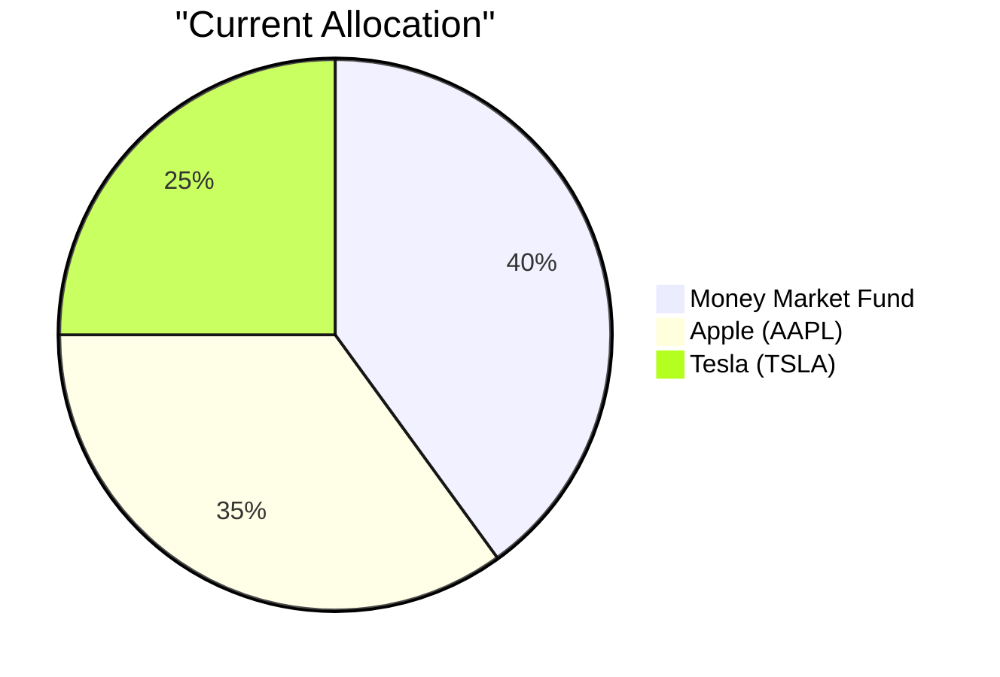
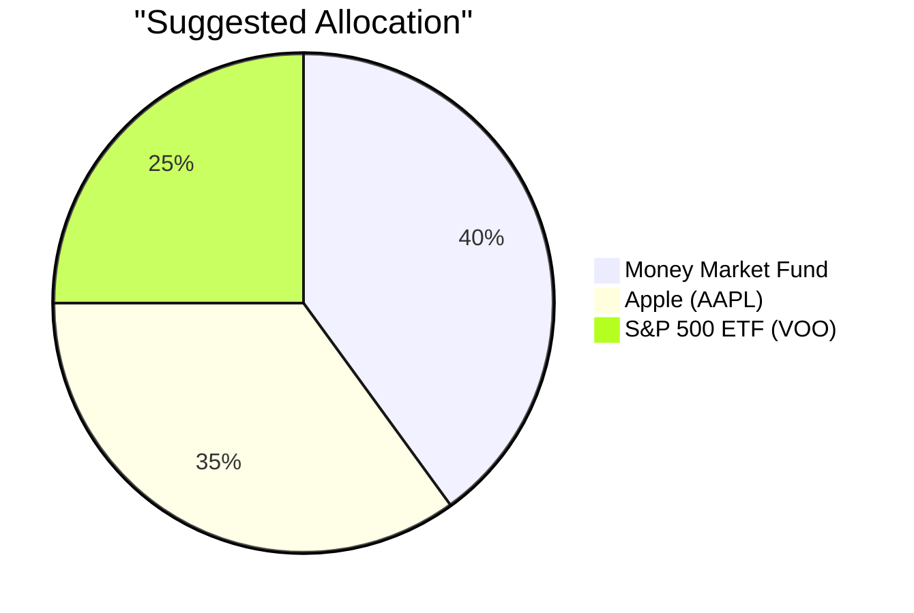

# Suggested Portfolio
```yaml
instructions: |
  This section shows the impact of the single recommended trade on the
  client's overall portfolio.  Only ONE product is being recommended for
  purchase and ONE product (the funding source) is being sold.  All other
  holdings remain unchanged. Please consider the following in product suggestion

  - product fitness score
  - market outlook
  - RM note and client profile
  - investment note in every product under product catalog
```
---

## Current vs. Suggested Allocation
```yaml
instructions: |
  Present a table with EXACTLY these 7 columns in this order:

  | Asset | Current Value (USD) | Suggested Value (USD) | Current % | Suggested % | Change % | Remark |

  Rules:
  - List EVERY holding as a separate row.  Do not aggregate by asset class.
    For example, list "STOCK-AAPL" and "STOCK-MSFT" as separate rows,
    never grouped as "Equities."
  - "Current Value" = market value from the client's holdings data.
  - "Suggested Value" = value after the recommended buy + sell.  For all
    holdings NOT involved in the trade, Suggested Value = Current Value.
  - "Current %" = Current Value ÷ total portfolio value × 100.
  - "Suggested %" = Suggested Value ÷ total portfolio value × 100.
  - "Change %" = Suggested % − Current % (may be negative for sold assets).
  - "Remark" = one sentence explaining the rationale for EACH changed row.
    For unchanged rows, leave blank or write "No change."
  - Add a TOTAL row at the bottom where each numeric column is the sum
    (for Value columns) or 100% (for % columns).  Change % total must be 0%.
  - After writing the table, verify: (a) Change % column sums to exactly 0%,
    (b) Suggested % column sums to exactly 100%.

  Example format (values are illustrative only — do not copy them):
  | Asset | Current Value (USD) | Suggested Value (USD) | Current % | Suggested % | Change % | Remark |
  |---|---|---|---|---|---|---|
  | STOCK-TSLA | 77,048 | 0 | 8.1% | 0% | −8.1% | Sold to fund PROD016 purchase |
  | PROD016 | 0 | 77,048 | 0% | 8.1% | +8.1% | New healthcare sector allocation |
  | ... (all other holdings unchanged) | | | | | | |
  | **Total** | **950,000** | **950,000** | **100%** | **100%** | **0%** | |
```

## Portfolio Allocation (Pie Charts)
```yaml
instructions: |
  Before the table above, output TWO pie charts using Mermaid syntax:

  1. **Current Allocation** — based on Current % values.
  2. **Suggested Allocation** — based on Suggested % values.

  Rules for Mermaid pie charts:
  - Each chart MUST be wrapped in a fenced code block: ```mermaid ... ```
  - Use double-quote characters (") to quote every label string.
  - Do NOT use smart/curly quotes.  Only ASCII double-quote (U+0022).
  - Group holdings by asset class for readability if there are more than 8
    individual positions.  Use asset class labels (e.g., "US Equity",
    "Fixed Income", "Cash").
  - The two charts must visually show the shift caused by the single
    recommended trade.

  Example output (values are illustrative):
```





## Pros and Cons of the Suggested Trade
```yaml
instructions: |
  Present two subsections at H3 level:

  ### Pros
  List 3–5 specific advantages.  Address at minimum:
  - Alignment with the client's stated financial goals.
  - Impact on concentration risk (name the specific concentration being
    reduced or added — e.g., "reduced single-stock TSLA exposure").
  - Diversification benefit vs. the current portfolio.

  ### Cons
  List 2–3 specific disadvantages or trade-offs.  Address at minimum:
  - What the client gives up (e.g., lower expected return, loss of
    dividend income).
  - Any new risk introduced (e.g., sector tilt, currency exposure).
  - Tax or transaction-cost implications where data is available.

  Each pro and con must be a single complete sentence.  Use bullet points (-).
```

## Alternative Products to Consider
```yaml
instructions: |
  Suggest 2 alternative products from the product catalog that the client
  could consider instead of the primary recommendation.  For each:

  - Product ID and name.
  - One sentence explaining when this alternative would be preferred over
    the primary recommendation.
  - One sentence stating the trade-off (what is sacrificed vs. the primary).

  Format as a bullet list.  Do NOT include full product specifications —
  those are already in the product catalog reference document.
```
