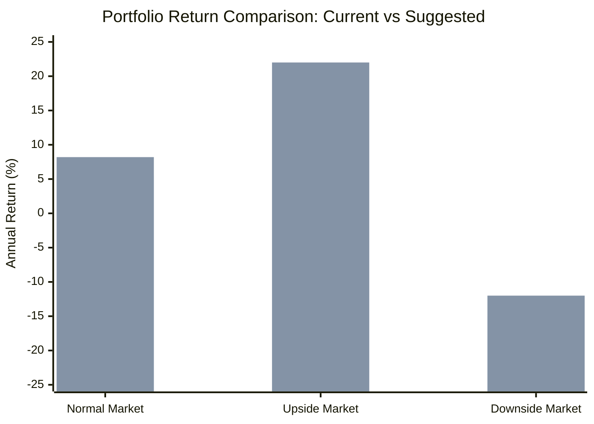

```mermaid
xychart-beta
    title "Portfolio Return Comparison: Current vs Suggested"
    x-axis ["Normal Market", "Upside Market", "Downside Market"]
    y-axis "Annual Return (%)" -25 --> 25
    bar "Current Portfolio" [5.5, 18, -15]
    bar "Suggested Portfolio" [8.2, 22, -12]
```