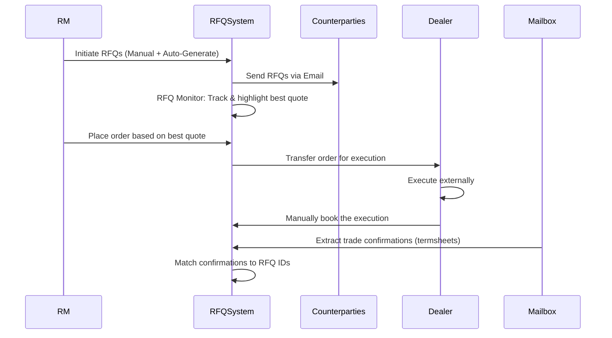

RFQ Workflow
============

# Workflow

- The Relationship Manager (RM) initiates RFQs to multiple counterparties in two ways:
    - Manually enter one or more RFQs.
    - Use a generator to create multiple RFQs by perturbing terms and the underlying.
- The system sends RFQs to the selected counterparties by email.
- The RFQ monitor tracks the progress of quotes from counterparties and highlights the best quote.
- The RM places orders on behalf of their investors based on the selected quotes.
- A Dealer takes over the RM's order and execute it outside the RFQ system.
- The Dealer records the executed order in the RFQ system manually.
- Trade confirmations (term sheets) are extracted from a monitored mailbox.
- The RFQ system matches confirmations to RFQ IDs by comparing terms and the underlying.

# New product
Currently new product configuration are externalized in
- Product fields
- Email setting

# Demo environment

http://159.138.150.49/login

uid/password: dealer/123456Bb.

