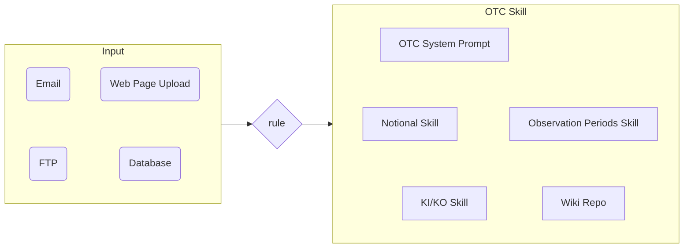

```mermaid
flowchart LR

subgraph "Input"
  email("Email") ~~~ ftp("FTP")
  webpage("Web Page Upload") ~~~
  database("Database")
end
 
subgraph otc_skill [OTC Skill]
  direction TB
  otc["OTC System Prompt"]
  notional["Notional Skill"] ~~~ kiko["KI/KO Skill"]
  obs["Observation Periods Skill"] ~~~ wiki["Wiki Repo"]
  otc ~~~ notional
  otc ~~~ kiko
end

classDef wide padding:360px

rule@{shape : diam}

direction LR
Input --> rule --> otc_skill

```