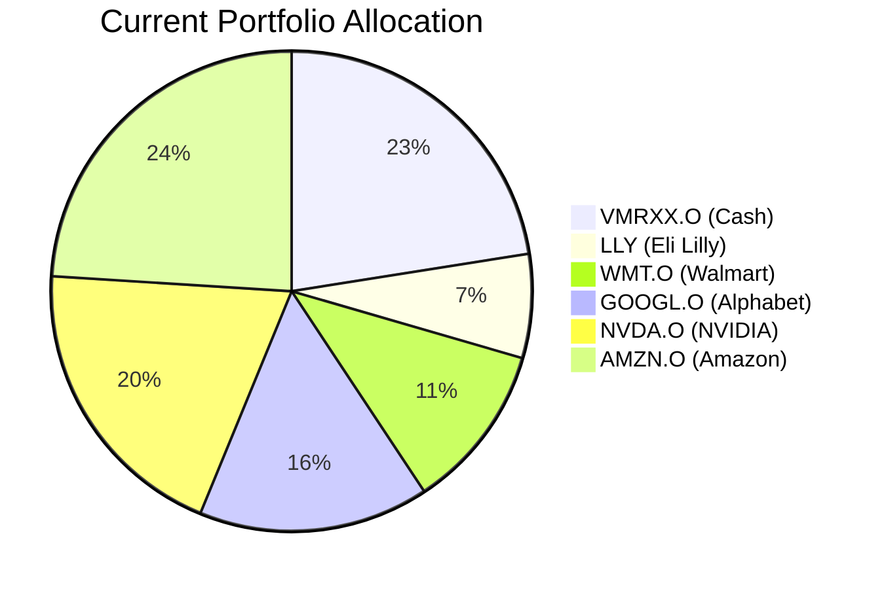
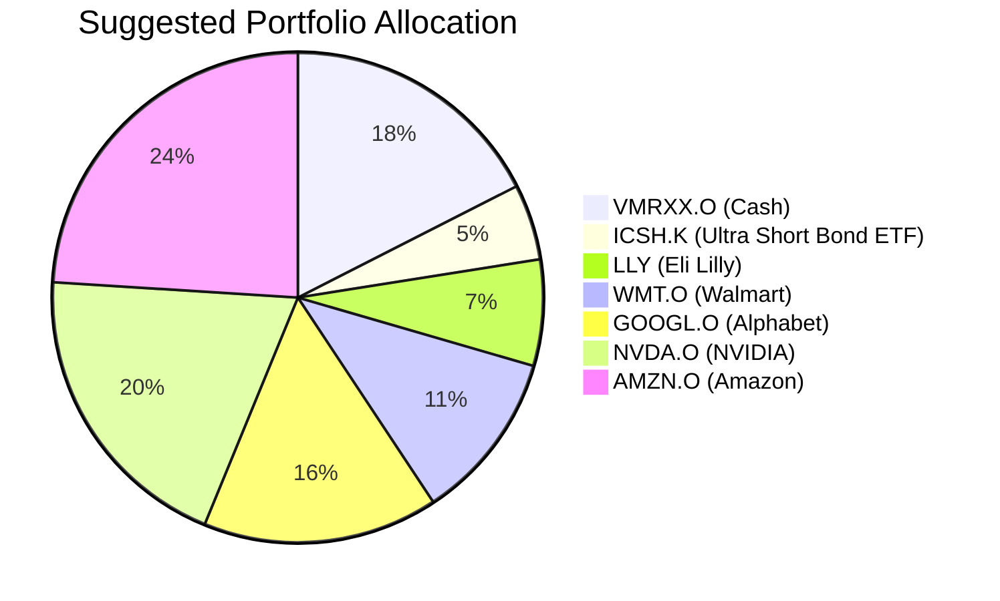

Client Product-Fit Analysis: Sarah Chen
===================================

# Executive Summary
We recommend reallocating HKD 500,000 (approximately 15.6% of portfolio) from the existing cash holding (VMRXX.O) into the iShares Ultra Short Duration Bond ETF (ICSH.K). This "cash-plus" optimization is designed to enhance the yield on the client's substantial short-term liquidity buffer without compromising the required capital preservation or immediate access. The action is expected to generate incremental annual income of approximately HKD 22,000 while maintaining a very high degree of portfolio safety and liquidity.

# Recommended Product: iShares Ultra Short Duration Bond ETF (ICSH.K)
## Product Specifications
- **Ticker:** ICSH.K
- **Category:** Cash Equivalent / Ultra Short Duration Bond ETF
- **Underlying:** Investment-grade ultra-short-term corporate and government bonds.
- **Average Duration:** Less than 1 year.
- **Risk Rating (from catalog logic):** 1 (Lowest)
- **Liquidity Score:** 5 (Daily Liquidity, T+2 settlement)
- **Current Yield:** 4.49%

## Performance Metrics
- **1-Year Return (2025-2026):** +4.44%
- **5-Year Return:** +18.89%
- **Yield (30-Day SEC):** 4.49%
- **Contrast with VMRXX.O (Vanguard Cash Reserves):** The money market fund (VMRXX.O) provides a stable NAV of $1 but offers minimal to no yield (effectively 0% based on available data). ICSH.K has consistently provided a yield pickup of over 4.4% annually while exhibiting minimal price volatility due to its short duration profile.

## Risk Characteristics
- **Credit Risk:** Low. The fund invests primarily in investment-grade securities.
- **Interest Rate Risk:** Very Low. The ultra-short duration minimizes sensitivity to interest rate changes.
- **Liquidity Risk:** Low. The ETF trades daily on major exchanges.
- **Principal Stability:** High. While not guaranteed like a money market fund's stable NAV, historical maximum drawdowns have been minimal.

## Detailed Justification
The client's portfolio holds a 22.5% cash allocation (HKD 720,000 in VMRXX.O), which strongly indicates a need for a **Business Operating Buffer / Tax Reserve** (Horizon: 1-2 years, Certainty: 5, Return: 1). While the current placement in a money market fund is appropriate, it represents a sub-optimal use of capital given the current yield environment. ICSH.K is a precise fit for this need: it maintains a Risk Rating of 1 (matching the client's requirement for capital preservation), offers daily liquidity (Liquidity Score 5), and provides a meaningful yield enhancement (Expected Return score of 2 vs. 1 for pure cash). The product's 1-year Certainty score is high, aligning with the short-term obligation horizon. This is a low-touch optimization that directly addresses the identified financial need for a secure, liquid buffer while improving portfolio efficiency.

# Suggested Portfolio

| Asset | Current % | Suggested % | Change | Remark |
| :--- | :---: | :---: | :---: | :--- |
| Vanguard Treasury Money Market Fund (VMRXX.O) | 22.5% | 17.5% | -5.0% | Reduce cash holding to fund higher-yielding alternative. |
| iShares Ultra Short Duration Bond ETF (ICSH.K) | 0% | 5.0% | +5.0% | Introduce "cash-plus" vehicle to enhance yield on short-term buffer. |
| Eli Lilly and Company (LLY) | 7.0% | 7.0% | 0% | No change. |
| Walmart Inc. (WMT.O) | 11.2% | 11.2% | 0% | No change. |
| Alphabet Inc. (GOOGL.O) | 15.5% | 15.5% | 0% | No change. |
| NVIDIA Corporation (NVDA.O) | 19.8% | 19.8% | 0% | No change. |
| Amazon.com Inc. (AMZN.O) | 24.0% | 24.0% | 0% | No change. |
| **Total** | **100%** | **100%** | **0%** | |

## Pros and cons of suggested portfolio
**Pros:**
*   **Yield Enhancement:** The primary benefit is generating incremental income (est. 4.4% vs. ~0%) on a portion of the idle cash buffer, directly addressing the sub-optimal "Return: 1" score of the current allocation.
*   **Maintained Safety Profile:** ICSH.K has a Risk Rating of 1, aligning perfectly with the client's need for high certainty (Certainty: 5) for short-term obligations. The credit quality and short duration provide strong capital protection.
*   **High Liquidity:** The ETF structure ensures the funds remain highly liquid (T+2 settlement), preserving the "buffer" functionality.
*   **Low Disruption:** This is a minor, targeted adjustment within the defensive sleeve of the portfolio. The core equity holdings, which drive long-term growth, remain untouched.

**Cons:**
*   **Minimal Principal Volatility:** Unlike a money market fund with a stable $1 NAV, ICSH.K's share price will fluctuate slightly (typically within a +/- 1-2% band). While historical drawdowns are minimal, there is a non-zero risk of a small, temporary loss.
*   **Incremental Complexity:** Introduces one additional holding to monitor, though it behaves like a cash equivalent.
*   **Concentration:** The portfolio remains heavily concentrated in US large-cap technology and consumer discretionary equities (GOOGL, NVDA, AMZN, LLY). **This recommendation does not address that concentration risk**, which is a separate strategic consideration for long-term growth objectives.

**Alignment with Financial Goal:** This proposal is specifically and exclusively aligned with optimizing the **Business Operating Buffer / Tax Reserve** need. It improves the return dimension of that specific goal from a score of 1 to 2, while preserving the top scores in Time Horizon (1-2 years) and Certainty (5).

# Scenario Analysis of the Suggested Portfolio
**Assumptions:** Analysis focuses on the HKD 500,000 segment moved from VMRXX.O to ICSH.K. Equity holdings are unchanged in all scenarios.

## Normal Market Condition
- **Assumption:** Stable monetary policy with modest credit spreads. Ultra-short bond yields average 4.4% (based on ICSH.K's 1-year return for 2025-2026). Money market yields near 0%.
- **Probability:** 70% (Base Case)

| Asset | % Return | Suggested Holding (HKD) | Return (HKD) | Current Holding (HKD) | Return (HKD) |
| :--- | :---: | :---: | :---: | :---: | :---: |
| ICSH.K | 4.4% | 500,000 | 22,000 | 0 | 0 |
| VMRXX.O | 0.0% | 0 | 0 | 500,000 | 0 |
| **Segment Total** | **4.4%** | **500,000** | **22,000** | **500,000** | **0** |

- **Annual incremental benefit:** +HKD 22,000.

## Upside Market Condition (Rising Rate Environment)
- **Assumption:** The Federal Reserve raises interest rates to combat inflation. Newly issued short-term bonds carry higher coupons, benefiting rolling funds in ICSH.K. Yield rises to 5.5%. Money market yields may lag, rising to 0.5%.
- **Probability:** 15%

| Asset | % Return | Suggested Holding (HKD) | Return (HKD) | Current Holding (HKD) | Return (HKD) |
| :--- | :---: | :---: | :---: | :---: | :---: |
| ICSH.K | 5.5% | 500,000 | 27,500 | 0 | 0 |
| VMRXX.O | 0.5% | 0 | 0 | 500,000 | 2,500 |
| **Segment Total** | **5.5%** | **500,000** | **27,500** | **500,000** | **2,500** |

- **Annual incremental benefit:** +HKD 25,000.

## Downside Market Condition (Credit Stress)
- **Assumption:** A mild, short-lived credit event causes spreads on investment-grade corporate bonds to widen. ICSH.K experiences a price decline of -1.5% but continues to pay its coupon. Money market fund (VMRXX.O) preserves capital.
- **Probability:** 15%
- **Historical Reference:** Similar to the brief sell-off in March 2020, where ultra-short bond ETFs saw small, rapid declines before recovering.

| Asset | % Return | Suggested Holding (HKD) | Return (HKD) | Current Holding (HKD) | Return (HKD) |
| :--- | :---: | :---: | :---: | :---: | :---: |
| ICSH.K | -1.5% | 500,000 | -7,500 | 0 | 0 |
| VMRXX.O | 0.0% | 0 | 0 | 500,000 | 0 |
| **Segment Total** | **-1.5%** | **500,000** | **-7,500** | **500,000** | **0** |

- **Annual impact:** Potential temporary loss of HKD 7,500 on this segment. The loss is expected to be recouped as bonds mature or spreads normalize.

# Risk Disclosure
- Past performance does not guarantee future returns.
- Projected returns are estimates, not promises.
- All investments, including ultra-short bond ETFs, carry a risk of principal loss.

# References
- **Client Profile & Suggested Product:** `client_profile.md`
- **Client Holdings:** `client_holding.csv`
- **Product Catalog & Performance Data:** `demo-market-quotes.csv`
- **Financial Needs Framework:** `common_needs.md`
- **Web References:** N/A (Analysis based solely on provided internal data).
