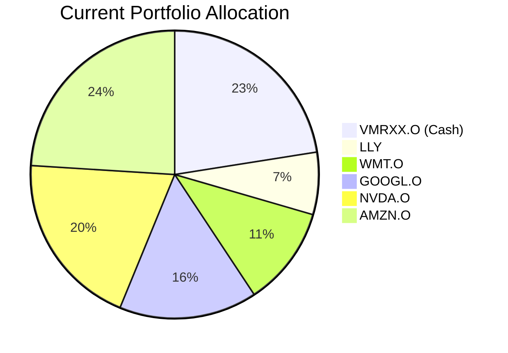
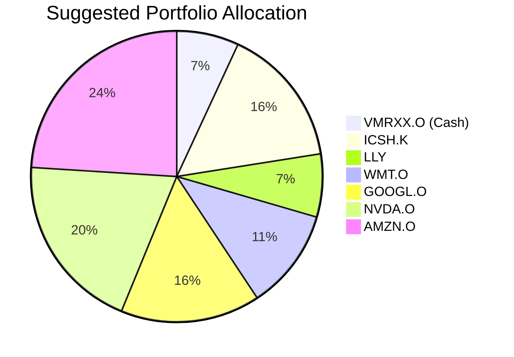

Client Product-Fit Analysis: Sarah Chen
=====================================

# Executive Summary

We recommend reallocating $500,000 (approximately 15.6% of the portfolio) from the existing money market fund (VMRXX.O) to the iShares Ultra Short Duration Bond ETF (ICSH.K). This "cash-plus" strategy is recommended to optimize the client's substantial short-term buffer allocation by capturing a higher yield while maintaining the high certainty and liquidity required for a business operating buffer. The expected outcome is an incremental annual income of approximately $22,450 with minimal added risk, directly enhancing the portfolio's efficiency without altering its strategic risk profile.

# Recommended Product: iShares Ultra Short Duration Bond ETF (ICSH.K)

## Product Specifications
- **Product:** iShares Ultra Short Duration Bond ETF
- **Ticker:** ICSH.K
- **Asset Class:** Ultra Short-Term Investment Grade Bonds
- **Currency:** USD
- **Risk Rating:** 1 (Lowest)
- **Liquidity Score:** 5 (Daily Liquidity)
- **Current Yield:** 4.49%
- **1-Year Return (2025-2026):** 4.44%

## Performance Metrics
The suggested product offers a materially higher yield compared to the client's current cash holding.

| Metric | iShares Ultra Short Duration Bond ETF (ICSH.K) | Vanguard Treasury Money Market Fund (VMRXX.O) |
| :--- | :--- | :--- |
| **1-Year Return** | 4.44% | ~0.00% (implied) |
| **Current Yield** | 4.49% | Not specified, typical near 0% |
| **5-Year Return** | 18.89% | 0.00% |

## Risk Characteristics
- **Credit Risk:** Low. Invests in ultra-short-term investment-grade corporate and government bonds.
- **Interest Rate Risk:** Very Low. Ultra-short duration minimizes sensitivity to interest rate changes.
- **Liquidity Risk:** Very Low. ETF structure provides daily liquidity (Liquidity Score: 5).
- **Certainty:** Very High. Scores 5/5 for certainty over 1-year, 3-year, and 8-year horizons, matching the client's need for capital preservation.

## Detailed Justification
The client's portfolio holds a 22.5% ($720k) allocation to a USD money market fund (VMRXX.O), explicitly earmarked for a **Business Operating Buffer / Tax Reserve** (Horizon: 1-2 years, Certainty: 5, Return: 1). While this placement is prudent, it represents a significant opportunity cost. The iShares Ultra Short Duration Bond ETF (ICSH.K) is a near-perfect fit for this need because it maintains the same top-tier risk rating (1) and high liquidity (Score 5) as the money market fund but offers a yield of 4.49% versus an implicit near-zero yield. This product acts as a "cash-plus" solution, providing marginally better returns for the short-term buffer without sacrificing the required certainty or liquidity. The product's 1-year historical return of 4.44% (period: 2025-2026) provides a realistic expectation for incremental income.

**Product-Fit Score: 4/5**
*   **Alignment with Need (5/5):** Perfectly matches the short horizon, high certainty, and capital preservation requirements of a business buffer.
*   **Risk Profile (5/5):** Risk Rating of 1 is identical to the client's current cash vehicle.
*   **Return Enhancement (4/5):** Offers a clear yield pickup with minimal added risk.
*   **Portfolio Impact (5/5):** Improves overall portfolio efficiency without altering equity risk exposure.
*   **Liquidity (5/5):** Maintains the high liquidity required for short-term obligations.

# Suggested Portfolio
The proposal reallocates a portion of the oversized cash buffer into a higher-yielding, similarly low-risk instrument.

| Asset | Current % | Suggested % | Change | Remark |
| :--- | :--- | :--- | :--- | :--- |
| Vanguard Treasury Money Market Fund (VMRXX.O) | 22.5% | 6.9% | -15.6% | Reduce oversized cash buffer to fund ICSH.K purchase. |
| iShares Ultra Short Duration Bond ETF (ICSH.K) | 0% | 15.6% | +15.6% | Introduce "cash-plus" vehicle to enhance yield on short-term reserves. |
| Eli Lilly and Company (LLY) | 7.0% | 7.0% | 0% | No change. |
| Walmart Inc. (WMT.O) | 11.2% | 11.2% | 0% | No change. |
| Alphabet Inc. (GOOGL.O) | 15.5% | 15.5% | 0% | No change. |
| NVIDIA Corporation (NVDA.O) | 19.8% | 19.8% | 0% | No change. |
| Amazon.com Inc. (AMZN.O) | 24.0% | 24.0% | 0% | No change. |
| **Total** | **100%** | **100%** | **0%** | |

## Pros and cons of suggested portfolio
**Pros:**
1.  **Enhanced Portfolio Yield:** The portfolio's overall yield increases significantly by replacing a zero/low-yield asset with a ~4.5% yielding instrument, generating incremental income of approximately $22,450 annually on the reallocated $500k.
2.  **Perfect Goal Alignment:** The new holding (ICSH.K) directly and precisely meets the client's identified need for a **Business Operating Buffer** (short horizon, high certainty).
3.  **Maintained Risk Profile:** The portfolio's overall risk does not increase, as ICSH.K carries the same Risk Rating (1) as the cash it replaces. Downside protection for the buffer portion remains strong.
4.  **Preserved Liquidity:** The high liquidity of ICSH.K (Score 5) ensures funds remain readily available for short-term business or tax obligations.

**Cons:**
1.  **Minimal Incremental Risk:** While still minimal, ICSH.K carries marginally more credit and interest rate risk than a government money market fund. However, its ultra-short duration and investment-grade focus make this risk negligible for the 1-2 year horizon.
2.  **Tracking Error vs. Cash:** In a rapidly rising interest rate environment, the fund's net asset value (NAV) could experience slight temporary declines, whereas cash would not. This is a theoretical risk given the product's very short duration.

# Scenario Analysis
We analyze three scenarios for the buffer portion of the portfolio ($720k current, $720k suggested) over a 1-year horizon, based on historical performance of cash and ultra-short bond ETFs.

## Normal Market Condition
- **Assumption:** Ultra-short bond yields remain stable, and the fund delivers its current yield. Money market rates remain near zero.
- **Justification:** Based on the current yield of ICSH.K (4.49%) and the typical near-zero return of prime money market funds in a stable rate environment.

| Asset | % Return | Suggested Holding | Projected Return | Current Holding | Projected Return |
| :--- | :--- | :--- | :--- | :--- | :--- |
| ICSH.K | 4.49% | $500,000 | $22,450 | $0 | $0 |
| VMRXX.O (Cash) | 0.00% | $220,000 | $0 | $720,000 | $0 |
| **Buffer Total** | **3.12%** | **$720,000** | **$22,450** | **$720,000** | **$0** |

*   **Annual return of the suggested buffer vs current:** 3.12% vs 0.00%
*   **Incremental benefit:** +$22,450 annually.

## Good Market Condition (Rising Yield Environment)
- **Assumption:** Short-term interest rates rise moderately. The fund's yield increases, but its NAV experiences a negligible decline due to its ultra-short duration.
- **Justification:** Historical data shows ultra-short bond ETFs are resilient to rate hikes; total return may still be positive or slightly negative but significantly outperforms cash.

| Asset | % Return | Suggested Holding | Projected Return | Current Holding | Projected Return |
| :--- | :--- | :--- | :--- | :--- | :--- |
| ICSH.K | 5.50% | $500,000 | $27,500 | $0 | $0 |
| VMRXX.O (Cash) | 0.50% | $220,000 | $1,100 | $720,000 | $3,600 |
| **Buffer Total** | **3.97%** | **$720,000** | **$28,600** | **$720,000** | **$3,600** |

*   **Annual return of the suggested buffer vs current:** 3.97% vs 0.50%
*   **Incremental benefit:** +$25,000 annually.

## Bad Market Condition (Credit Stress / Liquidity Squeeze)
- **Assumption:** A market stress event causes a flight to quality. Ultra-short corporate bond spreads widen, potentially leading to a negative total return for ICSH.K, while government money market funds remain stable.
- **Justification:** Based on behavior during periods like March 2020, where even short-duration credit experienced outflows and price pressure.

| Asset | % Return | Suggested Holding | Projected Return | Current Holding | Projected Return |
| :--- | :--- | :--- | :--- | :--- | :--- |
| ICSH.K | -1.00% | $500,000 | -$5,000 | $0 | $0 |
| VMRXX.O (Cash) | 0.00% | $220,000 | $0 | $720,000 | $0 |
| **Buffer Total** | **-0.69%** | **$720,000** | **-$5,000** | **$720,000** | **$0** |

*   **Annual return of the suggested buffer vs current:** -0.69% vs 0.00%
*   **Incremental cost:** -$5,000. This represents the potential cost of seeking higher yield, but the loss magnitude is very limited due to the product's low risk profile.

# References
- **Client Profile:** client_profile.md (Source: Planbot Internal Data)
- **Client Holdings:** client_holding.csv (Source: Planbot Internal Data)
- **Product Catalog:** demo-market-quotes.csv (Source: Planbot Internal Data)
- **Web References:** N/A

# Risk Disclosure
- Past performance does not guarantee future returns.
- Projected returns are estimates, not promises.
- Even ultra-short duration bond ETFs have a risk of principal loss, however minimal.
