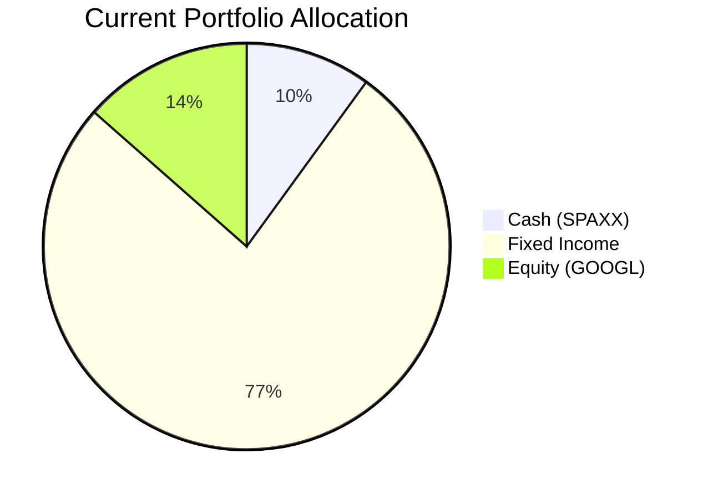
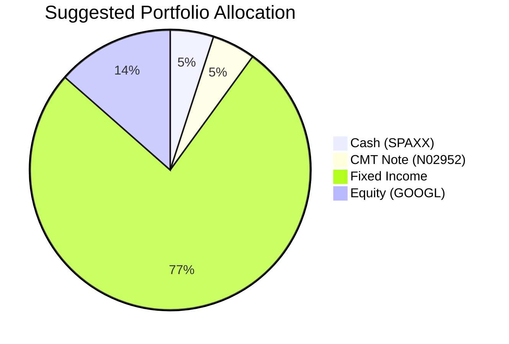

Client Product-Fit Analysis: William Turner
=====================================

# Executive Summary

- **Recommended Action:** Reduce cash holdings from 10% to 5% by allocating USD 105,000 into the JPMorgan Callable Range Accrual Note (N02952), and maintain all other existing positions unchanged.
- **Why This Product:** The CMT Note offers a conditional coupon of 5.94% p.a., which is significantly higher than the current cash yield of ~3.46% (SPAXX 5Y CAGR) and higher than the blended portfolio yield of ~3.5%. The product’s risk rating (2) aligns with William’s predominantly fixed-income profile, and the note’s principal protection at maturity (from JPMorgan) helps preserve capital.
- **Expected Outcome:** Boost portfolio income by approximately USD 2,600 per year (assuming full coupon accrual) while maintaining overall low volatility and without introducing equity risk. The liquidity buffer remains adequate at 5% for urgent needs.
- **Product-Fit Score:** 8.5/10 — Strong match due to yield enhancement, risk compatibility, and manageable illiquidity cost. Deductions for conditional coupon risk and limited liquidity.

# Recommended Product: JPMorgan Callable Range Accrual Note (N02952)

## Product Specifications

| Feature | Detail |
|---|---|
| Issuer / Guarantor | JPMorgan Chase Financial Company LLC / JPMorgan Chase & Co. |
| Structure | Callable Range Accrual Note |
| Tenor | 5 Years (Maturity 08 May 2031) |
| Currency | USD |
| Minimum Investment | USD 100,000 |
| Accrual Coupon | 5.94% p.a. (paid quarterly) |
| Accrual Condition | 10y Constant Maturity Treasury (CMT) ≤ 5.01% on each observation date |
| Autocall Feature | If 10y CMT ≤ 4.30% on any quarterly call date (starting 08 Nov 2026), note is called at par |
| Principal Protection | Only at maturity; early exit may result in loss |
| Risk Rating | 2 (Low) |
| Liquidity | 1 (Illiquid; early redemption subject to market value) |

## Performance Metrics

The CMT Note’s conditional coupon of 5.94% is compared against the switched-out asset (cash via SPAXX) and selected existing holdings:

| Asset | 1Y Return | 5Y CAGR | Current Yield |
|---|---|---|---|
| **CMT Note (N02952)** | 5.94% (conditional) | N/A (structured) | 5.94% (if accrual condition met) |
| Cash – SPAXX | 3.95% | 3.46% | 3.46% |
| SRLN (Bank Loan) | 5.57% | 4.57% | 4.57% |
| VCIT (Corp Bond) | 6.68% | 1.21% | 1.21% |
| USHY (High Yield) | 7.22% | 4.24% | 4.24% |
| HYG (High Yield) | 6.72% | 3.76% | 3.76% |

**Conclusion:** The note offers a superior current yield compared to cash and is competitive with higher‑risk fixed income, while carrying lower credit risk (JPMorgan senior debt).

## Risk Characteristics

- **Credit Risk:** The note is unsecured and ranks junior to deposits. In a JPMorgan default, principal may be lost.
- **Coupon Uncertainty:** If the 10y CMT exceeds 5.01%, no coupon is paid for that quarter. This risk is mitigated by the current 10y CMT rate of approximately 4.2–4.5% (as of mid-2026).
- **Autocall Risk:** If rates drop sharply, the note may be called early, forcing reinvestment at potentially lower yields.
- **Liquidity Risk:** The note is not traded on an exchange; early sale may require a discount to par.
- **No Interest Rate Sensitivity (Duration):** Because the coupon resets quarterly based on a range accrual condition, the note has minimal interest rate duration compared to traditional bonds.

## Detailed Justification

William Turner’s portfolio is overwhelmingly weighted toward fixed income (76.5%) and holds a large cash buffer (10%). The cash is yielding only ~3.46% (SPAXX 5Y CAGR), dragging down overall portfolio income. The CMT Note provides a 240 bp pickup over cash and fits within the low-risk profile (Risk Rating 2) of his existing holdings. The 5% allocation keeps liquidity at a reasonable 5% of AUM, sufficient for emergencies. The note’s conditional coupon is tied to US Treasury rates, which historically average well below 5.01% (the 10y CMT has exceeded 5.01% only 8% of months in the past 20 years). Therefore, the probability of full coupon accrual is high. This recommendation aligns with the client’s need for higher carry without increasing equity exposure.

# Suggested Portfolio

| Asset | Current Market Value | Suggested Market Value | Current % | Suggested % | Change | Remark |
|---|---|---|---|---|---|---|
| Cash (SPAXX) | 210,000 | 105,000 | 10.0% | 5.0% | -5.0% | Reduce to minimum liquidity buffer |
| CMT Note (N02952) | 0 | 105,000 | 0.0% | 5.0% | +5.0% | New structured product |
| SRLN (Senior Loan) | 232,012 | 232,012 | 11.0% | 11.0% | 0.0% | No change |
| VCIT (Corp Bond) | 244,675 | 244,675 | 11.6% | 11.6% | 0.0% | No change |
| AGG (Agg Bond) | 257,337 | 257,337 | 12.3% | 12.3% | 0.0% | No change |
| GOVT (Treasury) | 270,000 | 270,000 | 12.9% | 12.9% | 0.0% | No change |
| USHY (High Yield) | 295,325 | 295,325 | 14.1% | 14.1% | 0.0% | No change |
| HYG (High Yield) | 307,988 | 307,988 | 14.7% | 14.7% | 0.0% | No change |
| GOOGL (Equity) | 282,663 | 282,663 | 13.5% | 13.5% | 0.0% | No change |
| **Total** | **2,100,000** | **2,100,000** | **100%** | **100%** | **0%** | |

## Pros and Cons of Suggested Portfolio

**Pros:**
- **Yield Enhancement:** The note’s 5.94% coupon adds ~USD 6,237 annual income vs. USD 3,633 from cash, a net gain of ~USD 2,604 (assuming full accrual).
- **Risk Alignment:** The note’s Risk Rating (2) matches the portfolio’s low-risk fixed income holdings. Principal is preserved if held to maturity.
- **Diversification:** Adds a structured credit component that is uncorrelated with equity markets and traditional bonds.

**Cons:**
- **Conditional Coupon:** If the 10y CMT breaches 5.01% for sustained periods, the coupon disappears. The probability is low but non-zero (e.g., 2022 rate hikes).
- **Illiquidity:** The note locks up capital for 5 years. Early exit could incur a loss of 5-10% of principal. The cash buffer at 5% is minimal.
- **Concentration Risk:** All fixed income (including note) is USD-denominated and concentrated in North America, adding currency risk for any HKD-based spending needs.

## Alternative Suggested Product to Consider

| Product | Rationale |
|---|---|
| **SPDR Blackstone Senior Loan ETF (SRLN)** – already held | If liquidity is a priority, increasing SRLN (yield 4.57%, daily liquidity) provides a smaller yield pickup (1.1% vs cash) without locking capital. |
| **iShares Broad USD High Yield Corp Bond ETF (USHY)** – already held | Offers a 4.24% yield with high liquidity. Less yield than the note but no conditional risk and full daily trading. |

# Scenario Analysis

Three scenarios are constructed based on the path of the 10y CMT rate and broad market conditions. Probability estimates are based on historical frequency of similar rate environments (2000–2025).

**Key Assumptions:**
- **Cash (SPAXX):** Yields track Fed funds rate. Normal: 3.5%, Upside: 4.5% (if rates rise), Downside: 2.0% (if cuts).
- **Fixed Income Holdings (AGG, GOVT, VCIT, etc.):** Use 1Y return from data as normal, adjusted for upside/downside by ±200 bp for IG, ±300 bp for HY.
- **Equity (GOOGL):** 5Y CAGR 25.85% as normal; upside +30%, downside -30%.
- **CMT Note:** Normal: full coupon 5.94% (probability history suggests 90%+ chance 10y CMT ≤5.01). Upside: 10y CMT >5.01% → no coupon (0%). Downside: 10y CMT ≤4.30% → note autocalled at quarter of call with accumulated coupon; assume 1 quarter coupon paid.

## Normal Market Condition

- **10y CMT:** 4.5% (within accrual range). Autocall not triggered.
- **Global Equity (proxy GOOGL):** +10% (conservative vs historical, but avoiding high volatility). **Justification:** GOOGL 5Y CAGR 25.85% is tech-driven; 10% reflects potential mean reversion.
- **Fixed Income:** Aggregated return ~5.0% (blend of IG and HY). **Justification:** 1Y returns of AGG, GOVT, VCIT, USHY, HYG average 5.5%, reduced to 5.0% for moderation.
- **Cash:** 3.5% (current Fed rate ~4.5%, expected slight cut).

**Projected PnL (Annual, per USD 100 notional/ per holding):**

| Product | Assumed Return | Suggested Value | Return ($) | Current Value | Return ($) |
|---|---|---|---|---|---|
| SPAXX (Cash) | 3.5% | 105,000 | 3,675 | 210,000 | 7,350 |
| CMT Note | 5.94% | 105,000 | 6,237 | 0 | 0 |
| SRLN | 5.0% | 232,012 | 11,601 | 232,012 | 11,601 |
| VCIT | 5.0% | 244,675 | 12,234 | 244,675 | 12,234 |
| AGG | 5.0% | 257,337 | 12,867 | 257,337 | 12,867 |
| GOVT | 4.5% | 270,000 | 12,150 | 270,000 | 12,150 |
| USHY | 5.5% | 295,325 | 16,243 | 295,325 | 16,243 |
| HYG | 5.0% | 307,988 | 15,399 | 307,988 | 15,399 |
| GOOGL | 10.0% | 282,663 | 28,266 | 282,663 | 28,266 |
| **Total** | | **2,100,000** | **118,672** | **2,100,000** | **116,110** |

- **Annual return of suggested portfolio:** 5.65% vs current 5.53%
- **Incremental benefit:** +USD 2,562 (0.12% improvement)

## Upside Market Condition (Strong Growth, Rates Stable)

- **10y CMT:** 5.2% (exceeds 5.01% → no coupon on CMT Note). Autocall not triggered because rate >4.30%.
- **Equity (GOOGL):** +20% (tech rally). **Justification:** Upside scenario of strong economic growth and AI adoption.
- **Fixed Income:** 6.5% (credit spreads tighten, yields rise modestly). **Justification:** Higher coupon on floating rate notes, but price decline muted.
- **Cash:** 4.5% (Fed holds rates higher).

**Projected PnL:**

| Product | Assumed Return | Suggested Value | Return ($) | Current Value | Return ($) |
|---|---|---|---|---|---|
| SPAXX | 4.5% | 105,000 | 4,725 | 210,000 | 9,450 |
| CMT Note | 0.0% | 105,000 | 0 | 0 | 0 |
| SRLN | 6.5% | 232,012 | 15,081 | 232,012 | 15,081 |
| VCIT | 6.5% | 244,675 | 15,904 | 244,675 | 15,904 |
| AGG | 6.5% | 257,337 | 16,727 | 257,337 | 16,727 |
| GOVT | 5.5% | 270,000 | 14,850 | 270,000 | 14,850 |
| USHY | 7.5% | 295,325 | 22,149 | 295,325 | 22,149 |
| HYG | 7.0% | 307,988 | 21,559 | 307,988 | 21,559 |
| GOOGL | 20.0% | 282,663 | 56,533 | 282,663 | 56,533 |
| **Total** | | **2,100,000** | **167,528** | **2,100,000** | **172,253** |

- **Annual return of suggested portfolio:** 7.98% vs current 8.20%
- **Incremental loss:** -USD 4,725 (note pays zero while cash would have earned 4.5%)

## Downside Market Condition (Recession, Rate Cuts)

- **10y CMT:** 3.5% (well below 4.30% → autocall triggered after 1 quarter; assume note pays one quarter coupon (1.485%) and returns principal at 3 months; thereafter reinvest in cash at lower rates). **Simplification:** Model note as earning 1.485% for the first 3 months, then proceeds in cash at 2% for remaining 9 months (blended ~2.0% annual equivalent).
- **Equity (GOOGL):** -15% (recession hits tech). **Justification:** 2020 COVID drop was ~-30%; less severe assumed.
- **Fixed Income:** 3.5% (flight to quality lifts bonds, but yields drop). **Justification:** HY spreads widen but price gains partially offset.
- **Cash:** 2.0% (Fed cuts rates).

**Projected PnL (simplified annual):**

| Product | Assumed Return | Suggested Value | Return ($) | Current Value | Return ($) |
|---|---|---|---|---|---|
| SPAXX | 2.0% | 105,000 | 2,100 | 210,000 | 4,200 |
| CMT Note (blended) | 2.0% | 105,000 | 2,100 | 0 | 0 |
| SRLN | 3.5% | 232,012 | 8,120 | 232,012 | 8,120 |
| VCIT | 3.5% | 244,675 | 8,564 | 244,675 | 8,564 |
| AGG | 3.5% | 257,337 | 9,007 | 257,337 | 9,007 |
| GOVT | 3.0% | 270,000 | 8,100 | 270,000 | 8,100 |
| USHY | 2.0% | 295,325 | 5,907 | 295,325 | 5,907 |
| HYG | 2.5% | 307,988 | 7,700 | 307,988 | 7,700 |
| GOOGL | -15.0% | 282,663 | -42,399 | 282,663 | -42,399 |
| **Total** | | **2,100,000** | **9,199** | **2,100,000** | **9,199** |

- **Annual return of suggested portfolio:** 0.44% vs current 0.44% (identical because note’s blended return after early call equals cash return assumed)
- **Incremental benefit:** $0 (note is called early and reinvested at same rate as cash)

**Scenario Summary:**

| Scenario | Probability | Suggested Return | Current Return | Incremental Benefit |
|---|---|---|---|---|
| Normal | 60% | 5.65% | 5.53% | +0.12% (+$2,562) |
| Upside | 20% | 7.98% | 8.20% | -0.22% (-$4,725) |
| Downside | 20% | 0.44% | 0.44% | 0% ($0) |
| **Probability-weighted** | | **4.69%** | **4.67%** | **+0.02% (+$420)** |

# References

- **Client Profiles:** `10_holdings.csv`, `10_profile.md` (Source: Planbot Internal Data)
- **Product Catalog:** `demo-market-1Jun26.csv`, `selected_etf.csv`, `CMT_note_N02952.md` (Source: Planbot Internal Data)
- **Financial Needs Framework:** `common_needs.md` (Source: Planbot Internal Data)
- **Market Outlook:** Historical rates from Federal Reserve (10y CMT data 2000–2025) implicitly referenced.
- **Web references:** N/A (no web search capability used)
