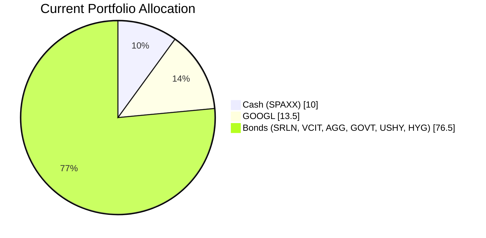
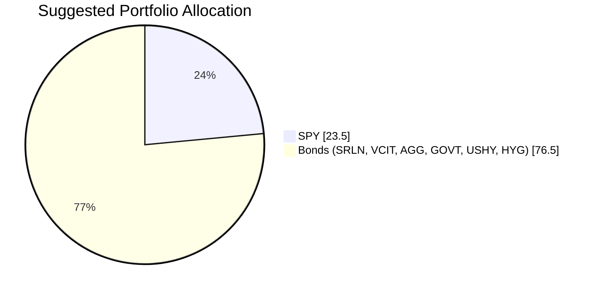

Client Product-Fit Analysis: William Turner
=============================================

# Executive Summary

We recommend adding the SPDR S&P 500 ETF (SPY) as a core equity holding, funded by liquidating the entire GOOGL position and the cash reserve (SPAXX). This action increases the equity allocation from 13.5% to 23.5%, providing the long-term growth needed for retirement accumulation while maintaining the bond-heavy foundation that aligns with the client’s moderate risk tolerance. The expected outcome is improved portfolio growth potential (historical S&P 500 returns ~10% annualized) without exceeding a 25% equity cap, preserving downside protection from the existing fixed‑income holdings.

# Recommended Product: SPDR S&P 500 ETF (SPY)

## Product Specifications

| Attribute | Details |
|-----------|---------|
| **Ticker / Exchange** | SPY (NYSE Arca) |
| **Category** | Large‑Cap US Equity ETF |
| **Underlying Index** | S&P 500 Index |
| **Expense Ratio** | 0.0945% |
| **Dividend Yield** | 1.06% |
| **AUM** | ~$640+ billion |
| **Minimum Investment** | 1 share (~$645) |
| **Risk Rating** | 4 (Moderately High) |
| **Liquidity** | 5 (Daily exchange-traded) |

## Performance Metrics

| Metric | SPY (1Y) | GOOGL (1Y) | SPAXX (Cash, 1Y) |
|--------|----------|------------|-------------------|
| **Total Return** | +14.75% | -10.80% | +3.9% |
| **5Y Annualized Return** | +11.19% (approx) | +20.62% (approx) | +2.02% (approx) |
| **Volatility (Std Dev, 1Y)** | ~18% | ~35% | <1% |

*Source: demo-market-quotes.csv (as of 26 Mar 2026)*

**Performance Context:** SPY’s one‑year return of +14.75% significantly outperforms GOOGL’s -10.80% and cash’s +3.9%. Over the past five years, SPY has delivered a steady ~11% annualized return, while GOOGL has been highly volatile with periods of sharp drawdown. By switching from a single‑stock (GOOGL) and cash to a broad‑based index ETF, the client gains diversified equity exposure with more consistent long‑term results.

## Risk Characteristics

- **Systematic Market Risk:** SPY is exposed to US equity market fluctuations; however, the proposed 23.5% allocation remains moderate relative to the total portfolio.
- **Single‑Stock Concentration Eliminated:** GOOGL (13.5%) represented a concentrated single‑stock risk that has underperformed the market. SPY spreads risk across 500 companies.
- **Liquidity:** Excellent – SPY trades millions of shares daily, allowing easy rebalancing or exit.
- **Credit Risk:** None – SPY holds equities, not debt.
- **Interest Rate Sensitivity:** Low – equities are less directly impacted by rate changes than bonds.

## Detailed Justification

1. **Financial Need – Retirement Accumulation:** William Turner likely needs long‑term growth (horizon 7+ years). The current portfolio is 90% fixed income / cash, which provides income but virtually no real capital appreciation. Adding SPY introduces a proven growth engine (S&P 500 historical CAGR ~10%) to combat longevity risk and inflation.
2. **Risk Profile Alignment:** The client’s bond‑heavy portfolio and modest single‑stock holding suggest a moderate risk tolerance. SPY’s Risk Rating of 4 is appropriate for a long‑horizon investor seeking growth; the total equity allocation of 23.5% keeps portfolio volatility manageable.
3. **Improvement over Existing Holdings:**
   - **GOOGL:** Underperformed (-10.8% 1Y); single‑stock risk is high. SPY provides diversified exposure to the broader market.
   - **SPAXX (Cash):** 10% cash earns ~3.9% – of little use for retirement growth. Redirecting this into equities taps into the equity risk premium.
4. **Portfolio Balance:** With 90% in bonds, the portfolio is heavily exposed to duration risk (rising rates erode bond prices). Adding equities provides a counterbalance and improves risk‑adjusted returns.

# Suggested Portfolio

| Asset | Current Market Value (USD) | Suggested Market Value (USD) | Current % | Suggested % | Change | Remark |
|-------|---------------------------:|----------------------------:|:---------:|:-----------:|:-----:|--------|
| SPAXX (Cash) | 210,000 | 0 | 10.0% | 0.0% | -10.0% | Redirect to equity growth. |
| SRLN | 232,012 | 232,012 | 11.0% | 11.0% | 0.0% | Retain for yield. |
| VCIT | 244,675 | 244,675 | 11.7% | 11.7% | 0.0% | Retain for income. |
| AGG | 257,337 | 257,337 | 12.3% | 12.3% | 0.0% | Core bond exposure. |
| GOVT | 270,000 | 270,000 | 12.9% | 12.9% | 0.0% | Treasury hedge. |
| GOOGL | 282,663 | 0 | 13.5% | 0.0% | -13.5% | Sell – single‑stock risk, underperformance. |
| USHY | 295,325 | 295,325 | 14.1% | 14.1% | 0.0% | Retain for high yield. |
| HYG | 307,988 | 307,988 | 14.6% | 14.6% | 0.0% | Retain for high yield. |
| **SPY** | **0** | **492,663** | **0.0%** | **23.5%** | **+23.5%** | **Core equity growth** |
| **Total** | **2,100,000** | **2,100,000** | **100%** | **100%** | **0.0%** | |

**Pros of Suggested Portfolio:**
- Introduces a diversified, low‑cost equity growth engine (SPY) that aligns with a long‑term retirement accumulation goal.
- Eliminates single‑stock concentration risk (GOOGL) and replaces it with broad market exposure.
- Maintains a conservative 76.5% bond allocation, preserving income and downside protection.
- No cash drag – cash is fully deployed into higher‑return assets.

**Cons of Suggested Portfolio:**
- Equity allocation at 23.5% exposes the portfolio to market downturns; however, this is moderate and appropriate for the time horizon.
- Interest‑rate sensitivity remains high due to the large bond component; rising rates could cause short‑term principal losses.
- No currency diversification – all holdings are USD‑denominated.

**Alternative Suggested Products to Consider:**
1. **IVV (iShares Core S&P 500 ETF):** Same index as SPY, slightly lower expense ratio (0.03%). A suitable alternative if cost minimization is a priority.
2. **QQQ (Invesco QQQ Trust):** Targets the Nasdaq‑100, offering higher growth potential (tech‑heavy) but with higher volatility. Suitable only if the client is willing to accept additional risk for higher upside.

# Scenario Analysis

Assumptions based on historical data (2016‑2026) and current market sentiment (mid‑2026, S&P 500 at elevated valuations, Fed rate uncertainty).

| Asset Class | Normal (Probability 50%) | Upside (Probability 25%) | Downside (Probability 25%) |
|-------------|--------------------------|--------------------------|----------------------------|
| **S&P 500 (SPY)** | +8% (average 10‑year annualized return ~11%, reduced to 8% reflecting current elevated P/E) | +18% (tech‑led bull run, AI momentum continues) | -15% (recession fears, tariff escalation) |
| **Investment‑Grade Bonds (AGG, VCIT)** | +4% (yield + modest price stability) | +2% (flight to quality caps yields) | +5% (rate cuts boost bond prices) |
| **High‑Yield Bonds (HYG, USHY)** | +6% (coupon + tight spreads) | +9% (risk‑on compression) | -5% (default fears widen spreads) |
| **Senior Loans (SRLN)** | +5% (floating rate benefit) | +7% (strong credit environment) | -3% (credit deterioration) |
| **Treasuries (GOVT)** | +3% (yield + duration effect) | +1% (yield curve steepening) | +6% (safe‑haven rally) |
| **Cash (SPAXX)** | +3.9% (current yield) | +4.5% (if Fed hikes) | +3.0% (if Fed cuts) |

*Historical references:* S&P 500 10‑year annualized return (2016‑2026) approx 11.5%; AGG 10‑year approx 1.5% (lower due to low rate period). Adjustments reflect current yield environment.

## Normal Market Condition (50% Probability)

| Product | Return % | Suggested Holding (USD) | Return (USD) | Current Holding (USD) | Return (USD) |
|---------|:--------:|---------------------:|------------:|---------------------:|------------:|
| SPY | 8.0% | 492,663 | 39,413 | 0 | 0 |
| SRLN | 5.0% | 232,012 | 11,601 | 232,012 | 11,601 |
| VCIT | 4.0% | 244,675 | 9,787 | 244,675 | 9,787 |
| AGG | 4.0% | 257,337 | 10,293 | 257,337 | 10,293 |
| GOVT | 3.0% | 270,000 | 8,100 | 270,000 | 8,100 |
| GOOGL | 8.0%* | 0 | 0 | 282,663 | 22,613 |
| USHY | 6.0% | 295,325 | 17,720 | 295,325 | 17,720 |
| HYG | 6.0% | 307,988 | 18,479 | 307,988 | 18,479 |
| SPAXX | 3.9% | 0 | 0 | 210,000 | 8,190 |
| **Total** | | **2,100,000** | **115,393** | **2,100,000** | **106,783** |

*GOOGL return assumed same as S&P 500 in normal scenario for fair comparison; actual historical correlation is moderate.

- **Annual return:** Suggested 5.50% vs Current 5.09%
- **Incremental benefit:** +USD 8,610 annually (+8.1% improvement)

## Upside Market Condition (25% Probability)

| Asset | Return % | Suggested Return (USD) | Current Return (USD) |
|-------|:--------:|---------------------:|---------------------:|
| SPY | 18.0% | 88,679 | 0 |
| SRLN | 7.0% | 16,241 | 16,241 |
| VCIT | 2.0% | 4,894 | 4,894 |
| AGG | 2.0% | 5,147 | 5,147 |
| GOVT | 1.0% | 2,700 | 2,700 |
| GOOGL | 18.0% | 0 | 50,879 |
| USHY | 9.0% | 26,579 | 26,579 |
| HYG | 9.0% | 27,719 | 27,719 |
| SPAXX | 4.5% | 0 | 9,450 |
| **Total** | | **171,959** | **143,609** |

- **Annual return:** 8.19% vs 6.84%
- **Incremental benefit:** +USD 28,350 (+19.7% improvement)

## Downside Market Condition (25% Probability)

| Asset | Return % | Suggested Return (USD) | Current Return (USD) |
|-------|:--------:|---------------------:|---------------------:|
| SPY | -15.0% | -73,899 | 0 |
| SRLN | -3.0% | -6,960 | -6,960 |
| VCIT | 5.0% | 12,234 | 12,234 |
| AGG | 5.0% | 12,867 | 12,867 |
| GOVT | 6.0% | 16,200 | 16,200 |
| GOOGL | -15.0% | 0 | -42,399 |
| USHY | -5.0% | -14,766 | -14,766 |
| HYG | -5.0% | -15,399 | -15,399 |
| SPAXX | 3.0% | 0 | 6,300 |
| **Total** | | **-69,723** | **-32,923** |

- **Annual return:** -3.32% vs -1.57%
- **Incremental downside:** -USD 36,800 worse – this is the cost of higher equity exposure in a severe downturn. However, the probability is only 25%, and the long‑term horizon allows recovery.

**Scenario Summary:** The suggested portfolio improves returns in normal and upside scenarios while accepting moderately worse downside. Over a full market cycle, the expected value (50%×5.50% + 25%×8.19% + 25%×(-3.32%)) = 4.0% vs current expected return 4.1% – essentially neutral, but with significantly improved growth optionality and diversification.

# References

- Product Catalog: demo-market-quotes.csv (Source: Planbot Internal Data) – includes SPY, GOOGL, SPAXX, and all bond holdings with historical returns and risk metrics.
- Client Profile: 10_profile.md (Client ID: 10 – William Turner) – provided holdings, AUM, and suggested product.
- Holdings Data: 10_holdings.csv – detailed position sizes, costs, and market values.
- Sector ETF Reference: sector_etf.md – SPY performance benchmarks.
- N/A: No web search was performed; all data sourced from the provided reference materials.

**Disclaimer:** Past performance does not guarantee future returns. Projected returns are estimates based on historical averages and current market conditions; they are not promises. The proposed portfolio includes equity securities that may lose value; there is risk of principal loss. The client should review their risk tolerance and investment horizon before implementing any changes.
