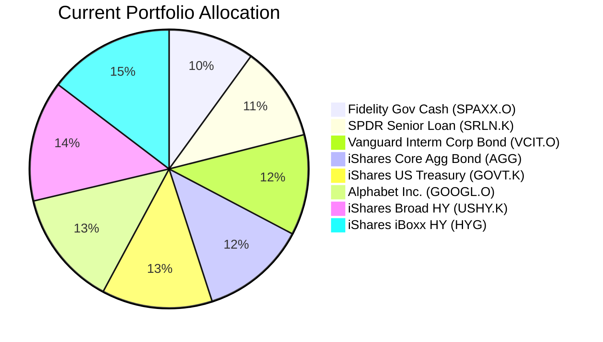
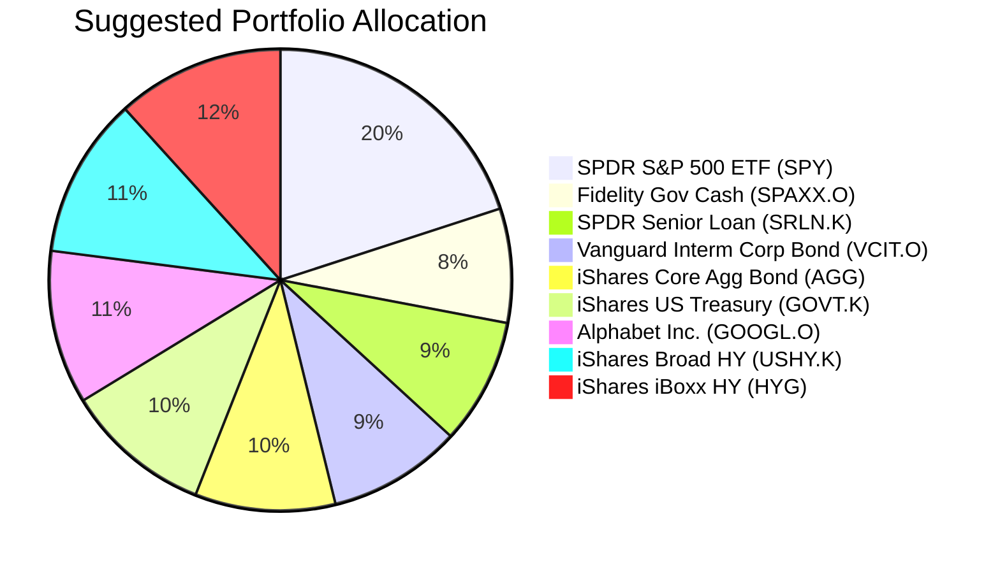

Client Product-Fit Analysis: William Turner
=====================================

# Executive Summary

We recommend introducing a 20% ($420,000) allocation to the SPDR S&P 500 ETF Trust (SPY) into William Turner's portfolio. This action is critical to address a major strategic gap: the complete absence of equity exposure, which is essential for long-term growth and inflation hedging. The funding will come from a proportional reduction across all existing fixed-income holdings. This adjustment is expected to significantly improve the portfolio's long-term return potential, aligning it with a "Growth" objective, while maintaining a prudent overall risk level given the client's 7+ year time horizon.

# Recommended Product: SPDR S&P 500 ETF Trust (SPY)

## Product Specifications
*   **Product:** SPDR S&P 500 ETF Trust
*   **Ticker:** SPY
*   **Asset Class:** Equity (US Large-Cap)
*   **Currency:** USD
*   **Risk Rating:** 4 (High)
*   **Liquidity Score:** 5 (Daily Liquidity)
*   **Current Price (as of 2026-03-27):** $645.09

## Performance Metrics
*   **1-Year Return:** 14.75%
*   **5-Year Return:** 69.97% (Annualized approx. 11.2%)
*   **Yield:** 1.06%
*   **Historical Justification:** The S&P 500 has delivered an average annual return of approximately 10% over long periods (e.g., 7-10% nominal). SPY's 5-year track record is consistent with this long-term growth expectation.

**Contrast with Current Holdings:** The client's portfolio is 100% allocated to fixed-income ETFs, which have delivered significantly lower returns over the same period. For example, the core holding AGG (iShares Core U.S. Aggregate Bond ETF) returned 0.61% over 5 years. Introducing SPY provides access to the historically superior growth engine of the US equity market.

## Risk Characteristics
*   **Volatility:** As a broad equity index, SPY exhibits higher short-term price volatility compared to fixed income.
*   **Certainty Scores:** Certainty-1y: 2 (Low short-term certainty), Certainty-3y: 3, Certainty-8y: 4 (High long-term certainty of achieving growth). This profile is suitable for a long-term horizon.
*   **Concentration Risk:** Provides diversified exposure to 500 large US companies, mitigating single-stock risk but maintaining a US equity and USD concentration.

## Detailed Justification
The recommendation for SPY is driven by a critical portfolio hygiene issue. William Turner's portfolio is 100% allocated to various fixed-income ETFs, which is suboptimal for any long-term financial goal requiring growth (Return Target: 4). Equities are a fundamental component for capital appreciation and inflation protection over a 7+ year horizon. SPY is the ideal foundational equity holding because: 1) It provides instant, low-cost, and highly liquid exposure to the US large-cap market. 2) Its long-term historical return profile (~7-10% annualized) is necessary to achieve the client's "Growth" target. 3) A 20% initial allocation introduces meaningful growth potential without exposing the portfolio to excessive risk, given the client's stated ability to tolerate volatility (Certainty: 2). This strategic allocation corrects a major asset allocation gap.

# Suggested Portfolio

| Asset | Current Market Value (USD) | Suggested Market Value (USD) | Current % | Suggested % | Change | Remark |
| :--- | :---: | :---: | :---: | :---: | :---: | :--- |
| **SPDR S&P 500 ETF Trust (SPY)** | 0 | 420,000 | 0.00% | 20.00% | +20.00% | Introduce core US equity exposure for growth. |
| Fidelity Government Cash Reserves (SPAXX.O) | 210,000 | 168,000 | 10.00% | 8.00% | -2.00% | Proportional reduction to fund equity allocation. |
| SPDR Blackstone Senior Loan ETF (SRLN.K) | 232,012 | 185,610 | 11.05% | 8.84% | -2.21% | Proportional reduction to fund equity allocation. |
| Vanguard Intermediate-Term Corp Bond ETF (VCIT.O) | 244,675 | 195,740 | 11.65% | 9.32% | -2.33% | Proportional reduction to fund equity allocation. |
| iShares Core U.S. Aggregate Bond ETF (AGG) | 257,337 | 205,870 | 12.25% | 9.80% | -2.45% | Proportional reduction to fund equity allocation. |
| iShares U.S. Treasury Bond ETF (GOVT.K) | 270,000 | 216,000 | 12.86% | 10.29% | -2.57% | Proportional reduction to fund equity allocation. |
| Alphabet Inc. Class A (GOOGL.O) | 282,663 | 226,130 | 13.46% | 10.77% | -2.69% | Proportional reduction to fund equity allocation. |
| iShares Broad USD High Yield Corp Bond ETF (USHY.K) | 295,325 | 236,260 | 14.06% | 11.25% | -2.81% | Proportional reduction to fund equity allocation. |
| iShares iBoxx $ High Yield Corporate Bond ETF (HYG) | 307,988 | 246,390 | 14.66% | 11.73% | -2.93% | Proportional reduction to fund equity allocation. |
| **Total** | **2,100,000** | **2,100,000** | **100.00%** | **100.00%** | **0.00%** | |

**Execution Instructions:** Sell approximately 2.93% of each existing holding (by market value) and use the proceeds ($420,000) to buy approximately 651 shares of SPY.

## Pros and cons of suggested portfolio

**Pros:**
*   **Goal Alignment:** Directly addresses the primary need for "Growth Diversification." The 20% equity allocation is the first step toward building a portfolio capable of achieving long-term financial objectives.
*   **Improved Return Potential:** Based on historical averages, the blended portfolio return should increase significantly, moving from an income-focused profile to a balanced growth-and-income profile.
*   **Risk Management:** The allocation is introduced prudently. A 20% equity/80% fixed-income mix maintains a defensive tilt while capturing equity upside.

**Cons:**
*   **Increased Short-Term Volatility:** The portfolio will experience greater price fluctuations, especially during market downturns, as seen in the Downside Scenario.
*   **Concentration Risk:** The portfolio remains heavily concentrated in US Dollar-denominated assets and now has a 20% concentration in US large-cap equities as an asset class.
*   **Behavioral Risk:** As a previously income-focused investor, the client may be uncomfortable with the initial volatility of the equity portion, requiring discipline to stay invested.

## Alternative suggested product to consider
1.  **Invesco QQQ Trust (QQQ):** For clients seeking more aggressive growth tilted towards technology and innovation. QQQ tracks the Nasdaq-100. It has higher historical returns but also higher volatility and sector concentration than SPY. Justification: Could be suitable if the client's risk tolerance is higher than initially assessed.
2.  **Vanguard Total Bond Market ETF (BND):** As a potential consolidation swap within the fixed-income sleeve. It is a broader aggregate bond fund similar to AGG but from a different issuer. Justification: Could offer marginally lower costs or different portfolio construction for the core bond holding, though the strategic benefit is minor compared to adding equity exposure.

# Scenario Analysis

## Normal Market Condition
*   **Assumption:** Global equities revert to long-term historical average returns. US fixed income yields moderate returns as interest rates stabilize.
*   **Projected US Equity (SPY) Return:** 10% p.a. (Justification: Long-term historical average for S&P 500).
*   **Projected Fixed Income Return:** 4% p.a. (Justification: Approximate yield of the current aggregate bond portfolio).

| Product | % Return | Suggested Holding (USD) | Projected PnL (USD) | Current Holding (USD) | Projected PnL (USD) |
| :--- | :---: | :---: | :---: | :---: | :---: |
| **SPY** | 10.0 | 420,000 | 42,000 | 0 | 0 |
| **Fixed Income & Cash Basket** | 4.0 | 1,680,000 | 67,200 | 2,100,000 | 84,000 |
| **Total** | **5.2** | **2,100,000** | **109,200** | **2,100,000** | **84,000** |
*   **Annual return of suggested vs current portfolio:** 5.2% vs 4.0%
*   **Incremental benefit:** +$25,200 annually (+30% improvement in portfolio income)

## Good Market Condition (Upside)
*   **Assumption:** Strong economic growth and stable inflation drive a bull market in equities. Bond markets are benign.
*   **Projected US Equity (SPY) Return:** 15% p.a. (Justification: Strong bull market year, e.g., 2013, 2019).
*   **Projected Fixed Income Return:** 5% p.a. (Justification: Positive credit spread tightening and stable rates).

| Product | % Return | Suggested Holding (USD) | Projected PnL (USD) | Current Holding (USD) | Projected PnL (USD) |
| :--- | :---: | :---: | :---: | :---: | :---: |
| **SPY** | 15.0 | 420,000 | 63,000 | 0 | 0 |
| **Fixed Income & Cash Basket** | 5.0 | 1,680,000 | 84,000 | 2,100,000 | 105,000 |
| **Total** | **7.0** | **2,100,000** | **147,000** | **2,100,000** | **105,000** |
*   **Annual return of suggested vs current portfolio:** 7.0% vs 5.0%
*   **Incremental benefit:** +$42,000 annually (+40% improvement)

## Bad Market Condition - Equity Correction
*   **Assumption:** A significant risk-off event causes a broad equity sell-off similar to the COVID-19 crash in Q1 2020. Flight-to-quality supports high-grade bonds.
*   **Projected US Equity (SPY) Return:** -20% p.a. (Justification: S&P 500 fell ~34% peak-to-trough in Feb-Mar 2020).
*   **Projected Fixed Income Return:** -2% p.a. (Justification: High-yield credit suffers; aggregate bonds may see small gains/losses).

| Product | % Return | Suggested Holding (USD) | Projected PnL (USD) | Current Holding (USD) | Projected PnL (USD) |
| :--- | :---: | :---: | :---: | :---: | :---: |
| **SPY** | -20.0 | 420,000 | -84,000 | 0 | 0 |
| **Fixed Income & Cash Basket** | -2.0 | 1,680,000 | -33,600 | 2,100,000 | -42,000 |
| **Total** | **-5.6** | **2,100,000** | **-117,600** | **2,100,000** | **-42,000** |
*   **Annual return of suggested vs current portfolio:** -5.6% vs -2.0%
*   **Incremental downside:** -$75,600 additional loss. This highlights the short-term volatility cost of adding equities.

# Risk Disclosure
*   Past performance of SPY or any other investment does not guarantee future returns.
*   Projected returns in the scenario analysis are estimates based on historical data and hypothetical market conditions, not promises of future performance.
*   All investments, including ETFs, carry risk of loss. The value of the SPY ETF can go down, and the client may not get back the full amount invested.

# References
*   Client Profile: 10_profile.md (Source: Planbot Internal Data)
*   Product Catalog: demo-market-quotes.csv (Source: Planbot Internal Data)
*   Web References: N/A
