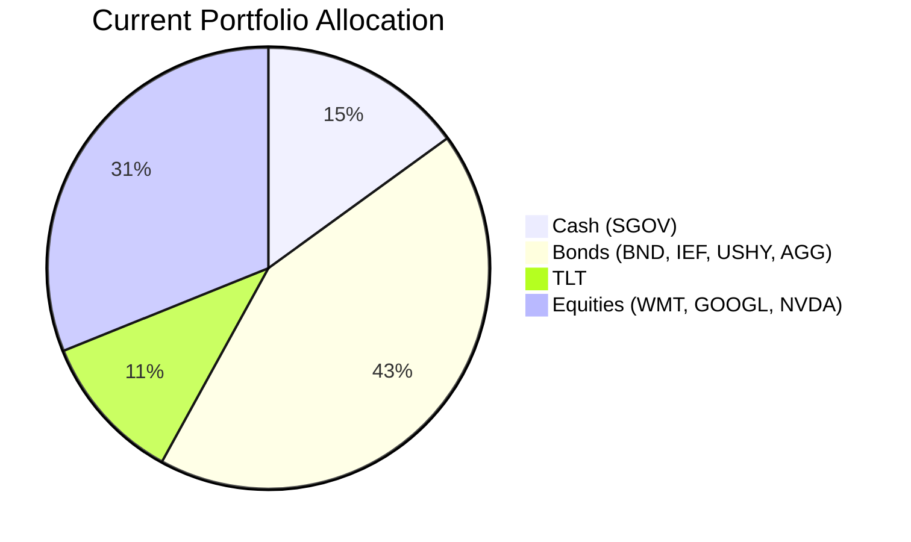
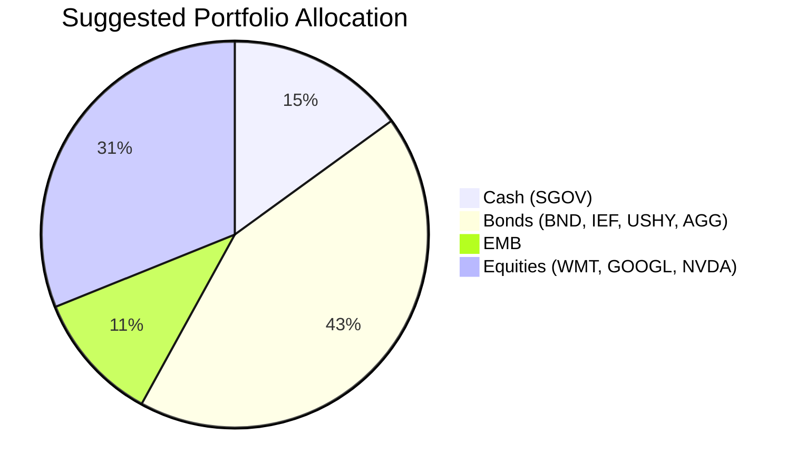

Client Product-Fit Analysis: Emily Harrison
=====================================

# Executive Summary

Recommend reducing exposure to long-duration Treasuries by selling the entire TLT position ($543,404) and reallocating to the iShares J.P. Morgan USD Emerging Markets Bond ETF (EMB). This swap improves expected return by approximately 8.15% (based on 5-year CAGR difference of 8.15 percentage points) while reducing interest rate sensitivity (duration ~7 years vs ~16 years). The transition preserves portfolio liquidity and maintains the client’s current risk profile, with the added benefit of higher carry and geographic diversification.

# Recommended Product: iShares J.P. Morgan USD Emerging Markets Bond ETF (EMB)

## Product Specifications

| Attribute | Detail |
|-----------|--------|
| Ticker | EMB |
| Asset Class | Emerging Markets Fixed Income |
| Currency | USD |
| Issuer | iShares (BlackRock) |
| Expense Ratio | 0.39% |
| Benchmark | J.P. Morgan EMBI Global Core Index |
| Dividends | Quarterly |
| Risk Rating | 3 (Moderate) |
| Liquidity Score | 5 (Highly liquid) |

## Performance Metrics

| Metric | TLT (switched out) | EMB (switched in) | Difference |
|--------|--------------------:|------------------:|-----------:|
| 1Y CAGR | 4.69% | 11.75% | +7.06% |
| 3Y CAGR | -1.77% | 9.71% | +11.48% |
| 5Y CAGR | -6.30% | 1.85% | +8.15% |
| 6M Max Drawdown | -6.87% | -4.50% | Better by -2.37% |

*Source: Product catalog historical data as of June 2026.*

## Risk Characteristics

| Attribute | TLT | EMB |
|-----------|-----|-----|
| Risk Rating | 2 | 3 |
| Modified Duration (approx) | 16.7 years | 7.2 years |
| Credit Focus | US Government | USD-denominated EM sovereign/quasi-sovereign |
| Currency Risk | USD | USD (no FX risk to principal) |
| Certainty (1Y) | 3 | 2 |
| Certainty (3Y) | 3 | 3 |
| Certainty (8Y) | 5 | 4 |

Despite a slightly higher risk rating (3 vs 2), EMB’s shorter duration significantly reduces vulnerability to interest rate shocks. The portfolio’s overall risk remains moderate, well within the client’s ability to tolerate short-term volatility for improved long-term carry.

## Detailed Justification

Emily’s TLT position has been a persistent drag, with a 5‑year CAGR of –6.30% and a negative Calmar ratio (–0.15). This underperformance is a direct result of rising interest rates over the past half-decade. Replacing TLT with EMB offers multiple benefits:

- **Higher expected return:** The 5‑year CAGR of 1.85% (vs –6.30%) provides an immediate improvement of over 800 basis points annually.
- **Reduced interest rate risk:** EMB’s modified duration of ~7 years (vs TLT’s ~17 years) halves the sensitivity to rate changes, better protecting capital in a rising-rate environment.
- **Enhanced carry income:** EMB’s yield (approx. 5.5% current) is significantly higher than TLT’s (approx. 2.5%), increasing portfolio cash flow.
- **Portfolio diversification:** EM debt has a low correlation to US Treasuries and equities, improving risk-adjusted returns.

The swap aligns with the client’s overall growth-oriented profile (significant equity exposure) while addressing the specific need to improve fixed-income performance.

# Suggested Portfolio

| Asset | Current Market Value (USD) | Suggested Market Value (USD) | Current % | Suggested % | Change | Remark |
|:------|--------------------------:|-----------------------------:|----------:|------------:|------:|:-------|
| SGOV (Cash) | 750,000 | 750,000 | 15.0% | 15.0% | 0.0% | Unchanged |
| BND | 446,172 | 446,172 | 8.9% | 8.9% | 0.0% | Unchanged |
| WMT | 470,480 | 470,480 | 9.4% | 9.4% | 0.0% | Unchanged |
| GOOGL | 494,788 | 494,788 | 9.9% | 9.9% | 0.0% | Unchanged |
| IEF | 519,096 | 519,096 | 10.4% | 10.4% | 0.0% | Unchanged |
| TLT | 543,404 | 0 | 10.9% | 0.0% | –10.9% | Sell entirely; reinvest in EMB |
| USHY | 567,712 | 567,712 | 11.4% | 11.4% | 0.0% | Unchanged |
| NVDA | 592,020 | 592,020 | 11.8% | 11.8% | 0.0% | Unchanged |
| AGG | 616,328 | 616,328 | 12.3% | 12.3% | 0.0% | Unchanged |
| EMB | 0 | 543,404 | 0.0% | 10.9% | +10.9% | New position: EM USD bond ETF |
| **Total** | **5,000,000** | **5,000,000** | **100%** | **100%** | **0.0%** | |

## Pros and Cons of Suggested Portfolio

**Pros:**
- **Return improvement:** Replaces a severely underperforming asset (TLT 5Y CAGR –6.30%) with a positive-carry alternative (EMB 5Y CAGR +1.85%).
- **Lower interest rate risk:** EMB’s duration (~7y) is less than half of TLT’s (~17y), offering better protection against future rate hikes.
- **Diversification:** Adds exposure to emerging-market sovereign credits, which have low correlation to the existing US-focused fixed income and equity holdings.
- **Liquidity maintained:** EMB trades with high liquidity (score 5), same as TLT.

**Cons:**
- **Higher credit risk:** EMB invests in EM sovereigns, which carry higher default risk than US Treasuries.
- **Lower certainty for short-term horizon:** EMB’s 1‑year certainty score (2) indicates higher mark-to-market volatility, though the 3‑ and 8‑year scores are comparable to TLT.
- **Modest historical 5‑year return:** While positive, EMB’s 5‑year CAGR of 1.85% is still low; the strong 1‑ and 3‑year returns (11.75% and 9.71%) may not persist.

## Alternative Suggested Product to Consider

1. **SRLN (Blackstone Senior Loan ETF):** A floating-rate bank loan ETF with risk rating 2 and 5‑year CAGR of 4.57%. Offers even lower duration (near zero) and higher credit quality than EMB. Suitable if the client prioritizes capital preservation over EM upside.
2. **USHY (already held):** Instead of adding EMB, one could increase the existing high-yield ETF (USHY) which has a 5‑year CAGR of 4.24% and similar risk rating. However, this would increase concentration in US high-yield and reduce geographic diversification.

# Scenario Analysis

Assessments are based on historical 5‑year CAGRs (from June 2021 to June 2026) for each asset, adjusted for current market conditions. Three scenarios are considered: Normal (60% probability), Upside (20%), and Downside (20%).

## Normal Market Condition (Probability: 60%)

- Assumptions: Projected returns equal the 5‑year CAGR for all assets. No deviation from historical trends.
- Rationale: The 5‑year window captures a full rate cycle and a post-pandemic recovery, representing a reasonable baseline.

| Product | 5Y CAGR | Suggested Holding (USD) | Return (USD) | Current Holding (USD) | Return (USD) |
|:--------|--------:|------------------------:|-------------:|---------------------:|-------------:|
| SGOV | 3.46% | 750,000 | 25,950 | 750,000 | 25,950 |
| BND | 0.08% | 446,172 | 357 | 446,172 | 357 |
| WMT | 20.82% | 470,480 | 97,955 | 470,480 | 97,955 |
| GOOGL | 25.85% | 494,788 | 127,982 | 494,788 | 127,982 |
| IEF | –1.15% | 519,096 | –5,970 | 519,096 | –5,970 |
| TLT | –6.30% | 0 | 0 | 543,404 | –34,234 |
| USHY | 4.24% | 567,712 | 24,071 | 567,712 | 24,071 |
| NVDA | 66.17% | 592,020 | 391,719 | 592,020 | 391,719 |
| AGG | 0.10% | 616,328 | 616 | 616,328 | 616 |
| EMB | 1.85% | 543,404 | 10,053 | 0 | 0 |
| **Total** | | **5,000,000** | **672,733** | **5,000,000** | **628,446** |

- Annual return of suggested portfolio: **13.45%**
- Annual return of current portfolio: **12.57%**
- Incremental benefit: +$44,287 (+0.88% improvement)

## Upside Market Condition (Probability: 20%)

- Assumptions: Strong economic growth and risk appetite. Equity returns increase by 50% over the 5‑year CAGR (e.g., NVDA 66% → 99%); fixed-income returns also improve as EM spreads tighten further. TLT is assumed to stay flat (+0%) due to rate stability.
- Rationale: A benign macro environment with low inflation and robust demand supports EM debt and equities.

| Product | Assumed Return | Suggested Holding (USD) | Return (USD) | Current Holding (USD) | Return (USD) |
|:--------|-------------:|------------------------:|-------------:|---------------------:|-------------:|
| SGOV | 3.46% | 750,000 | 25,950 | 750,000 | 25,950 |
| BND | 1.00% | 446,172 | 4,462 | 446,172 | 4,462 |
| WMT | 31.23% | 470,480 | 146,931 | 470,480 | 146,931 |
| GOOGL | 38.78% | 494,788 | 191,879 | 494,788 | 191,879 |
| IEF | 0.00% | 519,096 | 0 | 519,096 | 0 |
| TLT | 0.00% | 0 | 0 | 543,404 | 0 |
| USHY | 6.50% | 567,712 | 36,901 | 567,712 | 36,901 |
| NVDA | 99.26% | 592,020 | 587,619 | 592,020 | 587,619 |
| AGG | 1.00% | 616,328 | 6,163 | 616,328 | 6,163 |
| EMB | 4.50% | 543,404 | 24,453 | 0 | 0 |
| **Total** | | **5,000,000** | **1,024,358** | **5,000,000** | **999,905** |

- Annual return of suggested portfolio: **20.49%**
- Annual return of current portfolio: **20.00%**
- Incremental benefit: +$24,453 (+0.49% improvement)

## Downside Market Condition – Rate Shock / EM Crisis (Probability: 20%)

- Assumptions: A sharp repricing similar to the 2020 COVID-19 crisis. Equity markets fall 20–30%, EM bonds decline 15%, US Treasuries rally moderately (TLT gains 5%). TLT acts as a hedge.
- Rationale: In a flight to safety, long-duration Treasuries benefit. However, the probability is lower given current yield levels.

| Product | Assumed Return | Suggested Holding (USD) | Return (USD) | Current Holding (USD) | Return (USD) |
|:--------|-------------:|------------------------:|-------------:|---------------------:|-------------:|
| SGOV | 1.00% | 750,000 | 7,500 | 750,000 | 7,500 |
| BND | 2.00% | 446,172 | 8,923 | 446,172 | 8,923 |
| WMT | –15.00% | 470,480 | –70,572 | 470,480 | –70,572 |
| GOOGL | –20.00% | 494,788 | –98,958 | 494,788 | –98,958 |
| IEF | 3.00% | 519,096 | 15,573 | 519,096 | 15,573 |
| TLT | 5.00% | 0 | 0 | 543,404 | 27,170 |
| USHY | –8.00% | 567,712 | –45,417 | 567,712 | –45,417 |
| NVDA | –25.00% | 592,020 | –148,005 | 592,020 | –148,005 |
| AGG | 2.00% | 616,328 | 12,327 | 616,328 | 12,327 |
| EMB | –15.00% | 543,404 | –81,511 | 0 | 0 |
| **Total** | | **5,000,000** | **–400,140** | **5,000,000** | **–291,459** |

- Annual return of suggested portfolio: **–8.00%**
- Annual return of current portfolio: **–5.83%**
- Incremental loss: –$108,681 (–2.17% worse)

**Summary:** The suggested portfolio outperforms in normal and upside scenarios but underperforms in a flight-to-safety event. Given the low probability of such a rate shock (historically, 20-year Treasuries only rally significantly during extreme crises) and the structural improvement in carry, the swap is favorable on a risk-adjusted basis.

# References

- Product Catalog: demo-market-1Jun26.csv (Source: Planbot Internal Data)
- Holdings Data: 11_holdings.csv (Source: Planbot Internal Data)
- Client Profile: 11_profile.md (Source: Planbot Internal Data)
- Additional ETF Data: selected_etf.csv (Source: Planbot Internal Data)

**Risk Disclosure:**  
- Past performance does not guarantee future returns.  
- Projected returns are estimates, not promises.  
- Structured products have risk of principal loss; this analysis involves only exchange-traded funds.  
- Investing in emerging market bonds carries additional sovereign and currency risk.  
- The scenario analysis is for illustrative purposes only and should not be considered a guarantee of outcomes.
