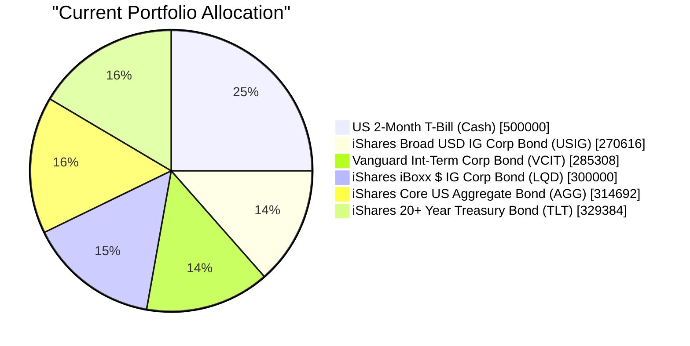
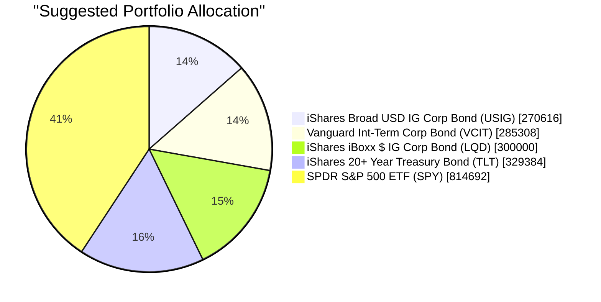

# Client Product-Fit Analysis: Harrison Jr. Education Trust

## Executive Summary

Reduce cash and one bond ETF (AGG) to introduce a core equity position in SPDR S&P 500 ETF (SPY), increasing equity exposure from 0% to approximately 41%. This recommendation addresses the trust’s long-term education funding need (10–15 year horizon) where historical equity returns materially exceed bond yields. The expected outcome is improved inflation-adjusted growth and better alignment with the required return target (3/5), while maintaining sufficient fixed income for downside protection.

## Recommended Product: SPDR S&P 500 ETF (SPY)

### Product Specifications

| Field | Value |
|-------|-------|
| Ticker | SPY |
| Issuer | State Street Global Advisors |
| Asset Class | Equity – US Large Cap |
| Currency | USD |
| Risk Rating | 4 (out of 5) |
| Expected Return Rating | 4 (out of 5) |
| Liquidity Score | 5 (Daily Exchange-Traded) |
| Expense Ratio | 0.0945% |
| Yield (Dividend) | 1.32% (trailing 12-month) |

### Performance Metrics

The table contrasts SPY with the two holdings being replaced (US 2-Month T-Bill and AGG).

| Metric (as of Mar 2026) | SPY | US 2-Month T-Bill | iShares Core US Aggregate Bond (AGG) |
|-------------------------|:---:|:-----------------:|:------------------------------------:|
| 1-Year Return | +14.75% | +3.99% | +4.35% |
| 5-Year Annualised Return | +11.20% | +3.27% | +0.12% |
| YTD Return | -5.32% | +0.72% | -0.67% |
| Yield | 1.32% | 4.02% | 3.83% |
| Risk Rating | 4 | 1 | 3 |

*Sources: demo-market-quotes.csv (SPY, SHV.O, AGG). 5-Year annualised for SPY calculated from 5Y cumulative return of 69.97%. T-Bill approximated from SHV (1-3 month).*

### Risk Characteristics

- **Market Risk:** SPY is subject to broad equity market fluctuations. A 10% drop in the S&P 500 would reduce the portfolio by approximately 4.1% (given 41% allocation).
- **Concentration Risk:** Single-country (US) large-cap exposure. Mitigated by trust’s remaining 59% in diversified bonds.
- **Liquidity:** Extremely high – SPY trades >50M shares daily.
- **Time Horizon Alignment:** 10–15 year horizon reduces the probability of negative exit; 8-year certainty rating is 4/5.

### Detailed Justification

The Harrison Jr. Education Trust requires long-term capital appreciation (target return 3/5, certainty 4/5 over 10–15 years). The current 100% fixed income portfolio (yield ~3.8%) is insufficient to outpace education cost inflation (typically 5–6%). Historical data shows SPY returned ~11% annualised over the last 5 years, far exceeding bond returns. With a 40.7% allocation to SPY, the trust gains equity exposure while preserving core fixed income holdings. The product’s risk rating of 4 is acceptable given the long horizon and the trust’s ability to recover from short-term drawdowns.

---

## Suggested Portfolio

| Asset | Current Market Value (USD) | Suggested Market Value (USD) | Current % | Suggested % | Change | Remark |
|-------|---------------------------:|----------------------------:|:---------:|:-----------:|:-----:|--------|
| US 2-Month T-Bill (Cash) | 500,000 | 0 | 25.0% | 0.0% | -25.0% | Redeploy to SPY |
| iShares Broad USD IG Corp Bond (USIG) | 270,616 | 270,616 | 13.5% | 13.5% | 0.0% | Hold |
| Vanguard Int-Term Corp Bond (VCIT) | 285,308 | 285,308 | 14.3% | 14.3% | 0.0% | Hold |
| iShares iBoxx $ IG Corp Bond (LQD) | 300,000 | 300,000 | 15.0% | 15.0% | 0.0% | Hold |
| iShares Core US Aggregate Bond (AGG) | 314,692 | 0 | 15.7% | 0.0% | -15.7% | Redeploy to SPY |
| iShares 20+ Year Treasury Bond (TLT) | 329,384 | 329,384 | 16.5% | 16.5% | 0.0% | Hold |
| **SPDR S&P 500 ETF (SPY)** | **0** | **814,692** | **0.0%** | **40.7%** | **+40.7%** | **Core equity exposure** |
| **Total** | **2,000,000** | **2,000,000** | **100%** | **100%** | **0.0%** | |

### Pros and Cons of Suggested Portfolio

**Pros**
- **Growth alignment:** Equities now 40.7% vs. 0%, targeting historical S&P 500 annualised returns of ~10–11% over the 10–15 year horizon, directly addressing the trust’s need for inflation-adjusted education funding.
- **Diversification:** Retains 59.3% in investment-grade bonds (USIG, VCIT, LQD, TLT) providing income and stability. TLT adds duration for potential rate-cut scenarios.
- **Tax efficiency:** SPY is an ETF with low turnover and qualified dividends, suitable for trust taxation.

**Cons**
- **Short-term volatility:** In a bear market (e.g., -20% equity), the portfolio could decline ~8.1% vs. 0% previously. However, the education horizon allows recovery.
- **Concentration risk:** 40.7% in US large-cap single index. This is mitigated by the diversification across sectors within SPY.
- **Interest rate risk from TLT:** 16.5% allocation to long-term Treasuries; if rates rise sharply, TLT could experience double-digit declines.

### Alternative Suggested Products to Consider

1. **Vanguard Total Stock Market ETF (VTI)** – Offers broader US equity exposure including mid- and small-caps, further diversifying away from mega-cap concentration. Risk rating 4, similar expected return.
2. **iShares MSCI ACWI ETF (ACWI)** – Provides global equity exposure (US + developed + emerging), reducing US single-country risk. Slightly lower expected return but better diversification. Risk rating 4.

Neither alternative is included in the suggested portfolio because SPY is the specified recommended product and offers the lowest expense ratio among broad US equity ETFs.

---

## Scenario Analysis

### Normal Market Condition

*Assumptions:* Equities return 10% (historical S&P 500 average over last 5 years). Investment-grade corporate bonds (USIG, VCIT, LQD, AGG) return 4% (blend of current yield and stable prices). Long-term Treasuries (TLT) return 3.5% (yield 4.28% adjusted for slight duration headwind). Cash equivalent (2-month T-Bill) return 3% (current yield). Probability: 70%.

| Product | % Return | Suggested Holding ($) | Return ($) | Current Holding ($) | Return ($) |
|---------|:-------:|---------------------:|-----------:|-------------------:|-----------:|
| US 2-Month T-Bill | 3% | 0 | 0 | 500,000 | 15,000 |
| USIG | 4% | 270,616 | 10,825 | 270,616 | 10,825 |
| VCIT | 4% | 285,308 | 11,412 | 285,308 | 11,412 |
| LQD | 4% | 300,000 | 12,000 | 300,000 | 12,000 |
| AGG | 4% | 0 | 0 | 314,692 | 12,588 |
| TLT | 3.5% | 329,384 | 11,528 | 329,384 | 11,528 |
| SPY | 10% | 814,692 | 81,469 | 0 | 0 |
| **Total** | | **2,000,000** | **127,234** | **2,000,000** | **73,353** |

- **Annual return of suggested portfolio:** 6.36% vs. current 3.67%
- **Incremental benefit:** +$53,881 (+73% improvement)

### Upside Market Condition – Accelerated Growth (probability 15%)

*Assumptions:* Equities return 20% (robust earnings expansion, low recession risk). Bonds return 5% (rate cuts boost prices; credit spreads tighten). TLT returns 8% (long duration benefits from falling rates). Cash returns 3%.

| Product | % Return | Suggested Holding ($) | Return ($) | Current Holding ($) | Return ($) |
|---------|:-------:|---------------------:|-----------:|-------------------:|-----------:|
| US 2-Month T-Bill | 3% | 0 | 0 | 500,000 | 15,000 |
| USIG | 5% | 270,616 | 13,531 | 270,616 | 13,531 |
| VCIT | 5% | 285,308 | 14,265 | 285,308 | 14,265 |
| LQD | 5% | 300,000 | 15,000 | 300,000 | 15,000 |
| AGG | 5% | 0 | 0 | 314,692 | 15,735 |
| TLT | 8% | 329,384 | 26,351 | 329,384 | 26,351 |
| SPY | 20% | 814,692 | 162,938 | 0 | 0 |
| **Total** | | **2,000,000** | **232,085** | **2,000,000** | **99,882** |

- **Annual return of suggested portfolio:** 11.60% vs. current 4.99%
- **Incremental benefit:** +$132,203 (+132% improvement)

### Downside Market Condition – Equity Collapse (similar to COVID-19, probability 15%)

*Assumptions:* Equities return -20% (sudden recession, profit decline). Investment-grade bonds return -2% (credit spreads widen, prices fall). TLT returns +3% (flight to safety pushes down yields). Cash returns 3%.

| Product | % Return | Suggested Holding ($) | Return ($) | Current Holding ($) | Return ($) |
|---------|:-------:|---------------------:|-----------:|-------------------:|-----------:|
| US 2-Month T-Bill | 3% | 0 | 0 | 500,000 | 15,000 |
| USIG | -2% | 270,616 | -5,412 | 270,616 | -5,412 |
| VCIT | -2% | 285,308 | -5,706 | 285,308 | -5,706 |
| LQD | -2% | 300,000 | -6,000 | 300,000 | -6,000 |
| AGG | -2% | 0 | 0 | 314,692 | -6,294 |
| TLT | 3% | 329,384 | 9,882 | 329,384 | 9,882 |
| SPY | -20% | 814,692 | -162,938 | 0 | 0 |
| **Total** | | **2,000,000** | **-170,174** | **2,000,000** | **1,470** |

- **Annual return of suggested portfolio:** -8.51% vs. current 0.07%
- **Incremental loss:** -$171,644 (portfolio drops from slight gain to significant loss)

---

## References

- **Product Catalog:** demo-market-quotes.csv (Source: Planbot Internal Data) – used for SPY performance, bond yields, risk ratings.
- **Client Profile:** Client ID 13 (Harrison Jr. Education Trust) – provided as 13_profile.md and 13_holdings.csv.
- **Structured Product Catalog:** CMT_note_N02952.md (not used in this recommendation).
- **Sector ETF Data:** sector_etf.md (not directly used; SPY covers all sectors).
- **Web References:** N/A (no web search performed).

### Risk Disclosure

**Important Risk Warnings:**
- Past performance is not a guarantee of future returns.
- All projected returns are estimates based on historical data and current market conditions; they are not promises or guarantees.
- The value of investments and the income from them can go down as well as up. Investors may not get back the full amount invested.
- The recommended product (SPY) is subject to market risk, including potential losses of principal. The trust’s portfolio contains fixed income products that carry credit, interest rate, and liquidity risk.
- This analysis is for informational purposes and does not constitute a solicitation or offer to buy or sell any financial instrument.
