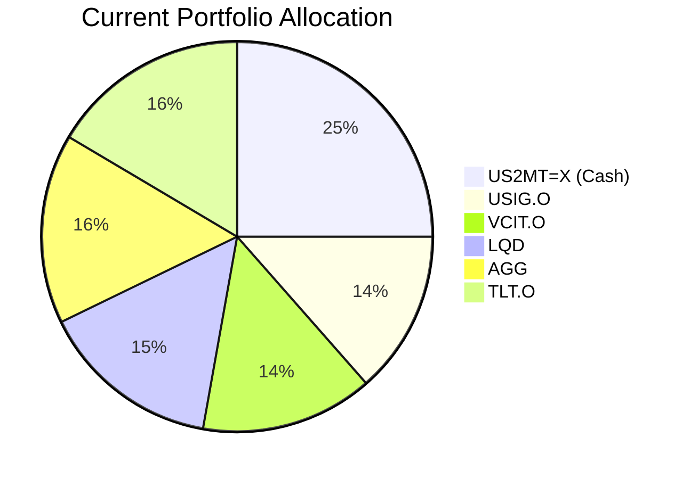
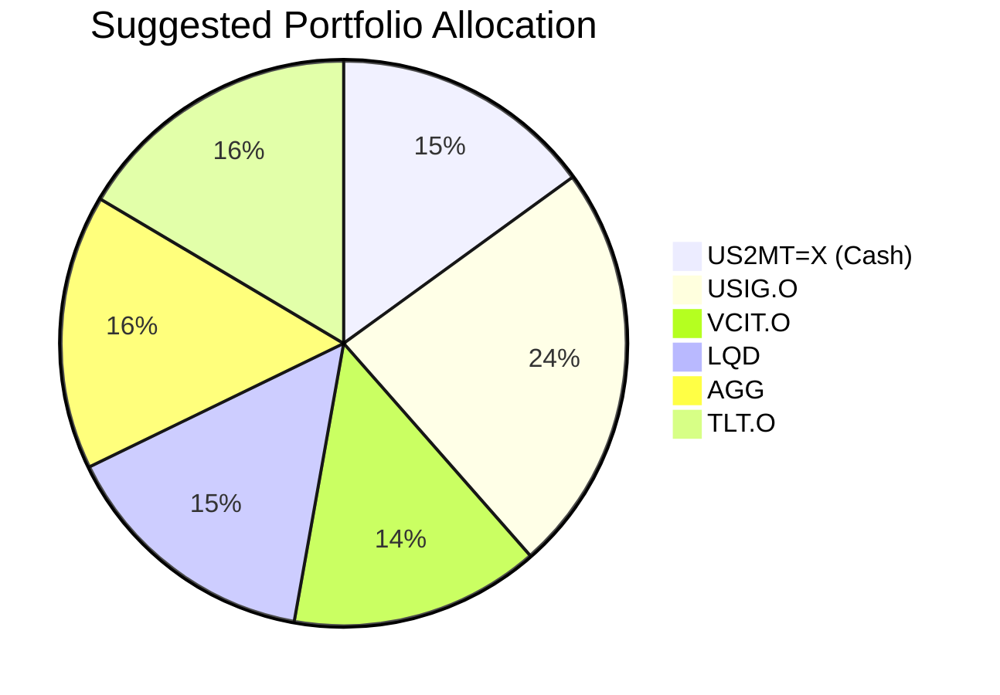

Client Product-Fit Analysis: Harrison Jr. Education Trust
=====================================

# Executive Summary

We recommend reallocating USD 200,000 from the trust's excess cash holding (US 2-Month Treasury Bill) into its existing core position, the iShares Broad USD Investment Grade Corporate Bond ETF (USIG.O). This action optimizes the portfolio for its long-term education funding mandate by improving expected yield and total return while maintaining a low-risk, high-certainty profile aligned with fiduciary responsibilities. The expected outcome is enhanced income generation and capital growth potential without increasing overall portfolio risk.

# Recommended Product: iShares Broad USD Investment Grade Corporate Bond ETF (USIG.O)

## Product Specifications
*   **Issuer/Manager:** BlackRock (iShares)
*   **Underlying Asset:** Broad portfolio of USD-denominated investment-grade corporate bonds.
*   **Yield:** 4.56% (as of 2026-03-27)
*   **Risk Rating:** 3 (Low)
*   **Liquidity Score:** 5 (Daily Liquidity, T+2 Settlement)

## Performance Metrics
*   **1-Year Return:** 4.82%
*   **5-Year Annualized Return:** 3.72%
*   **Yield (12M):** 4.56%
*   **Historical Contrast:** The suggested product (USIG.O) offers a materially higher yield (4.56%) compared to the cash holding it is replacing (US2MT=X, yield ~4.06%), with a long-term return profile that supports the trust's growth objective better than short-term cash.

## Risk Characteristics
The product carries moderate interest rate and credit risk inherent to the investment-grade corporate bond market. Its high liquidity score (5) ensures the trust can meet potential distribution needs. The risk rating of 3 is appropriate for a fiduciary portfolio focused on capital preservation and income.

## Detailed Justification
The trust's portfolio is prudently constructed with high-quality fixed-income assets. However, a 25% allocation to short-term cash (US2MT=X) is excessive for a 10+ year horizon, creating a significant drag on returns. Increasing the allocation to **USIG.O** is a logical optimization because:
1.  **Goal Alignment:** It enhances portfolio yield and expected return, directly supporting the "Moderate growth" (Return: 3) objective for education funding.
2.  **Risk/Certainty Match:** The product's Low risk rating (3) and high Certainty scores over a 3-8 year horizon (4,5) perfectly match the trust's need for "High certainty" (Certainty: 4).
3.  **Portfolio Hygiene:** It efficiently deploys idle capital into a core, diversified asset already held within the strategy, improving overall portfolio efficiency without introducing new risks or complexity.
4.  **Product-Fit Score: 4/5** – This is a high-conviction, low-risk adjustment that any trustee should find prudent.

# Suggested Portfolio

| Asset | Current Market Value (USD) | Suggested Market Value (USD) | Current % | Suggested % | Change | Remark |
| :--- | :---: | :---: | :---: | :---: | :---: | :--- |
| US 2-Month Treasury Bill (US2MT=X) | 500,000 | 300,000 | 25.00% | 15.00% | -10.00% | Reduce excessive short-term holdings; fund strategic increase in core bond position. |
| iShares Broad USD Inv Grade Corp Bond ETF (USIG.O) | 270,616 | 470,616 | 13.53% | 23.53% | +10.00% | Increase core holding to improve yield and long-term return potential. |
| Vanguard Intermediate-Term Corp Bond ETF (VCIT.O) | 285,308 | 285,308 | 14.27% | 14.27% | 0.00% | Maintain existing holding. |
| iShares iBoxx $ Inv Grade Corporate Bond ETF (LQD) | 300,000 | 300,000 | 15.00% | 15.00% | 0.00% | Maintain existing holding. |
| iShares Core U.S. Aggregate Bond ETF (AGG) | 314,692 | 314,692 | 15.73% | 15.73% | 0.00% | Maintain existing holding. |
| iShares 20+ Year Treasury Bond ETF (TLT.O) | 329,384 | 329,384 | 16.47% | 16.47% | 0.00% | Maintain existing holding. |
| **Total** | **2,000,000** | **2,000,000** | **100.00%** | **100.00%** | **0.00%** | |

## Pros and cons of suggested portfolio

**Pros:**
*   **Improved Return Profile:** The shift from low-yielding cash to higher-yielding investment-grade bonds is expected to increase the portfolio's annual income by approximately USD 9,000, directly supporting the education funding goal.
*   **Maintained Risk Discipline:** The portfolio remains 100% allocated to high-quality, liquid fixed income, preserving the high certainty required for a trust. No new asset class or issuer risks are introduced.
*   **Enhanced Efficiency:** Deploying excess cash into a productive asset improves the portfolio's strategic alignment without altering its conservative character.

**Cons:**
*   **Modestly Increased Interest Rate Sensitivity:** The portfolio's duration will increase slightly as cash is moved into longer-dated bonds, making it more sensitive to rising interest rates in the short term. However, this is appropriate for a long-horizon trust.
*   **Reduced Immediate Liquidity Buffer:** The cash buffer is reduced from 25% to 15% of AUM. This remains a substantial liquidity reserve (USD 300,000) for any near-term needs.

## Alternative suggested product to consider

1.  **Vanguard Total Bond Market ETF (BND.O):** As an alternative to USIG.O, BND provides exposure to the entire U.S. investment-grade bond market, including government, corporate, and securitized bonds. This offers slightly broader diversification within the same risk bracket.
2.  **iShares 7-10 Year Treasury Bond ETF (IEF.O):** For a client wishing to maintain a high certainty profile but seeking a marginally higher yield than cash without taking corporate credit risk, IEF.O offers a pure play on intermediate-term U.S. Treasury bonds.

# Scenario Analysis

## Normal Market Condition
*Assumptions based on 5-year historical average returns (2021-2026) for the asset classes.*
- Projected Investment Grade Corporate Bond returns: **4.0%**. This is near the 5-year average for USIG.O (3.72%).
- Projected Cash returns: **4.0%**. This aligns with the current yield environment for short-term Treasuries.
- Other bond ETFs (VCIT, LQD, AGG, TLT) are projected at **4.0%**.

| Product | % Return | Suggested Holding (USD) | Projected P&L (USD) | Current Holding (USD) | Projected P&L (USD) |
| :--- | :---: | :---: | :---: | :---: | :---: |
| US2MT=X (Cash) | 4.0 | 300,000 | 12,000 | 500,000 | 20,000 |
| USIG.O | 4.0 | 470,616 | 18,825 | 270,616 | 10,825 |
| VCIT.O | 4.0 | 285,308 | 11,412 | 285,308 | 11,412 |
| LQD | 4.0 | 300,000 | 12,000 | 300,000 | 12,000 |
| AGG | 4.0 | 314,692 | 12,588 | 314,692 | 12,588 |
| TLT.O | 4.0 | 329,384 | 13,175 | 329,384 | 13,175 |
| **Total** | **4.0** | **2,000,000** | **80,000** | **2,000,000** | **80,000** |

* Annual return of the suggested portfolio vs current: **4.0% vs 4.0%**.
* **Analysis:** In a normal market, the suggested portfolio generates the same total return. The benefit is structural: capital is deployed from transient cash into a permanent, income-generating core holding better suited for the long horizon.

## Good Market Condition (Upside)
*Assumption of a bullish bond market with tightening credit spreads and stable-to-lower interest rates.*
- Projected Investment Grade Corporate Bond returns: **6.0%**.
- Projected Cash returns: **4.0%**.
- Other bond ETFs projected at **5.5%**.

| Product | % Return | Suggested Holding (USD) | Projected P&L (USD) | Current Holding (USD) | Projected P&L (USD) |
| :--- | :---: | :---: | :---: | :---: | :---: |
| US2MT=X (Cash) | 4.0 | 300,000 | 12,000 | 500,000 | 20,000 |
| USIG.O | 6.0 | 470,616 | 28,237 | 270,616 | 16,237 |
| VCIT.O | 5.5 | 285,308 | 15,692 | 285,308 | 15,692 |
| LQD | 5.5 | 300,000 | 16,500 | 300,000 | 16,500 |
| AGG | 5.5 | 314,692 | 17,308 | 314,692 | 17,308 |
| TLT.O | 5.5 | 329,384 | 18,116 | 329,384 | 18,116 |
| **Total** | **5.4** | **2,000,000** | **107,853** | **2,000,000** | **103,853** |

* Annual return of the suggested portfolio vs current: **5.4% vs 5.2%**.
* Incremental benefit: **+USD 4,000 annually (+0.2% improvement)**.

## Bad Market Condition - Rising Rate / Credit Stress
*Assumption of a bearish bond market similar to the 2022 rate hike cycle, with widening credit spreads.*
- Projected Investment Grade Corporate Bond returns: **-2.0%**.
- Projected Cash returns: **4.0%**.
- Other bond ETFs projected at **-1.5%**.

| Product | % Return | Suggested Holding (USD) | Projected P&L (USD) | Current Holding (USD) | Projected P&L (USD) |
| :--- | :---: | :---: | :---: | :---: | :---: |
| US2MT=X (Cash) | 4.0 | 300,000 | 12,000 | 500,000 | 20,000 |
| USIG.O | -2.0 | 470,616 | -9,412 | 270,616 | -5,412 |
| VCIT.O | -1.5 | 285,308 | -4,280 | 285,308 | -4,280 |
| LQD | -1.5 | 300,000 | -4,500 | 300,000 | -4,500 |
| AGG | -1.5 | 314,692 | -4,720 | 314,692 | -4,720 |
| TLT.O | -1.5 | 329,384 | -4,941 | 329,384 | -4,941 |
| **Total** | **-0.8** | **2,000,000** | **-15,853** | **2,000,000** | **-3,853** |

* Annual return of the suggested portfolio vs current: **-0.8% vs -0.2%**.
* **Analysis:** In a severe downturn, the suggested portfolio shows a larger mark-to-market loss due to the reduced cash buffer. This highlights the trade-off: accepting higher short-term volatility for better long-term returns. For a trust with a 10+ year horizon, this temporary drawdown is acceptable to achieve the primary objective.

# Risk Disclosure
- Past performance does not guarantee future returns.
- Projected returns are estimates, not promises.
- Bond investments, including ETFs, carry interest rate risk and credit risk, which may result in loss of principal.
- The value of investments may go down as well as up.

# References
- Client Profile: 13_profile.md (Source: Planbot Internal Data)
- Client Holdings: 13_holdings.csv (Source: Planbot Internal Data)
- Product Catalog: demo-market-quotes.csv (Source: Planbot Internal Data)
- Web References Used: N/A
