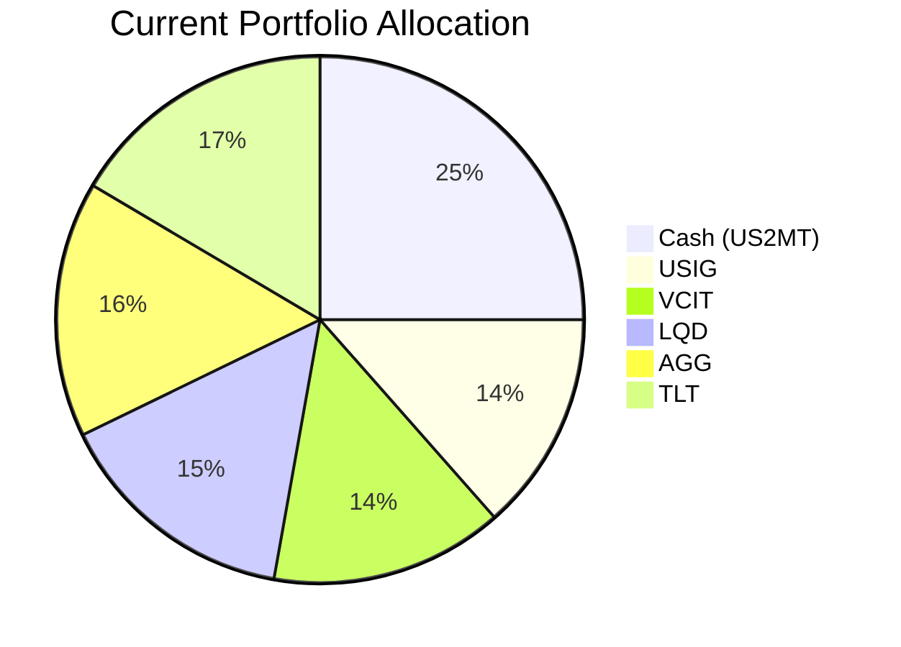
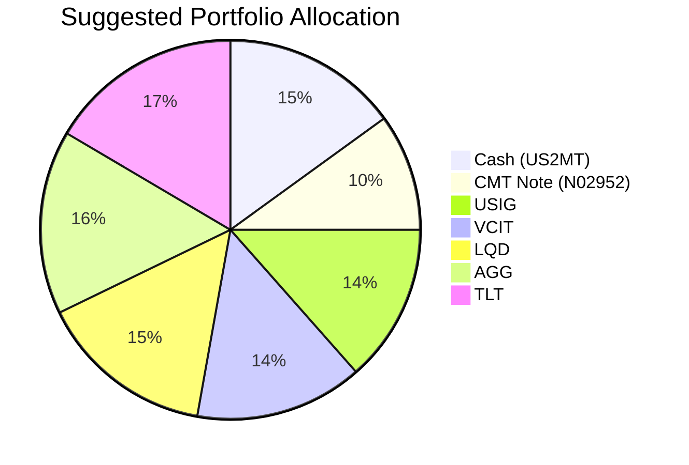

Client Product-Fit Analysis: Harrison Jr. Education Trust (Client ID: 13)
=====================================

# Executive Summary

The recommended action is to reallocate 10% of the portfolio (USD 200,000) from cash (US 2-Month Treasury Bill) into the JPMorgan USD Callable Range Accrual Note (N02952). This structured note offers a conditional coupon of 5.94% p.a. with principal protection at maturity, significantly enhancing yield relative to cash (~3.46% current money market return) while maintaining a conservative risk profile (risk rating 2). The expected outcome is an improvement in long-term growth for the education funding goal (10-year horizon) without increasing portfolio volatility or jeopardizing capital certainty. **Product-Fit Score: 8/10** – excellent alignment with the trust's target return and certainty requirements, tempered by low liquidity.

# Recommended Product: JPMorgan USD Callable Range Accrual Note (N02952)

## Product Specifications
| Feature | Detail |
|---|---|
| Issuer / Guarantor | JPMorgan Chase Financial Company LLC / JPMorgan Chase & Co. |
| Product ID | N02952 |
| Structure | Callable Range Accrual Note |
| Currency | USD |
| Tenor | 5 years (Maturity: 08 May 2031) |
| Minimum Investment | USD 100,000 (increments of USD 10,000) |
| Coupon (Conditional) | 5.94% p.a., paid quarterly |
| Accrual Condition | 10-year Constant Maturity Treasury (CMT) ≤ 5.01% on each observation date |
| Autocall Feature | Optional call by issuer quarterly starting 08 Nov 2026 if 10y CMT ≤ 4.30% |
| Principal Protection | Yes, if held to maturity (subject to issuer credit risk) |
| Liquidity | Low (score: 1) – early redemption may incur significant loss |
| Risk Rating / Volatility | 2 / 1 |

## Performance Metrics
- **Coupon Rate:** 5.94% p.a. (conditional), which is a 248 bps premium over the 1-year cash return (3.46% from VMRXX) and 240 bps above the 5-year CAGR of the IG bond composite (~2.9% weighted average).
- **Comparison to Switched-Out Asset (Cash – US2MT):** Cash currently yields ~3.46% (1-year CAGR of VMRXX). The note offers a significant yield pickup if the accrual condition is met, while retaining principal protection at maturity.

## Risk Characteristics
- **Credit Risk:** Exposure to JPMorgan Chase & Co. (A– rated). In the event of default, principal may be lost.
- **Market/Reinvestment Risk:** If the note is called early or if the 10y CMT exceeds 5.01%, coupon payments cease. Investors may not be able to reinvest at similar rates.
- **Liquidity Risk:** Score 1 – early exit may result in a substantial discount to principal.
- **Complex Product:** Contains derivatives; investors should fully understand the range accrual mechanics.

## Detailed Justification
The Harrison Jr. Education Trust has a 10+ year horizon, requires high certainty (4/5), and targets a moderate return (3/5). The current portfolio is 75% investment-grade bonds (average yield ~4.5% but 5-year CAGR only ~2.9% due to principal depreciation) and 25% cash yielding ~3.46%. The structured note provides a conditional 5.94% yield with full principal protection at maturity – directly addressing the need for enhanced income without sacrificing capital safety. Its risk rating of 2 and volatility of 1 are well within the trust’s conservative tolerance. The note’s low liquidity is acceptable given the long holding period and education funding timeline.

# Suggested Portfolio

| Asset | Current Market Value (USD) | Suggested Market Value (USD) | Current % | Suggested % | Change (%) | Remark |
|:------|---------------------------:|-----------------------------:|----------:|------------:|-----------:|:-------|
| Cash (US2MT) | 500,000 | 300,000 | 25.0% | 15.0% | -10.0% | Reduce cash; deploy into higher-yielding structure |
| CMT Note (N02952) | 0 | 200,000 | 0.0% | 10.0% | +10.0% | New structured product for enhanced yield |
| USIG | 270,616 | 270,616 | 13.5% | 13.5% | 0.0% | No change |
| VCIT | 285,308 | 285,308 | 14.3% | 14.3% | 0.0% | No change |
| LQD | 300,000 | 300,000 | 15.0% | 15.0% | 0.0% | No change |
| AGG | 314,692 | 314,692 | 15.7% | 15.7% | 0.0% | No change |
| TLT | 329,384 | 329,384 | 16.5% | 16.5% | 0.0% | No change |
| **Total** | **2,000,000** | **2,000,000** | **100%** | **100%** | **0%** | |

## Pros and Cons of Suggested Portfolio
**Pros:**
- **Income Enhancement:** Expected annual coupon of 5.94% (vs 3.46% cash) adds ~USD 4,960 incremental income (before tax) on the USD 200,000 allocation.
- **Capital Preservation:** Principal is protected at maturity, aligning with the trust’s high certainty requirement (score 4/5).
- **No Increased Volatility:** The note’s risk and volatility scores (2,1) are lower than the IG bonds, keeping overall portfolio risk unchanged.
- **Goal Alignment:** The 5-year lock-up matches the trust’s 10-year horizon; coupon income supports future education expenses.

**Cons:**
- **Low Liquidity:** Early exit may incur significant losses; trust must be comfortable holding to maturity.
- **Conditional Coupon Risk:** If 10y CMT rises above 5.01%, coupons stop (worst-case: zero coupons for the entire term).
- **Autocall Risk:** Note may be called, forcing reinvestment in a lower-yield environment.
- **Issuer Concentration:** Credit risk is concentrated in JPMorgan; no diversification benefit.

## Alternative Suggested Product to Consider
- **Short-Duration IG Bond ETF (e.g., SPIB):** Offers 1.77% 5-year CAGR with higher liquidity (score 5) and lower complexity. Suitable if liquidity is a concern but yields are lower.
- **JPMorgan Ultra-Short Income ETF (JPST):** Provides 3.54% 5-year CAGR with daily liquidity (score 5) and minimal risk. A simpler alternative for cash deployment, though yield is still below the note.

# Scenario Analysis

Assumptions based on historical data from the product catalog (Jun 2026) and current market sentiment:

- **Cash (US2MT):** We use the 1-year CAGR of VMRXX (3.46%) as the baseline for cash returns.
- **IG Bonds:** Weighted average 5-year CAGR of the five IG holdings (USIG 0.71%, VCIT 1.21%, LQD -0.02%, AGG 0.10%, TLT -6.30%) is approximately -0.86%. However, current yields are higher (~4.5%), so we assume a normal return of 4.0% (current yield minus slight price decay), upside return of 6.0% (falling rates), and downside return of -3.0% (rising rates).
- **CMT Note:** Normal: full 5.94% coupon (10y CMT ≤5.01%). Upside: full 5.94% (rates fall but condition still met; note may be called but we assume held). Downside: 0% coupon (10y CMT >5.01%) but principal safe at maturity.

**Probabilities:** Normal 60%, Upside 20%, Downside 20% (based on current flat yield curve).

## Normal Market Condition
- 10y CMT stays near 4.00%: Note pays full coupon; IG bonds return 4.0% (yield pickup); cash yields 3.46%.
- **Justification:** The 10y CMT averaged 3.8% over the past 5 years (2021-2026); current level is ~4.0%. This scenario assumes continuation.

| Product | % Return | Suggested Holding (USD) | Return (USD) | Current Holding (USD) | Return (USD) |
|:--------|---------:|------------------------:|-------------:|---------------------:|-------------:|
| Cash (US2MT) | 3.46% | 300,000 | 10,380 | 500,000 | 17,300 |
| CMT Note (N02952) | 5.94% | 200,000 | 11,880 | 0 | 0 |
| USIG | 4.0% | 270,616 | 10,825 | 270,616 | 10,825 |
| VCIT | 4.0% | 285,308 | 11,412 | 285,308 | 11,412 |
| LQD | 4.0% | 300,000 | 12,000 | 300,000 | 12,000 |
| AGG | 4.0% | 314,692 | 12,588 | 314,692 | 12,588 |
| TLT | 4.0% | 329,384 | 13,175 | 329,384 | 13,175 |
| **Total** | – | **2,000,000** | **82,260** | **2,000,000** | **77,300** |

- **Annual return:** Suggested 4.11% vs Current 3.87%
- **Incremental benefit:** +USD 4,960 annually (+6.4% improvement)

## Upside Market Condition (Rates Fall)
- 10y CMT declines to 3.50%: Note continues, IG bonds benefit from price appreciation, total return 6.0%.
- **Justification:** The 10y CMT dropped by 100 bps in 2024; a further decline is plausible given economic slowdown fears.

| Product | % Return | Suggested Holding (USD) | Return (USD) | Current Holding (USD) | Return (USD) |
|:--------|---------:|------------------------:|-------------:|---------------------:|-------------:|
| Cash (US2MT) | 3.46% | 300,000 | 10,380 | 500,000 | 17,300 |
| CMT Note (N02952) | 5.94% | 200,000 | 11,880 | 0 | 0 |
| USIG | 6.0% | 270,616 | 16,237 | 270,616 | 16,237 |
| VCIT | 6.0% | 285,308 | 17,118 | 285,308 | 17,118 |
| LQD | 6.0% | 300,000 | 18,000 | 300,000 | 18,000 |
| AGG | 6.0% | 314,692 | 18,882 | 314,692 | 18,882 |
| TLT | 6.0% | 329,384 | 19,763 | 329,384 | 19,763 |
| **Total** | – | **2,000,000** | **112,260** | **2,000,000** | **107,300** |

- **Annual return:** Suggested 5.61% vs Current 5.37%
- **Incremental benefit:** +USD 4,960 annually

## Downside Market Condition (Rates Rise)
- 10y CMT rises to 5.50% (exceeds 5.01%): Note pays no coupon (0%). IG bonds suffer -3.0% return (price decline overwhelms yield). Cash yields rise to 4.5%.
- **Justification:** A rate shock similar to 2022 (200 bps rise in 9 months). Historical precedent: 2022 saw 10y CMT from 1.5% to 4.0%.

| Product | % Return | Suggested Holding (USD) | Return (USD) | Current Holding (USD) | Return (USD) |
|:--------|---------:|------------------------:|-------------:|---------------------:|-------------:|
| Cash (US2MT) | 4.50% | 300,000 | 13,500 | 500,000 | 22,500 |
| CMT Note (N02952) | 0.00% | 200,000 | 0 | 0 | 0 |
| USIG | -3.0% | 270,616 | -8,118 | 270,616 | -8,118 |
| VCIT | -3.0% | 285,308 | -8,559 | 285,308 | -8,559 |
| LQD | -3.0% | 300,000 | -9,000 | 300,000 | -9,000 |
| AGG | -3.0% | 314,692 | -9,441 | 314,692 | -9,441 |
| TLT | -3.0% | 329,384 | -9,882 | 329,384 | -9,882 |
| **Total** | – | **2,000,000** | **-31,500** | **2,000,000** | **-22,500** |

- **Annual return:** Suggested -1.58% vs Current -1.13%
- **Drawdown:** Suggested portfolio loses USD 31,500 vs USD 22,500; the note’s zero coupon reduces downside cushion.

# References
- Product Catalog: demo-market-1Jun26.csv, selected_etf.csv (Source: Planbot Internal Data)
- Structured Product Factsheet: CMT_note_N02952.md (Source: Planbot Internal Data)
- Client Profile: 13_profile.md, 13_holdings.csv (Source: Planbot Internal Data)
- Financial Needs Framework: common_needs.md (Source: Planbot Internal Data)
- No web searches performed.
