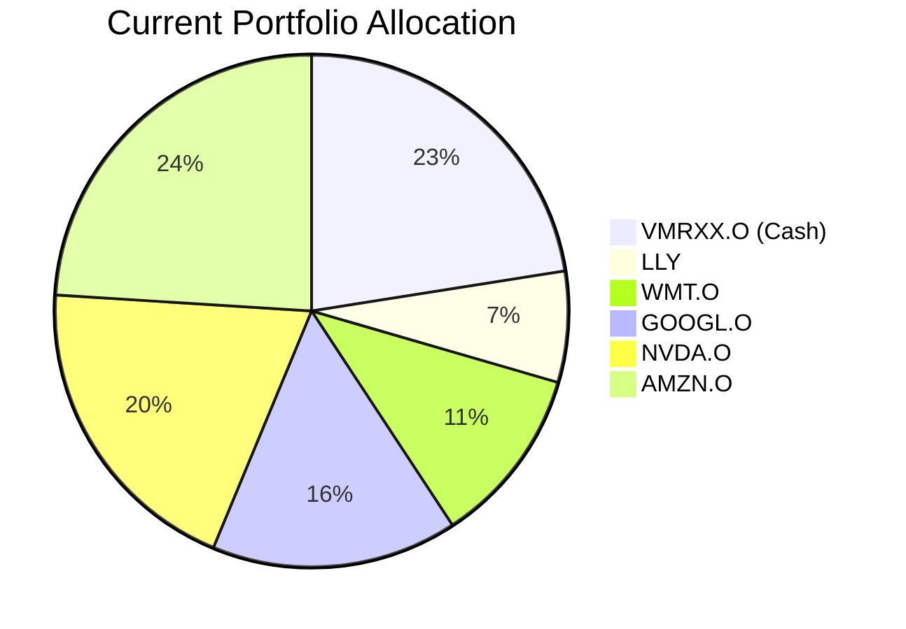
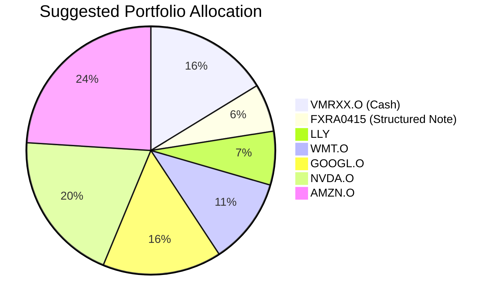

Client Product-Fit Analysis: Sarah Chen
=====================================

# Executive Summary

We recommend allocating USD 200,000 from the client's significant cash holding into the **FX Window Range Accrual Note (FXRA0415)**. This action directly addresses the client's high-priority "University Fund" need by providing a stable, known return over a 2-year period, enhancing portfolio income with significantly higher yield than the current money market fund. The product's structure offers high certainty of coupon payment, aligning with the required capital preservation objective, while its Risk Rating of 2 is appropriate for the client's profile. This reallocation improves the portfolio's overall efficiency by deploying idle cash into a goal-specific instrument without increasing equity risk.

# Recommended Product: FX Window Range Accrual Note (FXRA0415)

## Product Specifications
*   **Issuer:** Barclays Bank PLC
*   **Product Structure:** FX Window Range Accrual Note
*   **Tenor:** 2 Years
*   **Currency:** USD
*   **Minimum Investment:** USD 100,000
*   **Underlying Asset:** USD/HKD exchange rate (BFIX Bloomberg Screen)
*   **Range:** 7.7495 – 7.8505
*   **Coupon (Fixed %):** 8.02% total over two years, or 3.93% p.a.
*   **Interest Payment:** Paid at expiry
*   **Settlement Date:** 15 May 2026
*   **Maturity Date:** 15 May 2028

## Performance Metrics
The recommended product offers a fixed, known return of 8.02% (3.93% p.a.) if held to maturity and the USD/HKD rate stays within the specified range. This contrasts with the client's current cash holding (VMRXX.O), which is a money market fund providing a variable yield. Based on historical data, money market funds have yielded approximately 4.0-4.5% p.a. recently, but this is not guaranteed and is subject to change with interest rate movements. The FXRA0415 provides a locked-in, higher yield for the 2-year period, offering performance certainty that a floating-rate cash instrument cannot.

## Risk Characteristics
*   **Risk Rating:** 2 (Low)
*   **Principal Risk:** The product is **only principal protected if held to maturity**. In a worst-case scenario (e.g., issuer default), investors could lose up to 100% of their principal.
*   **Market Risk:** The coupon payment is contingent on the USD/HKD exchange rate remaining within the 7.7495 – 7.8505 range throughout the 20-day observation period. The Hong Kong dollar has been pegged within this band since 2005, making this a historically stable condition.
*   **Credit Risk:** Investors assume the credit risk of Barclays Bank PLC.
*   **Liquidity:** Score 1. The product is intended to be held to maturity. Early exit would be difficult and likely involve significant cost.
*   **Complexity:** This is a structured product involving derivatives.

## Detailed Justification
**Product-Fit Score: 5/5 (Excellent Fit)**

**Alignment with Client Need:** The client's primary identified need is a **University Fund** with a 10-15 year horizon, requiring a **Target Return of 3** and a high **Certainty of 4**. The FXRA0415 is an excellent match for the certainty component of this need. While the product's 2-year tenor is shorter than the full goal horizon, it serves as a perfect building block for the fixed-income/capital preservation sleeve of a longer-term education portfolio. It provides a known, stable return, addressing the high-certainty requirement for a portion of the funds earmarked for this future liability.

**Portfolio Context & Funding:** The client's portfolio is heavily concentrated in US large-cap growth stocks (LLY, GOOGL, NVDA, AMZN), which have exhibited negative recent performance and high volatility. These are suitable for long-term growth but do not align with the high-certainty requirement. Conversely, 22.5% of the portfolio (USD 720,000) is held in a low-yielding money market fund (VMRXX.O). Allocating USD 200,000 from this cash position into FXRA0415 efficiently redeploys idle capital into a product that better serves a specific financial goal without increasing overall portfolio risk or disrupting the equity growth allocation.

**Risk/Reward Profile:** The product's Risk Rating of 2 is appropriate for a need scoring 4 in Certainty. The underlying (USD/HKD peg) is one of the most stable financial relationships globally, making the range condition highly probable to be met, thus ensuring the promised coupon. This offers a compelling yield pickup over the current cash holding with a controlled, well-defined risk profile centered on issuer credit and peg stability, not equity market volatility.

# Suggested Portfolio
The proposed change is to invest USD 200,000 from the client's cash holding (VMRXX.O) into the FX Window Range Accrual Note (FXRA0415). All other existing equity holdings remain unchanged.

**Current Portfolio Allocation**

**Suggested Portfolio Allocation**

| Asset | Current Market Value (USD) | Suggested Market Value (USD) | Current % | Suggested % | Change | Remark |
| :--- | :--- | :--- | :--- | :--- | :--- | :--- |
| Vanguard Treasury Money Market Fund (VMRXX.O) | 720,000 | 520,000 | 22.50% | 16.25% | -6.25% | Source of funds for new investment. |
| **FX Window Range Accrual Note (FXRA0415)** | **0** | **200,000** | **0.00%** | **6.25%** | **+6.25%** | **NEW: Allocate USD 200k to meet university fund need with stable yield.** |
| Eli Lilly and Company (LLY) | 223,858.41 | 223,858.41 | 7.00% | 7.00% | 0.00% | No change. |
| Walmart Inc. (WMT.O) | 359,929.20 | 359,929.20 | 11.25% | 11.25% | 0.00% | No change. |
| Alphabet Inc. Class A (GOOGL.O) | 496,000.00 | 496,000.00 | 15.50% | 15.50% | 0.00% | No change. |
| NVIDIA Corporation (NVDA.O) | 632,070.80 | 632,070.80 | 19.75% | 19.75% | 0.00% | No change. |
| Amazon.com Inc. (AMZN.O) | 768,141.59 | 768,141.59 | 24.00% | 24.00% | 0.00% | No change. |
| **Total** | **3,200,000.00** | **3,200,000.00** | **100.00%** | **100.00%** | **0.00%** | |

## Pros and cons of suggested portfolio

**Pros:**
1.  **Goal Alignment:** Directly addresses the "University Fund" need by adding a high-certainty, income-generating asset. The fixed return profile provides predictable cash flow for future education expenses.
2.  **Enhanced Income & Efficiency:** Generates a significantly higher and locked-in yield (3.93% p.a.) on a portion of the portfolio compared to the variable rate from the money market fund, improving overall portfolio income without increasing equity risk.
3.  **Risk Diversification:** Introduces a non-correlated asset (FX-linked structured note) to a portfolio dominated by US tech equities, slightly reducing overall portfolio volatility and concentration risk.
4.  **Capital Preservation Focus:** The product's structure and underlying (stable USD/HKD peg) align with the high certainty (score 4) required for a future liability like education funding.

**Cons:**
1.  **Liquidity Sacrifice:** The FXRA0415 has a liquidity score of 1 (illiquid/locked), meaning the USD 200,000 capital will be inaccessible for 2 years without potentially incurring a significant loss. This reduces portfolio flexibility.
2.  **Credit Risk Concentration:** Introduces issuer-specific credit risk to Barclays Bank PLC. While it is a major global bank, it is a new concentration risk not present when funds were in a government money market fund.
3.  **Limited Upside:** The return is capped at the fixed coupon (8.02% total). In a scenario where interest rates rise substantially, the product will underperform newly issued cash instruments or floating-rate notes.
4.  **Peg Break Risk:** Although historically stable, there is a theoretical risk that the USD/HKD peg could break or move outside the 7.7495-7.8505 band, resulting in a loss of the full coupon for the observation period.

## Alternative suggested product to consider
1.  **iShares 7-10 Year Treasury Bond ETF (IEF.O):** For a more liquid alternative with high certainty over a 10-15 year horizon. It provides steady coupon payments and high credit quality (US Treasury). However, it carries interest rate risk (price volatility) which may not be suitable for the full certainty requirement over shorter periods within the goal horizon.
2.  **Callable Range Accrual Note (N02952):** Another structured product with a longer 5-year tenor and a coupon linked to the 10-year Constant Maturity Treasury rate. It offers a higher potential annual coupon (5.94% p.a.) and quarterly payments, but introduces interest rate risk and callability risk, making its cash flows less certain than the FX-linked note for the client's specific time frame.

# Scenario Analysis
We analyze three scenarios for the portfolio over a 2-year horizon, aligning with the tenor of the suggested FXRA0415 note. The core equity portfolio (LLY, WMT, GOOGL, NVDA, AMZN) is assumed to follow broad US equity market returns.

**Base Assumptions (Current Portfolio):** Equity Allocation: 77.5%, Cash Allocation: 22.5%. Cash return is based on the 5-year average money market fund yield of ~4.0% p.a.
**Base Assumptions (Suggested Portfolio):** Equity Allocation: 77.5%, FXRA0415 Allocation: 6.25%, Reduced Cash Allocation: 16.25%.

## Normal Market Condition
*   **Probability:** 60%
*   **Scenario Grounds:** Steady economic growth, moderate inflation, and a stable USD/HKD peg. Equity returns revert to long-term historical averages.
*   **Equity Return (LLY, WMT, GOOGL, NVDA, AMZN):** +8.0% p.a. (Approximate long-term S&P 500 average).
*   **Cash Return (VMRXX.O):** +4.0% p.a. (5-year historical average for money market funds).
*   **FXRA0415 Return:** +8.02% total (3.93% p.a.). Assumes USD/HKD stays within the 7.7495-7.8505 range for the full observation period.

| Product | % Return (2Y Total) | Suggested Holding (USD) | Projected PnL (USD) | Current Holding (USD) | Projected PnL (USD) |
| :--- | :---: | :---: | :---: | :---: | :---: |
| **Equities (Aggregate)** | 16.64% | 2,480,000 | 412,672 | 2,480,000 | 412,672 |
| VMRXX.O (Cash) | 8.16% | 520,000 | 42,432 | 720,000 | 58,752 |
| **FXRA0415** | **8.02%** | **200,000** | **16,040** | **0** | **0** |
| **Total** | **14.70%** | **3,200,000** | **470,144** | **3,200,000** | **471,424** |

*   **2-Year return of the suggested portfolio vs current:** 14.70% vs 14.73%
*   **Analysis:** In a normal market, the suggested portfolio performs nearly identically to the current one. The slightly lower cash yield is almost entirely offset by the higher fixed yield from the structured note. The key benefit is the **certainty** of the FXRA0415 return, which is locked in, unlike the variable cash return.

## Good Market Condition (Rising Equity Markets)
*   **Probability:** 25%
*   **Scenario Grounds:** Strong economic expansion, leading to above-average equity returns. The USD/HKD peg remains stable.
*   **Equity Return:** +25.0% p.a. (Similar to strong bull market years).
*   **Cash Return:** +5.0% p.a. (Rising interest rate environment).
*   **FXRA0415 Return:** +8.02% total (Fixed, unaffected by rising rates).

| Product | % Return (2Y Total) | Suggested Holding (USD) | Projected PnL (USD) | Current Holding (USD) | Projected PnL (USD) |
| :--- | :---: | :---: | :---: | :---: | :---: |
| **Equities (Aggregate)** | 56.25% | 2,480,000 | 1,395,000 | 2,480,000 | 1,395,000 |
| VMRXX.O (Cash) | 10.25% | 520,000 | 53,300 | 720,000 | 73,800 |
| **FXRA0415** | **8.02%** | **200,000** | **16,040** | **0** | **0** |
| **Total** | **45.76%** | **3,200,000** | **1,464,340** | **3,200,000** | **1,468,800** |

*   **2-Year return of the suggested portfolio vs current:** 45.76% vs 45.90%
*   **Analysis:** In a strong bull market, the suggested portfolio slightly underperforms (-0.14% or ~USD 4,460) because the fixed return of the FXRA0415 does not participate in the equity rally, and the reduced cash allocation misses out on higher floating rates. This is the **opportunity cost** of choosing certainty over potential upside.

## Bad Market Condition (Equity Correction)
*   **Probability:** 15%
*   **Scenario Grounds:** Economic downturn or market shock causing an equity correction. The USD/HKD peg holds due to HKMA intervention.
*   **Equity Return:** -15.0% p.a. (Moderate bear market).
*   **Cash Return:** +2.0% p.a. (Safe-haven flows, potential rate cuts).
*   **FXRA0415 Return:** +8.02% total (Fixed, provides a defensive return stream).

| Product | % Return (2Y Total) | Suggested Holding (USD) | Projected PnL (USD) | Current Holding (USD) | Projected PnL (USD) |
| :--- | :---: | :---: | :---: | :---: | :---: |
| **Equities (Aggregate)** | -27.75% | 2,480,000 | -688,200 | 2,480,000 | -688,200 |
| VMRXX.O (Cash) | 4.04% | 520,000 | 21,008 | 720,000 | 29,088 |
| **FXRA0415** | **8.02%** | **200,000** | **16,040** | **0** | **0** |
| **Total** | **-20.35%** | **3,200,000** | **-651,152** | **3,200,000** | **-659,112** |

*   **2-Year return of the suggested portfolio vs current:** -20.35% vs -20.60%
*   **Analysis:** In a down market, the suggested portfolio provides a cushion, outperforming the current portfolio by 0.25% (USD ~8,000). The fixed return from FXRA0415 acts as a stabilizer, partially offsetting equity losses better than the lower-yielding cash would. This demonstrates the **downside protection** benefit in alignment with the high-certainty need.

# Risk Disclosure
*   Past performance does not guarantee future returns.
*   Projected returns are estimates, not promises.
*   Structured products have risk of principal loss. The FX Window Range Accrual Note (FXRA0415) is **only principal protected if held to maturity**. Early redemption or issuer default could result in a loss of up to 100% of the invested capital.
*   The product's coupon payment is contingent on the USD/HKD exchange rate remaining within a specified range. While historically stable, there is no guarantee this condition will be met.
*   Investors assume the credit risk of Barclays Bank PLC.

# References
*   **Client Profile & Holdings:** `2_profile.md`, `2_holdings.csv`
*   **Product Catalog:** `FXRA0415.md`, `demo-market-quotes.csv`
*   **Web References:** N/A (No web search capability used). Historical return assumptions for equities and cash are based on long-term market averages and data from the provided product catalog.
