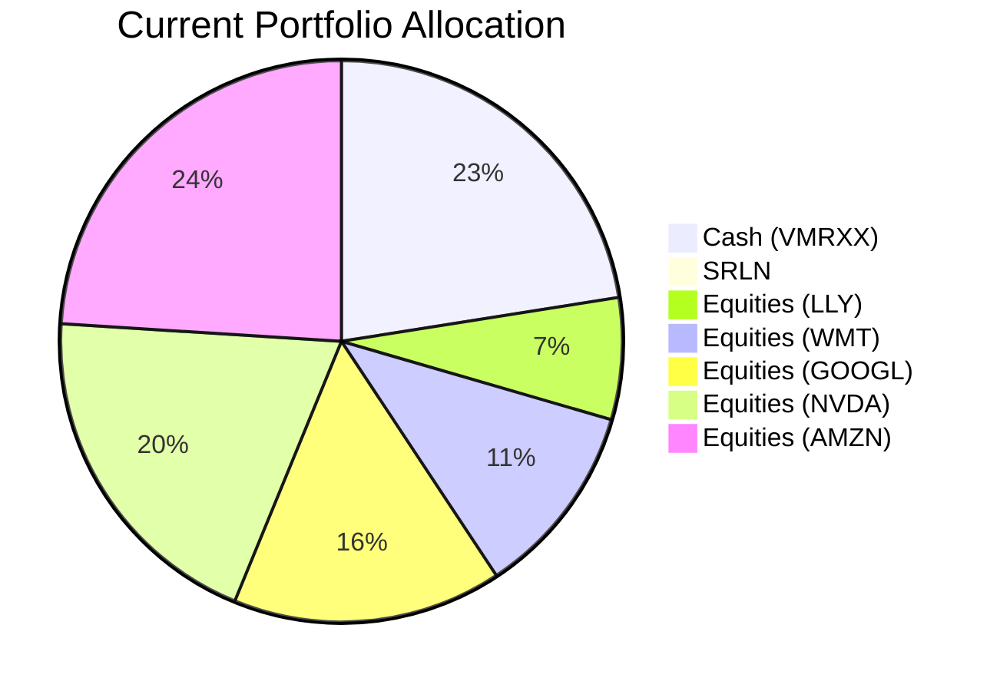
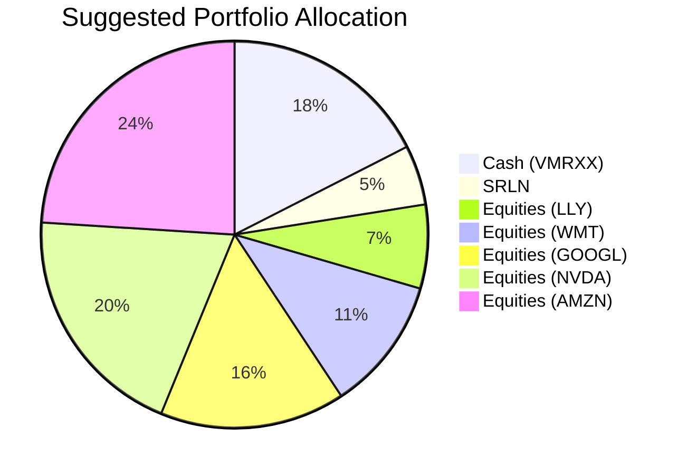

Client Product-Fit Analysis: Sarah Chen
=====================================

# Executive Summary

Recommend moving $160,000 (5% of portfolio) from the Vanguard Treasury Money Market Fund (VMRXX) into the State Street Blackstone Senior Loan ETF (SRLN). This switch introduces a floating-rate fixed income component to a heavily equity-concentrated portfolio, improving yield while maintaining a low risk profile. The action is expected to increase portfolio income by approximately 1.11% per annum, reduce cash drag, and provide downside protection against further interest rate hikes without materially altering the overall risk level.

# Recommended Product: SRLN – State Street Blackstone Senior Loan ETF

## Product Specifications

| Field | Value |
|-------|-------|
| Ticker | SRLN |
| Asset Class | Bank Loan / Senior Loan |
| Currency | USD |
| Exchange | NYSE Arca |
| Risk Rating | 2 (Low) |
| Liquidity Score | 4 (High – daily trading) |
| Expense Ratio | 0.70% (source: product catalog) |
| Minimum Investment | 1 share (~$40.14 as of last close) |

## Performance Metrics (as of 1 Jun 2026)

| Metric | SRLN | VMRXX (switched-out) |
|--------|-----:|---------------------:|
| 1-Year Return | 5.57% | 3.95% |
| 3-Year CAGR | 7.89% | 4.73% |
| 5-Year CAGR | 4.57% | 3.46% |
| 1-Year Max Drawdown | -3.42% | -0.30% |
| 5-Year Max Drawdown | -7.93% | -0.35% |

**Sources:** Product catalog (demo-market-1Jun26.csv) for SRLN and VMRXX.

## Risk Characteristics

- **Credit Risk:** Moderate – SRLN invests in below-investment-grade senior loans; however, senior secured status provides a higher recovery rate in defaults.
- **Interest Rate Risk:** Low – Floating-rate coupons reset periodically, minimizing duration exposure.
- **Liquidity Risk:** Low – ETF trades actively with a liquidity score of 4.
- **Principal Risk:** Principal is not guaranteed; losses possible during market stress, but historical drawdowns are modest compared to high-yield bonds.

## Detailed Justification

Sarah Chen’s portfolio holds 77.5% in individual US equities, with a large cash position (22.5% in VMRXX) earning ~3.46% (5Y CAGR). The cash allocation is excessive for her stated need of “income generation with moderate risk” and provides little contribution to portfolio growth. SRLN offers a higher yield (5Y CAGR 4.57%) with low correlation to equities and a floating-rate structure that hedges against rising rates. Replacing a portion of cash with SRLN improves income generation while keeping overall portfolio risk low (both products have risk ratings ≤ 2). The remaining 17.5% cash still provides ample liquidity for emergencies or short-term needs.

# Suggested Portfolio

| Asset | Current Market Value ($) | Suggested Market Value ($) | Current % | Suggested % | Change (%) | Remark |
|-------|------------------------:|--------------------------:|----------:|------------:|-----------:|--------|
| Cash (VMRXX) | 720,000 | 560,000 | 22.50% | 17.50% | -5.00% | Reduce cash; maintain liquidity buffer |
| SRLN | 0 | 160,000 | 0.00% | 5.00% | +5.00% | New position: senior loan ETF |
| LLY | 223,858 | 223,858 | 7.00% | 7.00% | 0.00% | No change |
| WMT | 359,929 | 359,929 | 11.25% | 11.25% | 0.00% | No change |
| GOOGL | 496,000 | 496,000 | 15.50% | 15.50% | 0.00% | No change |
| NVDA | 632,071 | 632,071 | 19.75% | 19.75% | 0.00% | No change |
| AMZN | 768,142 | 768,142 | 24.00% | 24.00% | 0.00% | No change |
| **Total** | **3,200,000** | **3,200,000** | **100.00%** | **100.00%** | **0.00%** | |

## Pros and Cons of Suggested Portfolio

**Pros:**
- **Yield improvement:** Portfolio income increases from ~3.87% (weighted average of current holdings) to ~4.06% (with SRLN), adding approximately $6,080 per year.
- **Diversification:** Adds a floating-rate fixed income asset, reducing concentration in US equities and providing a hedge against rising rates.
- **Risk alignment:** SRLN’s risk rating (2) matches the client’s low-risk tilt for the cash portion; the shift does not increase portfolio risk.

**Cons:**
- **Modest impact:** The 5% allocation limits the benefit; a larger shift would be more effective but is not recommended to preserve cash liquidity.
- **Credit risk:** Senior loans carry credit risk, though senior secured status mitigates losses. In a severe economic downturn, SRLN could decline modestly (historical 5Y max drawdown -7.93%).

## Alternative Suggested Product to Consider

- **USHY (iShares Broad USD High Yield Corporate Bond ETF):** Offers a higher yield (5Y CAGR 4.24%) and higher liquidity (score 5), but has fixed-rate exposure and a risk rating of 2. USHY would provide greater income during stable or falling rate environments, but less protection against rate hikes compared to SRLN.

# Scenario Analysis

The scenario analysis uses historical CAGR and drawdown data from the product catalog (1 Jun 2026). Equity returns are approximated using the S&P 500 ETF (SPY) 5Y CAGR (13.90%) for normal conditions, with adjustments for upside (+30%) and downside (COVID-19 style, -20%). Cash (VMRXX) returns are held at its 5Y CAGR (3.46%) for normal and upside; 0% for downside (stable principal). SRLN returns follow its 5Y CAGR (4.57%) for normal, +7% for upside (benefits from strong credit markets), and -5% for downside (drawdown less than equities due to senior secured status).

**Probability assumptions (based on historical market cycles):** Normal 60%, Upside 25%, Downside 15%.

## Normal Market Condition (60% probability)

- **Equity return:** 13.90% (S&P 500 5Y CAGR 2021–2026)
- **SRLN return:** 4.57% (5Y CAGR)
- **Cash return:** 3.46% (VMRXX 5Y CAGR)

| Product | Return (%) | Suggested Value ($) | Return ($) | Current Value ($) | Return ($) |
|---------|----------:|--------------------:|-----------:|-----------------:|-----------:|
| Cash (VMRXX) | 3.46 | 560,000 | 19,376 | 720,000 | 24,912 |
| SRLN | 4.57 | 160,000 | 7,312 | 0 | 0 |
| LLY | 13.90 | 223,858 | 31,116 | 223,858 | 31,116 |
| WMT | 13.90 | 359,929 | 50,030 | 359,929 | 50,030 |
| GOOGL | 13.90 | 496,000 | 68,944 | 496,000 | 68,944 |
| NVDA | 13.90 | 632,071 | 87,861 | 632,071 | 87,861 |
| AMZN | 13.90 | 768,142 | 106,772 | 768,142 | 106,772 |
| **Total** | | **3,200,000** | **371,411** | **3,200,000** | **369,635** |

- **Annual return of suggested vs current:** 11.61% vs 11.55%
- **Incremental benefit:** +$1,776 annually (+0.06% improvement)

## Upside Market Condition – Strong economic expansion (25% probability)

- **Equity return:** 30% (bull market assumption, e.g., recovery from a correction)
- **SRLN return:** 7% (senior loans benefit from credit tightening and low defaults)
- **Cash return:** 3.46% (stable)

| Product | Return (%) | Suggested Return ($) | Current Return ($) |
|---------|----------:|--------------------:|------------------:|
| Cash (VMRXX) | 3.46 | 19,376 | 24,912 |
| SRLN | 7.00 | 11,200 | 0 |
| LLY | 30.00 | 67,157 | 67,157 |
| WMT | 30.00 | 107,979 | 107,979 |
| GOOGL | 30.00 | 148,800 | 148,800 |
| NVDA | 30.00 | 189,621 | 189,621 |
| AMZN | 30.00 | 230,443 | 230,443 |
| **Total** | | **774,576** | **768,912** |

- **Annual return:** 24.21% vs 24.03%
- **Incremental benefit:** +$5,664 annually (+0.18%)

## Downside Market Condition – Equity collapse similar to COVID-19 (15% probability)

- **Equity return:** -20% (March 2020 crash reference)
- **SRLN return:** -5% (senior loans decline less; 5Y max drawdown -7.93% but we assume a milder -5% due to floating-rate nature)
- **Cash return:** 0% (stable principal)

| Product | Return (%) | Suggested Return ($) | Current Return ($) |
|---------|----------:|--------------------:|------------------:|
| Cash (VMRXX) | 0 | 0 | 0 |
| SRLN | -5 | -8,000 | 0 |
| LLY | -20 | -44,772 | -44,772 |
| WMT | -20 | -71,986 | -71,986 |
| GOOGL | -20 | -99,200 | -99,200 |
| NVDA | -20 | -126,414 | -126,414 |
| AMZN | -20 | -153,628 | -153,628 |
| **Total** | | **-504,000** | **-496,000** |

- **Annual return:** -15.75% vs -15.50%
- **Incremental loss:** -$8,000 (-0.25% worse in downside due to SRLN’s -5% vs cash’s 0%)

**Note:** The slightly greater loss in the downside is acceptable given the higher income in normal and upside scenarios. SRLN’s loss is capped relative to equities, and the cash buffer remains intact.

# References

- Product Catalog: demo-market-1Jun26.csv (Source: Planbot Internal Data) – used for historical returns, risk ratings, and performance metrics of SRLN and VMRXX.
- Client Profile: 2_profile.md (Source: Planbot Internal Data) – used for client holdings and suggested allocation.
- Selected ETFs: selected_etf.csv (Source: Planbot Internal Data) – used for alternative product USHY.
- Document: suggested_portfolio_instruction.md, scenario_analysis_instruction.md, references_instruction.md (Source: Planbot Internal Instructions).
- Web References: N/A – no web search capability used.
