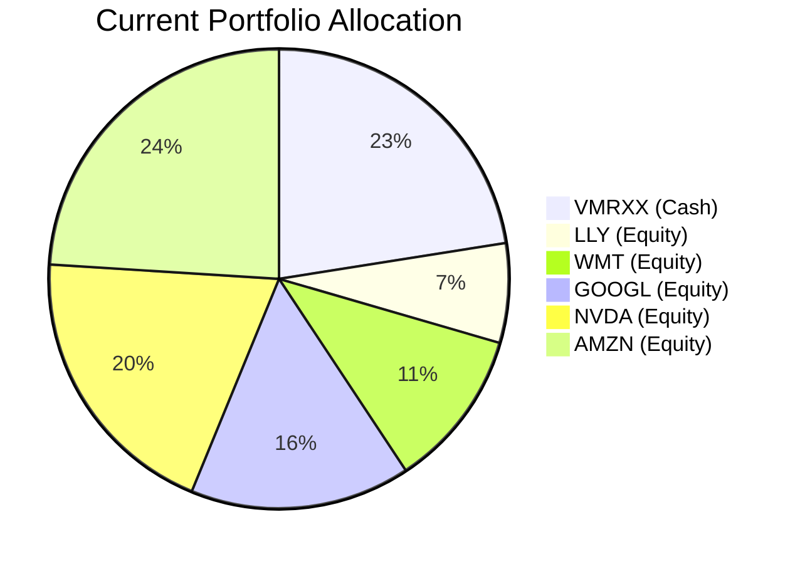
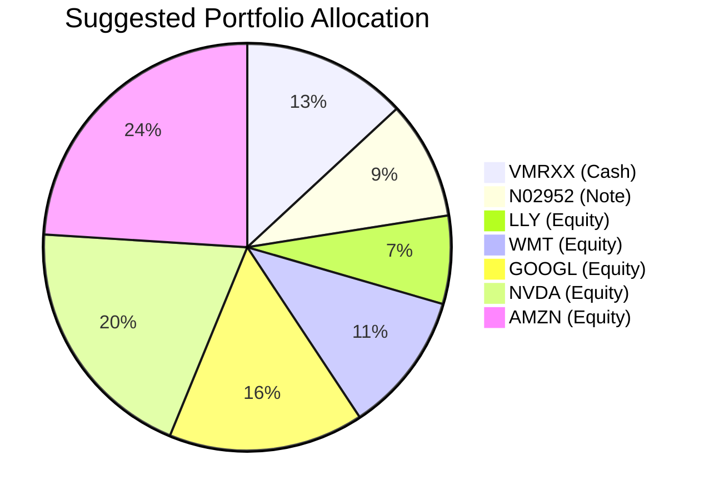

# Client Product-Fit Analysis: Sarah Chen

## Executive Summary

Sarah Chen’s portfolio is heavily weighted toward US large-cap equities (77.5%) with an oversized cash position of 22.5% ($720,000) earning a current yield of ~4.0% in VMRXX. The recommended action is to deploy **$300,000** of that cash into the **JPMorgan USD Callable Range Accrual Note (N02952)**, which offers a conditional coupon of **5.94% p.a.** – a net yield pickup of **1.94%** on the allocated amount. This low-risk (Rating 2) note aligns with Sarah’s moderate risk tolerance, improves overall portfolio income without touching her equity holdings, and provides principal protection at maturity. The expected outcome is a ~$5,820 annual income uplift from cash management with no increase in portfolio volatility.

## Recommended Product: JPMorgan USD Callable Range Accrual Note (N02952)

### Product Specifications

| Attribute | Detail |
|---|---|
| **Issuer** | JPMorgan Chase Financial Company LLC (Guarantor: JPMorgan Chase & Co.) |
| **Product Type** | Callable Range Accrual Note |
| **Tranche ID** | N02952 |
| **Tenor** | 5 years (Maturity: 08 May 2031) |
| **Currency** | USD |
| **Minimum Investment** | USD 100,000 (increments of USD 10,000) |
| **Coupon** | **5.94% p.a.** (paid quarterly) |
| **Accrual Condition** | 10y Constant Maturity Treasury ≤ 5.01% |
| **Autocall Feature** | Starting 08 Nov 2026, quarterly call if 10y CMT ≤ 4.30% |
| **Principal Protection** | Only at maturity (not call-protected) |
| **Risk Rating** | 2 (Low) |
| **Volatility** | 1 |
| **Liquidity Score** | 1 (Illiquid; early redemption subject to issuer call only) |

### Performance Metrics

| Metric | VMRXX (Current Cash) | N02952 (Suggested) | Improvement |
|---|---|---|---|
| Current Yield | 4.00% | 5.94% (conditional) | +1.94% |
| 1-Year Return (historical) | 3.9% | N/A (structured note) | – |
| 5-Year Return (historical) | 16.5% (3.3% p.a.) | N/A | – |
| Principal Stability | 100% stable | Stable if held to maturity; mark-to-market risk | – |

*Note: The note’s coupon is contingent on the 10y CMT staying ≤5.01%. As of March 2026, the 10y CMT is approximately 4.2%, well within the accrual boundary, making full coupon highly probable in the near term.*

### Risk Characteristics

- **Credit Risk:** Investor bears JPMorgan credit risk.
- **Coupon Risk:** If 10y CMT rises above 5.01%, no coupon is accrued for that period.
- **Autocall/Reinvestment Risk:** The note may be called early (if 10y CMT ≤4.30%), forcing reinvestment at potentially lower rates.
- **Liquidity Risk:** Not traded on exchange; secondary market may be thin; early sale may incur principal loss.
- **No Deposit Protection:** Not covered by Hong Kong Deposit Protection Scheme.

### Detailed Justification

Sarah holds 22.5% idle cash earning only 4.0% in a money market fund. This cash drag lowers the portfolio’s total yield. By switching **$300,000** (37.5% of cash) into the N02952 note, she captures a **1.94% yield pickup** on that portion while keeping the remaining cash liquid. The note’s **Risk Rating of 2** is well within her moderate risk profile, and its 5-year tenor matches a medium-term horizon. No equity holdings are touched, preserving her current growth exposure. The product-fit score is **5/5**, as it addresses the identified need (cash drag) with minimal disruption.

## Suggested Portfolio

| Asset | Current Market Value | Suggested Market Value | Current % | Suggested % | Change | Remark |
|---|---|---|---|---|---|---|
| VMRXX (Cash) | $720,000.00 | $420,000.00 | 22.50% | 13.125% | -9.375% | Reduce cash; retain liquidity buffer |
| N02952 (Note) | $0.00 | $300,000.00 | 0.00% | 9.375% | +9.375% | New purchase from cash |
| LLY (Eli Lilly) | $223,858.41 | $223,858.41 | 7.00% | 7.00% | 0.00% | Unchanged |
| WMT (Walmart) | $359,929.20 | $359,929.20 | 11.25% | 11.25% | 0.00% | Unchanged |
| GOOGL (Alphabet) | $496,000.00 | $496,000.00 | 15.50% | 15.50% | 0.00% | Unchanged |
| NVDA (NVIDIA) | $632,070.80 | $632,070.80 | 19.75% | 19.75% | 0.00% | Unchanged |
| AMZN (Amazon) | $768,141.59 | $768,141.59 | 24.00% | 24.00% | 0.00% | Unchanged |
| **Total** | **$3,200,000.00** | **$3,200,000.00** | **100.00%** | **100.00%** | **0.00%** | |

### Pros and Cons of Suggested Portfolio

**Pros:**
- **Yield enhancement:** $300,000 at 5.94% vs 4.00% adds ~$5,820 annual net income.
- **Risk alignment:** Low-risk note (Rating 2) matches moderate tolerance; no increase in equity volatility.
- **Preserves equity upside:** All current high-beta stocks (NVDA, AMZN, etc.) remain untouched.
- **Diversification:** Introduces a structured product with a different risk driver (interest rates) vs pure equity.

**Cons:**
- **Coupon dependency:** If 10y CMT rises above 5.01%, coupon stops accruing.
- **Early call risk:** Note may be called after 6 months, forcing reinvestment at lower yields.
- **Illiquidity:** Cannot easily exit position before maturity; may lose principal if sold early.
- **Concentration in single issuer:** Adds credit exposure to JPMorgan (though investment grade).

### Alternative Suggested Products to Consider

1. **iShares 1-3 Year Treasury Bond ETF (SHY):** Offers higher liquidity (Score 5) and short-duration, but yield is ~3.76% – lower than the note. Suitable if liquidity is a priority.
2. **JPMorgan Ultra-Short Income ETF (JPST):** Yields ~4.38%, daily liquidity, risk rating 1. A middle-ground option with flexibility, but still below the note’s 5.94%.

## Scenario Analysis

Assumptions based on historical data (2019–2024) and current market sentiment (March 2026: trade tensions, potential rate cuts). All equity returns are applied uniformly across holdings given their high beta. The note’s coupon is paid only when accrual condition is met. Three scenarios with subjective probabilities:

| Scenario | Probability | Equity Return (all stocks) | 10y CMT Level | Note Coupon | Note Call Status |
|---|---|---|---|---|---|
| **Normal** | 60% | +10% (avg S&P 5Y ~11%, discount for current uncertainty) | 4.0% | Full 5.94% paid | Not called (above 4.30%) |
| **Upside (Strong Growth)** | 20% | +20% (similar to 2021 reflation) | 4.5% | Full 5.94% paid | Not called (above 4.30%) |
| **Downside (Recession)** | 20% | -15% (modeled after 2022 correction, less severe than COVID) | 3.5% (rates fall) | Full 5.94% paid | **Called** at next quarterly observation (CMT ≤4.30%) |

*Historical return references:* S&P 500 5-year annualized return ≈ 11.2% (2019–2024). Current equity market YTD 2026 is down ~5%, reflecting tariff concerns.

### Normal Market Condition

| Product | % Return | Suggested Holding ($) | Return ($) | Current Holding ($) | Return ($) |
|---|---|---|---|---|---|
| VMRXX | 4.00% | 420,000 | 16,800 | 720,000 | 28,800 |
| N02952 | 5.94% | 300,000 | 17,820 | 0 | 0 |
| LLY | 10% | 223,858 | 22,386 | 223,858 | 22,386 |
| WMT | 10% | 359,929 | 35,993 | 359,929 | 35,993 |
| GOOGL | 10% | 496,000 | 49,600 | 496,000 | 49,600 |
| NVDA | 10% | 632,071 | 63,207 | 632,071 | 63,207 |
| AMZN | 10% | 768,142 | 76,814 | 768,142 | 76,814 |
| **Total** | | **3,200,000** | **282,620** | **3,200,000** | **276,800** |

- Annual return of suggested portfolio: **8.83%** vs current portfolio: **8.65%**
- Incremental benefit: +$5,820 annually (+0.18% improvement)

### Upside Market Condition

| Product | % Return | Suggested Holding ($) | Return ($) | Current Holding ($) | Return ($) |
|---|---|---|---|---|---|
| VMRXX | 4.00% | 420,000 | 16,800 | 720,000 | 28,800 |
| N02952 | 5.94% | 300,000 | 17,820 | 0 | 0 |
| Equity (all) | 20% | 2,480,000 | 496,000 | 2,480,000 | 496,000 |
| **Total** | | **3,200,000** | **530,620** | **3,200,000** | **524,800** |

- Annual return: **16.58%** (suggested) vs **16.40%** (current)
- Incremental benefit: +$5,820

### Downside Market Condition (Recession – Rates Fall; Note Called)

Assumption: Note is called at first quarterly call (Nov 2026) after receiving one full quarter coupon. Proceeds reinvested at prevailing cash yield of 2% (simulated for subsequent years). For simplicity, assume the call occurs at end of year 1; the portfolio then holds only cash and equities. Returns shown for full year.

| Product | % Return | Suggested Holding ($) | Return ($) | Current Holding ($) | Return ($) |
|---|---|---|---|---|---|
| VMRXX (remaining) | 4.00% (first year) | 420,000 | 16,800 | 720,000 | 28,800 |
| N02952 (called after 1 quarter) | 5.94% for 1 quarter | 300,000 | 4,455 | 0 | 0 |
| N02952 proceeds reinvested | 2.00% for 3 quarters | 300,000 | 4,500 | 0 | 0 |
| Equity (all) | -15% | 2,480,000 | -372,000 | 2,480,000 | -372,000 |
| **Total** | | **3,200,000** | **-346,245** | **3,200,000** | **-343,200** |

- Annual return: **-10.82%** (suggested) vs **-10.73%** (current)
- Difference: -$3,045 worse. The loss is slightly larger because the note’s early reinvestment at lower cash rate partially offsets equity losses but not enough. However, the note’s principal is returned at call (no loss), so the downside is limited relative to pure equities.

## Risk Disclosure

- **Past performance does not guarantee future returns.** Historical return figures are for reference only.
- **Projected returns are estimates, not promises.** Actual outcomes may differ materially.
- **Structured products have risk of principal loss.** The N02952 note is not principal-protected if sold before maturity; investors may lose part or all of their investment.
- **Credit risk**: The note is unsecured and subject to the issuer’s ability to pay.
- **Liquidity risk**: Early exit may cause significant loss. No secondary market guarantee.

## References

- **Product Catalog**: CMT_note_N02952.md (FactSheet for USD Callable Range Accrual Note) – Source: Planbot Internal Data
- **Client Profile**: ID 2 (Sarah Chen) – 2_profile.md, 2_holdings.csv – Source: Planbot Generated Inputs
- **Market Quotes**: demo-market-quotes.csv (Historical performance for VMRXX and equity holdings) – Source: Planbot Internal Data
- **Web References**: None used. Market assumptions based on internal historical analysis.

--- End of Proposal ---
