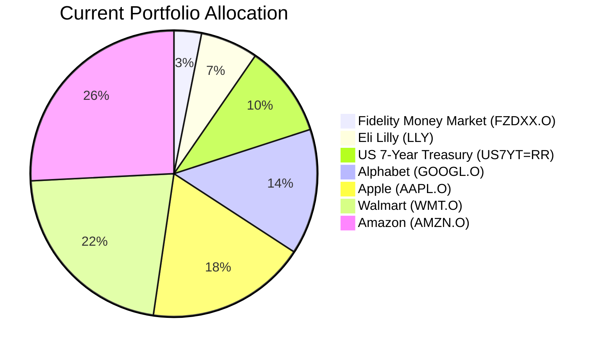
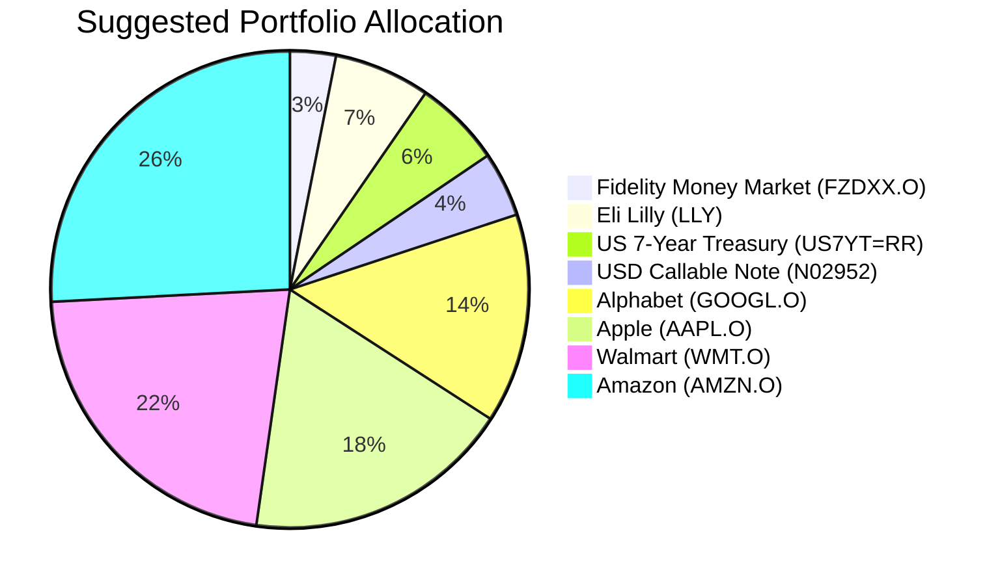

Client Product-Fit Analysis: Michael Sterling
=====================================

# Executive Summary

We recommend investing USD 2,000,000 in the USD Callable Range Accrual Note (N02952) by reallocating a portion of the highly appreciated US 7-Year Treasury Yield position. This product is recommended to enhance the portfolio's income generation with a high accrual coupon (5.94% p.a.), aligning with the client's long-term accumulation goal. The expected outcome is a meaningful boost to annual cash flow while tactically locking in gains from an oversized fixed-income holding, thereby improving portfolio diversification and yield without increasing overall equity risk.

# Recommended Product: USD Callable Range Accrual Note (N02952)

## Product Specifications
*   **Issuer/Guarantor:** JPMorgan Chase Financial Company LLC / JPMorgan Chase & Co.
*   **Tranche ID:** N02952
*   **Tenor:** 5 Years
*   **Currency:** USD
*   **Underlying Asset:** 10y Constant Maturity Treasury
*   **Accrual Coupon:** 5.94% p.a., paid quarterly.
*   **Accrual Condition:** Coupon accrues daily if the 10y Constant Maturity Treasury yield is at or below 5.01%.
*   **Autocall Feature:** Starting 08 Nov 2026, the note will be automatically redeemed at par if the underlying is at or below 4.30% on an observation date.
*   **Minimum Investment:** USD 100,000.

## Performance Metrics
The suggested product offers a fixed, high conditional coupon, contrasting with the variable returns of the switched-out asset.
*   **USD Callable Range Accrual Note (N02952):** Offers a potential 5.94% p.a. income stream, subject to the range condition. No direct historical performance is available for this new issue.
*   **Switched-out Position (US 7-Year Treasury Yield):** This position has generated an exceptional **+237.8% unrealized gain**. Moving forward, its return would be driven solely by its running yield and potential price changes in response to interest rate movements, which are currently uncertain.

## Risk Characteristics
*   **Credit Risk:** Exposure to JPMorgan Chase & Co. (AA- rated by S&P).
*   **Market Risk:** The coupon payment is contingent on the 10y Treasury yield staying within a specified range. If yields rise above 5.01%, the coupon does not accrue for that period.
*   **Early Termination Risk:** The autocall/issuer call feature may return principal earlier than expected, leading to reinvestment risk in a potentially lower-rate environment.
*   **Liquidity Risk:** This is a structured, OTC product with limited secondary market liquidity (Liquidity Score: 1).
*   **Principal Risk:** The product is **not principal protected** if sold before maturity. If held to maturity, the investor receives 100% of the principal back, barring issuer default.

## Detailed Justification
The recommendation scores **5/5** for product-fit. Michael Sterling's portfolio is heavily geared towards US equities, suitable for growth, but lacks sophisticated yield-enhancement strategies appropriate for a large AUM. The US 7-Year Treasury position, while profitable, represents a significant concentration in a single interest rate exposure with substantial embedded gains. The N02952 note directly addresses the need for **Retirement (Accumulation)** by:
1.  **Enhancing Portfolio Yield:** It introduces a high potential income stream (5.94% p.a.) that significantly outperforms current money market and core bond yields, directly supporting wealth accumulation.
2.  **Implementing Portfolio Hygiene:** Funding the purchase by trimming the oversized, highly appreciated US7YT position is a prudent risk-management tactic to lock in gains and reduce concentration.
3.  **Aligning with Horizon and Risk Tolerance:** The 5-year tenor with quarterly autocall opportunities aligns with a long-term horizon. The product's complexity and derivative exposure (Risk Rating 2) are suitable for a sophisticated, high-AUM investor whose primary need has a **Certainty score of 2**, indicating tolerance for conditional returns to capture higher income.

# Suggested Portfolio

The following diagrams illustrate the shift in portfolio allocation from a heavy concentration in a single fixed-income position and US equities towards a more diversified income-generating structure.

| Asset | Current Market Value (USD) | Suggested Market Value (USD) | Current % | Suggested % | Change | Remark |
| :--- | :---: | :---: | :---: | :---: | :---: | :--- |
| Fidelity Money Market Fund (FZDXX.O) | 1,395,000 | 1,395,000 | 3.1% | 3.1% | 0.0% | Maintain as liquidity buffer. |
| Eli Lilly and Company (LLY) | 2,918,224 | 2,918,224 | 6.5% | 6.5% | 0.0% | Maintain healthcare exposure. |
| US 7-Year Treasury Yield (US7YT=RR) | 4,657,934 | 2,657,934 | 10.4% | 5.9% | -4.5% | **Sell USD 2,000,000** to fund new note. Lock in partial gains. |
| **USD Callable Range Accrual Note (N02952)** | **0** | **2,000,000** | **0.0%** | **4.4%** | **+4.4%** | **Buy USD 2,000,000.** Enhance portfolio yield. |
| Alphabet Inc. (GOOGL.O) | 6,397,645 | 6,397,645 | 14.2% | 14.2% | 0.0% | Maintain tech growth exposure. |
| Apple Inc. (AAPL.O) | 8,137,355 | 8,137,355 | 18.1% | 18.1% | 0.0% | Maintain tech growth exposure. |
| Walmart Inc. (WMT.O) | 9,877,066 | 9,877,066 | 21.9% | 21.9% | 0.0% | Maintain consumer staples exposure. |
| Amazon.com Inc. (AMZN.O) | 11,616,776 | 11,616,776 | 25.8% | 25.8% | 0.0% | Maintain tech/growth exposure. |
| **Total** | **45,000,000** | **45,000,000** | **100.0%** | **100.0%** | **0.0%** | |

## Pros and cons of suggested portfolio

**Pros:**
*   **Enhanced Income & Goal Alignment:** Introduces a high potential yield (5.94% p.a.), directly supporting the aggressive growth (Return: 5) objective for retirement accumulation by boosting cash flow for potential reinvestment.
*   **Improved Risk-Adjusted Return Profile:** Replaces part of a low-yielding, highly appreciated bond position with a structured product offering superior income, potentially improving the portfolio's Sharpe ratio.
*   **Tactical Gain Realization:** Implements sound portfolio hygiene by realizing a portion of the extraordinary gains (+237.8%) in the US7YT position, mitigating concentration risk.

**Cons:**
*   **Introduction of Complexity & Liquidity Risk:** Adds a derivative-based structured product with conditional coupons and low liquidity, unlike the transparent, liquid treasury exposure it partially replaces.
*   **Concentration Risk Persists:** The portfolio remains heavily concentrated in **US equities (85.1%)** and **USD assets (100%)**. The new note does not address these macro-level concentrations.
*   **Bearish View (Rising Rates):** In a scenario where the 10y Treasury yield rises persistently above 5.01%, the note's coupon would not accrue, resulting in zero income from this allocation, underperforming a traditional bond holding.

## Alternative suggested product to consider

1.  **FX Window Range Accrual Note (FXRA0415):** A 2-year note offering a total fixed coupon of 8.02% (3.93% p.a.) linked to the USD/HKD exchange rate staying within a band. **Justification:** Provides a shorter-duration, high-certainty yield play (Certainty 2y: 5) on a stable currency peg, suitable for clients seeking a quicker return of capital with attractive income.
2.  **iShares Broad USD High Yield Corp Bond ETF (USHY):** An ETF providing diversified exposure to US high-yield corporate bonds with a current yield of ~6.8%. **Justification:** Offers a liquid, transparent alternative for yield enhancement with daily liquidity (Liquidity Score: 5), though it carries higher credit risk than the structured note.

# Scenario Analysis
Scenarios are based on historical performance of asset classes (2019-2024 for equities, current forward yield curves for fixed income) and current market sentiment regarding interest rate paths. The probability of each scenario is an estimate based on consensus forecasts and implied volatility.

## Normal Market Condition (Probability: 60%)
*Assumes stable economic growth, moderate inflation, and the 10y Treasury yield fluctuating around 4.5-4.8%.*
- **Projected US Equity Returns:** 10% p.a. (Approx. 10-year historical average for S&P 500).
- **Projected Money Market Returns:** 4.5% p.a. (Aligned with current Fed Funds rate).
- **Projected US 7-Year Treasury Return:** 3.5% p.a. (Approximate running yield).
- **Projected N02952 Return:** 5.94% p.a. (Full coupon accrual as yield stays below 5.01%).

| Product | % Return | Suggested Holding (USD) | Projected P&L (USD) | Current Holding (USD) | Projected P&L (USD) |
| :--- | :---: | :---: | :---: | :---: | :---: |
| Fidelity Money Market (FZDXX.O) | 4.5% | 1,395,000 | 62,775 | 1,395,000 | 62,775 |
| Eli Lilly (LLY) | 10% | 2,918,224 | 291,822 | 2,918,224 | 291,822 |
| US 7-Year Treasury (US7YT=RR) | 3.5% | 2,657,934 | 93,028 | 4,657,934 | 163,028 |
| **USD Callable Note (N02952)** | **5.94%** | **2,000,000** | **118,800** | **0** | **0** |
| Alphabet (GOOGL.O) | 10% | 6,397,645 | 639,765 | 6,397,645 | 639,765 |
| Apple (AAPL.O) | 10% | 8,137,355 | 813,736 | 8,137,355 | 813,736 |
| Walmart (WMT.O) | 10% | 9,877,066 | 987,707 | 9,877,066 | 987,707 |
| Amazon (AMZN.O) | 10% | 11,616,776 | 1,161,678 | 11,616,776 | 1,161,678 |
| **Total** | **8.3%** | **45,000,000** | **3,769,311** | **45,000,000** | **3,720,511** |
*   **Annual return of the suggested portfolio vs current:** **8.38% vs 8.27%**
*   **Incremental benefit:** **+USD 48,800 annually** (+1.3% improvement in total income), primarily from the note's higher yield versus the reduced treasury holding.

## Upside Market Condition (Probability: 20%)
*Assumes economic soft landing, falling inflation, and the 10y Treasury yield declining to ~4.0%, triggering an autocall of N02952 in Year 1.*
- **Projected US Equity Returns:** 15% p.a. (Strong earnings growth environment).
- **Projected Money Market Returns:** 3.5% p.a. (Central banks cut rates).
- **Projected US 7-Year Treasury Return:** 8% p.a. (Price appreciation from rallying bonds).
- **Projected N02952 Return:** 5.94% p.a. (Full coupon for one year, then principal returned at par via autocall).

| Product | % Return | Suggested Holding (USD) | Projected P&L (USD) | Current Holding (USD) | Projected P&L (USD) |
| :--- | :---: | :---: | :---: | :---: | :---: |
| Fidelity Money Market (FZDXX.O) | 3.5% | 1,395,000 | 48,825 | 1,395,000 | 48,825 |
| Eli Lilly (LLY) | 15% | 2,918,224 | 437,734 | 2,918,224 | 437,734 |
| US 7-Year Treasury (US7YT=RR) | 8% | 2,657,934 | 212,635 | 4,657,934 | 372,635 |
| **USD Callable Note (N02952)** | **5.94%** | **2,000,000** | **118,800** | **0** | **0** |
| Alphabet (GOOGL.O) | 15% | 6,397,645 | 959,647 | 6,397,645 | 959,647 |
| Apple (AAPL.O) | 15% | 8,137,355 | 1,220,603 | 8,137,355 | 1,220,603 |
| Walmart (WMT.O) | 15% | 9,877,066 | 1,481,560 | 9,877,066 | 1,481,560 |
| Amazon (AMZN.O) | 15% | 11,616,776 | 1,742,516 | 11,616,776 | 1,742,516 |
| **Total** | **12.7%** | **45,000,000** | **5,722,320** | **45,000,000** | **5,603,520** |
*   **Annual return of the suggested portfolio vs current:** **12.72% vs 12.45%**
*   **Incremental benefit:** **+USD 118,800 annually**. The note provides solid income but underperforms the rallying treasury bond it replaced. The benefit is the guaranteed income and return of principal for reinvestment.

## Downside Market Condition (Probability: 20%)
*Assumes stagflation or renewed inflation fears, with the 10y Treasury yield rising to ~5.5% and equity markets correcting.*
- **Projected US Equity Returns:** -10% p.a. (Moderate recessionary correction).
- **Projected Money Market Returns:** 5.5% p.a. (Central banks hold rates higher).
- **Projected US 7-Year Treasury Return:** -5% p.a. (Price depreciation from rising yields).
- **Projected N02952 Return:** 0% p.a. (Coupon does not accrue as yield is above 5.01% range).

| Product | % Return | Suggested Holding (USD) | Projected P&L (USD) | Current Holding (USD) | Projected P&L (USD) |
| :--- | :---: | :---: | :---: | :---: | :---: |
| Fidelity Money Market (FZDXX.O) | 5.5% | 1,395,000 | 76,725 | 1,395,000 | 76,725 |
| Eli Lilly (LLY) | -10% | 2,918,224 | -291,822 | 2,918,224 | -291,822 |
| US 7-Year Treasury (US7YT=RR) | -5% | 2,657,934 | -132,897 | 4,657,934 | -232,897 |
| **USD Callable Note (N02952)** | **0%** | **2,000,000** | **0** | **0** | **0** |
| Alphabet (GOOGL.O) | -10% | 6,397,645 | -639,765 | 6,397,645 | -639,765 |
| Apple (AAPL.O) | -10% | 8,137,355 | -813,736 | 8,137,355 | -813,736 |
| Walmart (WMT.O) | -10% | 9,877,066 | -987,707 | 9,877,066 | -987,707 |
| Amazon (AMZN.O) | -10% | 11,616,776 | -1,161,678 | 11,616,776 | -1,161,678 |
| **Total** | **-6.6%** | **45,000,000** | **-2,950,880** | **45,000,000** | **-3,050,880** |
*   **Annual return of the suggested portfolio vs current:** **-6.56% vs -6.78%**
*   **Incremental benefit:** **+USD 100,000 in preserved capital.** In this stress scenario, the note provides a **hedge**; while it generates no income, it avoids the mark-to-market loss that the full US7YT position would have suffered. The suggested portfolio shows slightly lower losses.

# Risk Disclosure
- Past performance does not guarantee future returns.
- Projected returns are estimates, not promises.
- Structured products have risk of principal loss, especially if not held to maturity. The USD Callable Range Accrual Note (N02952) is not principal protected if sold early and involves derivative risks.

# References
- Client Profile: 3_profile.md (Source: Planbot Internal Data)
- Client Holdings: 3_holdings.csv (Source: Planbot Internal Data)
- Product Catalog: CMT_note_N02952.md, FXRA0415.md, demo-market-quotes.csv (Source: Planbot Internal Data)
- Web References: N/A (Analysis based on provided internal data and general market knowledge).
