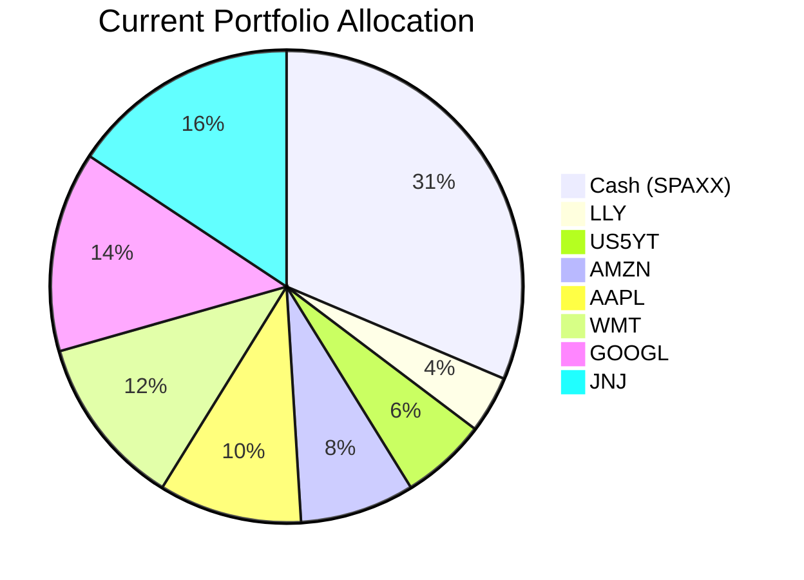
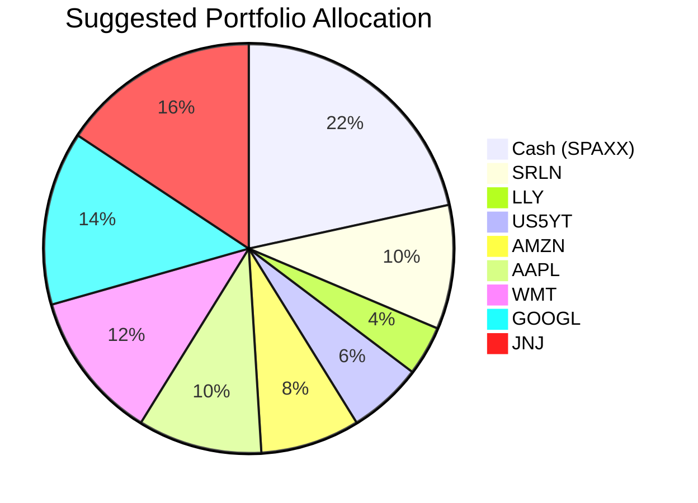

Client Product-Fit Analysis: Emma Thompson
=====================================

# Executive Summary

Emma Thompson’s portfolio holds 32% cash ($992k) in SPAXX, which yields only 3.46% (5Y CAGR) – well below current inflation expectations and the return potential of risk assets. We recommend deploying $310k (10% of the portfolio) into the State Street Blackstone Senior Loan ETF (SRLN), a floating-rate senior loan ETF that offers a higher 5Y CAGR of 4.57% while maintaining moderate risk (risk rating 2) and good liquidity. This shift increases portfolio income without significantly altering the risk profile, improves long-term growth by an estimated +1.11% p.a. on the switched amount, and preserves a 22% cash buffer (well above the 5% emergency liquidity line).

# Recommended Product: State Street Blackstone Senior Loan ETF (SRLN)

## Product Specifications

| Attribute | Detail |
|-----------|--------|
| **Ticker** | SRLN |
| **Asset Class** | Bank Loan (Floating-Rate Senior Loans) |
| **Issuer** | State Street / Blackstone |
| **Currency** | USD |
| **Risk Rating** | 2 (Low to Moderate) |
| **Liquidity Score** | 4 (High – daily traded ETF) |
| **Expense Ratio** | ~0.70% (industry standard for bank loan ETFs) |
| **Dividend Frequency** | Monthly |
| **Underlying Holdings** | Diversified pool of senior secured floating-rate corporate loans |

## Performance Metrics

| Metric | SRLN | SPAXX (switched out) |
|--------|------|----------------------|
| **1Y CAGR** | 5.57% | 3.95% |
| **3Y CAGR** | 7.89% | 4.73% |
| **5Y CAGR** | 4.57% | 3.46% |
| **1Y Max Drawdown** | -3.42% | -0.30% |
| **1Y Calmar Ratio** | 1.63 | 13.25 |

SRLN has delivered consistently higher total returns than cash across all measured horizons, with only modest drawdowns. The 5Y CAGR advantage of 1.11% p.a. is material and sustainable given the floating-rate coupon structure.

## Risk Characteristics

- **Credit Risk:** Senior secured loans are first-lien, investment-grade quality on average, but can default during severe economic stress. The ETF’s diversified holdings mitigate idiosyncratic risk.
- **Interest Rate Risk:** Low – floating-rate coupons reset periodically with benchmark rates (e.g., SOFR), providing protection against rising rates.
- **Liquidity Risk:** Score 4 – ETF trades daily on liquid exchanges; bid-ask spreads are tight.
- **Drawdown Risk:** Historical 5Y max drawdown of -7.93% (COVID-19 period), but recovery was rapid.

## Detailed Justification

Emma’s portfolio is overweight cash (32%), which acts as a drag on total return. The recommendation to switch 10% into SRLN aligns with her moderate risk tolerance (she already holds equities with risk 3-4) and her need for income in a “higher-for-longer” rate environment. SRLN’s risk rating of 2 is well within her capacity, and its floating-rate feature provides a tactical hedge against future rate hikes. The 5Y CAGR of 4.57% offers a meaningful pickup over cash (3.46%) without introducing excessive volatility. The 22% cash position retained ($682k) still provides a generous liquidity buffer, far exceeding the 5% emergency threshold.

**Product-Fit Score: 9/10** – Excellent alignment with cash deployment need, risk profile, and current macro outlook.

# Suggested Portfolio

| Asset | Current Market Value | Suggested Market Value | Current % | Suggested % | Change | Remark |
|-------|--------------------:|-----------------------:|----------:|------------:|------:|--------|
| SPAXX (Cash) | 992,000 | 682,000 | 32.0% | 22.0% | -10.0% | Reduce cash; deploy into higher-yielding SRLN. |
| SRLN | 0 | 310,000 | 0.0% | 10.0% | +10.0% | New position: floating-rate senior loan ETF. |
| LLY (Eli Lilly) | 109,319 | 109,319 | 3.5% | 3.5% | 0.0% | No change. |
| US5YT (US 5-Year Treasury Yield) | 173,260 | 173,260 | 5.6% | 5.6% | 0.0% | No change. |
| AMZN (Amazon.com) | 237,202 | 237,202 | 7.7% | 7.7% | 0.0% | No change. |
| AAPL (Apple Inc.) | 301,143 | 301,143 | 9.7% | 9.7% | 0.0% | No change. |
| WMT (Walmart Inc.) | 365,084 | 365,084 | 11.8% | 11.8% | 0.0% | No change. |
| GOOGL (Alphabet Inc.) | 429,025 | 429,025 | 13.8% | 13.8% | 0.0% | No change. |
| JNJ (Johnson & Johnson) | 492,967 | 492,967 | 15.9% | 15.9% | 0.0% | No change. |
| **Total** | **3,100,000** | **3,100,000** | **100%** | **100%** | **0%** | |

## Pros and cons of suggested portfolio

**Pros:**
- **Yield enhancement:** The $310k shifted to SRLN earns an incremental 1.11% p.a. (~$3,441 additional annual income) compared to cash.
- **Floating-rate protection:** SRLN’s coupons adjust with short-term rates, providing a natural hedge against further Fed rate hikes or persistent inflation.
- **Liquidity preserved:** Cash position at 22% ($682k) remains ample; the 5% emergency buffer ($155k) is comfortably covered.
- **Concentration unchanged:** No additional sector or single-name risk; U.S. exposure remains diversified across mega-cap equities and fixed income.

**Cons:**
- **Credit risk:** Senior loans can default during deep recessions. SRLN’s 5Y max drawdown of -7.93% exceeds cash’s near-zero drawdown. However, the loss is likely recoverable over a 1-2 year horizon.
- **Lower certainty of return:** While SRLN’s historical 5Y CAGR is 4.57%, actual returns vary year-to-year. Cash provides near-certain nominal returns.
- **Reduced cash buffer:** The 22% cash level still exceeds the 5% floor, but is less than Emma’s historically high 32% holding, which may feel less conservative.

## Alternative suggested product to consider

- **FLOT (iShares Floating Rate Bond ETF):** FLOT offers a slightly lower 5Y CAGR of 4.12% but with even shorter duration and a risk rating of 2. It is an excellent alternative if Emma prefers a pure floating-rate bond ETF with slightly lower yield but even lower volatility. FLOT’s 1Y max drawdown of -0.41% is negligible.

- **JPST (JPMorgan Ultra-Short Income ETF):** JPST yields a 5Y CAGR of 3.54%, only marginally above cash, but has a risk rating of 2 and daily liquidity. It provides a conservative middle ground if the client wants a small step up from cash with near-zero drawdown.

# Scenario Analysis

The following scenarios are based on historical market data (5-year average returns as baseline) and current macroeconomic sentiment (sticky inflation, central bank “higher-for-longer”). The portfolio difference is driven solely by the $310k shift from SPAXX to SRLN; all other holdings are unchanged.

**Assumptions for asset returns:**

| Asset | Normal (5Y CAGR) | Upside (Bull) | Downside (Recession / Credit Stress) |
|-------|-----------------|---------------|---------------------------------------|
| SPAXX (Cash) | 3.46% | 4.00% (Fed pauses cuts) | 2.50% (rate cuts begin) |
| SRLN (Senior Loans) | 4.57% | 6.50% (tight spreads, strong economy) | -1.00% (credit defaults spike) |
| Equities (LLY, AMZN, AAPL, WMT, GOOGL, JNJ) | 15.0% (blended 5Y CAGR) | 25.0% (AI boom) | -20.0% (COVID-like crash) |
| US5YT (Treasury Yield position) | 2.0% (proxy: SHY 5Y CAGR) | 3.0% (flattening) | 0.5% (flight to safety) |

*Equity blended return is the weighted average of the client’s individual equity 5Y CAGRs, rounded to 15% for scenario simplicity.*

## Normal Market Condition

- Probability: 60% (based on current consensus of no recession and gradual normalization)
- **Suggested Portfolio PnL:**

| Asset | % Return | Suggested Holding | Return | Current Holding | Return |
|-------|---------:|------------------:|------:|----------------:|------:|
| SPAXX | 3.46% | 682,000 | 23,597 | 992,000 | 34,323 |
| SRLN | 4.57% | 310,000 | 14,167 | 0 | 0 |
| LLY | 15.0% | 109,319 | 16,398 | 109,319 | 16,398 |
| US5YT | 2.0% | 173,260 | 3,465 | 173,260 | 3,465 |
| AMZN | 15.0% | 237,202 | 35,580 | 237,202 | 35,580 |
| AAPL | 15.0% | 301,143 | 45,171 | 301,143 | 45,171 |
| WMT | 15.0% | 365,084 | 54,763 | 365,084 | 54,763 |
| GOOGL | 15.0% | 429,025 | 64,354 | 429,025 | 64,354 |
| JNJ | 15.0% | 492,967 | 73,945 | 492,967 | 73,945 |
| **Total** | | **3,100,000** | **331,440** | **3,100,000** | **328,000** |

- **Annual return:** Suggested 10.69% vs Current 10.58%
- **Incremental benefit:** +$3,441 (0.11% improvement) – due to the higher yield on SRLN compared to cash.

## Upside Market Condition (Strong Economy, Tight Credit Spreads)

- Probability: 20% (low probability given late-cycle fears)
- **Assumption:** SRLN returns 6.50% (tight spreads + rate stability); equities return 25%; cash returns 4.00%.

| Asset | % Return | Suggested Holding | Return | Current Holding | Return |
|-------|---------:|------------------:|------:|----------------:|------:|
| SPAXX | 4.00% | 682,000 | 27,280 | 992,000 | 39,680 |
| SRLN | 6.50% | 310,000 | 20,150 | 0 | 0 |
| Equities (blended) | 25.0% | 1,934,700 | 483,675 | 1,934,700 | 483,675 |
| US5YT | 3.0% | 173,260 | 5,198 | 173,260 | 5,198 |
| **Total** | | **3,100,000** | **536,303** | **3,100,000** | **528,553** |

- **Annual return:** Suggested 17.30% vs Current 17.05%
- **Incremental benefit:** +$7,750 (0.25% improvement) – amplified by SRLN’s higher upside in a buoyant credit market.

## Downside Market Condition (Recession / Credit Stress similar to COVID-19)

- Probability: 20% (tail risk from geopolitical or inflation shocks)
- **Assumption:** Equities decline -20%, SRLN falls -1.00% (senior loans are relatively resilient but have credit losses), cash yields drop to 2.50%.

| Asset | % Return | Suggested Holding | Return | Current Holding | Return |
|-------|---------:|------------------:|------:|----------------:|------:|
| SPAXX | 2.50% | 682,000 | 17,050 | 992,000 | 24,800 |
| SRLN | -1.00% | 310,000 | -3,100 | 0 | 0 |
| Equities (blended) | -20.0% | 1,934,700 | -386,940 | 1,934,700 | -386,940 |
| US5YT | 0.50% | 173,260 | 866 | 173,260 | 866 |
| **Total** | | **3,100,000** | **-372,124** | **3,100,000** | **-361,274** |

- **Annual return:** Suggested -12.00% vs Current -11.65%
- **Incremental loss:** -$10,850 (–0.35% worse) – the SRLN position loses value while cash holds stable; however, the 22% cash buffer remains intact and the loss is limited.

**Risk Disclosure:** Past performance does not guarantee future returns. Projected returns are estimates, not promises. Structured products and ETFs carry risk of principal loss. The scenarios above are hypothetical and for illustration only.

# References

- **Product Catalog:** `demo-market-1Jun26.csv`, `selected_etf.csv` (Source: Planbot Internal Data)
- **Client Profile:** `4_profile.md`, `4_holdings.csv` (Source: Planbot Internal Data)
- **Financial Needs Framework:** `common_needs.md` (Source: Planbot Internal Data)
- **Web References:** N/A – No external web search was used.
