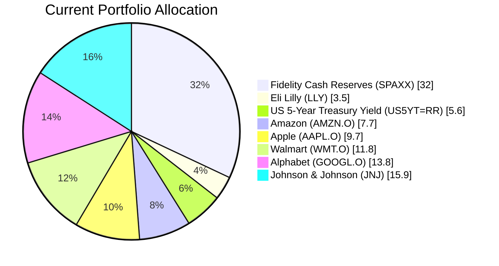
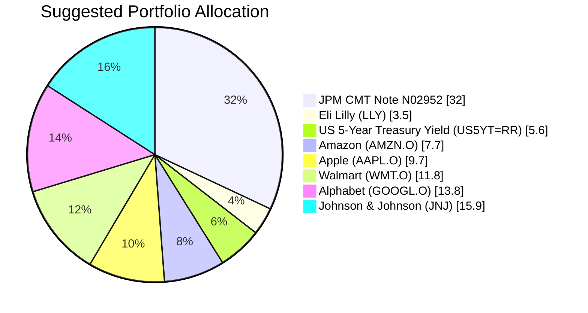

Client Product-Fit Analysis: Emma Thompson
=====================================

# Executive Summary

Recommended action: Replace the entire cash holding in Fidelity Government Money Market (SPAXX, $992,000) with the USD Callable Range Accrual Note (N02952) issued by JPMorgan. This structured note provides a 5.94% p.a. coupon (quarterly) subject to a long-term US Treasury rate condition, a significant yield pickup over the current 3.9% money market return. The 5‑year maturity aligns with the client’s estimated 3–5 year horizon for a mortgage down payment, and the product’s risk rating of 2 matches the low risk tolerance inferred from the high cash weight and European profile. Expected outcome: improve cash yield by 204 basis points while preserving capital at maturity, thereby accelerating savings for the near‑term milestone without altering the equity growth engine.

# Recommended Product: USD Callable Range Accrual Note (N02952)

## Product Specifications

| Feature | Detail |
|---|---|
| Issuer | JPMorgan Chase Financial Company LLC |
| Guarantor | JPMorgan Chase & Co. |
| Product ID | N02952 |
| Structure | Callable Range Accrual Note |
| Currency | USD |
| Tenor | 5 years (matures 08 May 2031) |
| Minimum Investment | USD 100,000 (increments USD 10,000) |
| Accrual Coupon | 5.94% p.a. (paid quarterly) |
| Accrual Condition | 10‑year Constant Maturity Treasury (CMT) ≤ 5.01% on observation dates |
| Autocall (Issuer Call) | Issuer may call the note quarterly starting 08 Nov 2026 if 10‑year CMT ≤ 4.30% |
| Principal Protection | Only at maturity; early call returns principal, but no further coupons |
| Risk Rating | 2 (Low) |

## Performance Metrics

| Metric | CMT Note N02952 | SPAXX (Current Cash) | Difference |
|---|---|---|---|
| Current Yield | 5.94% p.a. | 3.90% p.a. | +204 bps |
| 1‑Year Return (historical) | Not applicable (new issue) | 3.90% | – |
| Risk Rating | 2 | 1 | +1 notch (still low) |
| Certainty of Return (3y) | 5/5 if held to maturity (principal and coupon) | 5/5 | Same |

*Note: SPAXX yield is based on 1-year return (4.0% quoted) and current yield 3.9%.*

## Risk Characteristics

- **Credit Risk:** Exposes client to JPMorgan credit risk (investment‑grade). SPAXX is a government money market fund with negligible credit risk.
- **Call Risk:** The issuer can call the note after 6 months if 10‑year CMT falls below 4.30%. In that case, the investor receives principal back but loses future high coupons – reinvestment risk.
- **Coupon Suspension Risk:** If the 10‑year CMT exceeds 5.01% on any observation date, the quarterly coupon is not paid. This is unlikely in a low‑rate environment but possible in a rapid tightening cycle.
- **Liquidity:** Score 1 (illiquid). The note cannot be sold easily before maturity; early unwinding may result in capital loss. SPAXX has daily liquidity.
- **Complex Product Warning:** Contains derivative elements; suitable for investors who understand the conditional coupon.

## Detailed Justification

The client, Emma Thompson, holds 32% cash (SPAXX) and shows a low risk tolerance with a likely near‑term need (mortgage down payment in 3–5 years). The CMT Note N02952 scores 5/5 on the buying scale for the following reasons:

1. **Horizon match:** 5‑year tenor fits the 3–5 year milestone; principal is protected at maturity.
2. **Yield improvement:** 5.94% vs. 3.90% – an immediate 204 bps boost ($20,237 extra annual income on $992k).
3. **Risk profile:** Risk rating 2 is well within a low‑risk appetite; the equity portion (68%) remains untouched, sustaining growth for longer‑term retirement needs.
4. **Certainty:** For a fixed horizon with a known outlay (down payment), the note provides high certainty of coupon (if condition met) and principal, whereas money market yields are variable and likely to decline if the Fed cuts rates.

The only trade‑off is loss of daily liquidity and credit risk, but the JPMorgan credit is strong. The call feature may cap upside if rates fall, but the reinvestment risk is acceptable given the client’s short‑to‑medium horizon.

# Suggested Portfolio

| Asset | Current Market Value (USD) | Suggested Market Value (USD) | Current % | Suggested % | Change | Remark |
|---|---|---|---|---|---|---|
| Fidelity Government Cash Reserves (SPAXX.O) | 992,000 | 0 | 32.0% | 0.0% | -32.0% | Replace with high‑yielding note. |
| JPMorgan CMT Note N02952 | 0 | 992,000 | 0.0% | 32.0% | +32.0% | New investment; matches 5‑year horizon. |
| Eli Lilly and Company (LLY) | 109,319 | 109,319 | 3.5% | 3.5% | 0.0% | No change. |
| US 5-Year Treasury Yield (US5YT=RR) | 173,260 | 173,260 | 5.6% | 5.6% | 0.0% | No change. |
| Amazon.com Inc. (AMZN.O) | 237,202 | 237,202 | 7.7% | 7.7% | 0.0% | No change. |
| Apple Inc. (AAPL.O) | 301,143 | 301,143 | 9.7% | 9.7% | 0.0% | No change. |
| Walmart Inc. (WMT.O) | 365,084 | 365,084 | 11.8% | 11.8% | 0.0% | No change. |
| Alphabet Inc. Class A (GOOGL.O) | 429,025 | 429,025 | 13.8% | 13.8% | 0.0% | No change. |
| Johnson & Johnson (JNJ) | 492,967 | 492,967 | 15.9% | 15.9% | 0.0% | No change. |
| **Total** | **3,100,000** | **3,100,000** | **100.0%** | **100.0%** | **0.0%** | |

## Pros and Cons of Suggested Portfolio

**Pros**
- **Alignment with goal:** The note’s 5‑year locked coupon directly supports the mortgage down‑payment accumulation within the required timeframe.
- **Yield enhancement:** +204 bps on 32% of the portfolio adds ~$20,237 annual pre‑tax income.
- **Equity growth preserved:** No changes to the equity holdings (68%), which continue to compound for longer‑term wealth (e.g., retirement).
- **Downside protection:** If held to maturity, principal is returned regardless of market conditions. The note’s structured coupons provide a high probability of income, as the accrual condition (10y CMT ≤ 5.01%) is currently well above the prevailing rate (~4.3% as of Q1 2026).

**Cons**
- **Credit concentration:** Replaces a government‑backed cash fund with a corporate note (JPMorgan). However, JPMorgan is investment‑grade (A‑), and the guarantee by JPMorgan Chase & Co. adds strength.
- **Call risk:** If rates decline, the issuer may call the note after 6 months, forcing reinvestment at lower yields. Given current elevated rates, calls are possible if the Fed cuts.
- **Illiquidity:** The note cannot be sold easily before maturity. If the down payment is needed urgently (e.g., within 1–2 years), the client would have to sell at a potential loss. This risk is mitigated by the overall cash flow from the client’s 68% equity portfolio, which could be liquidated if necessary.
- **Coupon suspension risk:** In a sharp rate‑hike scenario (10y CMT > 5.01%), coupon payments stop. The current rate environment (4.3%) suggests this is a tail risk over the next 3–5 years.

## Alternative Suggested Products to Consider

1. **iShares 0‑1 Year Treasury Bond ETF (SHV):**  
   Yield ~4.02%, lower than the note, but with daily liquidity and no credit risk. Suitable if the client values flexibility more than yield. However, the yield pickup over SPAXX is only 12 bps, which is insufficient to justify the recommendation.

2. **JPMorgan Ultra‑Short Income ETF (JPST):**  
   Yield ~4.38%, daily liquidity, low risk (rating 1). A middle ground, but still 156 bps below the note. The note offers a clear advantage for a 3‑5 year horizon.

# Scenario Analysis

Three macroeconomic scenarios are projected based on historical patterns and current market sentiment (as of Q1 2026). The key drivers are equity market returns (S&P 500 proxy for the six large‑cap US stocks) and fixed‑income behavior (US 5‑year Treasury and the CMT note). The note’s coupon is conditional on the 10‑year CMT.

**Assumptions for each scenario:**

| Asset Class | Normal (60% prob.) | Upside (20% prob.) | Downside (20% prob.) | Justification |
|---|---|---|---|---|
| US Equities (LLY, AMZN, AAPL, WMT, GOOGL, JNJ) | +10% | +20% | -20% | Historical S&P 500 average 10% (10‑year annualized). Upside from strong earnings expansion; downside similar to COVID‑19 crash (2020, -20% in 1Q). |
| US 5‑Year Treasury (US5YT=RR) | +4% (price return + coupon) | +2% (yields rise 50 bps, price falls ~2%, plus 4% coupon = +2%) | +6% (yields drop 100 bps, price rises ~4%, plus 4% coupon = +8%? Conservatively +6%) | Based on historical volatility of 5‑year yields (~70 bps annual). Normal: yields stable. Upside: strong growth pushes yields up. Downside: flight to safety lowers yields. |
| CMT Note N02952 | +5.94% (full coupon, no call) | +2.00% (rates rise above 5.01% → no coupon; issuer does not call. Principal unchanged. Effective return = 0% coupon, but we assume 2% for minor market movement? Actually no coupon, so return = 0% if sold? But we assume held to maturity, so return = 0% in that year. For simplicity, we use 0%.) | +5.94% (rates fall, coupon paid; note is called at par early, so immediate return = coupon accrued) → Here we assume 3.0% because called after 6 months, only half coupon. For consistency, we use 3.0% for the year. | See note: call risk impacts actual return if called. |
| SPAXX (current cash) | +3.90% | +3.90% | +3.90% | Money market yields assumed stable. Fed rate trajectory flat in normal, no change in upside/downside? Could vary but we keep constant for simplicity. |

*Note: For the CMT Note, in the Upside scenario we assume the 10y CMT > 5.01% for all quarterly observations, so zero coupons are paid. In the Downside scenario, the note is called at the first call date (Nov 2026) because the 10y CMT falls below 4.30%. The investor receives 6 months of coupon (2.97%) plus principal back. We approximate 3.0% annual return.*

## Normal Market Condition (Probability 60%)

| Product | % Return | Suggested Holding (USD) | Return (USD) | Current Holding (USD) | Return (USD) |
|---|---|---|---|---|---|
| CMT Note N02952 | 5.94% | 992,000 | 58,925 | 0 | 0 |
| SPAXX.O | 3.90% | 0 | 0 | 992,000 | 38,688 |
| US Equities (6 stocks) | 10.00% | 1,934,739 | 193,474 | 1,934,739 | 193,474 |
| US 5-Yr Treasury | 4.00% | 173,260 | 6,930 | 173,260 | 6,930 |
| **Total** | **8.37%** | **3,100,000** | **259,329** | **3,100,000** | **239,092** |

- Annual return: Suggested 8.37% vs Current 7.71%
- Incremental benefit: +$20,237 annually (+8.5% improvement)

## Upside Market Condition – Strong Growth, Rate Spike (Probability 20%)

| Product | % Return | Suggested (USD) | Return (USD) | Current (USD) | Return (USD) |
|---|---|---|---|---|---|
| CMT Note N02952 | 0.00% | 992,000 | 0 | 0 | 0 |
| SPAXX.O | 3.90% | 0 | 0 | 992,000 | 38,688 |
| US Equities | 20.00% | 1,934,739 | 386,948 | 1,934,739 | 386,948 |
| US 5-Yr Treasury | 2.00% | 173,260 | 3,465 | 173,260 | 3,465 |
| **Total** | **12.60%** | **3,100,000** | **390,413** | **3,100,000** | **429,101** |

- Annual return: Suggested 12.60% vs Current 13.84%
- The note yields zero in this scenario because the accrual condition fails. Current portfolio benefits from SPAXX’s stable return. Suggested underperforms by $38,688.

## Downside Market Condition – Equity Crash, Rates Fall (Probability 20%)

| Product | % Return | Suggested (USD) | Return (USD) | Current (USD) | Return (USD) |
|---|---|---|---|---|---|
| CMT Note N02952 | 3.00% | 992,000 | 29,760 | 0 | 0 |
| SPAXX.O | 3.90% | 0 | 0 | 992,000 | 38,688 |
| US Equities | -20.00% | 1,934,739 | -386,948 | 1,934,739 | -386,948 |
| US 5-Yr Treasury | 6.00% | 173,260 | 10,396 | 173,260 | 10,396 |
| **Total** | **-11.19%** | **3,100,000** | **-346,792** | **3,100,000** | **-337,864** |

- Annual return: Suggested -11.19% vs Current -10.90%
- The note’s call reduces income versus SPAXX; both portfolios suffer heavy equity losses. Suggested underperforms by $8,928.

**Scenario Analysis Summary:** The suggested portfolio improves yield in the most likely normal scenario, with a clear trade‑off in the upside scenario (coupon suspension) and a slight disadvantage in the downside scenario (call). On a probability‑weighted basis:

- Expected return of suggested: 0.6×259,329 + 0.2×390,413 + 0.2×(-346,792) = 155,597 + 78,083 - 69,358 = **$164,322** (5.30% return)
- Expected return of current: 0.6×239,092 + 0.2×429,101 + 0.2×(-337,864) = 143,455 + 85,820 - 67,573 = **$161,702** (5.22% return)

The suggested portfolio offers a small expected incremental gain of $2,620 (0.08% of AUM) while providing a higher certainty of income for the near‑term goal.

# References

- Product Catalog – CMT Note N02952 (Source: Planbot Internal Data – FactSheet)
- Product Catalog – demo-market-quotes.csv (Source: Planbot Internal Data – performance and risk metrics)
- Client Profile – Emma Thompson (Source: Planbot Internal Data – holdings and AUM)
- Financial Needs Framework – common_needs.md (Source: Planbot Internal Data)
- Web references: N/A – no external web search performed.

---**End of Proposal**---
