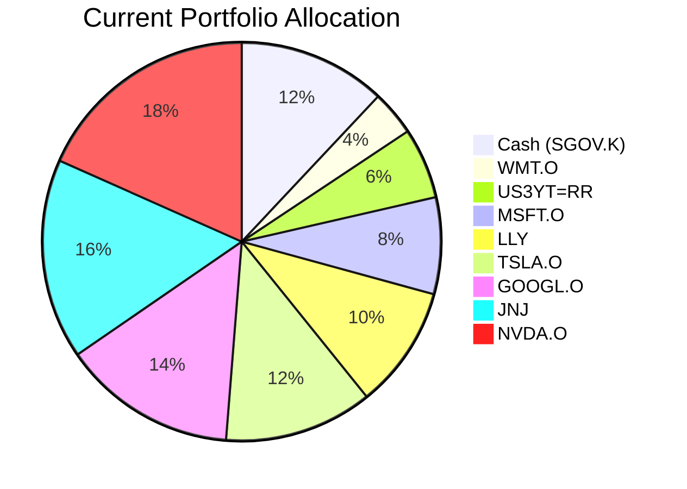
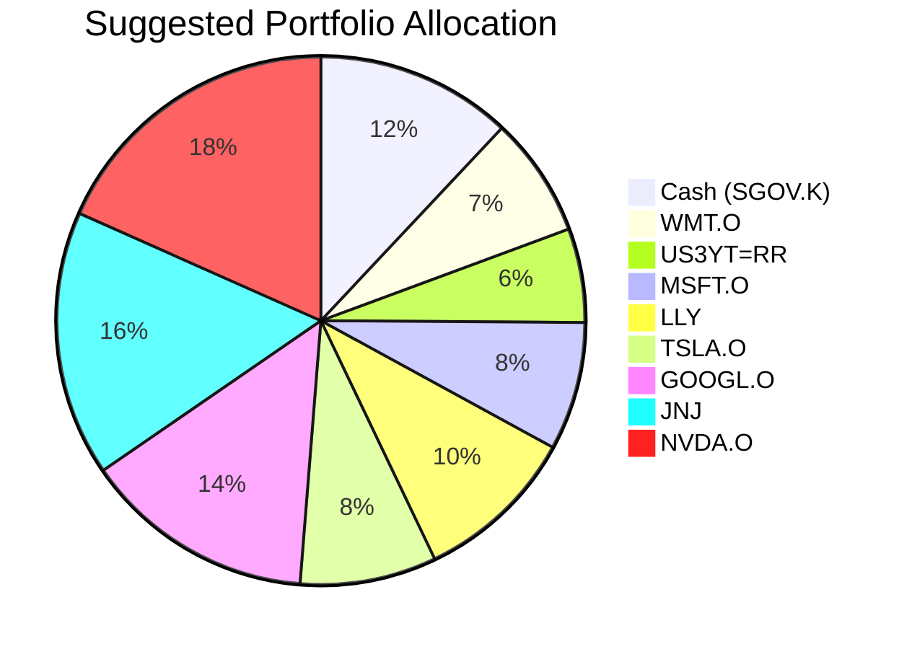

Client Product-Fit Analysis: Robert Rodriguez
=====================================

# Executive Summary

We recommend reallocating USD 150,000 from the volatile Tesla Inc. (TSLA.O) position into the defensive, dividend-paying Walmart Inc. (WMT.O). This action directly addresses the portfolio's primary need for risk reduction and income by swapping a high-volatility, loss-making growth stock for a stable consumer staple with positive momentum. The expected outcome is an improved risk/return profile, providing better downside protection and adding a steady income stream while maintaining exposure to equity growth over your 5-7 year horizon.

# Recommended Product: Walmart Inc. (WMT.O)

## Product Specifications
*   **Ticker:** WMT.O
*   **Asset Class:** Equity (Consumer Staples)
*   **Currency:** USD
*   **Current Price (as of 2026-03-27):** USD 122.18
*   **Dividend Yield:** 0.80%
*   **Risk Rating:** 3 (Medium)
*   **Liquidity:** T+2 (High)

## Performance Metrics
*   **YTD Return:** +8.58%
*   **1-Year Return:** +44.66%
*   **5-Year Annualized Return:** +180.77%
*   **Suggested Funding Source (TSLA.O) YTD Return:** -15.06%

**Contrast:** WMT.O has demonstrated strong positive momentum and consistent long-term growth, significantly outperforming the suggested funding source (TSLA.O) on a year-to-date and long-term basis. Its performance profile is characterized by lower volatility and higher certainty of returns compared to the speculative technology sector.

## Risk Characteristics
Walmart is classified as a "defensive" equity due to its business model (essential consumer goods). It typically exhibits a lower beta (sensitivity to market movements) than the overall market, especially compared to high-growth technology stocks. The primary risks are company-specific operational risks and broader consumer spending slowdowns, though its essential nature provides a buffer during economic downturns.

## Detailed Justification
This recommendation is driven by your portfolio's need for **Risk Reduction / Income**. Your current portfolio is heavily concentrated in volatile technology and growth stocks (TSLA, NVDA, LLY, MSFT, GOOGL), several of which are in significant unrealized loss positions. Adding WMT.O provides critical diversification:
1.  **Sector Diversification:** Introduces exposure to the stable Consumer Staples sector, which is non-cyclical and performs relatively well during market stress.
2.  **Risk Mitigation:** Funds the purchase by reducing the largest loss-making position (TSLA.O at -15.1% P&L), improving the overall portfolio's health and cost basis.
3.  **Income Generation:** Adds a dividend yield (0.80%), addressing the income component of your stated need.
4.  **Positive Momentum:** The stock's strong YTD and 1-year returns (+8.58% and +44.66% respectively) indicate current market favor, offering stability with growth potential.

The product's Risk Rating of 3 is consistent with your portfolio's overall risk level but represents a shift towards a more stable risk factor.

# Suggested Portfolio

| Asset | Current Market Value (USD) | Suggested Market Value (USD) | Current % | Suggested % | Change | Remark |
| :--- | :---: | :---: | :---: | :---: | :---: | :--- |
| iShares 0-3 Month Treasury Bond ETF (SGOV.K) | 486,000 | 486,000 | 12.00% | 12.00% | 0.00% | Maintain cash buffer. |
| Walmart Inc. (WMT.O) | 148,043 | 298,043 | 3.66% | 7.36% | +3.70% | **Increase by USD 150,000.** Add defensive equity for stability & income. |
| US 3-Year Treasury Yield (US3YT=RR) | 233,031 | 233,031 | 5.75% | 5.75% | 0.00% | Maintain fixed income exposure. |
| Microsoft Corporation (MSFT.O) | 318,018 | 318,018 | 7.85% | 7.85% | 0.00% | Maintain core tech holding. |
| Eli Lilly and Company (LLY) | 403,006 | 403,006 | 9.95% | 9.95% | 0.00% | Maintain healthcare exposure. |
| Tesla Inc. (TSLA.O) | 487,994 | 337,994 | 12.05% | 8.35% | -3.70% | **Reduce by USD 150,000.** Fund WMT purchase; trim volatile, loss-making position. |
| Alphabet Inc. Class A (GOOGL.O) | 572,982 | 572,982 | 14.15% | 14.15% | 0.00% | Maintain core tech holding. |
| Johnson & Johnson (JNJ) | 657,969 | 657,969 | 16.25% | 16.25% | 0.00% | Maintain defensive healthcare holding. |
| NVIDIA Corporation (NVDA.O) | 742,957 | 742,957 | 18.34% | 18.34% | 0.00% | Maintain core tech/growth holding. |
| **Total** | **4,050,000** | **4,050,000** | **100.00%** | **100.00%** | **0.00%** | |

## Pros and cons of suggested portfolio

**Pros:**
*   **Improved Risk-Adjusted Returns:** Substituting a portion of high-volatility TSLA with lower-volatility WMT reduces overall portfolio risk without sacrificing equity exposure, aligning with the goal of risk reduction.
*   **Enhanced Defensive Characteristics:** Increases allocation to non-cyclical consumer staples, which should provide better downside protection during market corrections.
*   **Income Generation:** Adds a dividend-paying component, addressing the income aspect of your financial need.
*   **Portfolio Hygiene:** Realizes a loss on TSLA (for tax purposes, if applicable) and reallocates capital into an asset with positive momentum.

**Cons:**
*   **Reduced Pure Growth Upside:** Limits potential explosive gains from TSLA in a strong bull market for technology stocks.
*   **Sector Concentration:** The portfolio remains heavily concentrated in **US equities (100%)** and within that, **Technology and Healthcare sectors**. The addition of WMT only slightly mitigates this.
*   **Interest Rate Sensitivity:** The fixed income holding (US3YT=RR) and the overall portfolio may face headwinds if interest rates rise unexpectedly.

## Alternative suggested product to consider
1.  **Procter & Gamble Co. (PG):** Another high-quality, defensive consumer staples stock with a higher dividend yield (~2.94%) and an even longer history of stable returns. It may offer more income but slightly lower growth potential than WMT.
2.  **iShares Core U.S. Aggregate Bond ETF (AGG):** If the income and certainty needs are prioritized over growth, allocating a portion to this investment-grade bond ETF would significantly reduce portfolio volatility and provide steady coupon payments, though at the cost of lower long-term return potential.

# Scenario Analysis

## Normal Market Condition (Probability: 50%)
*Assumptions based on long-term historical averages and current yield levels.*
- **Projected Global Equity Returns:** 10% p.a. (MSCI World 20-year average).
- **Projected Defensive Equity (WMT) Returns:** 9% p.a. (Slightly below market due to lower beta).
- **Projected High-Growth Equity (TSLA) Returns:** 12% p.a. (Higher risk premium).
- **Projected Money Market Returns:** 4% p.a. (Current yield on SGOV.K).
- **Projected US 3-Year Treasury Returns:** 4.5% p.a. (Current yield level).

| Product | % Return | Suggested Holding (USD) | Projected PnL (USD) | Current Holding (USD) | Projected PnL (USD) |
| :--- | :---: | :---: | :---: | :---: | :---: |
| SGOV.K | 4.0 | 486,000 | 19,440 | 486,000 | 19,440 |
| WMT.O | 9.0 | 298,043 | 26,824 | 148,043 | 13,324 |
| US3YT=RR | 4.5 | 233,031 | 10,486 | 233,031 | 10,486 |
| MSFT.O | 10.0 | 318,018 | 31,802 | 318,018 | 31,802 |
| LLY | 10.0 | 403,006 | 40,301 | 403,006 | 40,301 |
| **TSLA.O** | **12.0** | **337,994** | **40,559** | **487,994** | **58,559** |
| GOOGL.O | 10.0 | 572,982 | 57,298 | 572,982 | 57,298 |
| JNJ | 10.0 | 657,969 | 65,797 | 657,969 | 65,797 |
| NVDA.O | 10.0 | 742,957 | 74,296 | 742,957 | 74,296 |
| **Total** | **9.1%** | **4,050,000** | **366,803** | **4,050,000** | **371,303** |
- **Annual return of the suggested portfolio vs current:** 9.06% vs 9.17%
- **Incremental impact:** -USD 4,500 annually (-1.2%). The suggested portfolio sacrifices some upside in a normal market for greater stability.

## Good Market Condition (Probability: 30%)
*Assumptions based on a strong economic growth environment boosting cyclical and growth assets.*
- **Projected Global Equity Returns:** 20% p.a.
- **Projected Defensive Equity (WMT) Returns:** 15% p.a. (Participates but lags pure growth).
- **Projected High-Growth Equity (TSLA) Returns:** 30% p.a. (Outperforms in a risk-on rally).
- **Projected Money Market Returns:** 4% p.a.
- **Projected US 3-Year Treasury Returns:** 4.5% p.a.

| Product | % Return | Suggested Holding (USD) | Projected PnL (USD) | Current Holding (USD) | Projected PnL (USD) |
| :--- | :---: | :---: | :---: | :---: | :---: |
| SGOV.K | 4.0 | 486,000 | 19,440 | 486,000 | 19,440 |
| WMT.O | 15.0 | 298,043 | 44,706 | 148,043 | 22,206 |
| US3YT=RR | 4.5 | 233,031 | 10,486 | 233,031 | 10,486 |
| MSFT.O | 20.0 | 318,018 | 63,604 | 318,018 | 63,604 |
| LLY | 20.0 | 403,006 | 80,601 | 403,006 | 80,601 |
| **TSLA.O** | **30.0** | **337,994** | **101,398** | **487,994** | **146,398** |
| GOOGL.O | 20.0 | 572,982 | 114,596 | 572,982 | 114,596 |
| JNJ | 20.0 | 657,969 | 131,594 | 657,969 | 131,594 |
| NVDA.O | 20.0 | 742,957 | 148,591 | 742,957 | 148,591 |
| **Total** | **17.6%** | **4,050,000** | **715,016** | **4,050,000** | **737,516** |
- **Annual return of the suggested portfolio vs current:** 17.65% vs 18.21%
- **Incremental impact:** -USD 22,500 annually (-3.1%). The defensive tilt of the suggested portfolio causes it to underperform in a strong bull market.

## Bad Market Condition - Recession (Probability: 20%)
*Assumptions based on a moderate recession scenario similar to 2022's bear market.*
- **Projected Global Equity Returns:** -20% p.a.
- **Projected Defensive Equity (WMT) Returns:** -5% p.a. (Defensive holdings decline less).
- **Projected High-Growth Equity (TSLA) Returns:** -40% p.a. (High volatility stocks hit hardest).
- **Projected Money Market Returns:** 4% p.a. (Safe haven flows).
- **Projected US 3-Year Treasury Returns:** 6% p.a. (Flight to quality, yields may fall, prices rise).

| Product | % Return | Suggested Holding (USD) | Projected PnL (USD) | Current Holding (USD) | Projected PnL (USD) |
| :--- | :---: | :---: | :---: | :---: | :---: |
| SGOV.K | 4.0 | 486,000 | 19,440 | 486,000 | 19,440 |
| WMT.O | -5.0 | 298,043 | -14,902 | 148,043 | -7,402 |
| US3YT=RR | 6.0 | 233,031 | 13,982 | 233,031 | 13,982 |
| MSFT.O | -20.0 | 318,018 | -63,604 | 318,018 | -63,604 |
| LLY | -20.0 | 403,006 | -80,601 | 403,006 | -80,601 |
| **TSLA.O** | **-40.0** | **337,994** | **-135,198** | **487,994** | **-195,198** |
| GOOGL.O | -20.0 | 572,982 | -114,596 | 572,982 | -114,596 |
| JNJ | -20.0 | 657,969 | -131,594 | 657,969 | -131,594 |
| NVDA.O | -20.0 | 742,957 | -148,591 | 742,957 | -148,591 |
| **Total** | **-12.7%** | **4,050,000** | **-514,664** | **4,050,000** | **-698,164** |
- **Annual return of the suggested portfolio vs current:** -12.71% vs -17.24%
- **Incremental benefit:** +USD 183,500 preserved annually (+26.3%). The suggested portfolio provides significant downside protection, which is the core objective of the recommendation.

# Risk Disclosure
- Past performance does not guarantee future returns.
- Projected returns are estimates, not promises.
- Equity investments carry the risk of principal loss.

# References
- **Client Profile & Holdings:** 5_profile.md, 5_holdings.csv (Source: Planbot Internal Data)
- **Product Catalog:** demo-market-quotes.csv (Source: Planbot Internal Data)
- **Financial Needs Framework:** common_needs.md (Source: Planbot Internal Data)
- **Web References:** N/A
