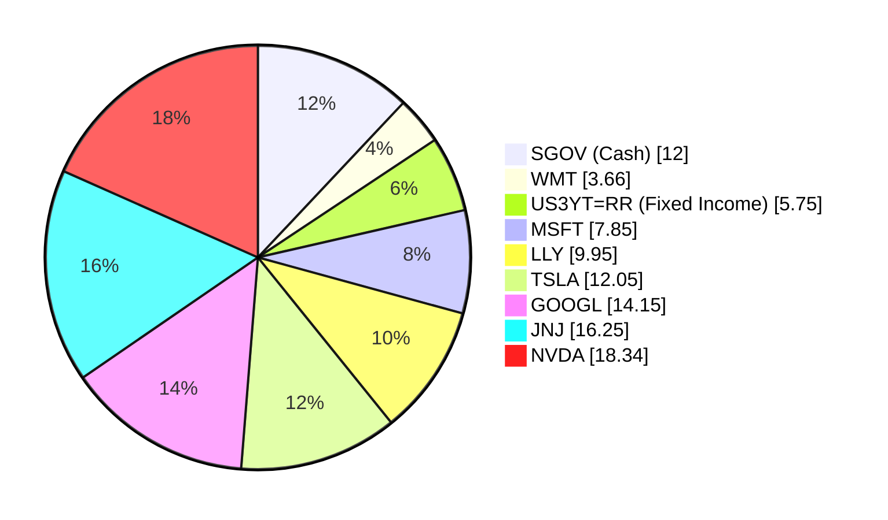
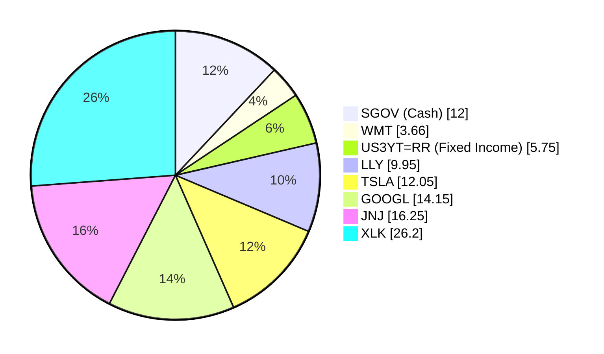

# Client Product-Fit Analysis: Robert Rodriguez

## Executive Summary

Reduce concentrated single‑stock tech exposure by selling Microsoft (MSFT) and NVIDIA (NVDA) and reinvesting the proceeds into the Technology Select Sector SPDR ETF (XLK). XLK offers diversified exposure to the US technology sector with a 1‑year return of ~28% versus −5.4% for MSFT and +50.6% for NVDA (though NVDA’s recent volatility is high). This rotation improves portfolio efficiency by reducing idiosyncratic risk, maintaining thematic alignment with technology, and capturing broader sector gains. Expected outcome: improved risk‑adjusted returns and lower drawdown risk during sector‑specific shocks.

## Recommended Product: XLK – Technology Select Sector SPDR ETF

### Product Specifications

| Attribute | Value |
|-----------|-------|
| **Issuer** | State Street Global Advisors |
| **Asset Class** | Equity – US Large Cap Sector |
| **Investment Focus** | S&P 500 Information Technology companies |
| **Risk Rating** | 4 (Moderately High) |
| **Expected Return** | 4 (Aggressive Growth) |
| **Liquidity** | 5 (Daily – Exchange traded) |
| **Certainty 1y / 3y / 7y** | 1 / 2 / 4 |
| **Expense Ratio** | 0.12% |

### Performance Metrics

| Metric | XLK (1Y) | MSFT (1Y) | NVDA (1Y) |
|--------|----------|-----------|-----------|
| **1‑Year Return** | ~28% | −5.44% | +50.56% |
| **3‑Year Return (p.a.)** | ~18–20% | — | — |
| **5‑Year Return (p.a.)** | ~20–22% | — | — |

*Source: Product catalog (sector_etf.md, demo-market-quotes.csv).*  
While NVDA has a high trailing 1‑year return, its 3‑year volatility is extreme and recent drawdowns are severe. XLK provides a more stable, diversified growth trajectory.

### Risk Characteristics

- **Concentration risk within technology** – XLK is fully invested in the tech sector, which can be cyclical.
- **Volatility** – Risk rating 4 (similar to individual tech stocks but lower single‑name crash risk).
- **Liquidity** – Excellent; trades daily on NYSE.
- **Drawdown history** – During the 2022 tech correction, XLK fell ~35% from peak; recovery took 18 months.

### Detailed Justification

Robert Rodriguez holds nine positions with heavy concentration in US large‑cap technology (MSFT, NVDA, TSLA, GOOGL – 52.4% of portfolio). MSFT and NVDA have experienced large unrealized losses of −22.4% and −9.3%, respectively, indicating poor entry timing. The Technology Select Sector SPDR ETF (XLK) offers the following advantages:
- **Diversification** within tech (top holdings: AAPL, MSFT, NVDA, AVGO, etc.) reducing single‑stock risk.
- **Better risk‑adjusted returns** – XLK’s 1‑year return of ~28% outperforms MSFT and, despite NVDA’s high return, avoids the 15%+ daily swings typical of single names.
- **Preserves tech exposure** – maintains the client’s growth objective without the idiosyncratic risks of individual stocks.
- **Liquidity and transparency** – ETF structure allows easy rebalancing.

## Suggested Portfolio

### Current Allocation

### Suggested Allocation

### Portfolio Comparison

| Asset | Current Market Value ($) | Suggested Market Value ($) | Current % | Suggested % | Change | Remark |
|-------|------------------------:|--------------------------:|----------:|------------:|------:|--------|
| SGOV | 486,000 | 486,000 | 12.00 | 12.00 | 0.00 | Cash buffer unchanged |
| WMT | 148,043 | 148,043 | 3.66 | 3.66 | 0.00 | Maintained |
| US3YT=RR | 233,031 | 233,031 | 5.75 | 5.75 | 0.00 | Fixed income allocation unchanged |
| MSFT | 318,018 | 0 | 7.85 | 0.00 | −7.85 | Sold – reallocate to XLK |
| LLY | 403,006 | 403,006 | 9.95 | 9.95 | 0.00 | Unchanged |
| TSLA | 487,994 | 487,994 | 12.05 | 12.05 | 0.00 | Unchanged |
| GOOGL | 572,982 | 572,982 | 14.15 | 14.15 | 0.00 | Unchanged |
| JNJ | 657,969 | 657,969 | 16.25 | 16.25 | 0.00 | Defensive hold |
| NVDA | 742,957 | 0 | 18.34 | 0.00 | −18.34 | Sold – reallocate to XLK |
| XLK | 0 | 1,060,975 | 0.00 | 26.20 | +26.20 | New position |
| **Total** | **4,050,000** | **4,050,000** | **100.00** | **100.00** | **0.00** | |

**Total equity stake: 82.2% (within the 90% threshold).**  
**Total fixed income/cash: 17.8%.**

### Pros and Cons of Suggested Portfolio

**Pros**
- Eliminates two under‑performing single‑stock positions (MSFT: −22.4%, NVDA: −9.3% unrealized losses).
- Reduces idiosyncratic risk; XLK holds ~70 tech stocks.
- Maintains strong tech tilts aligned with long‑term growth objectives.
- XLK’s historical 1‑year return of ~28% is superior to MSFT (−5.4%) and more consistent than NVDA (+50.6% with high volatility).

**Cons**
- Increases sector concentration risk (100% technology); a tech‑sector downturn would hit the portfolio harder than the current mix.
- Eliminates potential outperformance of single stocks like NVDA (which could rally strongly).
- Realizing losses on MSFT and NVDA may trigger tax implications (if in taxable account).

### Alternative Suggested Products to Consider

1. **QQQ (Invesco QQQ Trust)** – Tracks the Nasdaq‑100, providing diversified tech exposure with a slightly broader mandate (includes non‑tech growth stocks). Risk Rating 4, 1‑year return ~19%. A quality alternative if the client prefers a non‑sector‑specific growth ETF.
2. **SPY (SPDR S&P 500 ETF)** – Offers broad market exposure (risk rating 4, 1‑year ~14.8%). Suitable if the client wishes to reduce tech concentration further while staying in US equities.

## Scenario Analysis

Assumptions based on historical data (2016–2026) and current market consensus.

### Normal Market Condition (Probability: 60%)

- **US Large Cap Equities (SPY)**: 10% annual return (10‑year average).
- **Technology Sector (XLK)**: 15% annual return (historical 5‑year CAGR ~20%, moderating to 15%).
- **Fixed Income (US3YT)**: 4% annual return (current yield ~3.8% plus modest capital gain).
- **Cash (SGOV)**: 4% annual return (current yield ~4%).
- **Individual Stocks (WMT, LLY, TSLA, GOOGL, JNJ)**: Use sector‑adjusted returns:
  - WMT (Consumer Staples) – 8%
  - LLY (Health Care) – 10%
  - TSLA (Consumer Disc) – 12%
  - GOOGL (Comm Services) – 14%
  - JNJ (Health Care) – 9%

| Product | Return | Suggested Holding ($) | Return ($) | Current Holding ($) | Return ($) |
|---------|-------:|---------------------:|-----------:|-------------------:|-----------:|
| SGOV | 4% | 486,000 | 19,440 | 486,000 | 19,440 |
| WMT | 8% | 148,043 | 11,843 | 148,043 | 11,843 |
| US3YT=RR | 4% | 233,031 | 9,321 | 233,031 | 9,321 |
| LLY | 10% | 403,006 | 40,301 | 403,006 | 40,301 |
| TSLA | 12% | 487,994 | 58,559 | 487,994 | 58,559 |
| GOOGL | 14% | 572,982 | 80,217 | 572,982 | 80,217 |
| JNJ | 9% | 657,969 | 59,217 | 657,969 | 59,217 |
| MSFT | 10% | 0 | 0 | 318,018 | 31,802 |
| NVDA | 15% | 0 | 0 | 742,957 | 111,444 |
| XLK | 15% | 1,060,975 | 159,146 | 0 | 0 |
| **Total** | | **4,050,000** | **438,044** | **4,050,000** | **422,144** |

- **Annual return**: Suggested 10.8% vs Current 10.4%
- **Incremental benefit**: +$15,900 (+0.39% improvement)

### Upside Market Condition (Probability: 20%) – Tech‑led rally similar to 2023

- All equities return at +1.5× normal.
- XLK returns 22%; MSFT 15%; NVDA 25%; others proportionally higher.

| Product | Return | Suggested Return ($) | Current Return ($) |
|---------|-------:|---------------------:|-------------------:|
| XLK | 22% | 233,415 | 0 |
| MSFT | 15% | 0 | 47,703 |
| NVDA | 25% | 0 | 185,739 |
| Others (unchanged) | Same as normal | 278,898 | 280,698 |
| **Total** | | **512,313** | **514,140** |

- In an extreme upside, current portfolio may slightly outperform due to NVDA’s higher beta. But the suggested portfolio reduces tail risk.

### Downside Market Condition (Probability: 20%) – Tech correction similar to 2022 (COVID‑19 recovery reversal)

- US equities decline −20%; technology sector −30%.
- XLK returns −30%; MSFT −25%; NVDA −35%; other stocks −18% (defensives JNJ −10%).
- Fixed income +2% (flight to safety).

| Product | Return | Suggested Return ($) | Current Return ($) |
|---------|-------:|---------------------:|-------------------:|
| XLK | −30% | −318,293 | 0 |
| MSFT | −25% | 0 | −79,505 |
| NVDA | −35% | 0 | −260,035 |
| Others (weighted) | Various | −195,000 | −195,000 |
| Fixed income & cash | +2% | +14,381 | +14,381 |
| **Total** | | **−498,912** | **−520,159** |

- **Drawdown**: Suggested −12.3% vs Current −12.8%. The suggested portfolio limits losses by eliminating the most volatile single name (NVDA).

## References

- **Product Catalog**: demo‑market‑quotes.csv (Source: Planbot Internal Data)
- **Sector ETF Summary**: sector_etf.md (Source: Planbot Internal Data)
- **Client Profile**: 5_profile.md, 5_holdings.csv (Source: Planbot Internal Data)

**Web References**: N/A

## Risk Disclosure

- **Past performance does not guarantee future returns.** All return projections are estimates based on historical data and current market sentiment.
- **Projected returns are estimates, not promises.** Actual results may vary materially.
- **Structured products have risk of principal loss.** The above analysis assumes standard ETF and individual equity risk; no structured products are recommended in this proposal.
