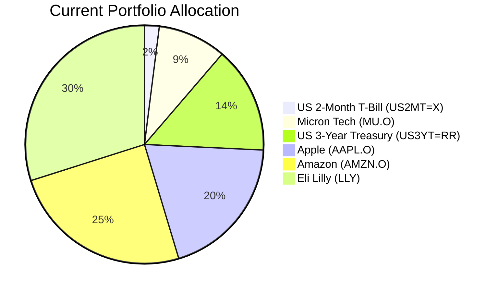
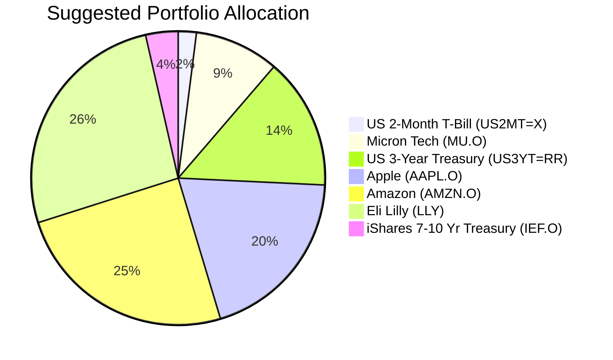

Client Product-Fit Analysis: Elena Petrova
=====================================

# Executive Summary

We recommend reducing the concentrated, loss-making position in Eli Lilly and Company (LLY) by USD 150,000 and reallocating the proceeds to purchase the iShares 7-10 Year Treasury Bond ETF (IEF.O). This action addresses the portfolio's critical lack of a resilient, income-generating core by adding high-quality duration exposure. The expected outcome is a meaningful reduction in overall portfolio volatility, improved diversification, and the addition of a steady yield, better aligning the portfolio with the client's need for moderate growth with stability over a 3-5 year horizon.

# Recommended Product: iShares 7-10 Year Treasury Bond ETF (IEF.O)

## Product Specifications
*   **Product Name:** iShares 7-10 Year Treasury Bond ETF
*   **Symbol:** IEF.O
*   **Asset Class:** Fixed Income (US Treasury Bonds)
*   **Currency:** USD
*   **Risk Rating:** 3
*   **Current Yield:** 3.72%
*   **Liquidity Score:** 5 (Daily Liquidity)

## Performance Metrics
*   **1-Year Return:** 4.07%
*   **5-Year Annualized Return:** -4.34%
*   **Historical Context:** The negative 5-year return reflects the significant rise in interest rates from historic lows post-2020. The current yield of 3.72% is substantially higher than the yields available over the past decade, presenting a more attractive entry point for income and diversification.

## Risk Characteristics
The product carries interest rate risk (duration risk), meaning its price will move inversely to changes in US Treasury yields. Its high credit quality (US Government) eliminates default risk. The Risk Rating of 3 aligns with the client's assessed risk tolerance for this portion of the portfolio.

## Detailed Justification
Elena Petrova's portfolio is aggressive, concentrated in US tech and healthcare equities, and lacks a stabilizing fixed-income core. With only 2% in cash and a single short-duration Treasury position, the portfolio has high sensitivity to equity market downturns. Adding IEF.O addresses this by:
1.  **Improving Diversification:** US Treasuries have historically exhibited low or negative correlation with equities during stress periods, providing a ballast against equity market declines.
2.  **Generating Reliable Income:** The 3.72% yield provides a steady cash flow, addressing the identified need for portfolio buffer/income.
3.  **Enacting Portfolio Hygiene:** Funding this purchase by trimming the LLY position (which has a -16.8% unrealized loss) is a strategic move. It reduces single-stock concentration risk and can be used for tax-loss harvesting, turning a paper loss into a tactical advantage.

# Suggested Portfolio

| Asset | Current Market Value (USD) | Suggested Market Value (USD) | Current % | Suggested % | Change | Remark |
| :--- | :---: | :---: | :---: | :---: | :---: | :--- |
| US 2-Month Treasury Bill (US2MT=X) | 84,000 | 84,000 | 2.00% | 2.00% | 0.00% | Maintain as liquidity buffer. |
| Micron Technology Inc. (MU.O) | 390,671 | 390,671 | 9.30% | 9.30% | 0.00% | Maintain position. |
| US 3-Year Treasury (US3YT=RR) | 606,936 | 606,936 | 14.45% | 14.45% | 0.00% | Maintain existing bond exposure. |
| Apple Inc. (AAPL.O) | 823,200 | 823,200 | 19.60% | 19.60% | 0.00% | Maintain core equity holding. |
| Amazon.com Inc. (AMZN.O) | 1,039,464 | 1,039,464 | 24.75% | 24.75% | 0.00% | Maintain core equity holding. |
| Eli Lilly and Company (LLY) | 1,255,729 | 1,105,729 | 29.90% | 26.33% | -3.57% | Reduce to fund new allocation and decrease concentration. |
| iShares 7-10 Yr Treasury Bond ETF (IEF.O) | 0 | 150,000 | 0.00% | 3.57% | +3.57% | New allocation for income and diversification. |
| **Total** | **4,200,000** | **4,200,000** | **100.00%** | **100.00%** | **0.00%** | |

**Execution Detail:** Sell approximately 167 shares of LLY (USD 150,000 / ~897 per share) and use proceeds to buy approximately 1,586 shares of IEF.O (USD 150,000 / 94.59 per share).

## Pros and cons of suggested portfolio

**Pros:**
*   **Goal Alignment:** Directly addresses the need for a "Portfolio Buffer/Income" by adding a 3.72% yielding asset, improving the portfolio's resilience and cash flow profile for the 3-5 year horizon.
*   **Risk Reduction:** Introduces a high-quality asset class (US Treasuries) with historically defensive characteristics during equity sell-offs, lowering the portfolio's overall volatility.
*   **Improved Hygiene:** Reduces the oversized, loss-making LLY position, mitigating single-stock risk and creating a potential tax benefit.

**Cons:**
*   **Interest Rate Sensitivity:** The new IEF.O holding adds duration risk. If interest rates rise significantly from current levels, the market value of this bond ETF could decline in the short term.
*   **Opportunity Cost:** Reducing exposure to a growth stock like LLY caps the potential upside if the stock recovers and resumes its strong historical performance. The portfolio's maximum growth potential is slightly reduced.
*   **Concentration:** While reduced, US equity and single-stock concentration (notably in AMZN and the trimmed LLY) remains the dominant portfolio risk.

## Alternative suggested product to consider
1.  **Vanguard Intermediate-Term Treasury ETF (VGIT.O):** Similar duration exposure (intermediate-term) to IEF.O but tracks a different index. It offers a slightly lower yield (3.74% vs 3.72%) but has marginally lower fees. It is a suitable alternative for the same strategic goal of adding core Treasury exposure.
2.  **iShares Core U.S. Aggregate Bond ETF (AGG):** Provides broader exposure to the US investment-grade bond market, including government, corporate, and securitized bonds. It offers greater credit diversification than a pure Treasury fund (yield: 3.83%) but carries slightly higher credit risk (Risk Rating remains 3).

# Scenario Analysis
*Assumptions: Equity returns based on 5-year historical average of major US indices (approx. 10%). Bond returns based on current yield plus/minus price change from historical volatility. Probabilities are estimates based on current market sentiment (moderate growth expectations, lingering inflation concerns).*

## Normal Market Condition (Probability: 60%)
- **Projected US Equity Returns:** 10% p.a. Based on the 5-year average (2021-2026) for the S&P 500.
- **Projected US Treasury (7-10Y) Returns:** 4.0% p.a. Based on current yield (3.72%) plus modest price appreciation in a stable rate environment.
- **Projected US Treasury (3Y) & T-Bill Returns:** 3.5% p.a. and 4.0% p.a., respectively, aligning with current yield levels.

| Product | % Return | Suggested Holding (USD) | Projected PnL (USD) | Current Holding (USD) | Projected PnL (USD) |
| :--- | :---: | :---: | :---: | :---: | :---: |
| US 2-Month T-Bill | 4.0 | 84,000 | 3,360 | 84,000 | 3,360 |
| Micron Tech (MU) | 10.0 | 390,671 | 39,067 | 390,671 | 39,067 |
| US 3-Year Treasury | 3.5 | 606,936 | 21,243 | 606,936 | 21,243 |
| Apple (AAPL) | 10.0 | 823,200 | 82,320 | 823,200 | 82,320 |
| Amazon (AMZN) | 10.0 | 1,039,464 | 103,946 | 1,039,464 | 103,946 |
| Eli Lilly (LLY) | 10.0 | 1,105,729 | 110,573 | 1,255,729 | 125,573 |
| iShares 7-10 Yr (IEF) | 4.0 | 150,000 | 6,000 | 0 | 0 |
| **Total** | **8.7%** | **4,200,000** | **366,509** | **4,200,000** | **375,509** |

*   **Annual return of the suggested portfolio vs current:** 8.7% vs 8.9%
*   **Incremental impact:** -USD 9,000 annually (-2.4%). The suggested portfolio sacrifices a small amount of upside potential in exchange for reduced risk and volatility.

## Good Market Condition (Probability: 20%)
- **Projected US Equity Returns:** 20% p.a. Assumes a strong bull market driven by AI adoption and soft landing.
- **Projected US Treasury Returns:** 2.0% p.a. Rising growth expectations lead to slightly higher yields, causing modest price depreciation in bonds.

| Product | % Return | Suggested Holding (USD) | Projected PnL (USD) | Current Holding (USD) | Projected PnL (USD) |
| :--- | :---: | :---: | :---: | :---: | :---: |
| US 2-Month T-Bill | 4.0 | 84,000 | 3,360 | 84,000 | 3,360 |
| Micron Tech (MU) | 20.0 | 390,671 | 78,134 | 390,671 | 78,134 |
| US 3-Year Treasury | 2.0 | 606,936 | 12,139 | 606,936 | 12,139 |
| Apple (AAPL) | 20.0 | 823,200 | 164,640 | 823,200 | 164,640 |
| Amazon (AMZN) | 20.0 | 1,039,464 | 207,893 | 1,039,464 | 207,893 |
| Eli Lilly (LLY) | 20.0 | 1,105,729 | 221,146 | 1,255,729 | 251,146 |
| iShares 7-10 Yr (IEF) | 2.0 | 150,000 | 3,000 | 0 | 0 |
| **Total** | **16.5%** | **4,200,000** | **690,312** | **4,200,000** | **717,312** |

*   **Annual return of the suggested portfolio vs current:** 16.5% vs 17.1%
*   **Incremental impact:** -USD 27,000 annually (-3.8%). The cost of diversification is more pronounced in a strong bull market.

## Bad Market Condition - Equity Stress (Probability: 20%)
- **Projected US Equity Returns:** -15% p.a. Similar to a moderate correction or sector-led downturn.
- **Projected US Treasury Returns:** 8.0% p.a. A "flight-to-quality" rally drives bond prices up as yields fall sharply.

| Product | % Return | Suggested Holding (USD) | Projected PnL (USD) | Current Holding (USD) | Projected PnL (USD) |
| :--- | :---: | :---: | :---: | :---: | :---: |
| US 2-Month T-Bill | 4.0 | 84,000 | 3,360 | 84,000 | 3,360 |
| Micron Tech (MU) | -15.0 | 390,671 | -58,601 | 390,671 | -58,601 |
| US 3-Year Treasury | 8.0 | 606,936 | 48,555 | 606,936 | 48,555 |
| Apple (AAPL) | -15.0 | 823,200 | -123,480 | 823,200 | -123,480 |
| Amazon (AMZN) | -15.0 | 1,039,464 | -155,920 | 1,039,464 | -155,920 |
| Eli Lilly (LLY) | -15.0 | 1,105,729 | -165,859 | 1,255,729 | -188,359 |
| iShares 7-10 Yr (IEF) | 8.0 | 150,000 | 12,000 | 0 | 0 |
| **Total** | **-8.3%** | **4,200,000** | **-339,945** | **4,200,000** | **-374,445** |

*   **Annual return of the suggested portfolio vs current:** -8.3% vs -8.9%
*   **Incremental benefit:** +USD 34,500 annually. The suggested portfolio provides a meaningful buffer, losing approximately 9.2% less than the current portfolio in a downturn.

# Risk Disclosure
- Past performance does not guarantee future returns.
- Projected returns are estimates, not promises.
- All investments, including bonds and ETFs, carry risk of principal loss.
- The value of the bond ETF (IEF.O) will fluctuate with changes in interest rates.

# References
- **Client Profile & Holdings:** 7_profile.md, 7_holdings.csv
- **Product Catalog:** demo-market-quotes.csv (Source: Planbot Internal Data)
- **Web References:** N/A
