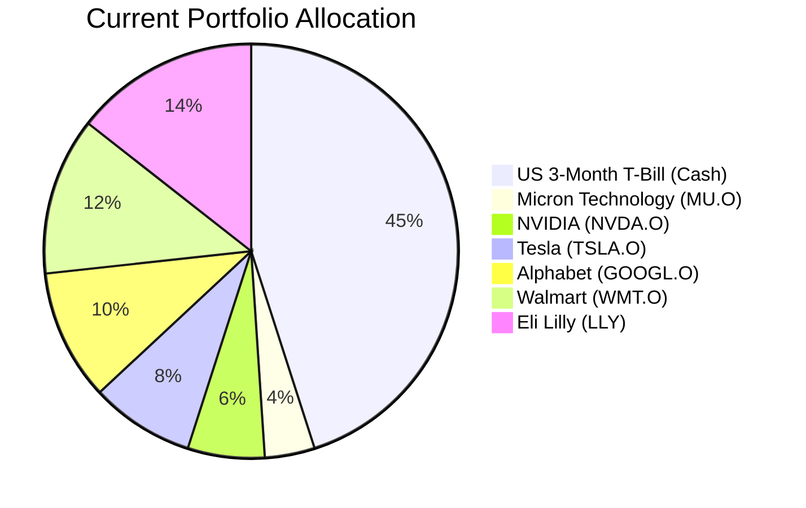
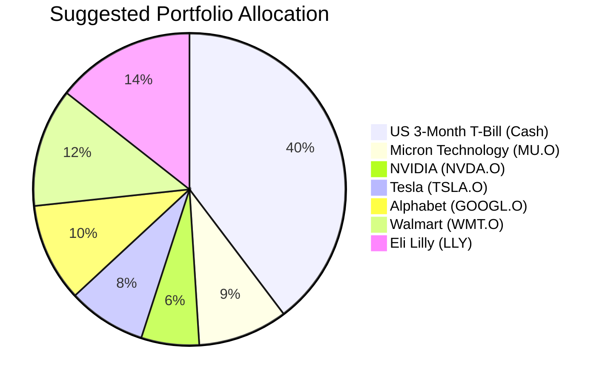

Client Product-Fit Analysis: David Kim
=====================================

# Executive Summary

We recommend investing USD 50,000 from the client's significant cash reserves into Micron Technology Inc. (MU.O). This action directly addresses the portfolio's primary weakness—a high 45% cash allocation—by deploying capital into a high-growth sector aligned with the client's long-term, aggressive growth objective. The expected outcome is a meaningful improvement in the portfolio's long-term return potential while maintaining an acceptable level of risk for a young investor with a 25+ year horizon.

# Recommended Product: Micron Technology Inc. (MU.O)

## Product Specifications
*   **Symbol:** MU.O
*   **Asset Class:** Equities
*   **Region:** North America
*   **Currency:** USD
*   **Current Price (as of 2026-03-27):** USD 355.46
*   **Risk Rating:** 3 (Medium)
*   **Liquidity:** T+2

## Performance Metrics
*   **YTD Return:** +12.69%
*   **1-Year Return:** +287.09%
*   **5-Year Return:** +288.60%
*   **Contrast with Cash (US3MT=RR):** The suggested product offers significantly higher historical returns, consistent with its growth profile, compared to the near-zero nominal return of the client's current cash position, which carries an opportunity cost in an inflationary environment.

## Risk Characteristics
*   **Volatility:** High. As a semiconductor stock, MU.O is subject to cyclical industry dynamics, technological shifts, and broad market sentiment.
*   **Credit Risk:** N/A (Equity).
*   **Liquidity Risk:** Low. The stock is exchange-traded with daily liquidity.
*   **Concentration Risk:** The investment adds to an existing single-stock position, increasing sector and single-security exposure within the tech segment.

## Detailed Justification
The recommendation for Micron Technology Inc. (MU.O) scores a **Product-Fit Score of 4/5** based on the following alignment with Client David Kim's profile:

1.  **Matches Primary Financial Need (Growth / Retirement Accumulation):** The client's inferred need is aggressive long-term growth (Target Return: 5, Certainty: 1). MU.O, operating in the high-growth semiconductor sector, is positioned to capture significant upside, aligning perfectly with this objective.
2.  **Addresses Portfolio Hygiene Issue:** The client's portfolio holds 45% in cash (US 3-Month T-Bills), representing a substantial drag on long-term returns. Deploying a portion (USD 50,000) into a growth asset corrects this strategic imbalance.
3.  **Appropriate Risk Tolerance Alignment:** The product's Risk Rating of 3 is suitable for a client with a long time horizon (25+ years) who can tolerate high volatility (Certainty score of 1) for higher potential returns.
4.  **Builds on Existing Understanding:** The client already holds a position in MU.O, suggesting familiarity with the company and sector, which may increase comfort with the increased allocation.

# Suggested Portfolio

The following charts illustrate the shift from a cash-heavy portfolio to one with enhanced growth exposure.

| Asset | Current Market Value (USD) | Suggested Market Value (USD) | Current % | Suggested % | Change | Remark |
| :--- | :---: | :---: | :---: | :---: | :---: | :--- |
| US 3-Month Treasury Bill (US3MT=RR) | 427,500 | 377,500 | 45.0% | 39.7% | -5.3% | Reduce oversized cash position to fund growth. |
| Micron Technology Inc. (MU.O) | 36,905 | 86,905 | 3.9% | 9.1% | +5.2% | Increase allocation to high-growth semiconductor stock. |
| NVIDIA Corporation (NVDA.O) | 56,976 | 56,976 | 6.0% | 6.0% | 0.0% | Maintain holding. |
| Tesla Inc. (TSLA.O) | 77,048 | 77,048 | 8.1% | 8.1% | 0.0% | Maintain holding. |
| Alphabet Inc. (GOOGL.O) | 97,119 | 97,119 | 10.2% | 10.2% | 0.0% | Maintain holding. |
| Walmart Inc. (WMT.O) | 117,190 | 117,190 | 12.3% | 12.3% | 0.0% | Maintain holding. |
| Eli Lilly and Company (LLY) | 137,261 | 137,261 | 14.4% | 14.4% | 0.0% | Maintain holding. |
| **Total** | **950,000** | **950,000** | **100.0%** | **100.0%** | **0.0%** | |

**Execution:** Buy approximately 141 additional shares of MU.O at USD 355.46, costing ~USD 50,000, funded by selling down the US3MT=RR cash position.

## Pros and cons of suggested portfolio

**Pros:**
*   **Enhanced Growth Potential:** Significantly improves the portfolio's expected long-term return by reducing low-yielding cash and increasing exposure to a cyclical growth stock.
*   **Alignment with Long Horizon:** The client's 25+ year time horizon justifies taking on the volatility associated with MU.O to capture the semiconductor cycle's upside.
*   **Efficient Capital Deployment:** Addresses the identified portfolio weakness (excess cash) with a targeted, high-conviction action.

**Cons:**
*   **Increased Single-Stock & Sector Concentration:** The portfolio remains heavily concentrated in US equities (100%) and within that, the tech/consumer discretionary sector. MU.O now represents a larger single-stock risk.
*   **Higher Short-Term Volatility:** The portfolio's value will be more sensitive to market downturns and semiconductor industry corrections, as seen in the Downside Scenario.
*   **Execution Risk:** Timing the entry into a cyclical stock like Micron carries risk; the investment may underperform if the memory cycle peaks.

## Alternative suggested product to consider

1.  **Invesco QQQ Trust (QQQ):** An ETF tracking the NASDAQ-100 Index. This would provide diversified exposure to the same high-growth tech sector as MU.O but mitigate single-stock risk. It aligns with the growth objective (Return: 5) while offering slightly more stability (Risk Rating: 3).
2.  **SPDR S&P 500 ETF Trust (SPY):** A broader US equity market ETF. This would reduce sector concentration while still capturing US growth, aligning with a long-term horizon. It has a higher Risk Rating (4), reflecting broader market volatility, but offers greater diversification.

# Scenario Analysis

## Normal Market Condition
*   **Assumption:** Steady economic growth with moderate interest rates. Semiconductor demand follows its typical cyclical pattern.
*   **Projected MU.O Return:** +15% p.a. (Based on 5-year historical CAGR of ~31%, moderated for a more mature cycle phase).
*   **Projected Cash Return:** +4% p.a. (Based on current yield environment and 5-year average for short-term treasuries).
*   **Probability:** 50%

| Product | % Return | Suggested Holding (USD) | Projected Return (USD) | Current Holding (USD) | Projected Return (USD) |
| :--- | :---: | :---: | :---: | :---: | :---: |
| US3MT=RR (Cash) | 4.0% | 377,500 | 15,100 | 427,500 | 17,100 |
| MU.O | 15.0% | 86,905 | 13,036 | 36,905 | 5,536 |
| Other Equities (Avg.) | 10.0% | 485,595 | 48,560 | 485,595 | 48,560 |
| **Total** | **8.06%** | **950,000** | **76,696** | **950,000** | **71,196** |

*   **Annual return of suggested vs current:** 8.06% vs 7.49%
*   **Incremental Benefit:** +USD 5,500 annually (+7.7% improvement).

## Good Market Condition (Upside)
*   **Assumption:** Accelerated tech adoption, strong memory pricing, and a "soft landing" for the economy.
*   **Projected MU.O Return:** +40% p.a. (Consistent with strong upswings in the semiconductor cycle).
*   **Projected Cash Return:** +4% p.a.
*   **Probability:** 25%

| Product | % Return | Suggested Holding (USD) | Projected Return (USD) | Current Holding (USD) | Projected Return (USD) |
| :--- | :---: | :---: | :---: | :---: | :---: |
| US3MT=RR (Cash) | 4.0% | 377,500 | 15,100 | 427,500 | 17,100 |
| MU.O | 40.0% | 86,905 | 34,762 | 36,905 | 14,762 |
| Other Equities (Avg.) | 20.0% | 485,595 | 97,119 | 485,595 | 97,119 |
| **Total** | **15.47%** | **950,000** | **146,981** | **950,000** | **128,981** |

*   **Annual return of suggested vs current:** 15.47% vs 13.58%
*   **Incremental Benefit:** +USD 18,000 annually (+13.9% improvement).

## Bad Market Condition (Downside)
*   **Assumption:** Severe economic downturn, collapse in electronics demand similar to the 2008-2009 or 2022 periods.
*   **Projected MU.O Return:** -35% p.a. (Based on peak-to-trough declines in past semiconductor downturns).
*   **Projected Cash Return:** +4% p.a. (Flight to safety supports short-term rates).
*   **Probability:** 25%

| Product | % Return | Suggested Holding (USD) | Projected Return (USD) | Current Holding (USD) | Projected Return (USD) |
| :--- | :---: | :---: | :---: | :---: | :---: |
| US3MT=RR (Cash) | 4.0% | 377,500 | 15,100 | 427,500 | 17,100 |
| MU.O | -35.0% | 86,905 | -30,417 | 36,905 | -12,917 |
| Other Equities (Avg.) | -25.0% | 485,595 | -121,399 | 485,595 | -121,399 |
| **Total** | **-14.39%** | **950,000** | **-136,716** | **950,000** | **-117,216** |

*   **Annual return of suggested vs current:** -14.39% vs -12.34%
*   **Incremental Drawdown:** -USD 19,500 annually (Increased loss of 16.6%).

# Risk Disclosure
*   Past performance does not guarantee future returns.
*   Projected returns are estimates, not promises.
*   Investing in equities, including Micron Technology Inc., carries the risk of principal loss.

# References
*   **Client Profile:** 8_profile.md (Source: Planbot Internal Data)
*   **Client Holdings:** 8_holdings.csv (Source: Planbot Internal Data)
*   **Product Catalog:** demo-market-quotes.csv (Source: Planbot Internal Data)
*   **Web References:** N/A
