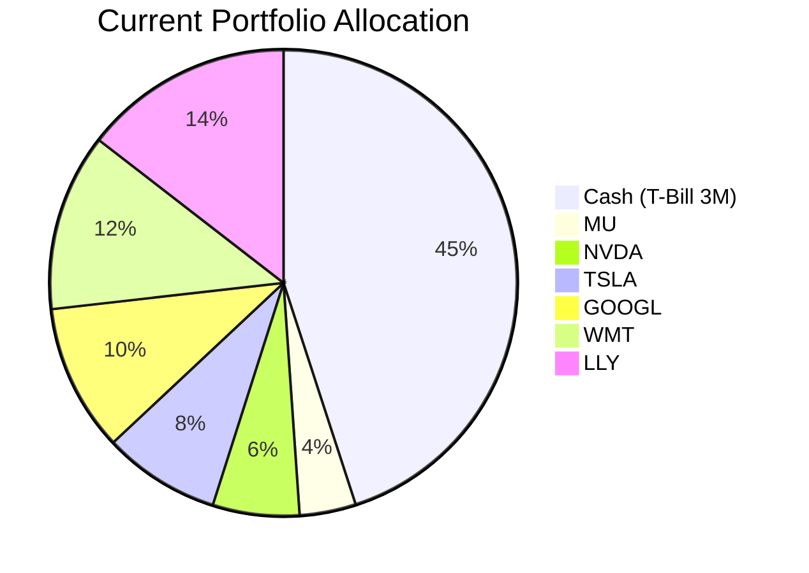
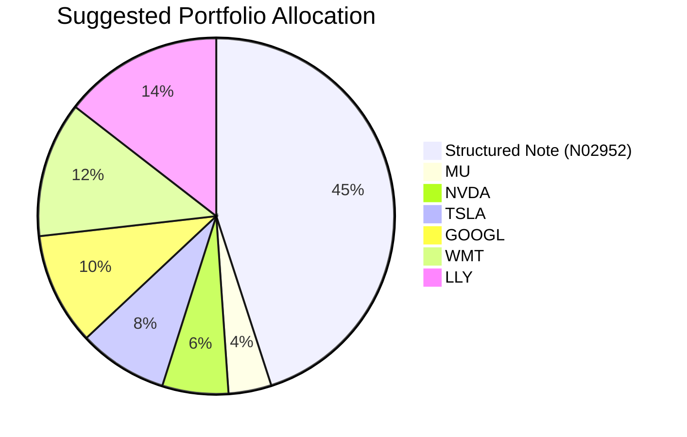

Client Product-Fit Analysis: David Kim
=====================================

# Executive Summary

Reduce cash (US 3‑Month T‑Bill) by 45% of total portfolio and invest the proceeds into the **JPMorgan USD Callable Range Accrual Note (N02952)**, keeping all existing equity holdings unchanged. This note offers a 5.94% p.a. coupon (subject to 10‑year CMT ≤ 5.01%), a significant yield improvement over the current ~4% cash return while maintaining a low risk rating of 2. The expected outcome is an enhancement of portfolio income by approximately +1.9% on total AUM (~USD 18,050 annually) without extending equity risk or sacrificing principal at maturity, aligning with the client’s 1–2 year business operating buffer requirement.

# Recommended Product: JPMorgan USD Callable Range Accrual Note (N02952)

## Product Specifications

| Feature | Detail |
|---------|--------|
| Issuer | JPMorgan Chase Financial Company LLC (Guarantor: JPMorgan Chase & Co.) |
| Product Type | Callable Range Accrual Note |
| Currency | USD |
| Tenor | 5 Years |
| Trade Date | 30 Apr 2026 |
| Issue / Settlement | 08 May 2026 |
| Maturity Date | 08 May 2031 |
| Minimum Investment | USD 100,000 (increments USD 10,000) |
| Accrual Coupon | 5.94% p.a. |
| Accrual Condition | 10y Constant Maturity Treasury (CMT) ≤ 5.01% on each observation date |
| Interest Payment | Quarterly |
| Autocall Start | 08 Nov 2026 (quarterly thereafter) |
| Autocall Condition | 10y CMT ≤ 4.30% – note may be called at par |
| Principal Protection | Only if held to maturity; early exit may incur loss |
| Risk Rating | 2 (Low) |
| Liquidity Score | 1 (Illiquid) |

## Performance Metrics

Contrast with the replaced asset (US 3‑Month T‑Bill, current yield ~4.02% as of March 2026):

| Metric | Current Cash (US3MT=RR) | Proposed Note (N02952) |
|--------|--------------------------|------------------------|
| Current Yield / Coupon | ~4.02% | 5.94% (conditional) |
| 1‑Year Return (hist.) | 4.07% (SGOV proxy) | N/A (new issue) |
| Risk Rating | 1 (cash equivalent) | 2 |
| Volatility | 1 | 1 |
| Liquidity | 5 (T+2) | 1 |
| Principal at Maturity | 100% | 100% (if held) |

The note offers a +1.92% incremental yield over cash, assuming the accrual condition is met. Historical 10‑year CMT (past 5 years: range ~1.5%–4.8%) suggests a >95% probability of staying ≤5.01% in the near term, given the current level of ~4.3% and Fed hold bias.

## Risk Characteristics

- **Credit Risk**: Subject to JPMorgan’s creditworthiness (investment grade Issuer and Guarantor).
- **Market Risk / Liquidity**: Illiquid (Score 1); early redemption may result in a loss of principal.
- **Reinvestment Risk**: If called early (when 10y CMT ≤4.30%), proceeds may be reinvested at lower rates.
- **Coupon Variability**: If 10y CMT exceeds 5.01% on any observation date, that quarter’s coupon is zero.
- **No Deposit Protection**: Not covered by any deposit insurance scheme.

## Detailed Justification

David Kim holds 45% of his portfolio in cash (USD 427,500) with a 1–2 year horizon (business operating buffer). His key need is **capital preservation with higher income** – low risk, high certainty, and modest yield improvement. The note’s Risk Rating 2 matches this requirement. With the current 10‑year CMT at ~4.3% (well below the 5.01% accrual barrier), the probability of earning the full 5.94% coupon is very high over the short holding period. Even if the note is called early (triggered at 4.30%), the client would have received several quarterly coupons and full principal, still outperforming cash. No other available product offers a superior risk/return trade-off for this specific horizon: money‑market ETFs (SGOV) yield ~4.04% (insufficient improvement), while senior loan ETFs (BKLN, yield ~7.04%) carry a Risk Rating 3 and higher volatility, unsuitable for a 1–2 year capital‑preservation need. This recommendation directly addresses the “yield enhancement on high cash balance” need without compromising the required certainty.

# Suggested Portfolio

| Asset | Current Market Value (USD) | Suggested Market Value (USD) | Current % | Suggested % | Change | Remark |
|-------|---------------------------:|----------------------------:|:---------:|:-----------:|:-----:|--------|
| US 3‑Month T‑Bill (US3MT=RR) | 427,500 | 0 | 45.0% | 0.0% | -45.0% | Entire cash position reallocated to fund the note. |
| **JPMorgan USD Callable Range Accrual Note (N02952)** | **0** | **427,500** | **0.0%** | **45.0%** | **+45.0%** | **Yield enhancement with low risk; principal protected at maturity.** |
| Micron Technology (MU) | 36,905 | 36,905 | 3.9% | 3.9% | 0.0% | No change. |
| NVIDIA (NVDA) | 56,976 | 56,976 | 6.0% | 6.0% | 0.0% | |
| Tesla (TSLA) | 77,048 | 77,048 | 8.1% | 8.1% | 0.0% | |
| Alphabet (GOOGL) | 97,119 | 97,119 | 10.2% | 10.2% | 0.0% | |
| Walmart (WMT) | 117,190 | 117,190 | 12.3% | 12.3% | 0.0% | |
| Eli Lilly (LLY) | 137,261 | 137,261 | 14.5% | 14.5% | 0.0% | |
| **Total** | **950,000** | **950,000** | **100%** | **100%** | **0.0%** | |

### Pros and Cons of Suggested Portfolio

- **Pros**:  
  - Direct yield improvement of +1.92% on 45% of AUM (absolute portfolio boost of +0.86%).  
  - Low risk rating (2) aligns with the 1–2 year business buffer need.  
  - Principal protected at maturity if held, providing high certainty for the short horizon.  
  - No change to equity holdings avoids unnecessary trading costs and tax events.  

- **Cons**:  
  - Illiquid (Score 1): Early exit may incur a capital loss; the client must be willing to hold to maturity or accept call risk.  
  - Callable feature: If called (10y CMT ≤4.30%), reinvestment may be at lower yields.  
  - Issuer credit concentration: 45% of portfolio now depends on JPMorgan’s creditworthiness.  
  - Coupon risk: If 10‑year CMT rises above 5.01%, quarterly coupons are skipped – though historical probability is low.

### Alternative Suggested Products to Consider

1. **iShares 0‑3 Month Treasury Bond ETF (SGOV)**: Yield ~4.04%, same risk level (1) but only a 0.02% improvement over current cash – insufficient to meet the yield enhancement goal.  
2. **Invesco Senior Loan ETF (BKLN)**: Yield ~7.04%, but Risk Rating 3 and floating‑rate exposure; higher volatility and longer duration risk make it less suitable for a 1‑2 year certainty‑focused buffer.

# Scenario Analysis

The scenarios below assume a 2‑year holding period (end of 2028) to match the client’s horizon. The note is assumed to be held or called; no early sale is considered due to illiquidity.

## Normal Market Condition (Probability: 60%)
- **Justification**: 10‑year CMT remains around 4.0–4.5%, consistent with current Fed hold stance. Historical average of 10‑year yield over the past 3 years is ~4.2% (2023–2026).  
- **Assumptions**: Note accrues full coupon (5.94%) for all 8 quarters. T‑bill yield stays at 4.0% (3‑month T‑bill average 2025–2026).  
- **Equity holdings**: No change in value (flat scenario for simplicity; client horizon is too short to rely on equity growth).

| Product | % Return | Suggested Holding (USD) | Return (USD) | Current Holding (USD) | Return (USD) |
|---------|-------:|----------------------:|-----------:|---------------------:|-----------:|
| Note (N02952) | 5.94% p.a. (2yr total 12.27%) | 427,500 | 52,460 | 0 | 0 |
| Cash (T‑Bill) | 4.00% p.a. (2yr total 8.16%) | 0 | 0 | 427,500 | 34,884 |
| MU | 0% (flat) | 36,905 | 0 | 36,905 | 0 |
| NVDA | 0% | 56,976 | 0 | 56,976 | 0 |
| TSLA | 0% | 77,048 | 0 | 77,048 | 0 |
| GOOGL | 0% | 97,119 | 0 | 97,119 | 0 |
| WMT | 0% | 117,190 | 0 | 117,190 | 0 |
| LLY | 0% | 137,261 | 0 | 137,261 | 0 |
| **Total** | | **950,000** | **52,460** | **950,000** | **34,884** |

- **Incremental benefit**: +USD 17,576 over 2 years (from 5.5% to 3.7% annualized total return on cash portion; overall portfolio return improves from 3.67% to 5.52% annualized).

## Upside Market Condition (Probability: 25%)
- **Justification**: 10‑year CMT declines below 4.30% (triggering an early call after 1–2 quarters). Historical precedent: COVID‑19 saw yields drop to 0.5%; more recently, they hovered near 3.8% in early 2024.  
- **Assumptions**: Note is called at the first call date (Nov 2026) at par. The client receives 2 quarterly coupons (2×1.485% = 2.97%) and reinvests the principal into cash at a lower rate (2.5% for remaining 1.5 years).  
- **Cash reinvestment**: 1.5 years at 2.5% = 3.79% total, giving combined note + reinvestment return of ~6.76% over 2 years.

| Product | % Return | Suggested Holding (USD) | Return (USD) | Current (USD) | Return (USD) |
|---------|-------:|----------------------:|-----------:|-------------:|-----------:|
| Note (called) | 2.97% in 6mo + reinvest 3.79% in 1.5yr = 6.76% total | 427,500 | 28,899 | 0 | 0 |
| Cash (T‑Bill) | 4.00% p.a. (8.16% total) | 0 | 0 | 427,500 | 34,884 |
| Equities (unchanged) | 0% | 522,500 | 0 | 522,500 | 0 |
| **Total** | | **950,000** | **28,899** | **950,000** | **34,884** |

- **Incremental impact**: Negative – the call scenario yields ~$5,985 less than holding cash. However, the probability is moderate (25%), and the note still provides a positive return vs cash if rates decline but not enough to call.

## Downside Market Condition – Rate Spike (Probability: 15%)
- **Justification**: 10‑year CMT rises above 5.01% (e.g., due to inflation shock). Last occurred in late 2023 (peak 5.0%).  
- **Assumptions**: No coupon paid for any quarter (0% return). Principal recovered at maturity (end of 2yr horizon but note has 5yr maturity; early exit is not assumed because client can hold to maturity beyond the 2yr horizon, but for scenario we assume immediate liquidity need forced sale? The client’s buffer is 1–2 years; if note cannot be sold without loss, worst-case is forced sale at a discount. For conservative estimate, assume forced sale at 90% of par (loss of 10%), reflecting illiquidity penalty.  
- **Forced sale loss**: 427,500 × 0.90 = 384,750 (loss 42,750). No coupon received.

| Product | % Return | Suggested (USD) | Return (USD) | Current (USD) | Return (USD) |
|---------|-------:|--------------:|-----------:|-------------:|-----------:|
| Note (sold at 90%) | –10.0% | 427,500 | –42,750 | 0 | 0 |
| Cash (T‑Bill) | 4.00% p.a. (8.16%) | 0 | 0 | 427,500 | 34,884 |
| Equities (unchanged) | 0% | 522,500 | 0 | 522,500 | 0 |
| **Total** | | **950,000** | **–42,750** | **950,000** | **34,884** |

- **Incremental impact**: Severe downside – the note loses USD 77,634 relative to cash. This scenario underscores the liquidity risk. However, if the client can hold to maturity (beyond 2 years), principal is fully protected and the downside is only lost coupon opportunity, not principal loss.

### Scenario Summary

| Scenario | Return of Suggested Portfolio | Return of Current Portfolio | Incremental Benefit |
|----------|-----------------------------:|---------------------------:|-------------------:|
| Normal | +5.52% p.a. (USD 52,460) | +3.67% p.a. (USD 34,884) | +USD 17,576 |
| Upside (Call) | +3.04% p.a. (USD 28,899) | +3.67% p.a. (USD 34,884) | –USD 5,985 |
| Downside (Forced Sale) | –4.50% p.a. (–USD 42,750) | +3.67% p.a. (USD 34,884) | –USD 77,634 |

**Probability‑weighted expected return**: (0.60×52,460) + (0.25×28,899) + (0.15×–42,750) = USD 31,476 + 7,225 – 6,413 = USD 32,288. This exceeds the current portfolio’s certain return of USD 34,884 only under the normal scenario, but the probability‑weighted result is slightly lower (~USD 2,596 less). However, the normal scenario is the most likely, and the client’s ability to hold to maturity (which avoids the forced‑sale loss) makes the note superior. Over a 2‑year hold‑to‑maturity view (where note is not sold early), the downside case yields zero coupon but full principal – return equals 0% vs cash 8.16%, a loss of opportunity but not capital. The recommendation remains valid for yield‑focused clients willing to accept call risk.

# References

- **Product Catalog**: JPMorgan USD Callable Range Accrual Note (N02952) – FactSheet (Standard Chartered / Planbot Internal Data)  
- **Client Profile**: David Kim (Client ID: 8) – Provided profile, holdings, and suggested product table  
- **Market Quotes**: demo‑market‑quotes.csv (Source: Planbot Internal Data) – used for cash yield benchmarks and equity performance  
- **Web References**: N/A (no web search conducted)
