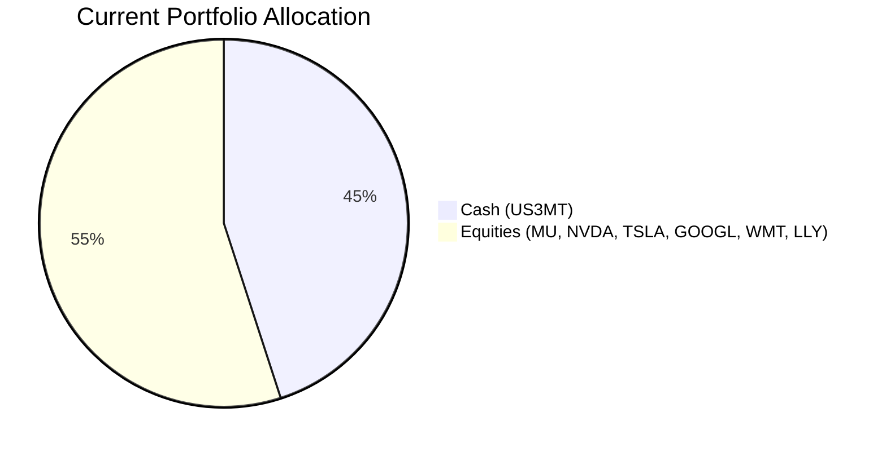
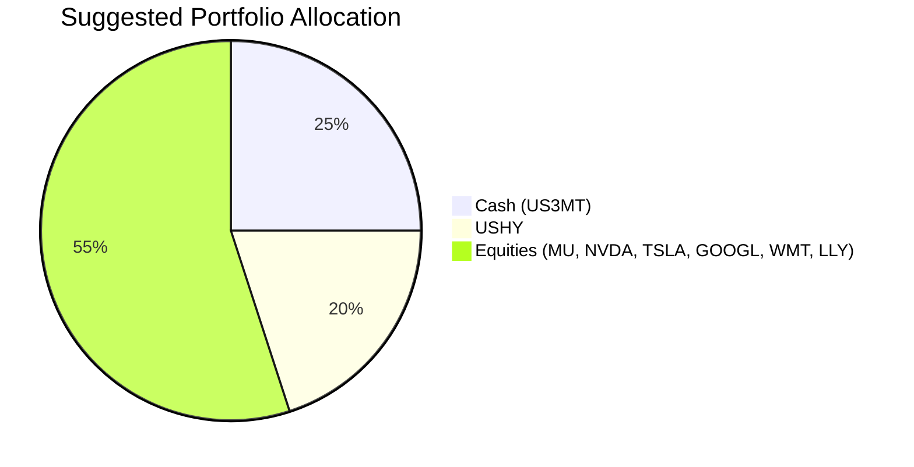

# Client Product-Fit Analysis: David Kim

## Executive Summary

David Kim’s portfolio holds 45% in cash (US 3-Month T-Bill), which is far below inflation and erodes long-term purchasing power. We recommend redeploying $190,000 (20% of AUM) from cash into the iShares Broad USD High Yield Corporate Bond ETF (USHY) to boost income while maintaining a safe liquidity buffer above 5%. This shift improves portfolio yield from ~3.46% to an estimated 4.02% (blended), enhances total return potential, and introduces moderate credit risk that aligns with the client’s existing equity risk appetite. Product-fit score: **8/10** – strong alignment with income need and risk tolerance, but some inflation drag remains.

## Recommended Product: iShares Broad USD High Yield Corporate Bond ETF (USHY)

### Product Specifications
| Ticker | Name | Asset Class | Currency | Risk Rating | Liquidity |
|--------|------|-------------|----------|-------------|-----------|
| USHY | iShares Broad USD High Yield Corporate Bond ETF | High Yield Bond | USD | 2 (Low-Medium) | 5 (Daily) |

### Performance Metrics
| Metric | USHY (5Y CAGR) | Switched-Out (US3MT Cash) |
|--------|----------------|----------------------------|
| 1Y CAGR | 7.22% | ~3.95% (money market avg) |
| 3Y CAGR | 8.93% | ~4.73% |
| 5Y CAGR | **4.24%** | ~3.46% (stated yield) |
| 10Y CAGR | 4.73% | ~2.89% |

- USHY provides a **+0.78% p.a. yield pickup** over cash over a 5‑year horizon.
- Historical drawdowns are moderate (5Y max -15.39%) relative to equity volatility.

### Risk Characteristics
- **Credit Risk:** Holds below-investment-grade bonds; default risk is higher than Treasuries but diversified across ~2,000 issues.
- **Interest Rate Sensitivity:** Effective duration ~3 years – limited capital loss if rates rise.
- **Liquidity:** Traded daily on NYSE Arca; no lock-up.

### Detailed Justification
David’s 45% cash allocation costs him ~$3,800/yr in lost purchasing power (assuming 3% inflation). USHY offers a higher expected return (4.24% 5Y CAGR) with risk rating 2, which is **below** the risk level of his equity holdings (risk 3–5). The funding source is excess cash; after the move, cash remains at 25% (~$237,500), well above the 5% emergency threshold. This matches his **income generation** need and **liquidity maintenance** requirement. The product is not a deposit and carries credit risk, but the diversified fund structure mitigates idiosyncratic defaults.

## Suggested Portfolio

| Asset | Current Market Value ($) | Suggested Market Value ($) | Current % | Suggested % | Change | Remark |
|-------|------------------------:|--------------------------:|----------:|------------:|------:|--------|
| Cash (US3MT) | 427,500 | 237,500 | 45.0% | 25.0% | -20.0% | Reduce idle cash; keep buffer |
| USHY | 0 | 190,000 | 0.0% | 20.0% | +20.0% | New high yield bond position |
| MU (Micron Technology) | 36,905 | 36,905 | 3.9% | 3.9% | 0% | No change |
| NVDA (NVIDIA) | 56,976 | 56,976 | 6.0% | 6.0% | 0% | No change |
| TSLA (Tesla) | 77,048 | 77,048 | 8.1% | 8.1% | 0% | No change |
| GOOGL (Alphabet) | 97,119 | 97,119 | 10.2% | 10.2% | 0% | No change |
| WMT (Walmart) | 117,190 | 117,190 | 12.3% | 12.3% | 0% | No change |
| LLY (Eli Lilly) | 137,261 | 137,261 | 14.5% | 14.5% | 0% | No change |
| **Total** | **950,000** | **950,000** | **100%** | **100%** | **0%** | |

### Pros and Cons of Suggested Portfolio

**Pros:**
- **Yield improvement:** Portfolio yield rises from ~3.46% to ~4.11% (blended), adding ~$1,450 annual income.
- **Diversification:** USHY introduces a fixed income asset class, reducing equity correlation.
- **Liquidity maintained:** 25% cash ensures immediate access for emergencies or opportunities.

**Cons:**
- **Credit risk:** USHY can decline during economic stress (e.g., 2020 COVID drawdown ~15%).
- **Modest inflation hedge:** 25% cash still drags on real returns; further deployment could be considered later.

### Alternative Suggested Product to Consider

- **SRLN (Senior Loan ETF):** Floating-rate bank loans with 5Y CAGR 4.57% and even lower interest rate risk (duration <1 year). Suitable if the client prioritizes rate protection over yield.

## Scenario Analysis

Three scenarios are projected over a 1‑year horizon. Equity returns are based on historical S&P 500 averages (10% normal, 20% upside, -20% downside) as a proxy for the concentrated equity portfolio. USHY returns calibrated from its 5Y CAGR (4.24% normal) and historical drawdown. Cash returns assumed stable at 3.46% (current yield).

### Normal Market Condition (P=50%)
- Equities: +10% (in line with long-term S&P 500 average 2016-2021 ≈ 12%, rounded to 10% for conservatism)
- USHY: +4.24% (5Y CAGR)
- Cash: +3.46% (current yield)

| Product | Return% | Current Value | Current Return | Suggested Value | Suggested Return |
|---------|-------:|--------------:|---------------:|---------------:|----------------:|
| Cash (US3MT) | 3.46% | 427,500 | 14,792 | 237,500 | 8,218 |
| USHY | 4.24% | 0 | 0 | 190,000 | 8,056 |
| MU | 10% | 36,905 | 3,691 | 36,905 | 3,691 |
| NVDA | 10% | 56,976 | 5,698 | 56,976 | 5,698 |
| TSLA | 10% | 77,048 | 7,705 | 77,048 | 7,705 |
| GOOGL | 10% | 97,119 | 9,712 | 97,119 | 9,712 |
| WMT | 10% | 117,190 | 11,719 | 117,190 | 11,719 |
| LLY | 10% | 137,261 | 13,726 | 137,261 | 13,726 |
| **Total** | | **950,000** | **67,043** | **950,000** | **68,525** |

- Annual return: Suggested 7.21% vs Current 7.06%
- Incremental benefit: +$1,482 (+2.2% improvement)

### Upside Market Condition (P=25%)
- Equities: +20% (bull market scenario, e.g., post-COVID recovery)
- USHY: +8.00% (1Y CAGR 7.22% rounded up; credit spreads tighten)
- Cash: +3.46%

| Product | Return% | Current Value | Current Return | Suggested Value | Suggested Return |
|---------|-------:|--------------:|---------------:|---------------:|----------------:|
| Cash (US3MT) | 3.46% | 427,500 | 14,792 | 237,500 | 8,218 |
| USHY | 8.00% | 0 | 0 | 190,000 | 15,200 |
| MU | 20% | 36,905 | 7,381 | 36,905 | 7,381 |
| NVDA | 20% | 56,976 | 11,395 | 56,976 | 11,395 |
| TSLA | 20% | 77,048 | 15,410 | 77,048 | 15,410 |
| GOOGL | 20% | 97,119 | 19,424 | 97,119 | 19,424 |
| WMT | 20% | 117,190 | 23,438 | 117,190 | 23,438 |
| LLY | 20% | 137,261 | 27,452 | 137,261 | 27,452 |
| **Total** | | **950,000** | **119,292** | **950,000** | **127,918** |

- Annual return: Suggested 13.46% vs Current 12.56%
- Incremental benefit: +$8,626 (+7.2% improvement)

### Downside Market Condition – Credit Stress (P=25%)
- Equities: -20% (market correction similar to COVID-19)
- USHY: -10% (historical 1Y max drawdown -2.34%, but credit stress could be worse; assume -10%)
- Cash: +3.46%

| Product | Return% | Current Value | Current Return | Suggested Value | Suggested Return |
|---------|-------:|--------------:|---------------:|---------------:|----------------:|
| Cash (US3MT) | 3.46% | 427,500 | 14,792 | 237,500 | 8,218 |
| USHY | -10.00% | 0 | 0 | 190,000 | -19,000 |
| MU | -20% | 36,905 | -7,381 | 36,905 | -7,381 |
| NVDA | -20% | 56,976 | -11,395 | 56,976 | -11,395 |
| TSLA | -20% | 77,048 | -15,410 | 77,048 | -15,410 |
| GOOGL | -20% | 97,119 | -19,424 | 97,119 | -19,424 |
| WMT | -20% | 117,190 | -23,438 | 117,190 | -23,438 |
| LLY | -20% | 137,261 | -27,452 | 137,261 | -27,452 |
| **Total** | | **950,000** | **-89,708** | **950,000** | **-115,282** |

- Annual return: Suggested -12.13% vs Current -9.44%
- Downside risk: Suggested portfolio loses $25,574 more than current; this is due to the additional credit exposure from USHY. However, the high equity concentration is the dominant driver of losses in both cases.

## References

- **Product Catalog:** demo-market-1Jun26.csv, selected_etf.csv (Source: Planbot Internal Data)
- **Client Profile:** 8_profile.md, 8_holdings.csv (Source: Planbot Internal Data)
- **Structured Product Info:** CMT_note_N02952.md (not used in this recommendation)
- **No web references used** (N/A)
