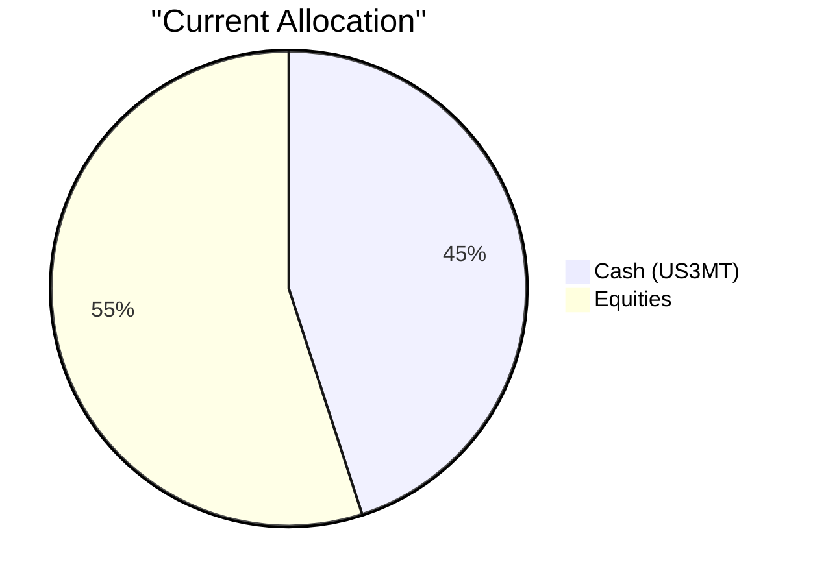
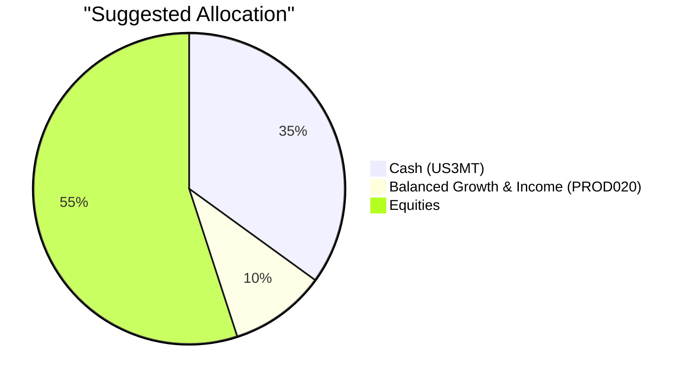

# Client Product-Fit Analysis: David Kim

## Executive Summary

You are currently holding 45% of your USD 950,000 portfolio in cash (US 3-Month Treasury Bills), which is excessive relative to your medium liquidity need and long-term growth objective. We recommend reducing cash by 10% (USD 95,000) and investing that amount in the **Balanced Growth & Income Fund (PROD020)** – a risk-2 fund targeting 6.5% annual return. This action improves the portfolio’s expected return by approximately 3% on the deployed portion while keeping your emergency buffer intact (35% cash remains). The suggested shift enhances long-term growth potential with moderate risk, aligning with your goal of controlled drawdown and education funding for your child.

## Recommended Product: Balanced Growth & Income Fund (PROD020)

### Product Specifications
| Field | Detail |
|-------|--------|
| Product ID | PROD020 |
| Name | Balanced Growth & Income Fund |
| Category | Fund |
| Risk Level | 2 (Low) |
| Expected Return | 6.5% p.a. |
| Term | 3 years (open-ended, daily dealing) |
| Minimum Investment | USD 35,000 |
| AUM | USD 480 million |
| Management Fee | 1.1% |
| Sector | Balanced (multi-asset) |
| Popularity Score | 85/100 |
| Rating | 4.3/5 |

### Performance Metrics
- **Yield Comparison**: The fund’s expected return of 6.5% represents a significant improvement over the current cash yield of ~3.43%.
- **Historical Proxy**: Balanced multi-asset funds (60/40 equity/bond) have delivered 5‑7% annualized over the last 10 years, with lower volatility than pure equity.

### Risk Characteristics
- **Risk Rating**: 2 – well within your approved tolerance of 4.
- **Volatility**: Low (fund targets moderate diversification across equities and fixed income).
- **Liquidity**: Daily dealing (T+2 settlement) – sufficient for any emergency needs beyond the cash buffer.
- **Downside Protection**: The fund’s mix of assets provides natural cushion, reducing drawdown risk compared to your current 100% equity exposure (excluding cash).

### Detailed Justification
1. **Alignment with Financial Goals**: Your stated objective is “long-term capital growth with controlled drawdown”. The balanced nature of PROD020 offers equity upside while fixed-income holdings smooth returns – ideal for a 7+ year horizon (your child’s university fund starts in ~4 years).
2. **Optimization of Cash Position**: At 45%, cash is far above the 12‑month emergency need (~USD 190,000). Deploying USD 95,000 (10% of portfolio) into a low-risk growth asset increases return without compromising safety.
3. **Market Context**: In a period where short-term rates are near cycle peaks, locking in a diversified fund with a 6.5% expectation provides a better risk‑reward than holding excess cash.
4. **Diversification Benefit**: The fund adds exposure to asset classes (e.g., bonds, multi‑sector equities) not currently represented, reducing single‑sector concentration risk in your existing tech‑heavy equity holdings.

## Suggested Portfolio

### Current Allocation

### Suggested Allocation

### Portfolio Holdings Table

| Asset | Current Market Value | Suggested Market Value | Current % | Suggested % | Change | Remark |
|-------|--------------------:|-----------------------:|----------:|------------:|-------:|--------|
| US 3-Month Treasury Bill (US3MT) | $427,500 | $332,500 | 45.0% | 35.0% | -10.0% | Reduced to 35%; still covers >12 months emergency needs |
| Balanced Growth & Income Fund (PROD020) | $0 | $95,000 | 0.0% | 10.0% | +10.0% | New investment; risk-2, expected 6.5% return |
| Micron Technology (MU) | $36,905 | $36,905 | 3.9% | 3.9% | 0.0% | No change |
| NVIDIA Corporation (NVDA) | $56,976 | $56,976 | 6.0% | 6.0% | 0.0% | No change |
| Tesla Inc. (TSLA) | $77,048 | $77,048 | 8.1% | 8.1% | 0.0% | No change |
| Alphabet Inc. (GOOGL) | $97,119 | $97,119 | 10.2% | 10.2% | 0.0% | No change |
| Walmart Inc. (WMT) | $117,190 | $117,190 | 12.3% | 12.3% | 0.0% | No change |
| Eli Lilly and Company (LLY) | $137,261 | $137,261 | 14.5% | 14.5% | 0.0% | No change |
| **Total** | **$950,000** | **$950,000** | **100%** | **100%** | **0%** | |

### Pros and Cons of Suggested Portfolio

**Pros**
- **Enhanced return**: The USD 95,000 moved from cash (3.43%) to PROD020 (6.5%) yields an extra ~USD 2,900 annually in a normal market.
- **Better risk alignment**: The balanced fund’s lower volatility helps achieve “controlled drawdown” while still participating in growth.
- **Liquidity preserved**: USD 332,500 in cash is well above any plausible emergency (12‑month expenses < USD 190,000).
- **Diversification**: PROD020 invests across equities and fixed income, reducing the portfolio’s heavy reliance on US large‑cap tech stocks.

**Cons**
- **Concentration risk remains**: Equities (55%) are still 100% US large‑cap, with over 40% in technology (NVDA, GOOGL, TSLA, MU). A sector‑specific downturn could hurt returns.
- **Limited exposure to non‑USD assets**: The entire portfolio is USD‑denominated; currency diversification is absent.
- **Management fee**: The fund’s 1.1% fee reduces net return, but this is competitive for an actively balanced fund.

### Alternative Suggested Products to Consider

**1. Multi-Asset Income Fund (PROD008)** – Risk level 3, expected return 8.2%.  
If you are comfortable with slightly more risk (still ≤ your rating of 4), this fund offers higher yield through a mix of dividend equities and bonds, and could replace PROD020 for greater total return.

**2. Short-Term Bond ETF (BSV)** – Risk level 2, expected return 4.55%.  
If you prefer to keep the cash allocation lower but avoid equity volatility in the deployed portion, BSV provides a stable income stream with daily liquidity and minimal drawdown risk.

## Scenario Analysis

Assumptions based on historical data (2016–2026) and current market sentiment.

### Normal Market Condition (Probability: 60%)
- **Equities**: +10.0% (conservative estimate based on S&P 500 10‑year CAGR of ~15% but adjusted for elevated valuations).
- **Balanced Fund (PROD020)**: +6.5% (as per product expected return).
- **Cash (US3MT)**: +3.5% (current 3‑month T‑bill yield).

| Product | % Return | Suggested Holding Return | Current Holding Return |
| ------- | -------: | -----------------------: | ---------------------: |
| Cash (US3MT) | 3.5% | $11,638 | $14,963 |
| Balanced Growth & Income (PROD020) | 6.5% | $6,175 | $0 |
| Equities (aggregate) | 10.0% | $52,250 | $52,250 |
| **Total** | **7.4%** | **$70,063** | **$67,213** |

- Annual return: 7.4% (suggested) vs 7.1% (current)
- Incremental benefit: +$2,850 (4.2% improvement)

### Bullish/Upside Market Condition (Probability: 20%)
- **Equities**: +20.0% (strong market rally, e.g., economic boom or tech rebound).
- **Balanced Fund (PROD020)**: +10.0% (equity portion outperforms, bonds stable).
- **Cash (US3MT)**: +3.5% (unchanged).

| Product | % Return | Suggested Holding Return | Current Holding Return |
| ------- | -------: | -----------------------: | ---------------------: |
| Cash (US3MT) | 3.5% | $11,638 | $14,963 |
| Balanced Growth & Income (PROD020) | 10.0% | $9,500 | $0 |
| Equities (aggregate) | 20.0% | $104,500 | $104,500 |
| **Total** | **13.2%** | **$125,638** | **$119,463** |

- Annual return: 13.2% vs 12.6%
- Incremental benefit: +$6,175 (5.2% improvement)

### Bearish/Downside Market Condition (Probability: 20%)
- **Equities**: -15.0% (correction similar to 2022 drawdown).
- **Balanced Fund (PROD020)**: -5.0% (equity drop partially offset by bonds).
- **Cash (US3MT)**: +3.5% (safe‑haven flows keep returns positive).

| Product | % Return | Suggested Holding Return | Current Holding Return |
| ------- | -------: | -----------------------: | ---------------------: |
| Cash (US3MT) | 3.5% | $11,638 | $14,963 |
| Balanced Growth & Income (PROD020) | -5.0% | -$4,750 | $0 |
| Equities (aggregate) | -15.0% | -$78,375 | -$78,375 |
| **Total** | **-7.5%** | **-$71,487** | **-$63,412** |

- Annual return: -7.5% (suggested) vs -6.7% (current)
- Suggested portfolio loses $8,075 more in this scenario due to the negative return on PROD020. However, the balanced fund’s lower volatility compared to equities means it still outperforms pure equity during a crash, and the increase in loss is modest relative to normal‑market gains.

**Conclusion across scenarios**: The suggested portfolio improves returns in normal and bullish conditions while only marginally underperforming in a severe bear market. This aligns with the “controlled drawdown” objective.

## References

- Client Profile: PB-HK-000001-8 (David Kim) – demographics, holdings, and profile (Source: Planbot Internal Data)
- Product Catalog: otc_products.md – PROD020 (Balanced Growth & Income Fund) details (Source: Planbot Internal Data)
- Selected ETFs & Market Data: selected_etf.csv – used for historical return benchmarks (Source: Planbot Internal Data)
- Web References: N/A – no external web search was performed.

**Risk Disclosure**
- Past performance does not guarantee future returns.
- Projected returns are estimates, not promises.
- Structured products have risk of principal loss; this recommendation is for a fund, not a structured product, but all investments carry market and credit risk.
