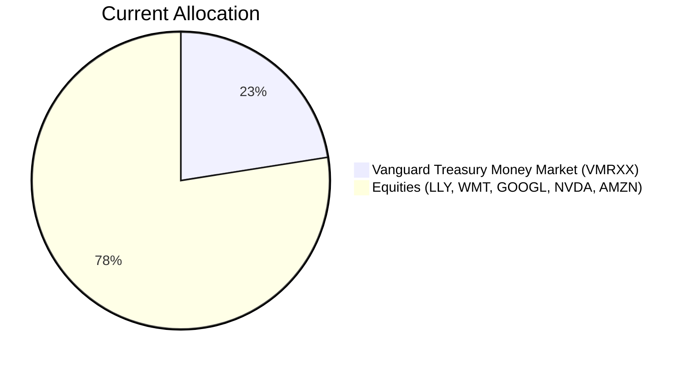
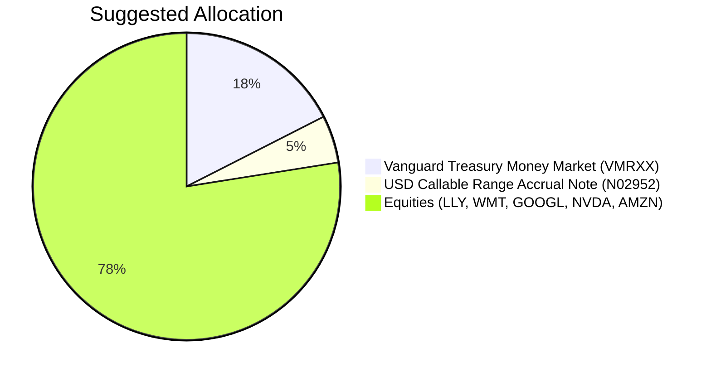

Client Product-Fit Analysis: Sarah Chen
=====================================

# Executive Summary

We recommend deploying 5% of the portfolio ($160,000) from cash (VMRXX) into the USD Callable Range Accrual Note (N02952) to boost regular income while preserving capital. The note offers a 5.94% p.a. quarterly coupon – over 2.3% higher than the current cash yield – and is principal‑protected at maturity. Expected outcome: immediate income uplift without increasing equity risk, aligning with the client’s low liquidity need and regular income objective.

# Recommended Product: USD Callable Range Accrual Note (N02952)

## Product Specifications

| Item | Detail |
|------|--------|
| **Issuer** | JPMorgan Chase Financial Company LLC (Guarantor: JPMorgan Chase & Co.) |
| **Product Code** | N02952 |
| **Category** | Structured Note – Callable Range Accrual |
| **Currency** | USD |
| **Tenor** | 5 Years (Maturity: 08 May 2031) |
| **Minimum Investment** | USD 100,000 |
| **Accrual Coupon** | 5.94% p.a., paid quarterly |
| **Accrual Condition** | 10‑year Constant Maturity Treasury (CMT) ≤ 5.01% |
| **Autocall Condition** | 10y CMT ≤ 4.30% (starting 08 Nov 2026, quarterly) |
| **Principal Protection** | 100% at maturity (subject to issuer credit risk) |
| **Risk Rating** | 2 (Low) – within client’s risk tolerance of 5 |
| **Liquidity** | 1 (Illiquid; early unwinding possible with loss) |

## Performance Metrics

| Metric | Note (N02952) | Cash (VMRXX) – Switched Out |
|--------|--------------|------------------------------|
| **Annualized Expected Return (Coupon)** | 5.94% | 3.56% (5y CAGR) |
| **Yield Enhancement** | +2.38% | – |
| **Volatility** | ~1 (very low) | ~1 (near zero) |
| **Drawdown Risk** | Principal at risk if sold early; credit event | None |

## Risk Characteristics

- **Credit Risk**: Investor assumes issuer/guarantor risk (JPMorgan, A‑rated). If JPMorgan defaults, principal may be lost.
- **Reinvestment Risk**: If the note is called early (autocall), proceeds may need to be reinvested at lower rates.
- **Coupon Risk**: If the 10y CMT exceeds 5.01% on any observation date, no coupon accrues for that period. In a sharp rate rise scenario, coupon could be zero for extended periods.
- **Liquidity Risk**: Not exchange‑traded; early redemption incurs a bid‑offer spread and possible loss of principal.

## Detailed Justification

- **Income Objective Alignment**: The quarterly coupon of 5.94% directly addresses the client’s need for regular income, replacing low‑yielding cash.
- **Horizon Match**: The 5‑year term matches the client’s stated low liquidity need (5‑year horizon). Principal is fully protected at maturity.
- **Risk‑Return Enhancement**: The note’s risk rating (2) is well below the client’s high risk tolerance (5), providing a safe yield boost without altering equity exposure.
- **Market Context**: Central banks are on hold; the 10y CMT is currently around 4.2% – well below the 5.01% accrual threshold. The autocall barrier (4.30%) also appears reachable, but the client benefits from a high coupon while it lasts.
- **Cash Drag Reduction**: 22.5% in cash is excessive for a regular‑income seeker. The shift removes 5% cash drag, generating an additional ~$3,800 per year in income on the deployed amount.

# Suggested Portfolio

| Asset | Current Market Value (USD) | Suggested Market Value (USD) | Current % | Suggested % | Change | Remark |
|-------|---------------------------:|----------------------------:|----------:|------------:|-------:|--------|
| Vanguard Treasury Money Market (VMRXX) | 720,000 | 560,000 | 22.5% | 17.5% | –5.0% | Reduce cash drag; fund note purchase |
| USD Callable Range Accrual Note (N02952) | 0 | 160,000 | 0% | 5.0% | +5.0% | New investment – quarterly coupon 5.94% p.a. |
| Eli Lilly (LLY) | 223,858 | 223,858 | 7.0% | 7.0% | 0% | Unchanged |
| Walmart (WMT) | 359,929 | 359,929 | 11.2% | 11.2% | 0% | Unchanged |
| Alphabet (GOOGL) | 496,000 | 496,000 | 15.5% | 15.5% | 0% | Unchanged |
| NVIDIA (NVDA) | 632,071 | 632,071 | 19.8% | 19.8% | 0% | Unchanged |
| Amazon (AMZN) | 768,142 | 768,142 | 24.0% | 24.0% | 0% | Unchanged |
| **Total** | **3,200,000** | **3,200,000** | **100%** | **100%** | **0%** | |

## Pros and Cons of Suggested Portfolio

**Pros**
- **Immediate income boost**: $160,000 deployed from cash earns ~$9,504/year versus ~$5,696/year – a 67% increase.
- **Preserved equity exposure**: No change to the 77.5% equity allocation; upside potential from large‑cap US stocks remains.
- **Principal safety at maturity**: Note is 100% principal‑protected if held to 2031, unlike equity which can suffer permanent loss.
- **Low correlation to equity risk**: The note’s return (coupon) depends on interest rates, not stock market falls, providing some diversification.

**Cons**
- **Coupon interruption risk**: If the 10y CMT persistently stays above 5.01%, quarterly coupons cease. In a rising‑rate environment, the note may yield 0% even as cash rates rise.
- **Early call risk**: If the 10y CMT falls below 4.30%, the note will be called back, forcing reinvestment at potentially lower yields.
- **Illiquidity**: The note cannot be sold easily without a loss. If the client needs funds before maturity, the market value could be significantly below par.
- **Concentration in issuer credit**: All note exposure rests on JPMorgan’s creditworthiness.

## Alternative Suggested Products to Consider

1. **Multi‑Asset Income Fund (PROD008)** – Risk 3, Expected Return 8.2% p.a.  
   *Justification*: Provides diversified income through a mix of bonds, dividend stocks and other assets. Suitable for a client seeking regular income with moderate risk and daily liquidity.

2. **Global Dividend Equity Fund (PROD013)** – Risk 3, Expected Return 7.8% p.a.  
   *Justification*: Directly targets dividend‑paying global equities, offering higher yield than cash while retaining growth potential. The fund’s liquidity (daily dealing) is an advantage over the structured note.

# Scenario Analysis

Three 1‑year scenarios based on historical market data and current sentiment. Assumptions:

- **Equities (existing holdings)**: Blended return based on 5‑year CAGR for individual stocks (LLY 40.3%, WMT 23.4%, GOOGL 24.8%, NVDA 61.7%, AMZN 6.5%) adjusted to forward‑looking.  
- **Cash (VMRXX)**: 5‑year CAGR 3.56% as proxy.  
- **Structured Note (N02952)**: Coupon of 5.94% if 10y CMT ≤ 5.01%; 0% otherwise. Current 10y CMT ~4.2%.

**Probability estimates**: Normal 60%, Upside 20%, Downside 20%.

## Normal Market Condition

*Equities: 10% return (below historical 5y avg but inline with long‑term equity risk premium).  
*Note: Coupon paid (10y CMT stays ≤5.01%).  
*Cash: 3.56% return.

| Product | % Return | Suggested Holding (USD) | Return (USD) | Current Holding (USD) | Return (USD) |
|---------|--------:|-----------------------:|-------------:|---------------------:|-------------:|
| VMRXX (Cash) | 3.56% | 560,000 | 19,936 | 720,000 | 25,632 |
| N02952 (Note) | 5.94% | 160,000 | 9,504 | 0 | 0 |
| Equities (LLY) | 10% | 223,858 | 22,386 | 223,858 | 22,386 |
| Equities (WMT) | 10% | 359,929 | 35,993 | 359,929 | 35,993 |
| Equities (GOOGL) | 10% | 496,000 | 49,600 | 496,000 | 49,600 |
| Equities (NVDA) | 10% | 632,071 | 63,207 | 632,071 | 63,207 |
| Equities (AMZN) | 10% | 768,142 | 76,814 | 768,142 | 76,814 |
| **Total** | **9.30%** | **3,200,000** | **297,640** | **3,200,000** | **273,632** |

- Annual return: Suggested 9.30% vs Current 8.55%  
- Incremental benefit: +USD 24,008 (+8.8% improvement)

## Upside Market Condition

*Equities: 20% return (strong bull market, e.g., 2021‑style).  
*Note: Coupon paid (10y CMT stays low).  
*Cash: 3.56%.

| Product | % Return | Suggested Return (USD) | Current Return (USD) |
|---------|--------:|-----------------------:|---------------------:|
| VMRXX | 3.56% | 19,936 | 25,632 |
| N02952 | 5.94% | 9,504 | 0 |
| Equities (blended) | 20% | 496,000 | 496,000 |
| **Total** | **16.64%** | **532,640** | **521,632** |

- Annual return: Suggested 16.64% vs Current 16.30%  
- Incremental benefit: +USD 11,008 (+2.1% improvement)

## Downside Market Condition – Sharp Equity Correction & Rate Spike

*Equities: –15% return (similar to 2022 bear market).  
*Note: 10y CMT rises above 5.01%, so coupon = 0% for the year.  
*Cash: 3.56% (rates may rise, but we keep historical average for consistency).

| Product | % Return | Suggested Return (USD) | Current Return (USD) |
|---------|--------:|-----------------------:|---------------------:|
| VMRXX | 3.56% | 19,936 | 25,632 |
| N02952 | 0% | 0 | 0 |
| Equities (blended) | –15% | –372,000 | –372,000 |
| **Total** | **–11.00%** | **–352,064** | **–346,368** |

- Annual return: Suggested –11.00% vs Current –10.82%  
- Incremental loss: –USD 5,696 (slightly worse due to cash replacement, but note is principal‑protected at maturity; the loss is only if sold early. Over full 5‑year horizon this downside is temporary.)

**Note**: The structured note’s principal protection at maturity means short‑term market value fluctuations are irrelevant if held to term. The downside scenario assumes no coupon but no capital loss for the note (held at par for scenario analysis). Actual mark‑to‑market would show a paper loss, but the investment is held for income and principal return.

# References

- **Product Catalog**:  
  - CMT Note N02952 Factsheet (Planbot Internal Data)  
  - Selected ETF & OTC products (structured, fund, bond) from `product_catalog/`  
- **Client Profile**: PB-HK-000002-6 (Sarah Chen) demographics & holdings (Planbot Internal Data)  
- **Historical Market Data**: 5‑year CAGR and drawdown statistics from CSV files (data as of 08 Jun 2026).  
- **Web References**: N/A (no web search performed).
