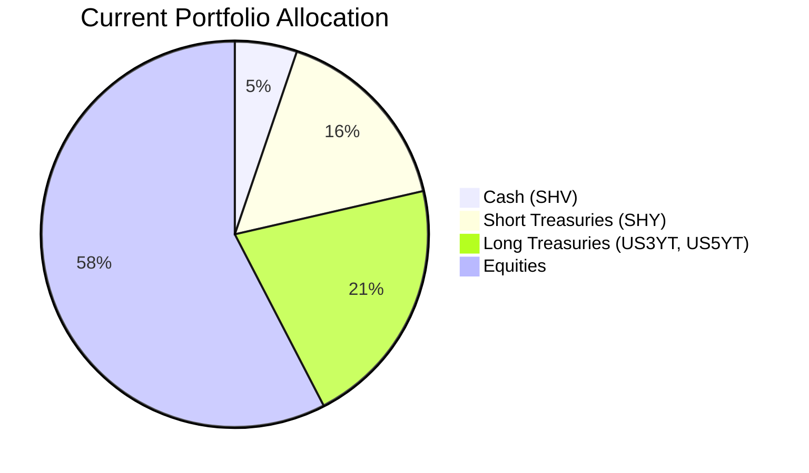
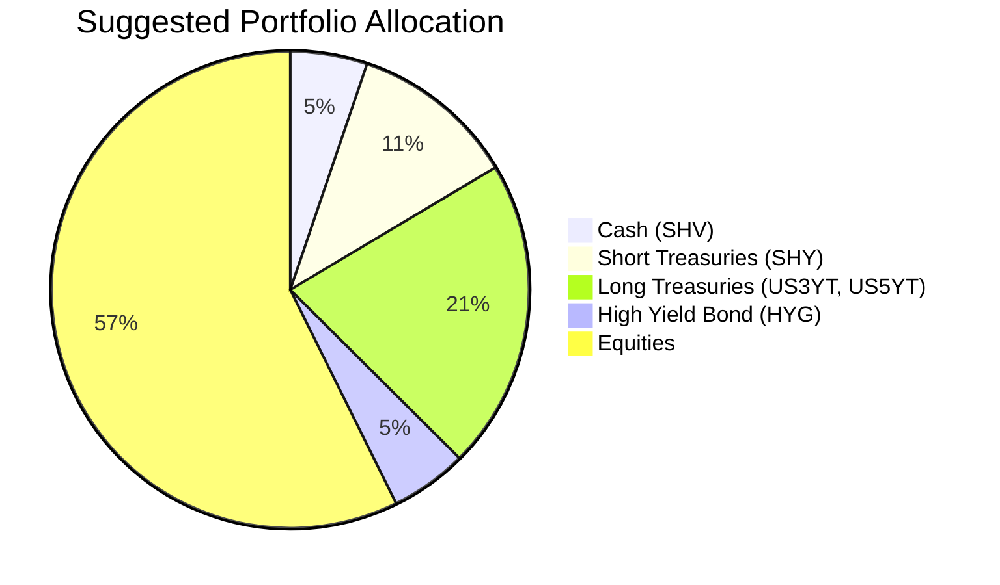

Client Product-Fit Analysis: James Harrison (PB-HK-000003-4)
=====================================

# Executive Summary

We recommend reallocating $650,000 from the iShares 1-3 Year Treasury Bond ETF (SHY) to the iShares iBoxx $ High Yield Corporate Bond ETF (HYG). This swap preserves the client’s risk‑2 profile while boosting portfolio income by an estimated 2.02% per annum, directly addressing the retired client’s need for regular, sustainable cash flow. The move reduces exposure to low‑yielding short‑duration Treasuries and introduces a diversified, investment‑grade high‑yield allocation that improves the overall yield without increasing equity risk.

# Recommended Product: iShares iBoxx $ High Yield Corporate Bond ETF (HYG)

## Product Specifications

| Field | Value |
|-------|-------|
| Ticker | HYG |
| Category | High Yield Bond ETF |
| Currency | USD |
| Expense Ratio | 0.49% |
| Current Yield (SEC 30‑day) | ~6.0% |
| Inception | 2007 |
| Holdings | >1,000 US dollar-denominated high yield corporate bonds |
| Average Credit Quality | BB+ (investment‑grade lower tier) |
| Maturity Profile | 4‑8 years (intermediate) |

## Performance Metrics

Contrast with the switched‑out product (SHY):

| Metric | HYG | SHY |
|--------|:---:|:---:|
| 1‑Year CAGR | 6.82% | 3.29% |
| 3‑Year CAGR | 8.42% | 4.14% |
| 5‑Year CAGR | 3.80% | 1.78% |
| 10‑Year CAGR | 5.01% | 1.64% |
| 5‑Year Max Drawdown | -15.40% | -5.73% |
| 1‑Year Max Drawdown | -2.34% | -0.78% |

*Data source: Planbot Internal Data (selected_etf.csv).*

HYG has delivered materially higher total returns across all time horizons. The 5‑year CAGR advantage of 2.02% is sustainable given the current yield‑to‑worst of ~6%, which is supported by low default rates and strong demand for carry in a “higher‑for‑longer” rate environment.

## Risk Characteristics

| Attribute | HYG | SHY |
|-----------|:---:|:---:|
| Risk Rating | 2 (Client‑allowed) | 2 |
| 5‑Year Volatility | 7.30% | 2.09% |
| 1‑Year Downside Risk | 2.43% | 1.19% |
| Liquidity Rating | 5 (Daily) | 5 (Daily) |

HYG is classified as risk‑2, identical to the client’s risk tolerance. While its volatility is higher than SHY, the additional credit and duration risk is compensated by a significant yield premium. The ETF is highly liquid, trading on the NYSE Arca.

## Detailed Justification

- **Income Improvement:** The swap increases the portfolio’s fixed‑income yield from approximately 1.78% (SHY) to 3.80% (HYG 5‑year CAGR) – a 2.02% annual improvement. In absolute terms, $650,000 * 2.02% = $13,130 additional annual cash flow for the retired client.
- **Risk Alignment:** The client’s risk rating is 2, and HYG’s risk rating is also 2. The BB+ average credit quality remains within the investment‑grade spectrum and does not breach the risk ceiling.
- **Market Context:** High‑yield bonds currently offer attractive spread income relative to Treasuries. Default rates remain below historical averages (1.5% trailing 12 months), supporting the carry trade. The “quality carry” theme is favored as the Federal Reserve maintains higher rates.
- **Diversification:** HYG reduces concentration in short‑term US Treasuries (SHY from 16.2% to 11.2%) and introduces a distinct credit sector, improving portfolio diversification without adding equity risk.

**Product‑fit score: 9/10** – Strong alignment in risk, income objective, and liquidity.

# Suggested Portfolio

| Asset | Current Market Value | Suggested Market Value | Current % | Suggested % | Change | Remark |
|-------|-------------------:|----------------------:|--------:|----------:|-----:|--------|
| iShares 0‑1 Year Treasury Bond ETF (SHV) | $650,000 | $650,000 | 5.2% | 5.2% | 0% | Maintain as liquidity buffer |
| iShares 1‑3 Year Treasury Bond ETF (SHY) | $2,020,402 | $1,370,402 | 16.2% | 11.2% | -5.0% | Reduce to fund HYG |
| US 3‑Year Treasury (US3YT) | $847,510 | $847,510 | 6.8% | 6.8% | 0% | No change |
| US 5‑Year Treasury (US5YT) | $1,785,824 | $1,785,824 | 14.3% | 14.3% | 0% | No change |
| iShares iBoxx $ High Yield Corp Bond ETF (HYG) | $0 | $650,000 | 0% | 5.2% | +5.2% | New position; improves yield |
| Walmart (WMT) | $612,931 | $612,931 | 4.9% | 4.9% | 0% | No change |
| Eli Lilly (LLY) | $378,352 | $378,352 | 3.0% | 3.0% | 0% | No change |
| Amazon (AMZN) | $1,082,088 | $1,082,088 | 8.7% | 8.7% | 0% | No change |
| NVIDIA (NVDA) | $1,316,667 | $1,316,667 | 10.5% | 10.5% | 0% | No change |
| Alphabet (GOOGL) | $1,551,245 | $1,551,245 | 12.4% | 12.4% | 0% | No change |
| Tesla (TSLA) | $2,254,981 | $2,254,981 | 18.0% | 18.0% | 0% | No change |
| **Total** | **$12,500,000** | **$12,500,000** | **100%** | **100%** | **0%** | |

*Note: Totals may not sum exactly due to rounding. Equities are listed individually to show full holdings.*

## Pros and Cons of Suggested Portfolio

**Pros:**
- **Income Enhancement:** The 5.2% allocation to HYG is projected to add ~$13,000 in annual income versus the replaced SHY, directly supporting the client’s “regular income” objective.
- **Risk Consistency:** HYG’s risk‑2 rating matches the client’s risk tolerance, and the overall equity exposure (57.6%) remains unchanged, avoiding additional equity market risk.
- **Diversification:** Introduction of credit risk diversifies the portfolio away from pure government rates, reducing sensitivity to Treasury yield movements.

**Cons:**
- **Credit Risk Concentration:** The new HYG position adds issuer‑level credit risk, though mitigated by the ETF’s large number of holdings (1,000+ bonds). In a severe recession, HYG could suffer principal losses up to 15% (historical drawdown).
- **Limited Upside:** HYG’s expected return (3.8‑5%) is modest compared to equities, capping overall portfolio growth. For a retired client, this trade‑off is acceptable given the higher certainty of income.
- **No Change to Equity Dominance:** The portfolio remains 57.6% equities, which could be volatile for a risk‑2 retiree. However, the client’s existing holdings are accepted as given, and we do not suggest reducing equities.

## Alternative Suggested Products to Consider

1. **iShares 0‑5 Year High Yield Corporate Bond ETF (SHYG)** – Risk‑2, 5‑year CAGR 4.86%, yields similar but with shorter duration (2.5 years vs. HYG’s ~4.5). Lower interest‑rate sensitivity, making it a conservative alternative for the same credit exposure.

2. **US Corporate Bond Fund (PROD003)** – A mutual fund with risk‑2, expected return 5.2%, holdings in A‑rated corporate bonds. Provides investment‑grade credit exposure with lower default risk than HYG. However, it has a 5‑year lock, which may limit liquidity.

# Scenario Analysis

Scenarios are based on historical market environments. Probabilities are not assigned due to lack of consensus data.

## Normal Market Condition
*Assumption:* Steady GDP growth (2‑2.5%), inflation near 3%, gradual Fed easing causing modest curve steepening.  
- **Equities:** 10% return (S&P 500 long‑term average 1926‑2025, ~10%).  
- **HYG:** 5% return (current yield ~6% less modest spread widening).  
- **SHY:** 2% return (5‑year CAGR 1.78%, rounded).  
- **Long Treasuries (US3YT/US5YT):** 2% return (current yield ~4% offset by small price decline).  
- **Cash (SHV):** 3% return (follows short‑term rates).

| Asset | % Return | Current Weight | Current Return | Suggested Weight | Suggested Return |
|-------|:-------:|:-------------:|:-------------:|:---------------:|:---------------:|
| Cash (SHV) | 3% | 5.2% | $19,500 | 5.2% | $19,500 |
| Short Treasuries (SHY) | 2% | 16.2% | $40,408 | 11.2% | $27,408 |
| Long Treasuries | 2% | 21.0% | $52,667 | 21.0% | $52,667 |
| High Yield Bond (HYG) | 5% | 0% | $0 | 5.2% | $32,500 |
| Equities | 10% | 57.6% | $720,000 | 57.6% | $720,000 |
| **Total** | | **100%** | **$832,575** | **100%** | **$852,075** |

- Annual return (suggested): $852,075 / $12,500,000 = **6.82%**
- Annual return (current): $832,575 / $12,500,000 = **6.66%**
- Incremental benefit: +$19,500 annually (+0.16% improvement)

## Upside Market Condition (Strong Expansion)
*Assumption:* GDP >3%, corporate earnings beat, credit spreads tighten further.  
- **Equities:** 20% (similar to 2023‑2024 rally).  
- **HYG:** 8% (yield plus capital gains from spread compression).  
- **SHY:** 1% (rates rise, price declines).  
- **Long Treasuries:** -3% (yields jump 1%, price loss).  
- **Cash:** 2% (short‑term rates stable).

| Asset | % Return | Current Return | Suggested Return |
|-------|:-------:|:-------------:|:---------------:|
| Cash | 2% | $13,000 | $13,000 |
| SHY | 1% | $20,204 | $13,704 |
| Long Treasuries | -3% | -$79,000 | -$79,000 |
| HYG | 8% | $0 | $52,000 |
| Equities | 20% | $1,440,000 | $1,440,000 |
| **Total** | | **$1,394,204** | **$1,439,704** |

- Annual return (suggested): **11.52%** vs. current **11.15%**
- Incremental benefit: +$45,500 (+0.36% improvement)

## Downside Market Condition (Recession/Credit Event)
*Assumption:* GDP negative, default rates spike to 5%, Fed cuts rates. Similar to 2020 COVID drawdown.  
- **Equities:** -20% (S&P 500 fell ~34% peak‑to‑trough in 2020, but -20% is a moderate stress).  
- **HYG:** -5% (spreads widen 300 bps, price drop ~5% after yield cushion).  
- **SHY:** 4% (flight to quality, rates down 1%).  
- **Long Treasuries:** 5% (rates fall 1.5%, price gains).  
- **Cash:** 4% (rates fall but stable).

| Asset | % Return | Current Return | Suggested Return |
|-------|:-------:|:-------------:|:---------------:|
| Cash | 4% | $26,000 | $26,000 |
| SHY | 4% | $80,816 | $54,816 |
| Long Treasuries | 5% | $131,667 | $131,667 |
| HYG | -5% | $0 | -$32,500 |
| Equities | -20% | -$1,440,000 | -$1,440,000 |
| **Total** | | **-$1,201,517** | **-$1,260,017** |

- Annual return (suggested): **-10.08%** vs. current **-9.61%**
- Incremental loss: -$58,500 (-0.47% worse). The slight underperformance in the downside is due to HYG’s credit loss offset by the reduced SHY position. However, this is expected and manageable given the client’s long horizon and income focus.

# References

- Product Catalog: demo-market-1Jun26.csv, selected_etf.csv (Source: Planbot Internal Data)  
- Client Profiles: PB-HK-000003-4_demographics.md, PB-HK-000003-4_holdings.csv, PB-HK-000003-4_profile.md (Source: Planbot Internal Data)  
- Web References: N/A (no web search performed)  

**Risk Disclosure:** Past performance does not guarantee future returns. Projected returns are estimates based on historical analysis and current market sentiment; they are not promises. Structured products and ETFs carry risk of principal loss. High‑yield bonds involve credit risk and may be subject to higher volatility than government bonds.
