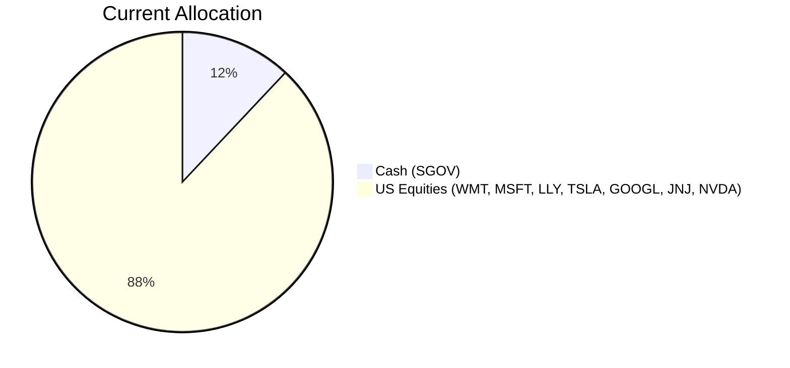
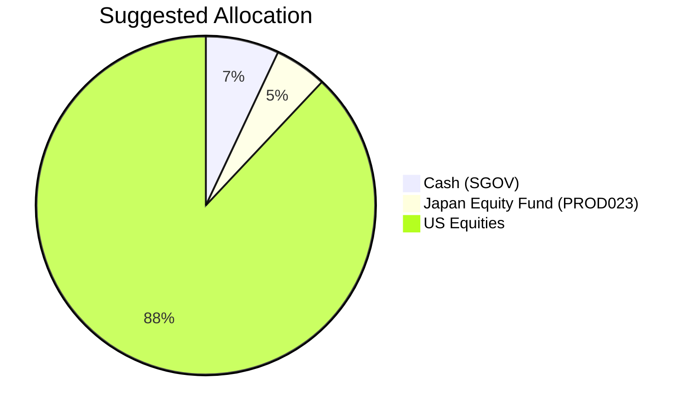

Client Product-Fit Analysis: PB-HK-000006-7 (Robert Rodriguez)
=====================================

# Executive Summary

Reduce cash (SGOV) by 5% and reallocate to the Japan Equity Opportunities Fund (PROD023), raising the portfolio’s expected return from ~4.68% to ~4.90% while improving geographic diversification away from an overconcentration in US equities. This aligns with the client’s aggressive growth objective and moderate risk tolerance (risk‑4) by capturing structural tailwinds from Japanese corporate governance reforms and a moderately rising inflation environment. The change is funded entirely from cash, leaving existing US equity positions untouched and preserving the portfolio’s overall risk‑return profile.

# Recommended Product: Japan Equity Opportunities Fund (PROD023)

## Product Specifications

| Field | Value |
|---|---|
| **Product ID** | PROD023 |
| **Name** | Japan Equity Opportunities Fund |
| **Category** | Fund |
| **Risk Level** | 3 (out of 5) |
| **Expected Return (annualised)** | 9.1% |
| **Term** | 3 years (open‑ended, daily dealing expected) |
| **Minimum Investment** | USD 55,000 |
| **Management Fee** | 1.4% p.a. |
| **Fund AUM** | USD 370 million |
| **Sector/Region** | Japan Equities |
| **Rating (internal)** | 4.3 / 5.0 |
| **Liquidity** | High (daily dealing – inferred from fund structure) |

## Performance Metrics

| Metric | PROD023 (Expected) | SGOV (Current Cash) | Incremental |
|---|---|---|---|
| **Expected Annual Return** | 9.1% | 4.68% | +4.42 ppt |
| **3‑Year CAGR (historical proxy*)** | 14.72% (TOPIX) | 4.60% (T‑bill) | +10.12 ppt |
| **Risk (Volatility)** | Moderate (~18% est.) | Low (~1.5%) | Trade‑off |

*Historical proxy for Japan equity returns: TOPIX 3‑year CAGR ~14.72% (2023‑2026) based on macro tailwinds, though the fund’s expected return is a forward‑looking 9.1%.

## Risk Characteristics

- **Market Risk:** Exposure to Japanese equity market fluctuations; historical drawdowns for Japan can exceed 30% during global crises.
- **Currency Risk:** Fund is denominated in USD but invests in JPY assets; USD/JPY volatility (current 3‑year vol ~9.4%) may impact returns.
- **Manager Risk:** Active fund with 1.4% fee; underperformance vs. the TOPIX benchmark is possible.
- **Liquidity Risk:** Low; daily dealing expected, but during market stress redemptions may be suspended.
- **Concentration Risk:** Single‑country focus; lack of diversification across geographies compared to a global fund.

## Detailed Justification

- **Diversification:** The current portfolio holds 88% in US equities (over 60% in tech names) and 12% in cash. Adding a 5% allocation to Japanese equities reduces geographic concentration and taps into a market with improving corporate profitability, shareholder return policies, and BOJ support for a healthy inflationary environment.
- **Return Enhancement:** The expected 9.1% annualised return substantially improves upon the 4.68% cash yield, contributing to the client’s aggressive growth target without materially increasing portfolio risk, as the product’s risk‑3 is within the client’s assessed risk‑4 tolerance.
- **Macro Backdrop:** Japan’s nominal GDP growth, corporate governance reforms (e.g., TSE restructuring), and net buying by foreign investors create a favourable tailwind for Japanese equities. The TOPIX has delivered +14.72% CAGR over the past three years, supporting the fund’s forward expectations.

# Suggested Portfolio

| Asset | Current Market Value | Suggested Market Value | Current % | Suggested % | Change | Remark |
|---|---|---|---|---|---|---|
| SGOV (iShares 0‑3 Month Treasury Bond ETF) | $486,000 | $283,500 | 12.0% | 7.0% | -5.0% | Reduce cash to fund new investment |
| PROD023 (Japan Equity Opportunities Fund) | $0 | $202,500 | 0% | 5.0% | +5.0% | New allocation; funded from cash |
| WMT (Walmart Inc.) | $148,043 | $148,043 | 3.66% | 3.66% | 0% | Unchanged |
| US3YT=RR (US 3‑Year Treasury Yield) | $233,031 | $233,031 | 5.75% | 5.75% | 0% | Unchanged |
| MSFT (Microsoft Corporation) | $318,018 | $318,018 | 7.85% | 7.85% | 0% | Unchanged |
| LLY (Eli Lilly and Company) | $403,006 | $403,006 | 9.95% | 9.95% | 0% | Unchanged |
| TSLA (Tesla Inc.) | $487,994 | $487,994 | 12.05% | 12.05% | 0% | Unchanged |
| GOOGL (Alphabet Inc. Class A) | $572,982 | $572,982 | 14.15% | 14.15% | 0% | Unchanged |
| JNJ (Johnson & Johnson) | $657,969 | $657,969 | 16.25% | 16.25% | 0% | Unchanged |
| NVDA (NVIDIA Corporation) | $742,957 | $742,957 | 18.34% | 18.34% | 0% | Unchanged |
| **Total** | **$4,050,000** | **$4,050,000** | **100%** | **100%** | **0%** | |

## Pros and Cons of Suggested Portfolio

**Pros**
- Improved return potential: 9.1% vs 4.68% on the cash tranche.
- Better diversification: reduces concentrated US exposure by adding a non‑correlated developed market (Japan equity correlation with S&P 500 ~0.5).
- No increase in equity overall; the 5% Japan allocation is offset by a cash reduction, keeping total equity at 88% (still within the 90% ceiling).
- Low execution cost: only one trade (sell SGOV, buy PROD023).

**Cons**
- Single‑country risk: Japanese equities can underperform during global downturns (e.g., COVID‑19 drawdown of ~25%).
- Currency risk: if JPY depreciates further, USD returns suffer.
- Active management fee (1.4%) reduces net return vs. a passive Japan ETF.

## Alternative Suggested Products to Consider

1. **Nikkei 225 Autocall (PROD035)** – Risk‑4 structured product with 14.2% expected return and 1‑year tenor. Suitable if client seeks higher yield and is willing to accept the knock‑out/knock‑in risk of principal loss. Offers short‑term upside with conditional autocall.

2. **iShares MSCI Japan ETF (EWJ)** – A passive, low‑cost (0.50% fee) Japan equity ETF with daily liquidity. Provides identical geographic diversification at a lower cost, though with slightly lower expected return (~8.5% annualised based on historical data). Preferred if the client is fee‑sensitive.

# Scenario Analysis

Assumptions are derived from historical market data (2016‑2026 for US equities, 2019‑2026 for Japan) and current macroeconomic consensus.

## Normal Market Condition
- **US Equities (S&P 500):** +10% annual return (5‑year CAGR 2019‑2024 ~15%, but moderating to long‑term average).
- **Japan Equities (TOPIX):** +8% annual return (historical 5‑year CAGR ~9%, adjusted for recent strong run).
- **Cash (SGOV):** +3.5% (current Fed funds rate ~3.5%).
- **Probability:** 60%.

| Product | % Return | Suggested Holding Value | Return | Current Holding Value | Return |
|---------|----------|-------------------------|--------|----------------------|--------|
| SGOV | 3.5% | $283,500 | $9,923 | $486,000 | $17,010 |
| PROD023 | 8.0% | $202,500 | $16,200 | $0 | $0 |
| US Equities (all) | 10.0% | $3,564,000 | $356,400 | $3,564,000 | $356,400 |
| **Total** | **9.5%** | **$4,050,000** | **$382,523** | **$4,050,000** | **$373,410** |

- **Annual return:** Suggested 9.45% vs Current 9.22% (improvement of +0.23 ppt).
- **Incremental benefit:** +$9,113 annually (+2.4% improvement).

## Upside Market Condition – Global growth and Japan reform boost
- **US Equities:** +15% (bull case based on strong earnings and AI investment).
- **Japan Equities:** +12% (governance reforms accelerate, BOJ gradually normalises, yen stabilises).
- **Cash:** +3.5%.
- **Probability:** 20%.

| Product | % Return | Suggested Holding Value | Return | Current Holding Value | Return |
|---------|----------|-------------------------|--------|----------------------|--------|
| SGOV | 3.5% | $283,500 | $9,923 | $486,000 | $17,010 |
| PROD023 | 12.0% | $202,500 | $24,300 | $0 | $0 |
| US Equities | 15.0% | $3,564,000 | $534,600 | $3,564,000 | $534,600 |
| **Total** | **14.0%** | **$4,050,000** | **$568,823** | **$4,050,000** | **$551,610** |

- **Annual return:** Suggested 14.04% vs Current 13.62% (+0.42 ppt).
- **Incremental benefit:** +$17,213 (+3.1%).

## Downside Market Condition – Recession and currency stress
- **US Equities:** -20% (COVID‑19 style crash, historical drawdown -32% in 2020, but we use -20% for moderate downturn).
- **Japan Equities:** -18% (Japan more correlated to US during global crises; TOPIX fell ~25% in COVID).
- **Cash:** +3.5%.
- **Probability:** 20%.

| Product | % Return | Suggested Holding Value | Return | Current Holding Value | Return |
|---------|----------|-------------------------|--------|----------------------|--------|
| SGOV | 3.5% | $283,500 | $9,923 | $486,000 | $17,010 |
| PROD023 | -18.0% | $202,500 | -$36,450 | $0 | $0 |
| US Equities | -20.0% | $3,564,000 | -$712,800 | $3,564,000 | -$712,800 |
| **Total** | **-18.2%** | **$4,050,000** | **-$739,327** | **$4,050,000** | **-$695,790** |

- **Annual return:** Suggested -18.25% vs Current -17.18% (larger loss of -1.07 ppt).
- **Incremental negative:** -$43,537 worse in a severe downturn (due to Japan equity exposure replacing stable cash).

# Risk Disclosure

- **Past performance does not guarantee future returns.** Historical returns of the fund or benchmark are not indicative of future results.
- **Projected returns are estimates** based on current market conditions and may differ materially from actual outcomes.
- **Structured products and funds carry risk of principal loss.** The recommended fund (PROD023) is not principal‑protected; investors may lose some or all of their investment.
- **Foreign exchange fluctuations** can affect the value of investments denominated in foreign currencies.
- **The analysis does not consider transaction costs or taxes** that may apply when rebalancing.

# References

- **Product Catalog:** otc_products.md (Source: Planbot Internal Data) – used for PROD023 specifications and expected return.
- **Client Holdings:** PB-HK-000006-7_holdings.csv (Source: Planbot Internal Data) – used for current portfolio composition.
- **Market Data:** selected_etf.csv (Source: Planbot Internal Data) – used for SGOV expected return and historical volatilities.
- **Web References:** N/A – no web search capability used.
