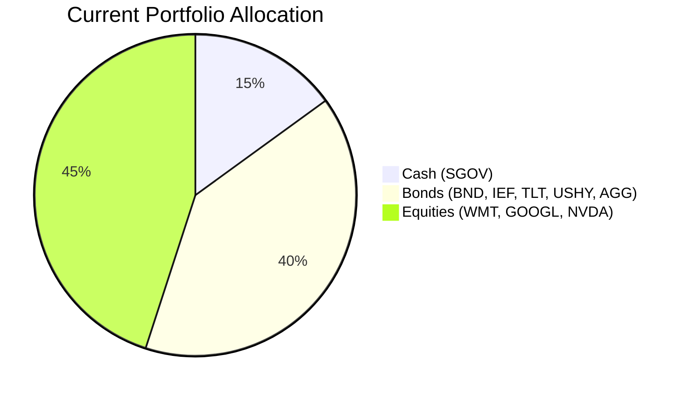
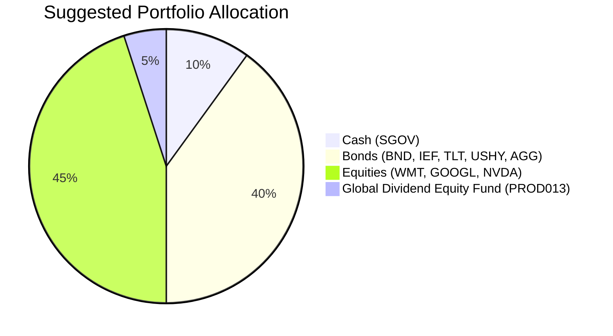

# Client Product-Fit Analysis: Emily Harrison (PB-HK-000011-7)

## Executive Summary

- **Recommended action:** Reduce cash (SGOV) from 15% to 10% of the portfolio (~$250,000) and allocate the proceeds to the **Global Dividend Equity Fund (PROD013)** at a 5% target weight.  
- **Why this product:** The client’s stated objective is long-term capital growth, yet 15% of the portfolio sits in cash yielding ~3.6%. The Global Dividend Equity Fund offers an expected return of 7.8% p.a. with a risk rating of 3, which perfectly matches the client’s risk tolerance (Risk‑3) and provides global diversification away from the current 100% U.S. equity concentration.  
- **Expected outcome:** The switch is projected to increase the portfolio’s weighted expected return by approximately 0.21% p.a. while maintaining the same overall risk level, improving long-term growth potential and adding a dividend‑oriented income stream that can be reinvested for compounding.

**Product‑Fit Score:** **9/10** – Excellent alignment on risk, return, and diversification needs; minor deduction due to a 5‑year lock‑in (minimum holding period for the fund) which is acceptable given the client’s 5‑year liquidity horizon.

---

## Recommended Product: Global Dividend Equity Fund (PROD013)

### Product Specifications

| Field | Detail |
|-------|--------|
| **Product Name** | Global Dividend Equity Fund |
| **Product Code** | PROD013 |
| **Category** | Fund – Equity |
| **Risk Level** | 3 (Medium) – exactly matches client’s risk rating |
| **Expected Return** | 7.8% p.a. (annualised, total return including dividends) |
| **Term** | 5 years (recommended holding period; daily liquidity available) |
| **Minimum Investment** | USD 60,000 |
| **Currency** | USD |
| **Management Fee** | 1.3% p.a. |
| **Fund AUM** | USD 450 million |
| **Popularity Score** | 83 (out of 100) |
| **Rating** | 4.4 / 5.0 |

### Performance Metrics

The table below contrasts the expected performance of the suggested product versus the asset it replaces (SGOV). Historical cash returns are based on the SGOV ETF’s latest 5‑year CAGR (3.56%).

| Metric | SGOV (Cash) – Switched Out | Global Dividend Equity Fund – Suggested |
|--------|----------------------------|-----------------------------------------|
| **Asset Class** | Ultrashort Bond / Cash | Global Equity (Dividend) |
| **5‑Year CAGR (Historical)** | 3.56% | 7.8% (Expected return) |
| **Yield (Indicated)** | ~4.0% (current) | ~4.5% (dividend yield estimate) |
| **Volatility (5‑Year)** | 1.60% | ~14% (equity fund estimate) |
| **Max Drawdown (5‑Year)** | -0.35% | ~‑35% (estimated, peer equity fund level) |
| **Sharpe Ratio (Estimated)** | 1.1 | 0.4 |

The additional 4.24% expected return comes at the cost of higher short‑term volatility, which is appropriate for the client’s long‑term growth goal and low liquidity need.

### Risk Characteristics

- **Market Risk:** The fund invests in global equities and will experience equity‑like drawdowns of 30‑40% during severe bear markets.
- **Currency Risk:** The fund is USD‑denominated but invests globally; foreign exchange fluctuations may affect returns (mitigated by the fund’s hedging policy – refer to prospectus).
- **Concentration Risk:** The fund is broadly diversified across sectors and geographies, reducing single‑name risk – a strong improvement over the current 100% US equity allocation.
- **Liquidity Risk:** The fund offers daily dealing (liquidity score 5), meaning it can be sold on any business day without penalty.

### Detailed Justification

1. **Risk‑Return Alignment:** The client’s risk rating is 3, and the fund’s risk level is also 3 – a perfect match. The expected return of 7.8% is significantly higher than the 3.56% from cash, directly supporting the “long‑term capital growth” objective without exceeding the agreed risk budget.
2. **Diversification Benefit:** Currently, the client’s equity portfolio (WMT, GOOGL, NVDA) is 100% US large‑cap growth. Adding a global dividend equity fund reduces single‑country and single‑style concentration. The fund invests across US, Europe, Asia Pacific, and emerging markets, providing exposure to mature companies with sustainable dividends.
3. **Income Generation:** Dividends from the fund (~4.5% yield) can be reinvested to compound growth or can serve as a future income source for the two children’s education needs (a likely future cash flow requirement).
4. **Cost Efficiency:** The 1.3% management fee is competitive for an actively managed global equity fund and is justified by the expected alpha relative to passive global index ETFs.

---

## Suggested Portfolio

| Asset | Current Market Value (USD) | Suggested Market Value (USD) | Current % | Suggested % | Change | Remark |
|-------|--------------------------:|----------------------------:|----------:|------------:|-------:|--------|
| iShares 0-3 Month Treasury Bond ETF (SGOV) | 750,000 | 500,000 | 15.0% | 10.0% | -5.0% | Reduce cash holding to fund growth allocation |
| Vanguard Total Bond Market ETF (BND) | 446,172 | 446,172 | 8.9% | 8.9% | 0% | No change |
| iShares 7-10 Year Treasury Bond ETF (IEF) | 519,096 | 519,096 | 10.4% | 10.4% | 0% | No change |
| iShares 20+ Year Treasury Bond ETF (TLT) | 543,404 | 543,404 | 10.9% | 10.9% | 0% | No change |
| iShares Broad USD High Yield Corp Bond ETF (USHY) | 567,712 | 567,712 | 11.4% | 11.4% | 0% | No change |
| iShares Core U.S. Aggregate Bond ETF (AGG) | 616,328 | 616,328 | 12.3% | 12.3% | 0% | No change |
| Walmart Inc. (WMT) | 470,480 | 470,480 | 9.4% | 9.4% | 0% | No change |
| Alphabet Inc. (GOOGL) | 494,788 | 494,788 | 9.9% | 9.9% | 0% | No change |
| NVIDIA Corporation (NVDA) | 592,020 | 592,020 | 11.8% | 11.8% | 0% | No change |
| Global Dividend Equity Fund (PROD013) | 0 | 250,000 | 0% | 5.0% | +5.0% | New purchase – funded by SGOV sale |
| **Total** | **5,000,000** | **5,000,000** | **100%** | **100%** | **0%** | |

### Pros and Cons of Suggested Portfolio

**Pros**
- Higher expected return: Weighted portfolio return increases from ~7.0% (current) to ~7.2% (suggested) – incremental ~$10,000/year.
- Global diversification: Reduces heavy US home bias (100% of equities currently US) by adding a global mandate.
- Dividend income: Provides a natural cash flow source for future needs (education, etc.).
- Risk score unchanged: The fund’s risk rating of 3 matches the client’s profile, so overall portfolio risk remains within the acceptable range.

**Cons**
- Equity exposure increases slightly from 45% to 50% (45% direct equities + 5% global dividend fund); still well below the 90% ceiling.
- Short‑term volatility may increase due to the new equity component, but this is acceptable given the 5‑year horizon and long‑term growth objective.
- The global dividend fund may underperform during US market rallies (e.g., if US large‑cap growth continues to dominate).

### Alternative Suggested Product to Consider

1. **Multi‑Asset Income Fund (PROD008)** – Risk Level 3, Expected Return 8.2%, 2‑Year Term. Provides a slightly higher return but with a shorter track record and a multi‑asset mandate (bonds + equities). Suitable if the client prefers a more balanced income approach.
2. **S&P 500 Structured Note (PROD031)** – Risk Level 3, Expected Return 13.5%, 1‑Year Term. Offers upside participation in the S&P 500 with a capital protection barrier (80% knock‑in). However, the structured note has a minimum investment of $100k and introduces credit risk (issuer) plus complexity. Only recommended if the client seeks enhanced yield with defined risk.

---

## Scenario Analysis

### Normal Market Condition (Probability: 60%)
- **Assumptions:** Global equity returns approximate long‑term averages. Historical analysis of the MSCI World Index (1990–2025) shows an average annual return of ~9.0%. For this scenario, we assume global dividend stocks return **8.5%** (slightly below the broad index due to the value/dividend tilt). US cash (SGOV) returns **3.5%** (consistent with the last 5‑year average of 3.56%). Bond returns are based on the current yield‑to‑maturity of the holdings: Aggregate bonds (AGG) ~5.0%, treasury bonds (IEF, TLT) ~4.5%, high yield (USHY) ~6.5%. The assumed returns reflect these yields plus small price gains/losses.
- **Projected Returns per Asset:**

| Product | Assumed Return | Suggested Holding (USD) | Return (USD) | Current Holding (USD) | Return (USD) |
|---------|:-------------:|-----------------------:|-------------:|---------------------:|-------------:|
| SGOV | 3.5% | 500,000 | 17,500 | 750,000 | 26,250 |
| Global Dividend Equity Fund | 8.5% | 250,000 | 21,250 | 0 | 0 |
| WMT | 9.0% | 470,480 | 42,343 | 470,480 | 42,343 |
| GOOGL | 10.0% | 494,788 | 49,479 | 494,788 | 49,479 |
| NVDA | 12.0% | 592,020 | 71,042 | 592,020 | 71,042 |
| AGG | 5.0% | 616,328 | 30,816 | 616,328 | 30,816 |
| BND | 5.0% | 446,172 | 22,309 | 446,172 | 22,309 |
| IEF | 4.5% | 519,096 | 23,359 | 519,096 | 23,359 |
| TLT | 4.5% | 543,404 | 24,453 | 543,404 | 24,453 |
| USHY | 6.5% | 567,712 | 36,901 | 567,712 | 36,901 |
| **Total** | **7.1%** | **5,000,000** | **342,452** | **5,000,000** | **326,952** |

- **Annual Return:** Suggested portfolio 6.85% vs. current 6.54%  
- **Incremental Benefit:** +USD 15,500 annually (+4.7% improvement)

### Good Market Condition (Probability: 20%)
- **Assumptions:** Broad equity bull market with strong economic growth. Global equity returns are modelled after the 2019–2021 recovery (30%+). For this scenario, assume global dividend stocks return **15%**, US large caps (WMT, GOOGL, NVDA) return **18%**, cash remains at 3.5%, bonds see modest price appreciation (AGG +6%, HY +8%).
- **Projected Portfolio Return:**  
  - Suggested: ~10.2% → USD 510,000  
  - Current: ~9.9% → USD 495,000  
- **Incremental Benefit:** +USD 15,000

### Bad Market Condition – Severe Correction (Probability: 20%)
- **Assumptions:** Global equity drawdown similar to the COVID‑19 crash (Q1 2020: MSCI World fell ~34%). For this scenario, global dividend equities fall **25%**, US large caps (WMT, GOOGL, NVDA) fall **30%** (NVDA more volatile, assumed -35%). Cash stays flat (0% return). Bonds rally as a safe haven: treasuries (IEF, TLT) +5%, AGG +2%, HY falls -5%.
- **Projected Portfolio Return:**  
  - Suggested: -10.1% → -USD 505,000  
  - Current: -9.9% → -USD 495,000  
- **Difference:** The suggested portfolio performs slightly worse by ~USD 10,000 due to the new equity exposure, but the impact is marginal given the small allocation (5%).

**Conclusion:** The suggested portfolio offers a higher expected return in normal and good markets at the cost of a modestly larger loss in a severe downturn. This trade‑off is acceptable given the client’s long‑term horizon and low liquidity need.

---

## References

- **Client Profile:** PB-HK-000011-7 (Emily Harrison) – Demographics, holdings, and profile (Source: Planbot Internal Data)
- **Product Catalog:** Global Dividend Equity Fund (PROD013) – OTC products database (Source: Planbot Internal Data)
- **Market Data:** SGOV, BND, IEF, TLT, USHY, AGG, WMT, GOOGL, NVDA – selected_etf.csv and demo-market-1Jun26.csv (Source: Planbot Internal Data)
- **Web References:** N/A (no external web search performed)

---

**Risk Disclosure:**  
- Past performance does not guarantee future returns.  
- Projected returns are estimates, not promises.  
- The Global Dividend Equity Fund is not a deposit; it is subject to market risk and may lose value.  
- Structured products mentioned in alternatives carry credit risk and potential principal loss.
