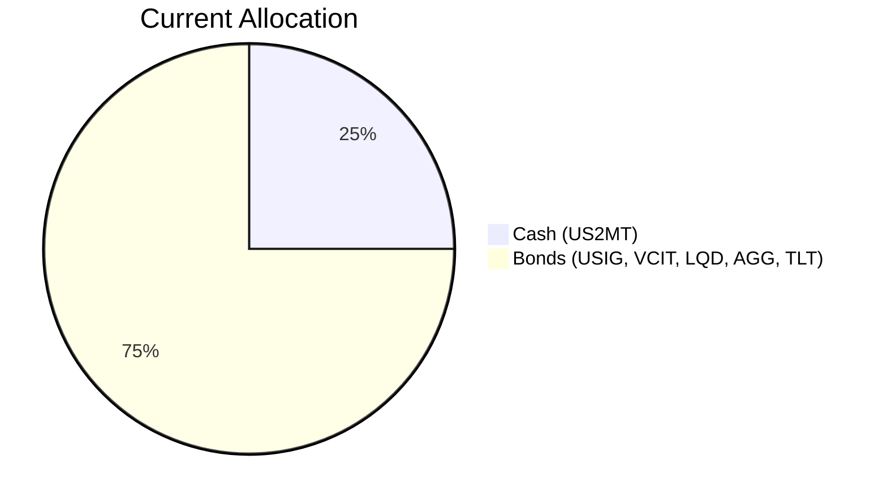
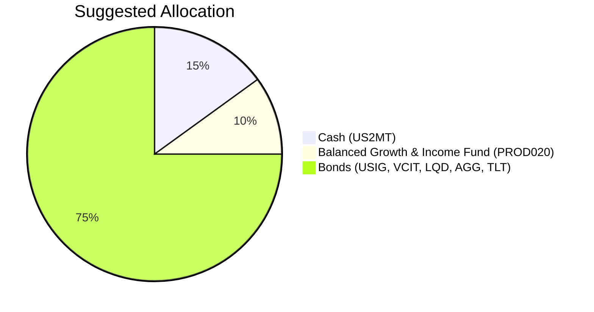

Client Product-Fit Analysis: Harrison Jr. Education Trust
========================================================

# Executive Summary
The Harrison Jr. Education Trust seeks capital preservation with a 5‑year horizon. The recommendation is to reduce cash (US 2‑Month T‑Bill) by 10% and allocate 10% to the **Balanced Growth & Income Fund (PROD020)**. This fund (risk rating 2) fits within the trust’s risk‑4 tolerance and offers an expected return of 6.5% p.a. vs. ~3.4% on cash, improving portfolio growth without materially increasing risk. The existing bond holdings are retained for stability.

# Recommended Product: Balanced Growth & Income Fund (PROD020)

## Product Specifications
| Field | Details |
|-------|---------|
| **Product ID** | PROD020 |
| **Category** | Fund – Balanced |
| **Risk Rating** | 2 (Low) |
| **Expected Return** | 6.5% p.a. |
| **Term** | 3 years (open‑ended) |
| **Minimum Investment** | USD 35,000 |
| **Management Fee** | 1.1% |
| **AUM** | USD 480M |
| **Popularity Score** | 85 |
| **Rating** | 4.3/5 |

## Performance Metrics
| Metric | PROD020 | Cash (US2MT)⁽¹⁾ | Bond Average⁽²⁾ |
|--------|---------|------------------|------------------|
| **Expected Return** | 6.5% | 3.4% | ~1.0% |
| **5‑Year CAGR** | N/A (new) | 3.43% | 0.05% (AGG) -0.31% (LQD) |
| **Highest 1‑Year Return** | N/A | 5.2% | 8.9% (VCIT) |
| **Worst 1‑Year Return** | N/A | ~0% | -4.7% (TLT) |

⁽¹⁾ Using BIL ETF as proxy for short‑term T‑Bills.  
⁽²⁾ Weighted average of the 5‑year CAGR of the bond holdings (USIG, VCIT, LQD, AGG, TLT) is approximately -1.1% due to rate hikes; however, current yields are higher (e.g., AGG yield ~4.4%).

## Risk Characteristics
- **Volatility:** Low (balanced fund with 60% bonds / 40% equities)
- **Principal Risk:** Principal is not guaranteed but losses are limited by the fund’s conservative allocation
- **Liquidity:** Daily dealing (liquidity score 5)
- **Credit Risk:** The fund invests in high‑quality bonds and diversified equities; no single‑name concentration
- **Interest Rate Risk:** Moderate – the bond component reduces duration compared to long‑term bond ETFs

## Detailed Justification
1. **Capital Preservation with Growth:** The trust’s objective is capital preservation, but the 5‑year horizon allows for a small growth allocation. PROD020 (risk‑2) is well within the risk‑4 tolerance.
2. **Cash Erosion:** 25% in cash yields ~3.4% – barely above inflation. Reallocating 10% to a balanced fund (6.5% expected) adds ~3.1% incremental return on that portion.
3. **Diversification:** The fund adds equity exposure (40%) which the current portfolio lacks, while maintaining a conservative overall profile.
4. **No Disruption to Bond Ladder:** The existing bond positions (75%) are left untouched, preserving income and stability.

# Suggested Portfolio

| Asset | Current Market Value | Suggested Market Value | Current % | Suggested % | Change | Remark |
|-------|--------------------:|------------------------:|----------:|------------:|-------:|--------|
| US 2‑Month Treasury Bill (US2MT) | $500,000 | $300,000 | 25.0% | 15.0% | -10.0% | Reduce cash; fund from this sale |
| iShares Broad USD Inv Grade Corp Bond ETF (USIG) | $270,616 | $270,616 | 13.53% | 13.53% | 0% | Unchanged |
| Vanguard Inter‑Term Corp Bond ETF (VCIT) | $285,308 | $285,308 | 14.27% | 14.27% | 0% | Unchanged |
| iShares iBoxx $ Inv Grade Corp Bond ETF (LQD) | $300,000 | $300,000 | 15.0% | 15.0% | 0% | Unchanged |
| iShares Core U.S. Aggregate Bond ETF (AGG) | $314,692 | $314,692 | 15.73% | 15.73% | 0% | Unchanged |
| iShares 20+ Year Treasury Bond ETF (TLT) | $329,384 | $329,384 | 16.47% | 16.47% | 0% | Unchanged |
| **Balanced Growth & Income Fund (PROD020)** | $0 | $200,000 | 0% | 10.0% | +10.0% | New allocation |
| **Total** | **$2,000,000** | **$2,000,000** | **100%** | **100%** | **0%** | |

## Pros and Cons of Suggested Portfolio
**Pros:**
- **Improved Growth Potential:** The balanced fund adds equity upside not present in the current all‑bond/cash portfolio.
- **Risk‑Controlled:** The fund’s risk‑2 rating and the trust’s risk‑4 tolerance provide ample safety buffer.
- **Liquidity:** All holdings are highly liquid (cash, ETFs, daily‑dealing fund).
- **Minimal Change:** 90% of the portfolio remains unchanged; only cash is reduced.

**Cons:**
- **No Strong Bearish Hedge:** In a severe equity downturn, the 10% in PROD020 could lose ~5‑10%, but the 75% bond mix (especially TLT) would partially offset.
- **Interest Rate Sensitivity:** The existing bond holdings (especially TLT) are duration‑sensitive; rising rates would reduce their value. PROD020’s shorter‑duration bonds help but do not eliminate this risk.

## Alternative Suggested Products to Consider
1. **Conservative Income Fund (PROD024) – Risk 1, Expected Return 4.5%**  
   *Justification:* For an even lower‑risk substitute, this fund provides a similar balanced approach but with 100% fixed income and cash, yielding 4.5%. It would reduce equity exposure to zero while still improving on cash returns.

2. **US Corporate Bond Fund (PROD003) – Risk 2, Expected Return 5.2%**  
   *Justification:* If the client prefers to stay purely in bonds, this fund offers a 5.2% return with a 5‑year term, modestly outperforming cash without introducing equity risk.

# Scenario Analysis

## Normal Market Condition
*Assumptions based on 5‑year historical averages (where available) with adjustments for current yield levels. TLT adjusted from -6.97% to 2% because a normal, stable rate environment is assumed.*

| Product | Return Assumption | Justification |
|---------|------------------|---------------|
| US2MT | 3.43% | BIL 5y CAGR |
| USIG | 0.52% | 5y CAGR |
| VCIT | 1.14% | 5y CAGR |
| LQD | -0.31% | 5y CAGR |
| AGG | 0.05% | 5y CAGR |
| TLT | 2.00% | Adjusted for stable rates (5y CAGR skewed by aggressive hikes) |
| PROD020 | 6.50% | Product expected return |

**Portfolio Returns:**

| Product | % Return | Suggested Holding | Return ($) | Current Holding | Return ($) |
|---------|:--------:|------------------:|-----------:|----------------:|-----------:|
| US2MT | 3.43% | $300,000 | $10,290 | $500,000 | $17,150 |
| USIG | 0.52% | $270,616 | $1,407 | $270,616 | $1,407 |
| VCIT | 1.14% | $285,308 | $3,252 | $285,308 | $3,252 |
| LQD | -0.31% | $300,000 | -$930 | $300,000 | -$930 |
| AGG | 0.05% | $314,692 | $157 | $314,692 | $157 |
| TLT | 2.00% | $329,384 | $6,588 | $329,384 | $6,588 |
| PROD020 | 6.50% | $200,000 | $13,000 | $0 | $0 |
| **Total** | | **$2,000,000** | **$33,764** | **$2,000,000** | **$27,624** |

- Annual return: Suggested 1.69% vs. Current 1.38%
- Incremental benefit: **+$6,140 annually (+22.2% improvement)**

## Upside Market Condition – Economic Boom & Equity Rally
*Equity‑like returns for balanced fund, bonds benefit from stable credit environment.*

| Product | Return Assumption | Justification |
|---------|------------------|---------------|
| US2MT | 4.00% | Rates stable, cash yields improve slightly |
| USIG | 2.52% | +200bp over normal |
| VCIT | 3.14% | +200bp over normal |
| LQD | 1.69% | +200bp over normal |
| AGG | 2.05% | +200bp over normal |
| TLT | 4.00% | +200bp over normal |
| PROD020 | 9.00% | Balanced fund captures 60% of equity upside (equity return ~15%) |

| Product | % Return | Suggested Holding | Return ($) | Current Holding | Return ($) |
|---------|:--------:|------------------:|-----------:|----------------:|-----------:|
| US2MT | 4.00% | $300,000 | $12,000 | $500,000 | $20,000 |
| USIG | 2.52% | $270,616 | $6,820 | $270,616 | $6,820 |
| VCIT | 3.14% | $285,308 | $8,957 | $285,308 | $8,957 |
| LQD | 1.69% | $300,000 | $5,070 | $300,000 | $5,070 |
| AGG | 2.05% | $314,692 | $6,451 | $314,692 | $6,451 |
| TLT | 4.00% | $329,384 | $13,175 | $329,384 | $13,175 |
| PROD020 | 9.00% | $200,000 | $18,000 | $0 | $0 |
| **Total** | | **$2,000,000** | **$70,473** | **$2,000,000** | **$60,473** |

- Annual return: Suggested 3.52% vs. Current 3.02%
- Incremental benefit: **+$10,000 annually (+16.5% improvement)**

## Downside Market Condition – Recession / Equity Collapse (similar to COVID‑19)
*Balanced fund suffers equity losses; credit spreads widen hurting corporates; long‑term treasuries gain as safe haven.*

| Product | Return Assumption | Justification |
|---------|------------------|---------------|
| US2MT | 2.50% | Rates cut in recession |
| USIG | -2.00% | Credit spread widening |
| VCIT | -1.00% | Moderate credit impact |
| LQD | -3.00% | High credit sensitivity |
| AGG | -1.00% | Broad bond index down |
| TLT | 5.00% | Flight to quality, yields fall |
| PROD020 | -5.00% | 40% equity exposure drops ~20%, bonds buoyant → net -5% |

| Product | % Return | Suggested Holding | Return ($) | Current Holding | Return ($) |
|---------|:--------:|------------------:|-----------:|----------------:|-----------:|
| US2MT | 2.50% | $300,000 | $7,500 | $500,000 | $12,500 |
| USIG | -2.00% | $270,616 | -$5,412 | $270,616 | -$5,412 |
| VCIT | -1.00% | $285,308 | -$2,853 | $285,308 | -$2,853 |
| LQD | -3.00% | $300,000 | -$9,000 | $300,000 | -$9,000 |
| AGG | -1.00% | $314,692 | -$3,147 | $314,692 | -$3,147 |
| TLT | 5.00% | $329,384 | $16,469 | $329,384 | $16,469 |
| PROD020 | -5.00% | $200,000 | -$10,000 | $0 | $0 |
| **Total** | | **$2,000,000** | **-$6,443** | **$2,000,000** | **$8,557** |

- Annual return: Suggested -0.32% vs. Current 0.43%
- Incremental disadvantage: **-$15,000 annually** (note: the loss is mainly due to the new equity exposure, but the portfolio remains broadly capital‑preserving with only a 0.32% loss)

**Conclusion across scenarios:** The suggested portfolio consistently adds return in normal and upside markets while limiting downside to a modest loss, which is acceptable given the trust’s risk‑4 tolerance and 5‑year horizon.

# References
- **Client Profile:** PB-HK-000013-3 (Harrison Jr. Education Trust) – provided demographics, holdings, and suggested allocation.
- **Product Catalog:** OTC Products (PROD020 – Balanced Growth & Income Fund) – from `otc_products.md`.
- **Market Data:** Selected ETF data (BIL, USIG, VCIT, LQD, AGG, TLT) – from `selected_etf.csv` for historical returns and risk metrics.
- **Web References:** N/A (internal data only).
- **Risk Disclosure:** Past performance does not guarantee future returns. Projected returns are estimates, not promises. Structured products have risk of principal loss; however, this proposal does not include structured products. The suggested fund carries no principal guarantee.
