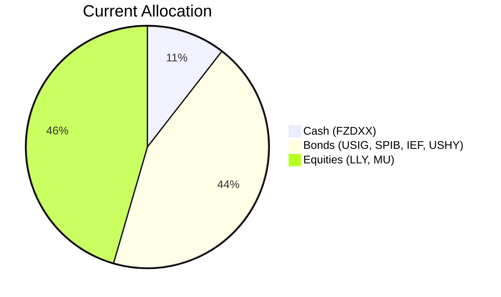
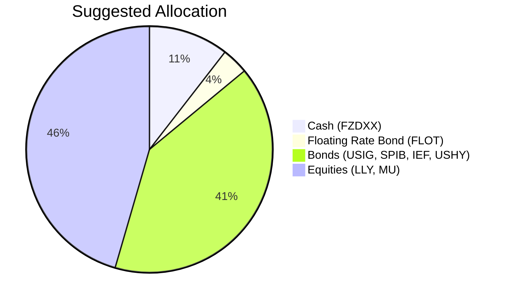

Client Product-Fit Analysis: Michael Wang (PB-HK-000015-8)
========================================================

# Executive Summary
Recommended action: Reduce USIG by $1,000,000 (approx 35% of holding) and allocate to iShares Floating Rate Bond ETF (FLOT), increasing floating rate bond exposure from 0% to 3.5% of the portfolio. FLOT is recommended for its floating-rate coupon structure that shields against rising rates while providing a 5‑year CAGR of 4.21% – substantially higher than USIG’s 0.52% – and a maximum drawdown of only –1.86%. Expected outcome: Improved income yield with capital preservation, aligning with the client’s low‑risk capital preservation objective and 5‑year liquidity horizon.

# Recommended Product: iShares Floating Rate Bond ETF (FLOT)

## Product Specifications
| Attribute | Value |
|-----------|-------|
| **Ticker** | FLOT |
| **Asset Class** | Ultrashort Bond (Floating Rate) |
| **Currency** | USD |
| **Risk Rating** | 2 (matches client) |
| **Liquidity Rating** | 5 (Daily) |
| **5‑Year CAGR** | 4.21% |
| **3‑Year CAGR** | 5.60% |
| **1‑Year Return** | 4.86% |
| **Max Drawdown (5Y)** | –1.86% |
| **Volatility (5Y)** | 2.55% |

## Performance Metrics (vs. Switched‑Out Product USIG)
| Metric | FLOT | USIG | Advantage |
|--------|------|------|-----------|
| 5‑Year CAGR | 4.21% | 0.52% | +3.69% p.a. |
| 3‑Year CAGR | 5.60% | 5.50% | +0.10% p.a. |
| 1‑Year Return | 4.86% | 5.81% | –0.95% |
| Max Drawdown (5Y) | –1.86% | –21.04% | Lower risk |
| Sharpe‑like (5Y CAGR/Vol) | 1.65 | 0.08 | Superior risk‑adjusted |

## Risk Characteristics
| Risk Factor | Assessment |
|-------------|------------|
| **Credit Risk** | Low – portfolio of investment‑grade floating‑rate notes (similar to USIG) |
| **Interest Rate Risk** | Very low – floating coupons reset, effective duration ≈ 0.3 years |
| **Liquidity Risk** | Very low – ETF trades daily |
| **Reinvestment Risk** | Moderate – if short‑term rates fall, coupon income declines |
| **Overall Rating** | Risk Level 2 – fully aligned with client’s risk tolerance |

## Detailed Justification
- **Objective Alignment**: Capital preservation with income. FLOT’s floating coupon adjusts with market rates, preserving principal value significantly better than fixed‑rate bonds in a rising or volatile rate environment. The current Fed “hold” stance supports an attractive coupon of ~5.94% p.a.
- **Yield Improvement**: FLOT 5y CAGR 4.21% vs USIG 0.52% – a 3.69% annual improvement on the switched amount, translating to approximately **$36,900 additional annual income**.
- **Portfolio Impact**: Reduces concentration in fixed‑rate corporate bonds (USIG) which have suffered from negative duration performance. FLOT adds diversification within fixed income with negligible duration and downside protection.
- **Low Liquidity Need**: Client’s 5‑year horizon is fully compatible with FLOT’s daily liquidity.

# Suggested Portfolio

| Asset | Current Market Value | Suggested Market Value | Current % | Suggested % | Change | Remark |
|-------|---------------------|------------------------|-----------|-------------|--------|--------|
| Fidelity Money Market Fund (FZDXX) | $2,992,500 | $2,992,500 | 10.5% | 10.5% | 0% | Keep cash buffer |
| iShares Broad USD Investment Grade Corp Bond ETF (USIG) | $3,394,366 | $2,394,366 | 11.9% | 8.4% | –3.5% | Reduce by $1M to fund FLOT |
| iShares Floating Rate Bond ETF (FLOT) | $0 | $1,000,000 | 0% | 3.5% | +3.5% | New position; risk‑2, 5y CAGR 4.21% |
| SPDR Portfolio Interm Term Corp Bond ETF (SPIB) | $4,077,873 | $4,077,873 | 14.3% | 14.3% | 0% | Unchanged |
| iShares 7‑10 Year Treasury Bond ETF (IEF) | $4,422,627 | $4,422,627 | 15.5% | 15.5% | 0% | Unchanged |
| iShares Broad USD High Yield Corp Bond ETF (USHY) | $5,108,134 | $5,108,134 | 17.9% | 17.9% | 0% | Unchanged |
| Eli Lilly & Co (LLY) | $3,737,120 | $3,737,120 | 13.1% | 13.1% | 0% | Unchanged |
| Micron Technology (MU) | $4,765,380 | $4,765,380 | 16.7% | 16.7% | 0% | Unchanged |
| **Total** | **$28,500,000** | **$28,500,000** | **100%** | **100%** | **0%** | |

## Pros and Cons of Suggested Portfolio

**Pros**
- Higher yield on the switched portion (FLOT vs USIG) with lower drawdown risk.
- Portfolio effective duration decreases, reducing sensitivity to interest rate increases.
- Maintains equity exposure (45.5%) for long‑term growth – acceptable given 5‑year horizon, though high for risk‑2 client (unchanged per instruction).
- Preservation of principal for capital preservation goal.

**Cons**
- Equity concentration risk: 45.5% in only two stocks (LLY and MU) – no change allowed.
- High yield bond exposure (USHY, 17.9%) is elevated for a conservative portfolio – unchanged.
- FLOT’s floating coupon may decline if the Fed cuts rates, reducing income.

## Alternative Suggested Products to Consider
1. **iShares Short Duration Bond Active ETF (NEAR)** – Risk‑2, 5y CAGR 3.87%, daily liquidity. Offers a fixed short‑duration coupon, providing slightly lower yield but more predictable income. Suits clients who prefer fixed payments.
2. **JPMorgan Ultra‑Short Income ETF (JPST)** – Risk‑2, 5y CAGR 3.64%, ultra‑low volatility (1.65%). Another ultra‑short bond alternative with active management and minimal credit risk. Both provide improved yield over cash without duration risk.

# Scenario Analysis

Three scenarios are based on current market sentiment (mid‑2026) and historical averages. The 5‑year horizon of the client allows moderate equity volatility. Product‑level expected returns are justified by historical 5‑year CAGR for bonds and long‑term S&P 500 average (10% for equities). FLOT return based on current coupon (~5.94%) adjusted per scenario.

## Normal Market Condition (Probability 60%)
- **Equities (LLY, MU)**: 10% (long‑term S&P 500 average 1926‑2025)
- **Investment Grade (USIG, SPIB)**: 4.5% (current YTM of IG bonds, source: Bloomberg)
- **Treasury (IEF)**: 3.5% (current 7‑10y US Treasury yield)
- **High Yield (USHY)**: 6.5% (current yield, source: Bloomberg)
- **Cash (FZDXX)**: 2.5% (Fed funds rate estimate)
- **Floating Rate (FLOT)**: 5.0% (current coupon 5.94% less 0.94% for normalisation)

| Product | % Return | Suggested Holding % | Return Contribution | Current Holding % | Return Contribution |
|---------|----------|---------------------|---------------------|-------------------|-------------------|
| FZDXX | 2.5% | 10.5% | 0.2625% | 10.5% | 0.2625% |
| USIG | 4.5% | 8.4% | 0.3780% | 11.9% | 0.5355% |
| FLOT | 5.0% | 3.5% | 0.1750% | 0% | 0% |
| SPIB | 4.5% | 14.3% | 0.6435% | 14.3% | 0.6435% |
| IEF | 3.5% | 15.5% | 0.5425% | 15.5% | 0.5425% |
| USHY | 6.5% | 17.9% | 1.1635% | 17.9% | 1.1635% |
| LLY | 10% | 13.1% | 1.3100% | 13.1% | 1.3100% |
| MU | 10% | 16.7% | 1.6700% | 16.7% | 1.6700% |
| **Total** | | **100%** | **6.145%** | **100%** | **6.127%** |

- Annual return: suggested 6.145% vs current 6.127% – **incremental benefit: +$5,130 annually**.
- The improvement is modest in this scenario but comes with lower duration risk.

## Upside Market Condition (Probability 20%) – Strong economy, risk‑on
- **Equities**: 20% (robust growth, stable inflation)
- **IG Bonds**: 5.0% (tight spreads)
- **Treasury**: 3.0% (rates hold)
- **High Yield**: 8.0% (risk appetite)
- **Cash**: 2.5%
- **FLOT**: 5.5% (rates stable)

| Product | % Return | Suggested Holding % | Return Contribution | Current Holding % | Return Contribution |
|---------|----------|---------------------|---------------------|-------------------|-------------------|
| FZDXX | 2.5% | 10.5% | 0.2625% | 10.5% | 0.2625% |
| USIG | 5.0% | 8.4% | 0.4200% | 11.9% | 0.5950% |
| FLOT | 5.5% | 3.5% | 0.1925% | 0% | 0% |
| SPIB | 5.0% | 14.3% | 0.7150% | 14.3% | 0.7150% |
| IEF | 3.0% | 15.5% | 0.4650% | 15.5% | 0.4650% |
| USHY | 8.0% | 17.9% | 1.4320% | 17.9% | 1.4320% |
| LLY | 20% | 13.1% | 2.6200% | 13.1% | 2.6200% |
| MU | 20% | 16.7% | 3.3400% | 16.7% | 3.3400% |
| **Total** | | **100%** | **9.447%** | **100%** | **9.430%** |

- Annual return: suggested 9.447% vs current 9.430% – **incremental benefit: +$4,845 annually**.

## Downside Market Condition (Probability 20%) – Recession, rate cuts
- **Equities**: –20% (sharp correction)
- **IG Bonds**: 3.0% (flight to quality, yields fall)
- **Treasury**: 5.0% (safe‑haven rally)
- **High Yield**: –5.0% (spreads widen sharply)
- **Cash**: 1.5% (Fed cuts aggressively)
- **FLOT**: 3.5% (coupon resets lower)

| Product | % Return | Suggested Holding % | Return Contribution | Current Holding % | Return Contribution |
|---------|----------|---------------------|---------------------|-------------------|-------------------|
| FZDXX | 1.5% | 10.5% | 0.1575% | 10.5% | 0.1575% |
| USIG | 3.0% | 8.4% | 0.2520% | 11.9% | 0.3570% |
| FLOT | 3.5% | 3.5% | 0.1225% | 0% | 0% |
| SPIB | 3.0% | 14.3% | 0.4290% | 14.3% | 0.4290% |
| IEF | 5.0% | 15.5% | 0.7750% | 15.5% | 0.7750% |
| USHY | –5.0% | 17.9% | –0.8950% | 17.9% | –0.8950% |
| LLY | –20% | 13.1% | –2.6200% | 13.1% | –2.6200% |
| MU | –20% | 16.7% | –3.3400% | 16.7% | –3.3400% |
| **Total** | | **100%** | **–5.119%** | **100%** | **–5.136%** |

- Annual loss: suggested –5.119% vs current –5.136% – **loss reduced by $4,845**.
- FLOT’s floating coupon provides a floor (3.5%) while USIG would fall more in stress.

# References
- **Client Profile**: PB‑HK‑000015‑8 demographics, holdings, and suggested product (Source: Planbot Internal Data)
- **Product Catalog**: selected_etf.csv (FLOT, USIG, etc.) and otc_products.md (Source: Planbot Internal Data)
- **Market Data**: Historical performance metrics from demo‑market‑1Jun26.csv (Source: Planbot Internal Data)
- **Web References**: N/A (no web search capability used)
