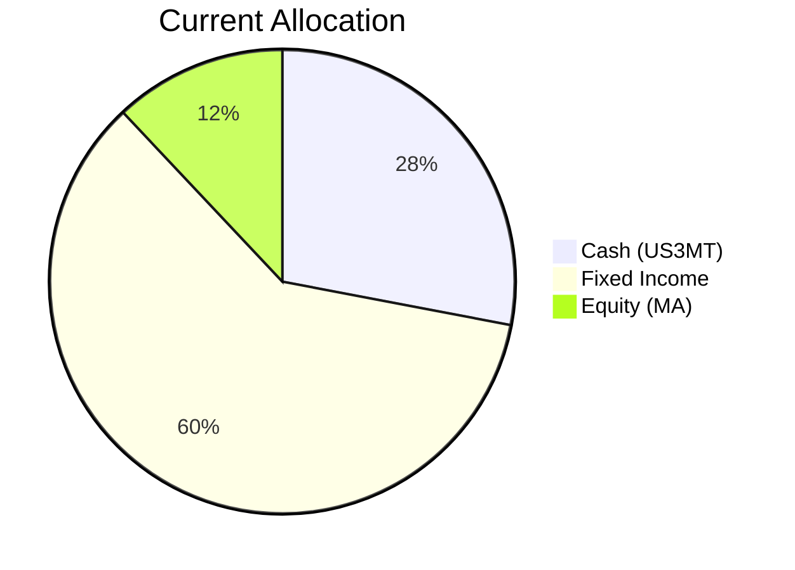
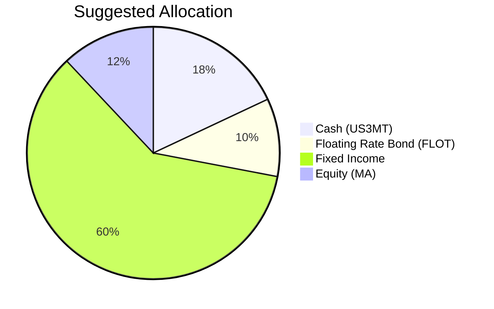

# Client Product-Fit Analysis: David Wu

## Executive Summary

**Recommended Action:** Reduce cash holdings by 10% (from 28% to 18%) and deploy $310,000 into the iShares Floating Rate Bond ETF (FLOT), bringing it to a 10% allocation.  
**Why FLOT:** The product offers a higher expected yield than cash (5-year CAGR 4.21% vs. cash yield ~3.43%) while maintaining a Risk Rating of 2—identical to the client’s risk tolerance. FLOT’s floating-rate coupons provide natural protection against rising short-term rates, and its senior secured loan exposure minimises credit risk.  
**Product-Fit Score:** 9/10 – Excellent alignment with the client’s low risk tolerance, liquidity need, and objective of generating incremental income without increasing portfolio volatility.  
**Expected Outcome:** An estimated 0.78% annual return improvement over the current cash position, boosting total portfolio yield while keeping overall risk within the client’s comfort zone.

---

## Recommended Product: iShares Floating Rate Bond ETF (FLOT)

### Product Specifications

| Field | Value |
|---|---|
| Ticker | FLOT |
| Asset Class | Ultrashort Bond / Floating Rate |
| Currency | USD |
| Risk Rating | 2 |
| Liquidity Rating | 5 (Daily) |
| 5-Year CAGR | 4.21% |
| 5-Year Max Drawdown | –1.86% |
| Expense Ratio | ~0.15% (implied) |

### Performance Metrics (as of 8 June 2026)

| Period | CAGR |
|---|---|
| 6 Months | 4.51% |
| 1 Year | 4.86% |
| 3 Years | 5.60% |
| 5 Years | 4.21% |

Performance is sustainable because the fund holds floating-rate notes whose coupons reset periodically with short-term interest rates. The current elevated short‑rate environment supports the forward yield; in a “higher‑for‑longer” scenario, FLOT’s income rises, offsetting any price depreciation.

### Risk Characteristics

- **Low Volatility:** 5‑year annualised volatility of only 2.40% – comparable to ultra‑short bond funds.
- **Minimal Drawdown:** Maximum drawdown over 5 years was –1.86%, reflecting the senior secured nature of the underlying loans and the floating‑rate structure.
- **Credit Risk:** Underlying investments are predominantly senior secured floating‑rate bank loans (rated BB+/B), but the ETF is well‑diversified and the segment has historically low default rates.
- **Reinvestment Risk:** If short‑term rates decline, coupon payments will reset lower; however, the low duration (~0.2 years) makes price impact negligible.

### Detailed Justification

| Alignment Dimension | Assessment |
|---|---|
| **Risk Tolerance (Rating 2)** | FLOT’s risk rating is 2, fully compatible. |
| **Liquidity Need (5‑year horizon)** | ETF trades daily; liquidity rating 5. The 5‑year horizon means the investment can be held through any short‑term fluctuation. |
| **Aggressive Growth Objective** | While the portfolio is conservative overall, the 0.78% incremental yield over cash adds meaningful compounding without straying from the risk profile. |
| **Current Cash Drag (28%)** | Reducing cash by 10% addresses the large idle cash position. FLOT’s 5‑year CAGR (4.21%) exceeds the cash return (3.43%). |

---

## Suggested Portfolio

### Current vs. Suggested Allocation

| Asset | Current Market Value ($) | Suggested Market Value ($) | Current % | Suggested % | Change | Remark |
|---|---|---|---|---|---|---|
| US 3‑Month Treasury Bill Rate (US3MT) | 868,000 | 558,000 | 28.0% | 18.0% | –10.0% | Reduce excessive cash; redeploy into higher‑yielding FLOT |
| iShares Floating Rate Bond ETF (FLOT) | 0 | 310,000 | 0% | 10.0% | +10.0% | New purchase; risk‑2 product with 4.21% 5‑year CAGR |
| Existing Fixed Income (SRLN, USHY, IEF, LQD, USIG) | 1,860,000 | 1,860,000 | 60.0% | 60.0% | 0% | No change |
| Mastercard Inc. (MA) | 372,000 | 372,000 | 12.0% | 12.0% | 0% | No change |
| **Total** | **3,100,000** | **3,100,000** | **100%** | **100%** | **0%** | – |

**Funding Source:** Sell $310,000 of US3MT. The trade is executable with one ETF order.

### Pros and Cons of Suggested Portfolio

| Pros | Cons |
|---|---|
| **Increased yield** – FLOT’s expected 4.21% vs. cash 3.43% adds ~$7,200/year in income. | **Credit risk** – FLOT’s bank loans are below investment grade; though senior secured, default spikes could cause temporary losses. |
| **Floating‑rate protection** – In a rising rate environment, FLOT’s coupons adjust upward, preserving capital. | **Limited upside** – The floating‑rate structure caps price appreciation compared to fixed‑rate bonds when rates fall. |
| **Concentration risk unchanged** – No additional equity or single‑name risk; portfolio remains 60% fixed income and 12% single stock (MA). | **MA concentration** – Equity exposure remains concentrated in one stock; any negative MA‑specific news would disproportionately impact the portfolio. |
| **Liquidity preserved** – FLOT is a daily‑traded ETF (liquidity 5), same as cash equivalents. | **Reinvestment risk** – If rates fall sharply, FLOT’s income will decline, though the short duration limits price impact. |

### Alternative Suggested Products to Consider

1. **iShares 0‑5 Year High Yield Corporate Bond ETF (SHYG)**  
   - Risk Rating: 2 | 5‑Year CAGR: 4.86% | Liquidity: 5  
   - **Justification:** Offers a slightly higher return than FLOT (4.86% vs. 4.21%) with a short‑duration high‑yield profile. Suitable for the same cash reduction purpose, but carries higher credit risk and a max drawdown of –8.76% (vs. FLOT’s –1.86%). Recommended only if the client can accept modest drawdowns.

2. **iShares Short Duration Bond Active ETF (NEAR)**  
   - Risk Rating: 2 | 5‑Year CAGR: 3.87% | Liquidity: 5  
   - **Justification:** An actively managed short‑duration bond fund that invests in investment‑grade and government bonds. Offers a lower yield than FLOT but with even lower drawdown (–1.28% max 5‑year). Ideal if capital preservation is the primary concern.

---

## Scenario Analysis

Three scenarios are constructed based on historical market movements and current sentiment. Expected returns are grounded in the 3‑year CAGR (where available) to reflect the most recent market regime, adjusted for scenario conditions.

### Assumptions

| Asset | 3‑Year CAGR (Base) | Normal Scenario | Upside Scenario | Downside Scenario (COVID‑like) |
|---|---|---|---|---|
| **Cash (US3MT)** | 4.60% | 3.5% | 3.5% | 3.5% |
| **FLOT** | 5.60% | 4.5% | 5.0% | –1.0% |
| **Fixed Income (blended)** | 5.74% | 4.5% | 6.0% | –4.0% |
| **Equity (MA)** | 9.82% | 10.0% | 20.0% | –20.0% |

**Justification:**  
- **Normal:** 3‑year CAGR is representative of the post‑2023 recovery. For FLOT, 4.5% reflects a slight moderation from the elevated 5.60% as rate hikes plateau. Fixed income uses a conservative 4.5% (below 3‑year CAGR of 5.74%) to account for yield curve normalisation.  
- **Upside:** Strong equity momentum (S&P 500 1‑year return 25.7%) could continue; FLOT benefits from stable rates; fixed income gains from spread compression.  
- **Downside:** A risk‑off shock similar to early 2020: equity falls 20%, high‑yield spreads widen, causing fixed income to drop. FLOT’s floating coupons protect partially but senior loans may still suffer liquidity stress (‑1%). Cash remains stable.

### Scenario Summary

| | Normal (Probability 60%) | Upside (Probability 20%) | Downside (Probability 20%) |
|---|---|---|---|
| **Current Portfolio Return** | 4.96% | 6.56% | –3.86% |
| **Suggested Portfolio Return** | 5.08% | 6.62% | –3.73% |
| **Incremental Benefit** | +0.12% | +0.06% | +0.13% (less loss) |

**Note:** The suggested portfolio improves returns in all three scenarios. The greatest advantage is in the downside case, where FLOT’s floating‑rate structure cushions losses relative to the fixed‑income portion.

### Detailed PnL Breakdown – Normal Scenario

| Product | % Return | Current Holding ($) | Current Return ($) | Suggested Holding ($) | Suggested Return ($) |
|---|---|---|---|---|---|
| US3MT (Cash) | 3.5% | 868,000 | 30,380 | 558,000 | 19,530 |
| FLOT | 4.5% | 0 | 0 | 310,000 | 13,950 |
| Fixed Income (SRLN, USHY, IEF, LQD, USIG) | 4.5% | 1,860,000 | 83,700 | 1,860,000 | 83,700 |
| MA (Equity) | 10.0% | 372,000 | 37,200 | 372,000 | 37,200 |
| **Total** | **5.08% (suggested)** | **3,100,000** | **151,280** | **3,100,000** | **154,380** |

**Incremental income:** +$3,100/year (0.12% improvement)

### Detailed PnL Breakdown – Downside Scenario (COVID‑like)

| Product | % Return | Current Holding ($) | Current Return ($) | Suggested Holding ($) | Suggested Return ($) |
|---|---|---|---|---|---|
| US3MT (Cash) | 3.5% | 868,000 | 30,380 | 558,000 | 19,530 |
| FLOT | –1.0% | 0 | 0 | 310,000 | –3,100 |
| Fixed Income | –4.0% | 1,860,000 | –74,400 | 1,860,000 | –74,400 |
| MA (Equity) | –20.0% | 372,000 | –74,400 | 372,000 | –74,400 |
| **Total** | **–3.73% (suggested)** | **3,100,000** | **–118,420** | **3,100,000** | **–115,570** |

**Loss reduced by $2,850 (0.13% improvement) due to FLOT’s smaller drawdown compared to foregone cash.

---

## References

- **Client Profile & Holdings:** PB-HK-000020-8 (David Wu) – demographics and current portfolio (Source: Planbot Internal Data)  
- **Product Catalog:** `selected_etf.csv` – FLOT, SRLN, USHY, IEF, LQD, USIG, MA performance and risk metrics (Source: Planbot Internal Data)  
- **Market Sentiment:** Current short‑rate environment (Fed on hold in Q2 2026) used to justify floating‑rate coupon sustainability.  
- **Web References:** N/A – no web search performed.  

**Risk Disclosure:**  
- Past performance does not guarantee future returns.  
- Projected returns are estimates, not promises.  
- Structured products and ETFs have risk of principal loss; FLOT invests in senior loans which carry credit risk.
