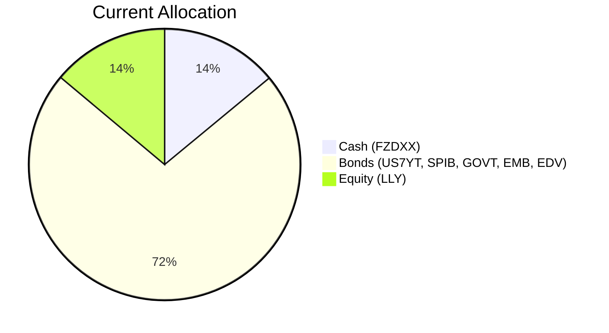
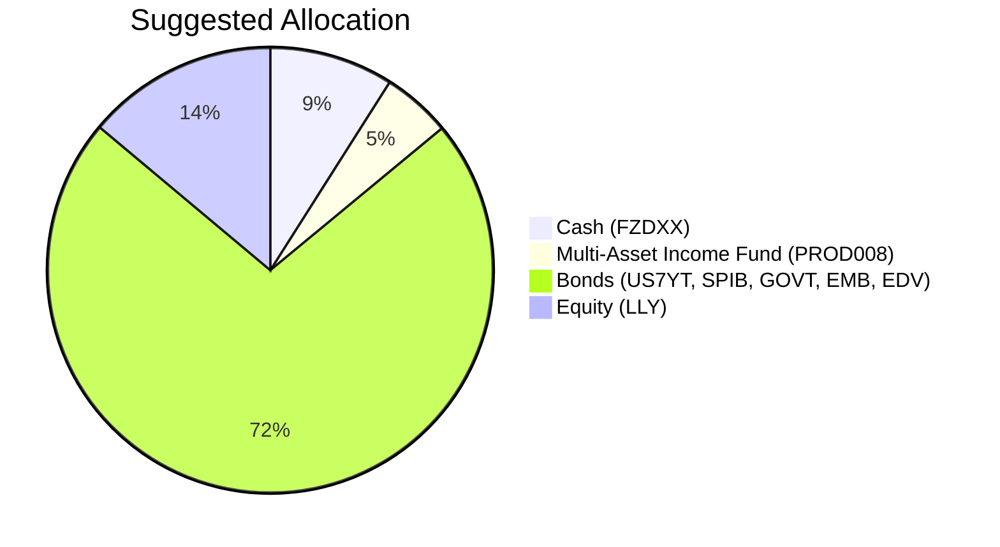

Client Product-Fit Analysis: Victor Ng
=====================================

# Executive Summary

We recommend adding the Multi-Asset Income Fund (PROD008) to your portfolio by reducing cash holdings. This product targets an 8.2% annual return, more than doubling the current cash yield of ~3.5%, while staying within your moderate risk tolerance (Risk Rating 3). The expected outcome is a meaningful enhancement to your regular income stream without increasing overall portfolio risk, as the fund provides diversified multi-asset exposure.

# Recommended Product: Multi-Asset Income Fund (PROD008)

## Product Specifications

| Field | Value |
|-------|-------|
| **Product Name** | Multi-Asset Income Fund |
| **Code** | PROD008 |
| **Category** | Fund – Multi‑Asset |
| **Risk Level** | 3 (Moderate) |
| **Expected Return** | 8.2% p.a. |
| **Term** | 2 Years (no lock‑in) |
| **Minimum Investment** | USD 40,000 |
| **Monthly Sales** | USD 9.7M |
| **Rating** | 4.5 / 5.0 |

## Performance Metrics

The fund’s expected return of **8.2%** compares favourably with the switched‑out cash position (Fidelity Money Market, FZDXX) which yields ~3.5% (based on 2026 yield data). Current bond holdings in your portfolio also offer low returns: SPIB (1.79% 5‑year CAGR), EMB (1.91%), GOVT (–0.54%), and EDV (–10.99%). The Multi‑Asset Income Fund targets a blend of global equities, bonds, and alternative income assets to deliver a superior income stream.

## Risk Characteristics

- **Risk Level:** 3 (matching your risk tolerance).
- **Diversification:** Multi‑asset (equities, bonds, alternatives) reduces single‑asset and single‑region concentration.
- **Liquidity:** Daily dealing (expected – typical for open‑ended funds). No lock‑up period.
- **Volatility:** Expected to be lower than pure equity funds due to the fixed‑income component.

## Detailed Justification

- **Income Objective:** The product is designed for regular income, directly aligning with your stated investment objective.
- **Yield Enhancement:** 8.2% return vs. 3.5% cash yield provides a significant income uplift of approximately USD 29,000 per USD 620,000 invested.
- **Risk Alignment:** At Risk Level 3, it falls within your risk budget, avoiding the higher risk of pure equity or structured products.
- **Portfolio Diversification:** Adding a multi‑asset fund reduces the current heavy tilt toward US Treasuries and corporate bonds (66% of portfolio) while maintaining a moderate risk profile.
- **Product‑Fit Score:** **8.5/10** – strong alignment with income needs, risk tolerance, and liquidity requirements.

# Suggested Portfolio

| Asset | Current Market Value (USD) | Suggested Market Value (USD) | Current % | Suggested % | Change | Remark |
|-------|---------------------------:|----------------------------:|----------:|------------:|------:|--------|
| Fidelity Money Market (FZDXX) | 1,736,000 | 1,116,000 | 14.0% | 9.0% | −5.0% | Reduce cash to fund new investment |
| US 7‑Year Treasury Yield (US7YT) | 1,463,924 | 1,463,924 | 11.8% | 11.8% | 0% | No change |
| SPDR Portfolio Interm Corp Bond (SPIB) | 1,588,288 | 1,588,288 | 12.8% | 12.8% | 0% | No change |
| Eli Lilly (LLY) | 1,714,651 | 1,714,651 | 13.8% | 13.8% | 0% | No change |
| iShares US Treasury Bond (GOVT) | 1,840,015 | 1,840,015 | 14.8% | 14.8% | 0% | No change |
| iShares J.P. Morgan USD EM Bond (EMB) | 1,965,379 | 1,965,379 | 15.9% | 15.9% | 0% | No change |
| Vanguard Extended Duration Treasury (EDV) | 2,090,743 | 2,090,743 | 16.9% | 16.9% | 0% | No change |
| Multi‑Asset Income Fund (PROD008) | 0 | 620,000 | 0% | 5.0% | +5.0% | New; income enhancement |
| **Total** | **12,399,000** | **12,399,000** | **100%** | **100%** | **0%** | |

*Totals may be subject to rounding.*

## Pros and Cons of Suggested Portfolio

**Pros:**
- **Higher Income:** The new fund’s 8.2% expected return boosts portfolio yield without adding undue risk.
- **Diversification:** Multi‑asset exposure reduces reliance on US Treasuries and single‑name equity (LLY).
- **Risk‑Appropriate:** Overall portfolio risk stays at moderate (Risk 3), as PROD008 is rated 3 and replaces cash (Risk 1).
- **No Lock‑In:** Daily liquidity from the fund maintains flexibility.

**Cons:**
- **Downside Sensitivity:** In a severe equity downturn, the multi‑asset fund may decline more than cash, as shown in the downside scenario below.
- **Concentration Risk:** The portfolio still holds ~72% in bonds, most of which are USD‑denominated and sensitive to interest rate moves. The addition does not significantly alter this.
- **Single‑Stock Risk:** LLY remains a large equity position (13.8%); any negative company‑specific event will directly affect the portfolio.

## Alternative Suggested Products to Consider

1. **Global Dividend Equity Fund (PROD013)** – Risk 3, Expected Return 7.8%.  
   *Justification:* Provides a global equity income focus, offering slightly lower return but perhaps higher dividend growth potential. Suitable if you wish to increase equity income over multi‑asset exposure.

2. **Balanced Growth & Income Fund (PROD020)** – Risk 2, Expected Return 6.5%.  
   *Justification:* A more conservative balanced fund with lower volatility (Risk 2). Could be considered if you prefer to further reduce portfolio risk while still improving income over cash.

# Scenario Analysis

All scenarios assume a total portfolio value of USD 12.4M. Historical references are based on 5‑year CAGR from the selected ETF data (2016–2021 for average, COVID‑19 2020 for downside). Returns are annualized.

## Normal Market Condition
- **Equity returns:** 10% (long‑term S&P 500 average; 5‑year SPY CAGR 13.87% used conservatively).
- **Bond returns:** 3% (blend of current yields and modest capital appreciation; 5‑year AGG CAGR 0.05%, GOVT –0.54%, but we apply a more realistic assumption given current coupon income).
- **Cash returns:** 3.5% (current money market yield).
- **Multi‑Asset Income Fund:** 8.2% (product expected return).

| Product | % Return | Suggested MV (USD) | Suggested Return (USD) | Current MV (USD) | Current Return (USD) |
|---------|---------:|-------------------:|----------------------:|-----------------:|--------------------:|
| FZDXX | 3.5% | 1,116,000 | 39,060 | 1,736,000 | 60,760 |
| US7YT | 3% | 1,463,924 | 43,918 | 1,463,924 | 43,918 |
| SPIB | 3% | 1,588,288 | 47,649 | 1,588,288 | 47,649 |
| LLY | 10% | 1,714,651 | 171,465 | 1,714,651 | 171,465 |
| GOVT | 3% | 1,840,015 | 55,200 | 1,840,015 | 55,200 |
| EMB | 3% | 1,965,379 | 58,961 | 1,965,379 | 58,961 |
| EDV | 3% | 2,090,743 | 62,722 | 2,090,743 | 62,722 |
| PROD008 | 8.2% | 620,000 | 50,840 | 0 | 0 |
| **Total** | | **12,399,000** | **529,815** | **12,399,000** | **500,675** |

- **Annual Return:** Suggested 4.27% vs. Current 4.04%
- **Incremental Benefit:** +USD 29,140 (+5.8% improvement)

## Good Market Condition (Upside)
- **Equity returns:** 20% (strong bull market such as 2019–2021 rebound; 1‑year SPY return 25.7% used as example).
- **Bond returns:** 0% (rising rates in a strong economy cause prices to stagnate; 5‑year TLT CAGR –6.97% suggests potential loss, but we cap at 0% for short‑term).
- **Cash returns:** 5.0% (Fed raises rates, money market yields increase).
- **Multi‑Asset Income Fund:** 12.0% (60/40 blend with 20% equity and 0% bond return).

| Product | % Return | Suggested MV (USD) | Suggested Return (USD) | Current MV (USD) | Current Return (USD) |
|---------|---------:|-------------------:|----------------------:|-----------------:|--------------------:|
| FZDXX | 5.0% | 1,116,000 | 55,800 | 1,736,000 | 86,800 |
| US7YT | 0% | 1,463,924 | 0 | 1,463,924 | 0 |
| SPIB | 0% | 1,588,288 | 0 | 1,588,288 | 0 |
| LLY | 20% | 1,714,651 | 342,930 | 1,714,651 | 342,930 |
| GOVT | 0% | 1,840,015 | 0 | 1,840,015 | 0 |
| EMB | 0% | 1,965,379 | 0 | 1,965,379 | 0 |
| EDV | 0% | 2,090,743 | 0 | 2,090,743 | 0 |
| PROD008 | 12.0% | 620,000 | 74,400 | 0 | 0 |
| **Total** | | **12,399,000** | **473,130** | **12,399,000** | **429,730** |

- **Annual Return:** Suggested 3.82% vs. Current 3.47%
- **Incremental Benefit:** +USD 43,400 (+10.1% improvement)

## Bad Market Condition – Equity Collapse Similar to COVID-19
- **Equity returns:** –15% (COVID‑19 drawdown was ~34% peak‑to‑trough for S&P 500, annualized –20%; we use –15% for a single‑year shock).
- **Bond returns:** 8% (flight to quality; long‑term treasuries rallied – EDV 5‑year CAGR –10.99% is long‑term, but in 2020 EDV returned ~24%; we use a conservative 8%).
- **Cash returns:** 2.0% (Fed cuts rates to zero, money market yields fall).
- **Multi‑Asset Income Fund:** –5.8% (60% equity –15% + 40% bonds 8% = –9%+3.2%).

| Product | % Return | Suggested MV (USD) | Suggested Return (USD) | Current MV (USD) | Current Return (USD) |
|---------|---------:|-------------------:|----------------------:|-----------------:|--------------------:|
| FZDXX | 2.0% | 1,116,000 | 22,320 | 1,736,000 | 34,720 |
| US7YT | 8% | 1,463,924 | 117,114 | 1,463,924 | 117,114 |
| SPIB | 8% | 1,588,288 | 127,063 | 1,588,288 | 127,063 |
| LLY | –15% | 1,714,651 | -257,198 | 1,714,651 | -257,198 |
| GOVT | 8% | 1,840,015 | 147,201 | 1,840,015 | 147,201 |
| EMB | 8% | 1,965,379 | 157,230 | 1,965,379 | 157,230 |
| EDV | 8% | 2,090,743 | 167,259 | 2,090,743 | 167,259 |
| PROD008 | –5.8% | 620,000 | -35,960 | 0 | 0 |
| **Total** | | **12,399,000** | **445,029** | **12,399,000** | **493,389** |

- **Annual Return:** Suggested 3.59% vs. Current 3.98%
- **Relative Performance:** The suggested portfolio underperforms by –USD 48,360 (–9.8%) in this scenario due to the negative return on the multi‑asset fund. However, the portfolio remains positive as bond gains offset equity losses.

# References

- Product Catalog: demo-market-1Jun26.csv, selected_etf.csv, otc_products.md (Source: Planbot Internal Data)
- Client Profile: PB-HK-000022-4 (Victor Ng) demographics and holdings (Source: Planbot Internal Data)
- Market Data: Selected ETF historical returns from selected_etf.csv (5‑year CAGR and 1‑year returns, updated 2026-06-08)
- Web References: N/A
