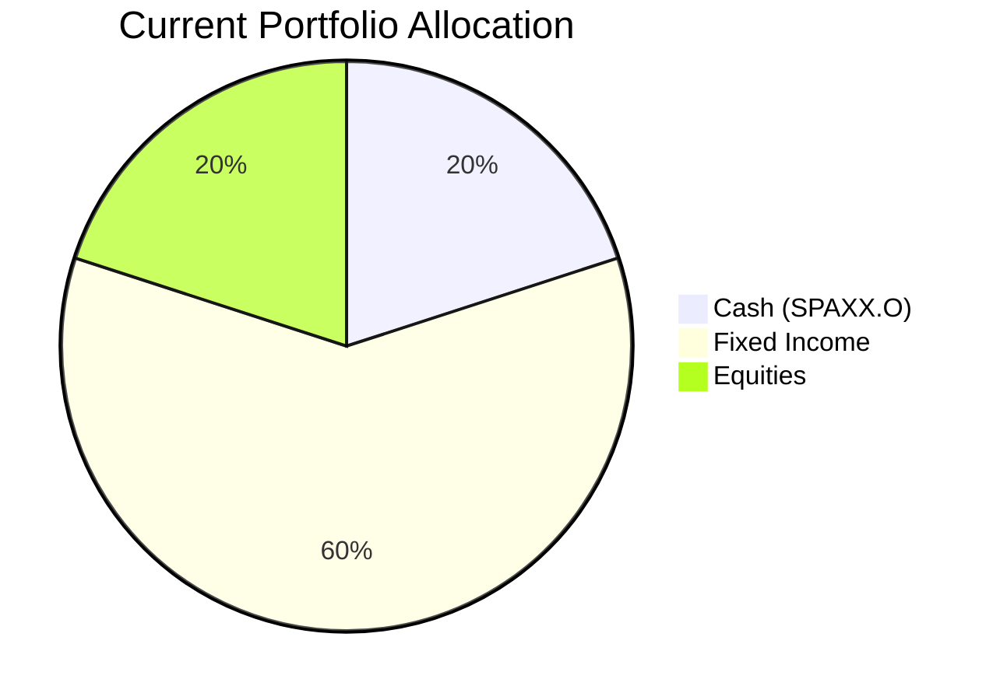
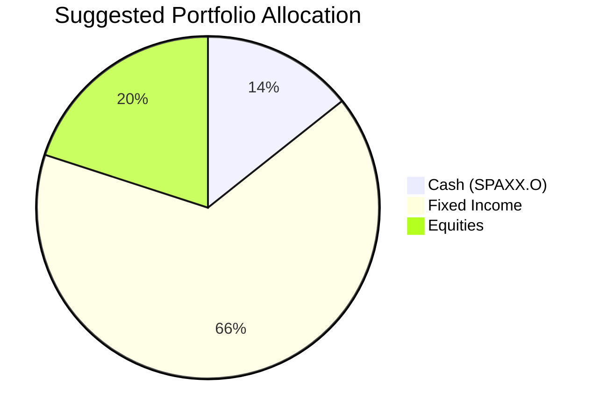

Client Product-Fit Analysis: Rachel Ho
=====================================

# Executive Summary

We recommend deploying USD 150,000 from the client's significant cash holding (SPAXX.O) into the existing position in the **iShares Core U.S. Aggregate Bond ETF (AGG)**. This action directly addresses the portfolio's suboptimal cash allocation by enhancing income generation and maintaining a conservative risk profile. The expected outcome is a modest increase in the portfolio's overall yield and a reduction in cash drag, thereby better aligning the portfolio with the client's primary need for stable income and capital preservation over a 3-7 year horizon.

# Recommended Product: iShares Core U.S. Aggregate Bond ETF (AGG)

## Product Specifications
*   **Issuer:** iShares (BlackRock)
*   **Underlying Index:** Bloomberg U.S. Aggregate Bond Index
*   **Asset Class:** Fixed Income (U.S. Investment Grade Bonds)
*   **Currency:** USD
*   **Risk Rating:** 3 (Low to Medium)
*   **Current Yield:** 3.83% p.a.
*   **Liquidity Score:** 5 (Daily Liquidity, Exchange-Traded)

## Performance Metrics
*   **1-Year Return:** 4.35%
*   **5-Year Annualized Return:** 0.61%
*   **Yield (30-Day SEC):** 3.83%

**Contrast with Cash (SPAXX.O):** While the cash fund (SPAXX.O) provides ultimate capital preservation and liquidity (Certainty 1y: 5), its yield is significantly lower. Allocating a portion to AGG shifts funds from a capital preservation vehicle (Return: 1) to a core income-generating asset (Return: 3), aiming to improve the portfolio's total return without a material increase in risk, as evidenced by AGG's low historical volatility and high credit quality.

## Risk Characteristics
*   **Primary Risks:** Interest rate risk, credit risk (though minimal given investment-grade focus), and market risk.
*   **Volatility:** Low relative to equities. The fund's duration exposes it to price declines if interest rates rise.
*   **Certainty Profile:** Certainty-1y: 3, Certainty-3y: 4, Certainty-8y: 5. This indicates high confidence in return of principal over the long term, with moderate short-term price fluctuation.

## Detailed Justification
The recommendation scores a **Product-Fit Score of 8/10**. This score is based on the following alignment with Client Rachel Ho's profile:

1.  **Meets Primary Need for Income & Stability:** The client's portfolio is heavily oriented towards fixed income, indicating a need for reliable income and capital preservation. AGG is the core building block of a U.S. fixed income portfolio, providing diversified exposure to government and investment-grade corporate bonds. Its 3.83% yield directly enhances the portfolio's income generation.
2.  **Optimal Use of Excess Cash:** The client holds 20% of AUM in cash (SPAXX.O), which creates a significant drag on returns in the current yield environment. Deploying a portion (USD 150,000) into AGG is a prudent step to reduce this drag while staying within the client's conservative mandate.
3.  **Risk Profile Alignment:** AGG carries a Risk Rating of 3, which is appropriate and consistent with the client's existing bond holdings (e.g., VCIT, SHY, USIG). It does not introduce undue complexity or risk.
4.  **Portfolio Simplification & Consolidation:** The client already holds AGG. Increasing this core position simplifies the portfolio rather than adding a new product, making it an efficient and logical adjustment.
5.  **Time Horizon Match:** With a 3-7 year horizon and a high certainty requirement (4), AGG's certainty metrics (3/4/5) are an excellent fit. It offers high certainty of capital over the client's investment period while providing a stable income stream.

# Suggested Portfolio

The following charts and table illustrate the proposed portfolio adjustment.

| Asset | Current Market Value (USD) | Suggested Market Value (USD) | Current % | Suggested % | Change | Remark |
| :--- | :---: | :---: | :---: | :---: | :---: | :--- |
| Fidelity Government Money Market (SPAXX.O) | 560,000 | 410,000 | 20.0% | 14.3% | -5.7% | Reduce cash drag; fund AGG purchase. |
| iShares Core U.S. Aggregate Bond ETF (AGG) | 320,000 | 470,000 | 11.4% | 16.8% | +5.4% | Increase core fixed income holding for yield. |
| Vanguard Intermediate-Term Corp (VCIT.O) | 254,737 | 254,737 | 9.1% | 9.1% | 0.0% | No change. |
| iShares 1-3 Year Treasury Bond ETF (SHY.O) | 276,491 | 276,491 | 9.9% | 9.9% | 0.0% | No change. |
| Eli Lilly and Company (LLY) | 298,246 | 298,246 | 10.7% | 10.7% | 0.0% | No change. |
| iShares Broad USD Inv Grade Corp Bond (USIG.O) | 341,754 | 341,754 | 12.2% | 12.2% | 0.0% | No change. |
| Xiaomi Corporation (1810.HK) | 363,509 | 363,509 | 13.0% | 13.0% | 0.0% | No change. |
| iShares iBoxx $ High Yield Corp Bond ETF (HYG) | 385,263 | 385,263 | 13.8% | 13.8% | 0.0% | No change. |
| **Total** | **2,800,000** | **2,800,000** | **100.0%** | **100.0%** | **0.0%** | |

## Pros and cons of suggested portfolio

**Pros:**
*   **Enhanced Income:** The portfolio's weighted average yield increases by moving funds from near-zero-yield cash to AGG (yield 3.83%).
*   **Maintained Risk Profile:** The shift from cash to a high-quality bond ETF does not materially alter the portfolio's overall conservative risk stance.
*   **Improved Efficiency:** Reduces the opportunity cost of holding excess cash, aiming for better risk-adjusted returns over the client's 3-7 year horizon.
*   **Simplicity:** Builds upon an existing, understood holding rather than introducing product complexity.

**Cons:**
*   **Interest Rate Sensitivity:** AGG has duration risk. In a rising rate environment, its market value could decline in the short term, unlike cash.
*   **Reduced Liquidity Buffer:** While still ample at 14.3%, the cash reserve is slightly reduced. However, AGG itself is highly liquid (Score 5).
*   **Concentration in USD Fixed Income:** The portfolio remains heavily concentrated in U.S. dollar-denominated fixed income assets. This recommendation does not address potential geographic or currency diversification.

## Alternative suggested product to consider

1.  **Vanguard Total Bond Market ETF (BND):** Similar to AGG in its role as a core U.S. aggregate bond fund. It could be considered for minor diversification between index providers, though its risk/return profile is nearly identical.
2.  **iShares 1-3 Year Treasury Bond ETF (SHY.O):** As the client already holds this, a further increase could be an alternative for an even more conservative deployment of cash, offering slightly higher yield than cash with minimal interest rate risk due to its short duration.

# Scenario Analysis

## Normal Market Condition (Probability: 60%)
*Assumption: Steady economic growth with stable interest rates. Bond returns revert to historical averages.*
- **Projected AGG return:** 4.0% p.a. (Based on 5-year average total return, adjusted for current yield).
- **Projected Cash (SPAXX.O) return:** 0.5% p.a. (Conservative estimate for money market funds).

| Product | % Return | Suggested Holding (USD) | Projected PnL (USD) | Current Holding (USD) | Projected PnL (USD) |
| :--- | :---: | :---: | :---: | :---: | :---: |
| AGG | 4.0% | 470,000 | 18,800 | 320,000 | 12,800 |
| SPAXX.O | 0.5% | 410,000 | 2,050 | 560,000 | 2,800 |
| **Rest of Portfolio** | **3.0%** | **1,920,000** | **57,600** | **1,920,000** | **57,600** |
| **Total** | **3.2%** | **2,800,000** | **88,450** | **2,800,000** | **73,200** |

*   **Annual return of suggested portfolio vs current:** 3.16% vs 2.61%
*   **Incremental benefit:** +USD 15,250 annually.

## Upside Market Condition (Probability: 20%)
*Assumption: Economic slowdown leads to central bank rate cuts, boosting bond prices.*
- **Projected AGG return:** 7.0% p.a. (Capital appreciation from falling rates plus yield).
- **Projected Cash (SPAXX.O) return:** 0.3% p.a. (Yields fall with policy rates).

| Product | % Return | Suggested Holding (USD) | Projected PnL (USD) | Current Holding (USD) | Projected PnL (USD) |
| :--- | :---: | :---: | :---: | :---: | :---: |
| AGG | 7.0% | 470,000 | 32,900 | 320,000 | 22,400 |
| SPAXX.O | 0.3% | 410,000 | 1,230 | 560,000 | 1,680 |
| **Rest of Portfolio** | **4.0%** | **1,920,000** | **76,800** | **1,920,000** | **76,800** |
| **Total** | **4.0%** | **2,800,000** | **110,930** | **2,800,000** | **100,880** |

*   **Annual return of suggested portfolio vs current:** 3.96% vs 3.60%
*   **Incremental benefit:** +USD 10,050 annually.

## Downside Market Condition (Probability: 20%)
*Assumption: Persistent inflation triggers further interest rate hikes, pressuring bond prices.*
- **Projected AGG return:** -2.0% p.a. (Capital loss from rising rates partially offset by yield).
- **Projected Cash (SPAXX.O) return:** 1.0% p.a. (Yields rise with policy rates).

| Product | % Return | Suggested Holding (USD) | Projected PnL (USD) | Current Holding (USD) | Projected PnL (USD) |
| :--- | :---: | :---: | :---: | :---: | :---: |
| AGG | -2.0% | 470,000 | -9,400 | 320,000 | -6,400 |
| SPAXX.O | 1.0% | 410,000 | 4,100 | 560,000 | 5,600 |
| **Rest of Portfolio** | **0.5%** | **1,920,000** | **9,600** | **1,920,000** | **9,600** |
| **Total** | **0.2%** | **2,800,000** | **4,300** | **2,800,000** | **8,800** |

*   **Annual return of suggested portfolio vs current:** 0.15% vs 0.31%
*   **Incremental cost:** -USD 4,500 annually. This scenario highlights the short-term opportunity cost and principal risk of moving out of cash.

# Risk Disclosure
- Past performance does not guarantee future returns.
- Projected returns are estimates, not promises.
- Bond ETFs, including AGG, carry risk of principal loss, particularly in rising interest rate environments.

# References
- **Client Profile & Holdings:** wl-2_profile.md, wl-2_holdings.csv
- **Product Catalog:** demo-market-quotes.csv
- **Financial Needs Framework:** common_needs.md
- **Web References:** N/A (Analysis based on provided internal data and historical metrics).
