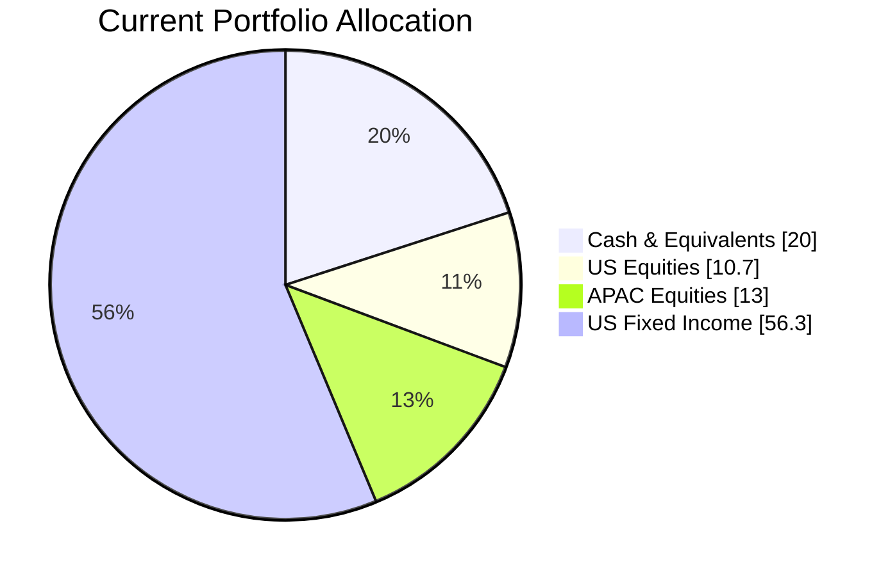
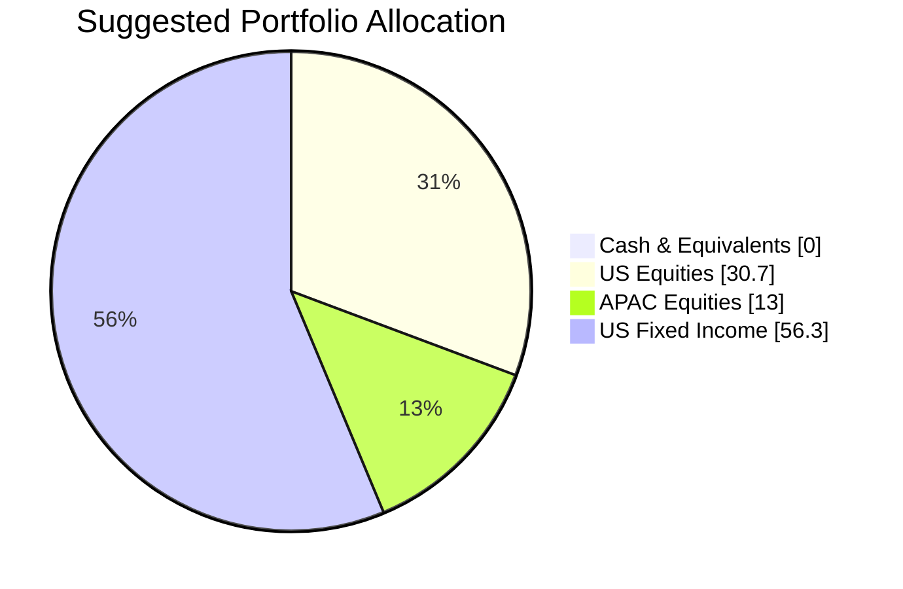

Client Product-Fit Analysis: Rachel Ho
=====================================

# Executive Summary

This proposal recommends a strategic cash-to-equity rotation for Rachel Ho by purchasing the SPDR S&P 500 ETF Trust (SPY), funded entirely from the $560,000 currently held in the Fidelity Government Cash Reserves (SPAXX). SPY is recommended to address the inefficiency of a 20% cash allocation earning only 3.9%, by capturing the higher expected returns of US large-cap equities. This action is expected to improve long-term portfolio growth potential while maintaining a diversified fixed-income core, aligning with an inferred long-term investment horizon.

# Recommended Product: SPDR S&P 500 ETF Trust (SPY)

## Product Specifications

| Field | Value |
|---|---|
| **Product Name** | SPDR S&P 500 ETF Trust |
| **Symbol** | SPY |
| **Asset Class** | Equity – US Large Cap |
| **Currency** | USD |
| **Price (as of 27 Mar 2026)** | $645.09 |
| **Expense Ratio** | 0.0945% |
| **Risk Rating** | 4 (Medium-High) |
| **Liquidity Score** | 5 (Daily Liquidity) |

## Performance Metrics

The table below contrasts the historical performance of the recommended equity ETF (SPY) against the cash holding (SPAXX) it replaces.

| Ticker | YTD Return | 1-Year Return | 5-Year Return (p.a.) | Yield |
|---|---|---|---|---|
| **SPY (Recommended)** | -5.32% | 14.75% | 69.97% (cumulative, ~11.2% p.a.) | 1.06% |
| **SPAXX (Cash/To be Switched Out)** | 0.71% | 3.9% | 16.5% (cumulative, ~3.1% p.a.) | 3.9% |

SPY has delivered significantly higher long-term returns compared to the cash money market fund, though with notably higher volatility, which is consistent with its higher risk rating.

## Risk Characteristics

| Metric | Value |
|---|---|
| **Risk Rating** | 4 (Scale: 1-Low to 5-High) |
| **Expected Return Score** | 4 |
| **Certainty-1y** | 2 |
| **Certainty-3y** | 3 |
| **Certainty-8y** | 4 |
| **Volatility** | 4 |

SPY carries a higher risk profile than the cash it replaces. However, for a long-term investor, the certainty of achieving the target return increases significantly with the holding period, as reflected in the Certainty scores rising from 2 to 4 over time.

## Detailed Justification

The rationale for recommending SPY is as follows:

1.  **Inefficient Cash Allocation:** Rachel Ho's portfolio holds 20% ($560,000) in a money market fund (SPAXX) yielding only 3.9%. This level of cash is excessive for a long-term investment portfolio and creates a drag on potential growth, especially in a moderate-to-positive market environment.
2.  **Rotation into Growth:** Re-allocating this cash into US equities via the S&P 500 (SPY) provides a more efficient growth engine. Historically, the S&P 500 has provided a significant equity risk premium over cash. SPY offers broad, diversified exposure to 500 leading US companies, which complements the existing bond holdings.
3.  **Diversification Benefit:** The existing portfolio is heavily weighted (62.9%) toward fixed income. Adding SPY improves equity diversification without creating undue concentration, as the client already holds individual US and APAC equities (LLY, 1810.HK). There is no overlap with the suggested product.
4.  **Portfolio Fit Score: 4/5**

# Suggested Portfolio

| Asset | Current Market Value (USD) | Suggested Market Value (USD) | Current % | Suggested % | Change | Remark |
|---|---|---|---|---|---|---|
| Fidelity Government Cash Reserves (SPAXX.O) | 560,000 | 0 | 20.0% | 0.0% | -20.0% | Redeemed to fund SPY purchase. |
| SPDR S&P 500 ETF Trust (SPY) | 0 | 560,000 | 0.0% | 20.0% | +20.0% | New purchase. Provides US large-cap growth. |
| Eli Lilly and Company (LLY) | 298,246 | 298,246 | 10.7% | 10.7% | 0.0% | Held. |
| Xiaomi Corporation (1810.HK) | 363,509 | 363,509 | 13.0% | 13.0% | 0.0% | Held. |
| Vanguard Int-Term Corp Bond ETF (VCIT.O) | 254,737 | 254,737 | 9.1% | 9.1% | 0.0% | Held. |
| iShares 1-3 Year Treasury Bond ETF (SHY.O) | 276,491 | 276,491 | 9.9% | 9.9% | 0.0% | Held. |
| iShares Core U.S. Aggregate Bond ETF (AGG) | 320,000 | 320,000 | 11.4% | 11.4% | 0.0% | Held. |
| iShares Broad USD Inv Grade Corp Bond ETF (USIG.O) | 341,754 | 341,754 | 12.2% | 12.2% | 0.0% | Held. |
| iShares iBoxx $ High Yield Corp Bond ETF (HYG) | 385,263 | 385,263 | 13.8% | 13.8% | 0.0% | Held. |
| **Total** | **2,800,000** | **2,800,000** | **100.0%** | **100.0%** | **0.0%** | |

## Pros and Cons of Suggested Portfolio

**Pros:**
- **Enhanced Growth Potential:** The shift from cash (3.9% yield) to US equities (SPY) significantly increases the portfolio's long-term return potential, which is crucial for long-term wealth accumulation.
- **Improved Diversification:** Adds a diversified US equity component to a portfolio that is predominantly fixed-income, reducing overall portfolio sensitivity to interest rate movements.
- **Inflation Hedge:** Equities historically provide a better hedge against inflation compared to cash or short-duration bonds.

**Cons:**
- **Increased Volatility:** The new portfolio will be more volatile in the short term due to the addition of a 20% equity allocation. A market downturn could result in a temporary drawdown.
- **Sector Concentration:** SPY is still heavily weighted towards the Technology sector (~30%), which, while a source of historical growth, introduces a sector concentration risk.
- **Foreign Exchange Risk:** SPY is a USD-denominated asset. If Rachel's base currency is not USD, the value of the holding will be affected by USD/HKD exchange rate fluctuations.

## Alternative Suggested Products to Consider

1.  **Invesco QQQ Trust (QQQ):** For a more aggressive growth tilt, QQQ tracks the Nasdaq-100, which has historically outperformed the S&P 500. This would be suitable if Rachel has a higher risk appetite and a focus on technology-driven growth.
2.  **iShares Core S&P 500 ETF (IVV):** This is an alternative S&P 500 ETF with a lower expense ratio (0.03%) than SPY. If the goal is purely to track the benchmark at the lowest cost, IVV is a superior alternative to SPY for a buy-and-hold investor.

# Scenario Analysis

## Normal Market Condition
- **Projected US Equity (SPY) Return:** 10%. Based on the average annual return of the S&P 500 over the last 10 years (2016-2026). This represents a continuation of moderate economic growth.
- **Projected Fixed Income (existing holdings) Return:** 4.0%. This reflects a weighted average of the current yields on the bond ETFs (VCIT, SHY, AGG, USIG, HYG).
- **Projected Cash (SPAXX) Return:** 3.9%. The current yield.
- **Projected APAC Equity (LLY, 1810.HK) Return:** 8%. A moderate assumption for individual US and APAC growth equities, below the broader US market to account for company-specific risk.

| Product | % Return (Normal) | Suggested Holding Value | Return | Current Holding Value | Return |
|---|---|---|---|---|---|
| SPY (Suggested/Shift from Cash) | 10% | 560,000 | 56,000 | 0 | 0 |
| Cash (SPAXX) | 3.9% | 0 | 0 | 560,000 | 21,840 |
| Other Equity (LLY, 1810.HK) | 8% | 661,755 | 52,940 | 661,755 | 52,940 |
| Fixed Income (VCIT, SHY, AGG, USIG, HYG) | 4% | 1,578,245 | 63,130 | 1,578,245 | 63,130 |
| **Total** | **-** | **2,800,000** | **172,070** | **2,800,000** | **137,910** |

- Annual return of the suggested portfolio vs current : **6.1% vs 4.9%**
- Incremental benefit: **+USD 34,160 annually (+24.7% improvement)**

## Good Market Condition – Strong US Equity Rally
- **Projected US Equity (SPY) Return:** 20%. Reflects a scenario with strong corporate earnings, AI-driven productivity gains, and a favorable interest rate environment. This is within the range of the 1-year return of SPY (14.75%) but assumes an acceleration.
- **Projected Fixed Income Return:** 3.5%. A minor decline in bond prices is assumed as yields rise moderately with a stronger economy.
- **Projected Cash Return:** 3.9%.
- **Projected APAC Equity Return:** 15%.

| Product | % Return (Upside) | Suggested Holding Value | Return | Current Holding Value | Return |
|---|---|---|---|---|---|
| SPY (Suggested/Shift from Cash) | 20% | 560,000 | 112,000 | 0 | 0 |
| Cash (SPAXX) | 3.9% | 0 | 0 | 560,000 | 21,840 |
| Other Equity (LLY, 1810.HK) | 15% | 661,755 | 99,263 | 661,755 | 99,263 |
| Fixed Income (VCIT, SHY, AGG, USIG, HYG) | 3.5% | 1,578,245 | 55,239 | 1,578,245 | 55,239 |
| **Total** | **-** | **2,800,000** | **266,502** | **2,800,000** | **176,342** |

- Annual return of the suggested portfolio vs current : **9.5% vs 6.3%**
- Incremental benefit: **+USD 90,160 annually (+51.1% improvement)**

## Bad Market Condition – US Recession
- **Projected US Equity (SPY) Return:** -15%. This is more conservative than the -20% seen during COVID-19, assuming a standard recession. It reflects a sharp contraction in corporate profits.
- **Projected Fixed Income Return:** 2.0%. Bonds provide a hedge in this scenario as yields fall and prices rise. The return is a mix of price appreciation and coupon.
- **Projected Cash Return:** 3.9%.
- **Projected APAC Equity Return:** -20%.

| Product | % Return (Downside) | Suggested Holding Value | Return | Current Holding Value | Return |
|---|---|---|---|---|---|
| SPY (Suggested/Shift from Cash) | -15% | 560,000 | -84,000 | 0 | 0 |
| Cash (SPAXX) | 3.9% | 0 | 0 | 560,000 | 21,840 |
| Other Equity (LLY, 1810.HK) | -20% | 661,755 | -132,351 | 661,755 | -132,351 |
| Fixed Income (VCIT, SHY, AGG, USIG, HYG) | 2.0% | 1,578,245 | 31,565 | 1,578,245 | 31,565 |
| **Total** | **-** | **2,800,000** | **-184,786** | **2,800,000** | **-78,946** |

- Annual return of the suggested portfolio vs current : **-6.6% vs -2.8%**
- Downside consequence: **-USD 105,840 more in losses during a bear market.**

# Risk Disclosure

- **Past performance does not guarantee future returns.** Historical returns cited for SPY, SPAXX, and other assets are not an indicator of future results.
- **Projected returns are estimates, not promises.** The scenario analysis is a hypothetical illustration based on certain market assumptions and should not be considered a guaranteed outcome.
- **Equity investments carry the risk of principal loss.** The value of SPY can fall, and investors may lose a significant portion or all of their investment.
- **Structured products and other complex instruments have their own specific risks, including potential total loss of principal.**

# References

- **Product Catalog:** demo-market-quotes.csv (Source: Planbot Internal Data)
- **Client Profile:** wl-2_profile.md (Source: Planbot Internal Data)
- **Product Facts:** Sector SPDR ETF document, overview of product catalog and CMT_note_N02952 were reviewed for product context but not directly referenced.
- **Web Search:** N/A (No web search capability was used).
