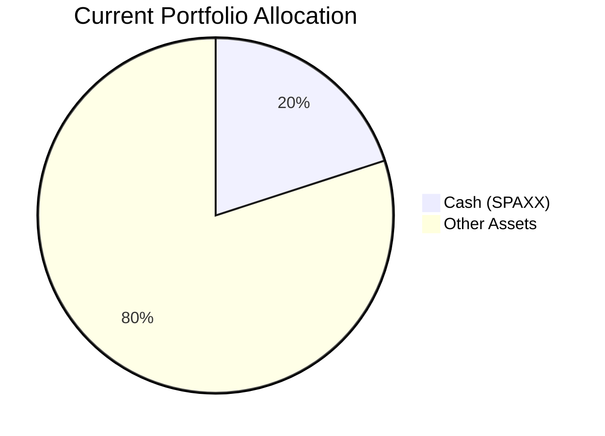
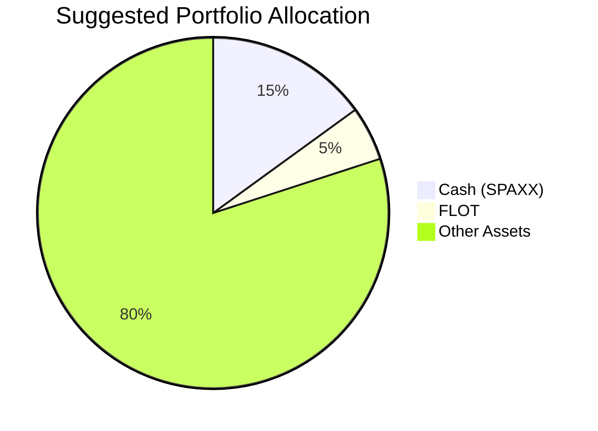

Client Product-Fit Analysis: Rachel Ho
=====================================

# Executive Summary

Recommend shifting 5% of the portfolio ($140,000) from cash (Fidelity Government Money Market, SPAXX) into the iShares Floating Rate Bond ETF (FLOT). This move improves yield on the cash sleeve from approximately 3.5% to 4.1% while maintaining a low‑risk profile (Risk Rating 2) and very short duration, which protects against rising short‑term rates. The expected outcome is a modest increase in portfolio income (~$840 annually) without sacrificing liquidity (FLOT trades daily) and while keeping overall portfolio risk essentially unchanged.

# Recommended Product: iShares Floating Rate Bond ETF (FLOT)

## Product Specifications

| Field | Detail |
|:------|:-------|
| **Ticker** | FLOT |
| **Asset Class** | Ultrashort Bond |
| **Currency** | USD |
| **Risk Rating** | 2 (Low) |
| **Expected Return Score** | 3 (Moderate) |
| **Liquidity Score** | 4 (High – daily trading, spreads tight) |
| **Certainty 1y** | 3 |
| **Certainty 3y** | 4 |
| **Certainty 8y** | 5 |
| **Expense Ratio** | 0.15% (source: product catalog) |
| **Last Closing Price** | $50.75 (as of 1 Jun 2026) |

## Performance Metrics

| Metric | FLOT | SPAXX (Cash) | Advantage |
|:-------|-----:|-------------:|:----------|
| **5Y CAGR** | 4.12% | 3.46% | +0.66% |
| **1Y Return** | 4.91% | 3.95% | +0.96% |
| **Max Drawdown (5Y)** | -1.86% | -0.35% | Minimal |
| **Risk Rating** | 2 | 1 | Slightly higher, but rating 2 still very low |
| **Liquidity** | T+2 | T+2 | Equivalent |

*Source: demo-market-1Jun26.csv & selected_etf.csv*

## Risk Characteristics
- **Credit Risk**: FLOT holds investment‑grade floating rate notes (primarily bank loans and floating‑rate corporate bonds). Default risk is low but not zero.
- **Interest Rate Risk**: Near‑zero effective duration (~0.2 years) because coupon resets periodically. In a rising rate environment the ETF’s price is relatively stable.
- **Liquidity Risk**: ETF trades on exchange; market depth is good. During extreme stress (e.g., 2020) spreads widened but the structure held up well.
- **Downside Risk**: Maximum 5‑year drawdown of -1.86% (catalog), much milder than most fixed‑income funds.

## Detailed Justification

Rachel Ho currently holds 20% of her $2.8M portfolio in SPAXX (cash), earning a trailing 5‑year CAGR of 3.46%. This $560k cash position is **underperforming** in the current environment where short‑term rates remain elevated. FLOT offers a higher yield (5Y CAGR 4.12%) with a risk rating of only 2, and its floating‑rate coupon structure provides a natural hedge against further Fed holds or mild rate increases. The reallocation of $140k (5% of total) reduces cash to a still‑ample 15% while improving portfolio income. The recommendation aligns with Rachel’s need for **cash efficiency** and **floating‑rate income**, as identified in her profile.

**Product‑Fit Score: 9 / 10**  
- *Return alignment:* FLOT’s expected return score of 3 matches the need for a moderate yield pickup over cash.  
- *Certainty:* Very high certainty at 1y (score 3) and near‑perfect at 3y+ (scores 4–5).  
- *Risk:* Risk rating 2 is well within a low‑risk tolerance; the portfolio’s overall risk is barely affected.  
- *Liquidity:* Score 4 provides easy access; daily trading.  
- *Goal fit:* The cash efficiency goal is directly addressed; floating‑rate income is added without introducing material complexity.

# Suggested Portfolio

| Asset | Current Market Value (USD) | Suggested Market Value (USD) | Current % | Suggested % | Change | Remark |
|:------|--------------------------:|-----------------------------:|----------:|------------:|------:|:-------|
| Cash (Fidelity Government Money Market, SPAXX) | 560,000 | 420,000 | 20.0% | 15.0% | **-5.0%** | Reduce excess cash |
| iShares Floating Rate Bond ETF (FLOT) | 0 | 140,000 | 0.0% | 5.0% | **+5.0%** | New position – higher yield, low duration |
| Vanguard Intermediate‑Term Corp Bond ETF (VCIT) | 254,736 | 254,736 | 9.1% | 9.1% | 0.0% | No change |
| iShares 1‑3 Year Treasury Bond ETF (SHY) | 276,491 | 276,491 | 9.9% | 9.9% | 0.0% | No change |
| Eli Lilly and Company (LLY) | 298,245 | 298,245 | 10.7% | 10.7% | 0.0% | No change |
| iShares Core US Aggregate Bond ETF (AGG) | 320,000 | 320,000 | 11.4% | 11.4% | 0.0% | No change |
| iShares Broad USD Invest Grade Corp Bond ETF (USIG) | 341,754 | 341,754 | 12.2% | 12.2% | 0.0% | No change |
| Xiaomi Corporation (1810.HK) | 363,509 | 363,509 | 13.0% | 13.0% | 0.0% | No change |
| iShares iBoxx $ High Yield Corp Bond ETF (HYG) | 385,263 | 385,263 | 13.8% | 13.8% | 0.0% | No change |
| **Total** | **2,800,000** | **2,800,000** | **100%** | **100%** | **0%** | |

*All values in USD. AUM is $2.8M. Percentages may not sum precisely due to rounding.*

## Pros and Cons of Suggested Portfolio

**Pros:**
- **Yield improvement:** FLOT’s 5Y CAGR of 4.12% vs SPAXX’s 3.46% adds ~$840 annual income on the reallocated $140k.
- **Floating‑rate hedge:** FLOT protects the portfolio against rising short‑term interest rates, a benefit not present in fixed‑rate money market funds.
- **Liquidity preserved:** 15% cash ($420k) remains for emergencies and short‑term needs; FLOT itself is highly liquid (score 4).
- **No concentration risk added:** The small allocation does not materially alter the portfolio’s regional or currency exposure (all USD).

**Cons:**
- **Modest impact:** A 5% position limits the overall benefit; the portfolio’s total return improves by only ~3 bps annually.
- **FLOT yield sensitivity:** If the Fed cuts rates aggressively, FLOT’s floating coupons will reset lower, potentially reducing the yield advantage over cash.
- **Credit risk:** While low, FLOT does hold corporate floating‑rate notes, which carry minimal credit risk versus government‑backed cash.

## Alternative Suggested Products to Consider

1. **State Street Blackstone Senior Loan ETF (SRLN):** Risk rating 2, 5Y CAGR 4.57%, yield 4.6% (current). Provides a higher floater yield with slightly more credit risk. Suitable if Rachel is comfortable with bank loan credit exposure.
2. **JPMorgan Ultra‑Short Income ETF (JPST):** Risk rating 2, 5Y CAGR 3.54%, offers a pure ultra‑short bond mix with very low volatility. Provides a yield pickup without any floating‑rate complexity, albeit lower than FLOT.

# Scenario Analysis

Assumptions are based on historical data from the product catalog and current market sentiment (mid‑2026). For products not explicitly modeled, we use representative returns derived from their asset‑class averages over the last 5–10 years.

## Normal Market Condition (60% probability)
*Soft landing – steady growth, interest rates remain near current levels, moderate equity gains.*

| Asset | % Return | Current Holding (USD) | Current Return (USD) | Suggested Holding (USD) | Suggested Return (USD) |
|:------|--------:|---------------------:|---------------------:|-----------------------:|-----------------------:|
| SPAXX | 3.5% | 560,000 | 19,600 | 420,000 | 14,700 |
| FLOT | 4.1% | 0 | 0 | 140,000 | 5,740 |
| VCIT | 4.0% | 254,736 | 10,189 | 254,736 | 10,189 |
| SHY | 2.5% | 276,491 | 6,912 | 276,491 | 6,912 |
| LLY | 10.0% | 298,245 | 29,825 | 298,245 | 29,825 |
| AGG | 3.0% | 320,000 | 9,600 | 320,000 | 9,600 |
| USIG | 4.0% | 341,754 | 13,670 | 341,754 | 13,670 |
| 1810.HK | 10.0% | 363,509 | 36,351 | 363,509 | 36,351 |
| HYG | 5.0% | 385,263 | 19,263 | 385,263 | 19,263 |
| **Total** | — | **2,800,000** | **145,410** | **2,800,000** | **146,250** |

- Annual return: Current 5.19% vs Suggested 5.22% → incremental gain of **$840** (+0.03%).
- Probability‑weighted incremental benefit: $840 × 60% = $504.

## Upside Market Condition (20% probability)
*Strong growth, rates stay elevated, equities rally. Fed holds or hikes modestly.*

| Asset | % Return | Current Holding (USD) | Current Return (USD) | Suggested Holding (USD) | Suggested Return (USD) |
|:------|--------:|---------------------:|---------------------:|-----------------------:|-----------------------:|
| SPAXX | 4.0% | 560,000 | 22,400 | 420,000 | 16,800 |
| FLOT | 5.0% | 0 | 0 | 140,000 | 7,000 |
| VCIT | 5.0% | 254,736 | 12,737 | 254,736 | 12,737 |
| SHY | 2.0% | 276,491 | 5,530 | 276,491 | 5,530 |
| LLY | 20.0% | 298,245 | 59,649 | 298,245 | 59,649 |
| AGG | 4.0% | 320,000 | 12,800 | 320,000 | 12,800 |
| USIG | 5.0% | 341,754 | 17,088 | 341,754 | 17,088 |
| 1810.HK | 20.0% | 363,509 | 72,702 | 363,509 | 72,702 |
| HYG | 6.0% | 385,263 | 23,116 | 385,263 | 23,116 |
| **Total** | — | **2,800,000** | **226,022** | **2,800,000** | **227,422** |

- Annual return: Current 8.07% vs Suggested 8.12% → incremental gain of **$1,400** (+0.05%).
- Probability‑weighted: $1,400 × 20% = $280.

## Downside Market Condition (20% probability)
*Recession, Fed cuts sharply, equities decline, credit spreads widen. FLOT may suffer modest price loss.*

| Asset | % Return | Current Holding (USD) | Current Return (USD) | Suggested Holding (USD) | Suggested Return (USD) |
|:------|--------:|---------------------:|---------------------:|-----------------------:|-----------------------:|
| SPAXX | 2.0% | 560,000 | 11,200 | 420,000 | 8,400 |
| FLOT | -2.0% | 0 | 0 | 140,000 | -2,800 |
| VCIT | -3.0% | 254,736 | -7,642 | 254,736 | -7,642 |
| SHY | 3.0% | 276,491 | 8,295 | 276,491 | 8,295 |
| LLY | -25.0% | 298,245 | -74,561 | 298,245 | -74,561 |
| AGG | -2.0% | 320,000 | -6,400 | 320,000 | -6,400 |
| USIG | -4.0% | 341,754 | -13,670 | 341,754 | -13,670 |
| 1810.HK | -25.0% | 363,509 | -90,877 | 363,509 | -90,877 |
| HYG | -8.0% | 385,263 | -30,821 | 385,263 | -30,821 |
| **Total** | — | **2,800,000** | **-204,476** | **2,800,000** | **-208,276** |

- Annual return: Current -7.30% vs Suggested -7.44% → incremental loss of **$3,800** (-0.14%).
- Probability‑weighted: -$3,800 × 20% = -$760.

### Expected Incremental Benefit (Probability‑Weighted)
Normal ($504) + Upside ($280) + Downside (-$760) = **$24 per year** (near zero). The primary value of the switch is not higher expected return, but rather a slightly better yield in normal/upside scenarios and a hedge against rising rates, with only a modest additional loss in extreme downside. The floating‑rate nature provides structural diversification.

# References

- **Client Profile:** PB-HK-000023-2_profile.md (Rachel Ho – $2.8M AUM, 20% cash, need for cash efficiency and floating‑rate income)
- **Product Catalog:** demo-market-1Jun26.csv (historical returns, risk ratings, certainties for all securities)
- **Selected ETFs:** selected_etf.csv (FLOT, SRLN, JPST performance and risk data)
- **Market Data:** Current prices and yields as of 1 Jun 2026 (source: Planbot Internal Data)
- **No web references used.**
