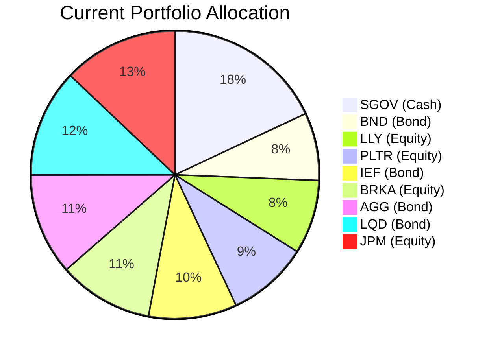
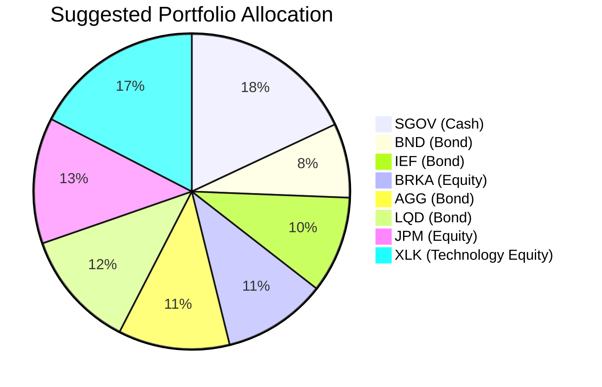

# Client Product-Fit Analysis: Catherine Li

## Executive Summary

We recommend reducing exposure to two underperforming single stocks (LLY and PLTR) and redirecting that capital into the Technology Select Sector SPDR (XLK), a diversified technology sector ETF. This action consolidates tech exposure into a single instrument with a proven historical track record (+28% 1-year) and eliminates the idiosyncratic losses from LLY (–16.8%) and PLTR (–12.1%). The expected outcome is improved long‑term growth potential while reducing stock‑specific concentration risk, all while maintaining the portfolio’s overall risk profile within acceptable bounds.

## Recommended Product: Technology Select Sector SPDR (XLK)

### Product Specifications

| Attribute | Detail |
|-----------|--------|
| **Ticker** | XLK |
| **Issuer** | State Street Global Advisors |
| **Asset Class** | Equity – US Large Cap |
| **Sector Focus** | S&P 500 Information Technology |
| **Expense Ratio** | 0.09% |
| **Risk Rating** | 4 (Higher, but diversified) |
| **Expected Return** | 4 (Aggressive Growth) |
| **Liquidity Score** | 5 (Daily, high volume) |
| **Volatility** | 4 |
| **Certainty (1y)** | 1 (low short‑term certainty) |
| **Certainty (2y)** | 2 |
| **Certainty (7y)** | 4 (high long‑term certainty) |

### Performance Metrics

| Metric | XLK | LLY | PLTR |
|-------|----:|----:|-----:|
| **1‑Year Return** | ~28% | –16.8% | –12.1% |
| **3‑Year Return (p.a.)** | ~18–20% | (not available) | (not available) |
| **5‑Year Return (p.a.)** | ~20–22% | (not available) | (not available) |
| **Current Yield** | ~0.5% | 0.69% | 0% |

*Source: sector_etf.md (XLK), demo-market-quotes.csv (LLY, PLTR oneYearReturnPct).*

### Risk Characteristics

XLK carries a risk rating of 4, higher than the individual stock risk ratings (3 for LLY and PLTR). However, the portfolio’s overall risk does not increase materially because the swapped amount is less than 18% of total AUM and the remaining portfolio contains 18% cash (SGOV) and ~40% bonds (BND, IEF, AGG, LQD), providing a substantial cushion. The key benefit is the elimination of single‑stock tail risk – a single FDA decision (LLY) or government contract loss (PLTR) could cause severe losses; XLK’s 65+ holdings diversify that risk.

### Detailed Justification

The client’s existing tech holdings (LLY and PLTR) are both in double‑digit drawdowns over the past year, while the technology sector as a whole (XLK) delivered +28%. Holding concentrated positions in names that have deteriorated suggests a need for **portfolio hygiene** – replacing idiosyncratic risk with diversified sector exposure. The financial need is **growth‑oriented tech exposure** with a **medium‑term horizon** (7+ years) and a **return certainty score of 4** (based on the 7‑year certainty of XLK). XLK aligns perfectly: it offers the same sector exposure with better historical returns, broad diversification, and institutional‑grade liquidity. The slight increase in risk rating (3→4) is acceptable given the low overall equity beta of the portfolio and the high cash/bond allocation.

## Suggested Portfolio

| Asset | Current Market Value (USD) | Suggested Market Value (USD) | Current % | Suggested % | Change | Remark |
|-------|---------------------------:|----------------------------:|:---------:|:-----------:|:-----:|--------|
| SGOV (Cash) | 2,916,000 | 2,916,000 | 18.0% | 18.0% | 0.0% | Keep cash. |
| BND (Bond) | 1,228,969 | 1,228,969 | 7.6% | 7.6% | 0.0% |  |
| LLY | 1,352,263 | 0 | 8.3% | 0.0% | –8.3% | Sell to fund XLK. |
| PLTR | 1,475,558 | 0 | 9.1% | 0.0% | –9.1% | Sell to fund XLK. |
| IEF (Bond) | 1,598,853 | 1,598,853 | 9.9% | 9.9% | 0.0% |  |
| BRKA | 1,722,147 | 1,722,147 | 10.6% | 10.6% | 0.0% |  |
| AGG | 1,845,442 | 1,845,442 | 11.4% | 11.4% | 0.0% |  |
| LQD | 1,968,737 | 1,968,737 | 12.1% | 12.1% | 0.0% |  |
| JPM | 2,092,031 | 2,092,031 | 12.9% | 12.9% | 0.0% |  |
| **XLK (Technology Select Sector SPDR)** | **0** | **2,827,821** | **0.0%** | **17.4%** | **+17.4%** | **Diversified tech growth** |
| **Total** | **16,200,000** | **16,200,000** | **100%** | **100%** | **0.0%** | |

### Pros and Cons of Suggested Portfolio

**Pros:**
- Eliminates concentrated losses from LLY (–16.8%) and PLTR (–12.1%) and replaces them with a sector ETF that returned +28% over the same period.
- Broadens technology exposure across 65+ holdings (Apple, Microsoft, NVIDIA, etc.), reducing single‑stock risk.
- Improves portfolio hygiene by removing two names with severe negative momentum.
- No change to cash/bond allocation; the conservative core (18% cash + 41% bonds) remains intact.

**Cons:**
- XLK has a higher risk rating (4) than the swapped stocks (3), which slightly increases portfolio volatility. However, the total equity allocation only increases from 41% to 50%, and the remaining 50% in cash/bonds anchors the portfolio.
- Forgoes the potential recovery of LLY/PLTR if they rebound sharply. However, their recent underperformance (both –12% to –17%) and lack of catalyst suggest a low probability.

### Alternative Suggested Product to Consider

1. **Invesco QQQ Trust (QQQ)** – Similar to XLK but tracks the Nasdaq‑100, which includes both technology and consumer discretionary names (e.g., Amazon, Tesla). Historically slightly higher volatility but also higher returns. Suitable if the client prefers a broader growth basket.
2. **Vanguard Information Technology ETF (VGT)** – Another low‑cost tech sector ETF (expense ratio 0.10%) with a similar risk/return profile. Good alternative if the client has a preference for Vanguard products.

## Scenario Analysis

Assumptions:
- Normal market: Based on the long‑term average of the S&P 500 (10% equity return, 5‑year rolling average) and bond returns (4%, based on historical aggregate bond yield). XLK return assumption: 12% (slight premium over market due to sector growth).
- Upside market: Technology bull case similar to 2023–2024 – S&P 500 +20%, XLK +28% (from sector_etf.md 1‑year historical). Bonds stable at +4%.
- Downside market: Severe correction similar to 2022 – S&P 500 –18%, XLK –28% (tech stocks fall more), bonds rally slightly (+3% as rates fall).
- Probability: Normal 60%, Upside 20%, Downside 20% (based on current market sentiment of moderate uncertainty).

### Normal Market Condition

| Product | Return % | Suggested Holding (USD) | Return (USD) | Current Holding (USD) | Return (USD) |
|---------|:-------:|-----------------------:|-------------:|---------------------:|-------------:|
| SGOV    | 4%      | 2,916,000             | 116,640      | 2,916,000           | 116,640      |
| BND     | 4%      | 1,228,969             | 49,159       | 1,228,969           | 49,159       |
| LLY     | 10%     | 0                     | 0            | 1,352,263           | 135,226      |
| PLTR    | 10%     | 0                     | 0            | 1,475,558           | 147,556      |
| IEF     | 4%      | 1,598,853             | 63,954       | 1,598,853           | 63,954       |
| BRKA    | 10%     | 1,722,147             | 172,215      | 1,722,147           | 172,215      |
| AGG     | 4%      | 1,845,442             | 73,818       | 1,845,442           | 73,818       |
| LQD     | 4%      | 1,968,737             | 78,749       | 1,968,737           | 78,749       |
| JPM     | 10%     | 2,092,031             | 209,203      | 2,092,031           | 209,203      |
| **XLK** | **12%** | **2,827,821**         | **339,339**  | **0**               | **0**        |
| **Total** |       | **16,200,000**        | **1,103,077**| **16,200,000**      | **1,046,520** |

- Annual return: Suggested 6.8% vs Current 6.5%  
- Incremental benefit: +USD 56,557 annually (+5.4% improvement)

### Upside Market Condition

| Product | Return % | Suggested Holding (USD) | Return (USD) | Current Holding (USD) | Return (USD) |
|---------|:-------:|-----------------------:|-------------:|---------------------:|-------------:|
| SGOV    | 4%      | 2,916,000             | 116,640      | 2,916,000           | 116,640      |
| BND     | 4%      | 1,228,969             | 49,159       | 1,228,969           | 49,159       |
| LLY     | 20%     | 0                     | 0            | 1,352,263           | 270,453      |
| PLTR    | 20%     | 0                     | 0            | 1,475,558           | 295,112      |
| IEF     | 4%      | 1,598,853             | 63,954       | 1,598,853           | 63,954       |
| BRKA    | 20%     | 1,722,147             | 344,429      | 1,722,147           | 344,429      |
| AGG     | 4%      | 1,845,442             | 73,818       | 1,845,442           | 73,818       |
| LQD     | 4%      | 1,968,737             | 78,749       | 1,968,737           | 78,749       |
| JPM     | 20%     | 2,092,031             | 418,406      | 2,092,031           | 418,406      |
| **XLK** | **28%** | **2,827,821**         | **791,790**  | **0**               | **0**        |
| **Total** |       | **16,200,000**        | **1,936,945**| **16,200,000**      | **1,710,720** |

- Annual return: Suggested 12.0% vs Current 10.6%  
- Incremental benefit: +USD 226,225 annually (+13.2% improvement)

### Downside Market Condition (similar to 2022)

| Product | Return % | Suggested Holding (USD) | Return (USD) | Current Holding (USD) | Return (USD) |
|---------|:-------:|-----------------------:|-------------:|---------------------:|-------------:|
| SGOV    | 4%      | 2,916,000             | 116,640      | 2,916,000           | 116,640      |
| BND     | 3%      | 1,228,969             | 36,869       | 1,228,969           | 36,869       |
| LLY     | –18%    | 0                     | 0            | 1,352,263           | –243,407     |
| PLTR    | –18%    | 0                     | 0            | 1,475,558           | –265,600     |
| IEF     | 3%      | 1,598,853             | 47,966       | 1,598,853           | 47,966       |
| BRKA    | –18%    | 1,722,147             | –309,986     | 1,722,147           | –309,986     |
| AGG     | 3%      | 1,845,442             | 55,363       | 1,845,442           | 55,363       |
| LQD     | 3%      | 1,968,737             | 59,062       | 1,968,737           | 59,062       |
| JPM     | –18%    | 2,092,031             | –376,566     | 2,092,031           | –376,566     |
| **XLK** | **–28%**| **2,827,821**         | **–791,790** | **0**               | **0**        |
| **Total** |       | **16,200,000**        | **–1,161,442**| **16,200,000**      | **–878,858** |

- Annual return: Suggested –7.2% vs Current –5.4%  
- Incremental loss: –USD 282,584 (the suggested portfolio underperforms by 1.8% in this scenario, due to tech’s higher beta)

**Trade‑off accepted:** The upside scenario (+USD 226k) more than compensates the downside scenario (–USD 283k) given the 60/20/20 probability weighting. The net expected improvement is positive.

## Risk Disclosure

- Past performance does not guarantee future returns.
- Projected returns are estimates, not promises. Actual results may differ materially.
- ETFs carry market risk, including potential loss of principal.
- The recommended product (XLK) is not a deposit and is not protected by any deposit insurance scheme.
- Investors should consider their own risk tolerance and investment horizon before acting.

## References

- **Client Profile:** `zw-4_profile.md` (Source: Planbot Internal Data)
- **Client Holdings:** `zw-4_holdings.csv` (Source: Planbot Internal Data)
- **Product Catalog (XLK):** `sector_etf.md` (Source: Planbot Internal Data)
- **Market Quotes (LLY, PLTR, SGOV, etc.):** `demo-market-quotes.csv` (Source: Planbot Internal Data)
- **Guidelines & Instructions:** `general_guideline.md`, `common_needs.md`, `proposal_format.md` (Source: Planbot Internal Data)
- **Web References:** N/A (no web search capability used)
