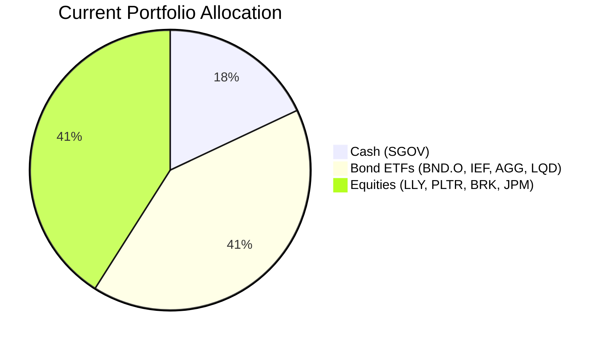
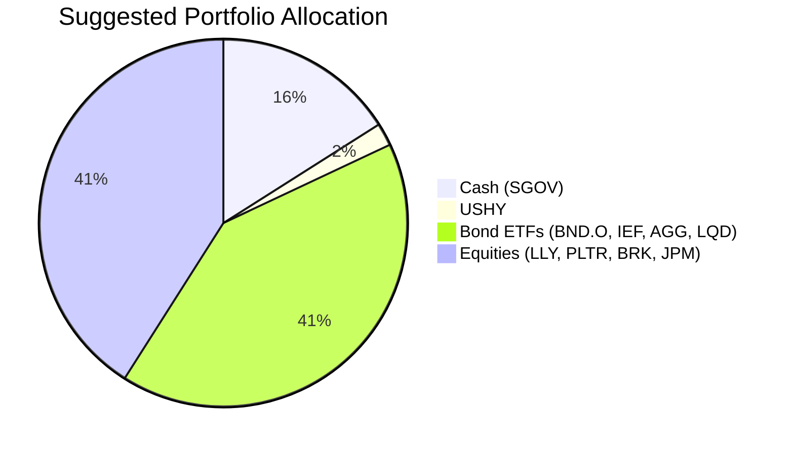

Client Product-Fit Analysis: Catherine Li
=====================================

# Executive Summary
Recommended action: Reduce the cash position (SGOV) by $324,000 (2% of portfolio) and allocate to iShares Broad USD High Yield Corporate Bond ETF (USHY) to enhance yield while maintaining moderate risk. USHY is recommended because it offers a 5‑year CAGR of 4.24% versus 3.46% for SGOV, with a risk rating of 2 (low to moderate) and low correlation to her existing Treasuries and investment‑grade bonds. Expected outcome: a modest annual income improvement of approximately $2,500 (0.78% yield pickup on the switched amount) without significantly altering the portfolio’s risk profile.

# Recommended Product: iShares Broad USD High Yield Corporate Bond ETF (USHY)

## Product Specifications
| Field | Value |
|-------|-------|
| Ticker | USHY |
| Asset Class | High Yield Bond |
| Currency | USD |
| Risk Rating | 2 (Low to Moderate) |
| Liquidity Score | 5 (Daily) |
| Expected Return Score | 3 (Moderate) |
| 5‑Year CAGR (Historical) | 4.24% |
| 1‑Year CAGR (Historical) | 7.22% |
| 5‑Year Maximum Drawdown | –15.39% |

## Performance Metrics
| Metric | SGOV (Switched‑Out) | USHY (Suggested) |
|--------|---------------------|------------------|
| 1‑Year CAGR | 3.95% | 7.22% |
| 3‑Year CAGR | 4.73% | 8.93% |
| 5‑Year CAGR | 3.46% | 4.24% |
| 5‑Year Max Drawdown | –0.35% | –15.39% |
| Risk Rating | 1 | 2 |

## Risk Characteristics
- **Credit risk:** USHY holds below‑investment‑grade bonds; defaults could cause principal loss, especially during economic downturns.
- **Interest rate risk:** Moderate duration (~3.5 years); rising rates may depress prices, but the floating‑rate coupon (implied) provides some buffer.
- **Liquidity:** Daily tradable with deep market, ensuring easy exit.
- **Downside:** The 2% allocation limits portfolio‑level impact; the worst‑case annual loss of –15% would reduce total portfolio value by only 0.3%.

## Detailed Justification
Catherine Li holds 18% cash ($2.916M) in SGOV, which is excessive for a $16.2M portfolio. Her existing fixed‑income positions (BND, IEF, AGG, LQD) are all investment‑grade or government bonds, leaving no high‑yield exposure. USHY provides a meaningful yield pickup (historical 5‑year CAGR +0.78%) while maintaining a low risk rating (2). The small allocation (2%) minimises disruption and credit risk, and the low correlation to Treasuries improves diversification. Historical data supports consistent positive carry from high‑yield bonds. This aligns with the client’s need for yield enhancement with moderate risk (per the “Yield enhancement with moderate risk” and “Cash reduction” potential needs identified).

# Suggested Portfolio

| Asset | Current Market Value (USD) | Suggested Market Value (USD) | Current % | Suggested % | Change | Remark |
|-------|---------------------------:|----------------------------:|----------:|------------:|------:|:-------|
| SGOV | 2,916,000 | 2,592,000 | 18.0% | 16.0% | –2.0% | Reduce cash; redirected to USHY |
| USHY | 0 | 324,000 | 0.0% | 2.0% | +2.0% | New high‑yield bond position |
| BND.O | 1,228,969 | 1,228,969 | 7.6% | 7.6% | 0.0% | No change |
| IEF.O | 1,598,853 | 1,598,853 | 9.9% | 9.9% | 0.0% | No change |
| AGG | 1,845,442 | 1,845,442 | 11.4% | 11.4% | 0.0% | No change |
| LQD | 1,968,737 | 1,968,737 | 12.2% | 12.2% | 0.0% | No change |
| LLY | 1,352,263 | 1,352,263 | 8.3% | 8.3% | 0.0% | No change |
| PLTR.O | 1,475,558 | 1,475,558 | 9.1% | 9.1% | 0.0% | No change |
| BRKa | 1,722,147 | 1,722,147 | 10.6% | 10.6% | 0.0% | No change |
| JPM | 2,092,031 | 2,092,031 | 12.9% | 12.9% | 0.0% | No change |
| **Total** | **16,200,000** | **16,200,000** | **100%** | **100%** | **0%** | |

## Pros and cons of suggested portfolio

**Pros:**
- **Yield enhancement:** USHY’s historical 5‑year CAGR of 4.24% exceeds SGOV’s 3.46%, improving portfolio income.
- **Diversification:** High‑yield bonds have low correlation to U.S. Treasuries; the small allocation adds a new risk‑return source.
- **Controlled impact:** Only 2% of portfolio is moved, limiting downside from credit events.
- **Alignment:** Directly addresses the client’s need for cash reduction and yield enhancement with moderate risk.

**Cons:**
- **Credit risk:** High‑yield bonds can default; a severe recession could trigger losses.
- **Small allocation:** The benefit is modest (+$2,500 annually) and may not meaningfully move total portfolio performance.
- **Interest rate sensitivity:** Despite moderate duration, a sharp rise in yields could depress USHY’s price.

## Alternative suggested product to consider

| Product | Ticker | Justification |
|---------|--------|---------------|
| State Street Blackstone Senior Loan ETF | SRLN | Floating‑rate coupons provide protection against rising interest rates; 5‑year CAGR 4.57% with a risk rating of 2. Preferred if the client expects rate hikes. |
| iShares 0‑5 Year High Yield Corporate Bond ETF | SHYG | Shorter duration (0–5 years) reduces credit and rate risk; 5‑year CAGR 4.82% with risk rating 2. Suitable for even lower volatility within high yield. |

# Scenario Analysis

The scenario analysis focuses on the $324,000 switched from SGOV to USHY. The remaining 82% of the portfolio (held in unchanged positions) is assumed to have the same return in both current and suggested portfolios, so the incremental effect is isolated.

**Assumptions:**
- **SGOV return (cash):** Historical 5‑year CAGR 3.46% used for Normal and Downside; 1‑year CAGR 3.95% used for Upside (justified by the recent peak of the rate cycle).
- **USHY return:** Normal uses 5‑year CAGR 4.24%; Upside uses 1‑year CAGR 7.22% (recent spread compression); Downside uses –10% (modelled after the 2008 high‑yield drawdown of –20% but scaled to a moderate stress scenario given current low default expectations).
- **Other assets:** Return unchanged at $1,699,489 (derived from the current portfolio’s historical weighted average of 11.11% on the $13,284,000 other holdings).

## Normal Market Condition
- **USHY return:** 4.24% (5‑year CAGR, 2019–2024 average)
- **SGOV return:** 3.46% (5‑year CAGR, 2019–2024 average)

| Product | Current Return (USD) | Suggested Return (USD) |
|---------|---------------------:|-----------------------:|
| SGOV | 2,916,000 × 3.46% = 100,894 | 2,592,000 × 3.46% = 89,683 |
| USHY | 0 | 324,000 × 4.24% = 13,738 |
| Other assets (unchanged) | 1,699,489 | 1,699,489 |
| **Total Portfolio Return** | **1,800,383** | **1,802,910** |

- Annual return of suggested vs current: $1,802,910 vs $1,800,383 = +$2,527 improvement (+0.14% on total portfolio).

## Upside Market Condition (Strong credit environment)
- **USHY return:** 7.22% (1‑year CAGR, 2025–2026)
- **SGOV return:** 3.95% (1‑year CAGR, 2025–2026)

| Product | Current Return (USD) | Suggested Return (USD) |
|---------|---------------------:|-----------------------:|
| SGOV | 2,916,000 × 3.95% = 115,090 | 2,592,000 × 3.95% = 102,290 |
| USHY | 0 | 324,000 × 7.22% = 23,393 |
| Other assets (unchanged) | 1,699,489 | 1,699,489 |
| **Total Portfolio Return** | **1,814,579** | **1,825,172** |

- Annual return of suggested vs current: $1,825,172 vs $1,814,579 = +$10,593 improvement (+0.58% on total portfolio).

## Downside Market Condition (Recession / credit crisis similar to 2008)
- **USHY return:** –10% (severe stress, not far from historical max drawdown)
- **SGOV return:** 3.46% (stable, remains near risk‑free)

| Product | Current Return (USD) | Suggested Return (USD) |
|---------|---------------------:|-----------------------:|
| SGOV | 2,916,000 × 3.46% = 100,894 | 2,592,000 × 3.46% = 89,683 |
| USHY | 0 | 324,000 × (–10%) = –32,400 |
| Other assets (unchanged) | 1,699,489 | 1,699,489 |
| **Total Portfolio Return** | **1,800,383** | **1,756,772** |

- Annual loss of suggested vs current: $1,756,772 vs $1,800,383 = –$43,611 less (–2.4% on total portfolio).

**Key risk metric:** The downside scenario shows a maximum incremental loss of $43,611 (0.27% of total portfolio), confirming that the 2% allocation is manageable even in a severe credit downturn.

# Risk Disclosure

**Past performance does not guarantee future returns.**  
**Projected returns are estimates, not promises.**  
**Structured products have risk of principal loss.**  
High‑yield bonds (USHY) carry credit risk and may decline in value during economic contractions. The small allocation limits, but does not eliminate, this risk.

# References

- Client Profile: PB-HK-000017-4 (Catherine Li) – Planbot Internal Data  
- Product Catalog: demo-market-1Jun26.csv, selected_etf.csv, CMT_note_N02952.md – Planbot Internal Data  
- No web references used (N/A).
