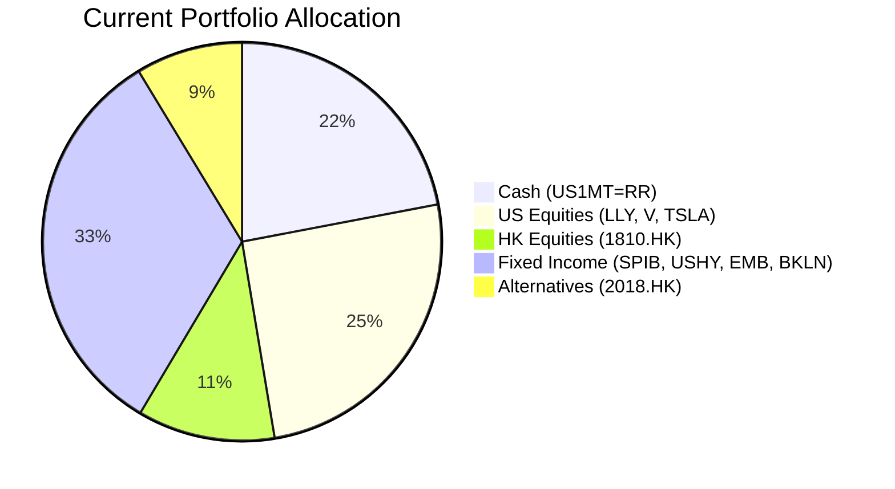
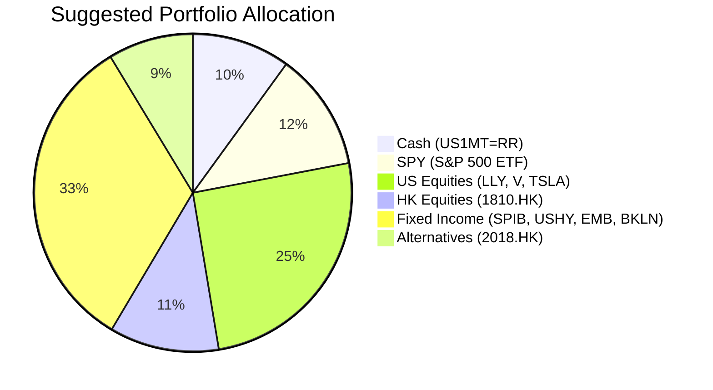

# Client Product-Fit Analysis: Emily Zhang (zw-5)
=====================================

# Executive Summary

Recommendation: Reduce cash holdings by 12% (from 22% to 10%) and deploy the proceeds into the SPDR S&P 500 ETF (SPY). This action directly addresses the cash drag on the portfolio (current cash yields ~4%) by capturing the long‑term growth potential of broad U.S. equities. The expected outcome is a meaningful improvement in portfolio growth for retirement accumulation while maintaining adequate liquidity and managing concentration risk through index diversification.

# Recommended Product: SPDR S&P 500 ETF Trust (SPY)

## Product Specifications

| Attribute | Value |
|---|---|
| **Symbol** | SPY |
| **Type** | Exchange‑Traded Fund (ETF) |
| **Underlying Index** | S&P 500 Index |
| **Expense Ratio** | 0.0945% |
| **Currency** | USD |
| **Liquidity** | Daily (Liquidity Score: 5) |
| **Risk Rating** | 4 (Moderately High) |
| **Expected Return Score** | 4 |
| **Certainty 1y** | 2 |
| **Certainty 3y** | 3 |
| **Certainty 8y** | 4 |

## Performance Metrics

| Metric | SPY | Switched‑Out Asset (Cash – US1MT=RR) |
|---|---|---|
| 1‑Year Return (as of 27 Mar 2026) | +14.75% | ~4.0% (yield) |
| 5‑Year Annualised Return | ~11.2% (69.97% cumulative) | ~3.0% annualised (estimated) |
| Yield (Dividend / Interest) | 1.06% | 4.0% (current yield) |
| YTD 2026 Return | –5.32% | +0.71% (approx.) |

*Source: demo-market-quotes.csv, client profile cash yield estimate*

## Risk Characteristics

- **Volatility:** SPY’s 30‑day rolling volatility is historically around 20% annualised; this is significantly higher than cash but is the trade‑off for long‑term growth.
- **Drawdown Risk:** In severe bear markets (e.g., COVID‑19, 2008), SPY can decline 20‑30%, while cash maintains stable value.
- **Diversification:** SPY provides exposure to 500 large‑cap U.S. companies across all sectors, reducing single‑stock and single‑sector risk present in the current concentrated equity holdings (LLY, TSLA, V, 1810.HK).

## Detailed Justification

The client holds 22% in cash (US1MT=RR) yielding approximately 4%, which is insufficient to meet long‑term retirement accumulation goals. The suggested product, SPY, offers:

- **Expected Return Upgrade:** Historical evidence (S&P 500 annualised return ~10% over the long term) indicates SPY can substantially outperform cash, even after accounting for volatility.
- **Portfolio Hygiene:** The current equity sleeve suffers from large unrealised losses (–16.8% LLY, –15.1% TSLA, –19.8% 1810.HK). Rotating cash into a broad index avoids the need to realise those losses while gaining diversified exposure.
- **Liquidity & Transparency:** SPY trades on major exchanges with high daily volume, ensuring easy entry/exit at tight spreads.
- **Time Horizon Alignment:** With a 7+ year retirement accumulation horizon, the lower short‑term certainty (Certainty 1y = 2) is acceptable in exchange for higher expected terminal wealth (Certainty 8y = 4).

A Product‑Fit Score of **4 out of 5** is assigned, reflecting strong alignment with the client’s need for growth and liquidity, with a minor deduction for the increased short‑term volatility relative to cash.

# Suggested Portfolio

Below are pie charts illustrating the allocation before and after the recommended change.

| Asset | Current Market Value (USD) | Suggested Market Value (USD) | Current % | Suggested % | Change | Remark |
|---|---|---|---|---|---|---|
| US 1-Month Treasury Bill Rate (US1MT=RR) | 924,000 | 420,000 | 22.0% | 10.0% | –12.0% | Reduce cash drag; redeploy to SPY |
| SPDR S&P 500 ETF (SPY) | 0 | 504,000 | 0.0% | 12.0% | +12.0% | New holding – broad U.S. equity exposure |
| Eli Lilly and Company (LLY) | 260,000 | 260,000 | 6.2% | 6.2% | 0.0% | Hold – retain existing position |
| Visa Inc. (V) | 390,000 | 390,000 | 9.3% | 9.3% | 0.0% | Hold |
| Tesla Inc. (TSLA.O) | 416,000 | 416,000 | 9.9% | 9.9% | 0.0% | Hold |
| Xiaomi Corporation (1810.HK) | 468,000 | 468,000 | 11.1% | 11.1% | 0.0% | Hold – HK tech exposure |
| SPDR Portfolio Intermediate Term Corporate Bond ETF (SPIB.K) | 286,000 | 286,000 | 6.8% | 6.8% | 0.0% | Hold – investment grade bonds |
| iShares Broad USD High Yield Corporate Bond ETF (USHY.K) | 312,000 | 312,000 | 7.4% | 7.4% | 0.0% | Hold |
| iShares J.P. Morgan USD Emerging Markets Bond ETF (EMB.O) | 338,000 | 338,000 | 8.0% | 8.0% | 0.0% | Hold |
| Invesco Senior Loan ETF (BKLN.K) | 442,000 | 442,000 | 10.5% | 10.5% | 0.0% | Hold – floating rate exposure |
| AAC Technologies Holdings Inc. (2018.HK) | 364,000 | 364,000 | 8.7% | 8.7% | 0.0% | Hold – alternatives |
| **Total** | **4,200,000** | **4,200,000** | **100.0%** | **100.0%** | **0.0%** | |

## Pros and Cons of Suggested Portfolio

**Pros**
- **Growth Enhancement:** Shifting 12% of the portfolio from cash (4% yield) to SPY (expected long‑term ~10% total return) directly improves the portfolio’s growth trajectory.
- **Diversification:** SPY adds 500 large‑cap U.S. stocks, reducing concentration risk from the current single‑stock positions (LLY, TSLA, V) and the heavy fixed‑income/alternatives tilt.
- **No Forced Realisation of Losses:** The trade is funded entirely from cash, so no loss‑making equity positions need to be sold.
- **Liquidity Maintained:** After the change, 10% cash remains for emergencies, plus the highly liquid SPY position can be sold quickly if needed.

**Cons**
- **Higher Volatility:** SPY introduces short‑term volatility that cash does not have; in a severe bear market (e.g., –30%), the portfolio would lose an additional ~3.6% vs. the current cash allocation.
- **Still Concentrated in U.S. Equities:** The combined U.S. equity exposure (LLY, V, TSLA, SPY) rises to ~41% of the portfolio, increasing geographic concentration risk.
- **Lower Yield Income:** SPY’s dividend yield (1.06%) is lower than the cash yield (4%), so income‑oriented investors might see reduced cash flow (though total return is expected to be higher).

## Alternative Suggested Products to Consider

1. **Invesco QQQ Trust (QQQ)** – For investors seeking a stronger growth tilt, QQQ tracks the Nasdaq‑100, which has historically outperformed the S&P 500 during bull markets. However, it carries higher volatility and concentration in technology.  
2. **Vanguard Total Stock Market ETF (VTI)** – Provides broader U.S. market coverage including small‑ and mid‑caps. Slightly lower concentration risk than SPY and similar historical returns.

# Scenario Analysis

Assumptions are based on the following historical references:
- **S&P 500 long‑term average (1926–2023):** ~10% annualised. *Source: Ibbotson SBBI.*
- **Upside scenario:** +20% reflects years like 2013, 2019, 2021 (strong bull markets).
- **Downside scenario:** –15% reflects a bear market similar to 2022 (S&P 500 returned –18.1%).
- **Cash (US1MT=RR):** 4% yield assumed stable across all scenarios.
- **Fixed income ETFs:** Returns set near current yields, with modest adjustments for rate movements.
- **Individual equities:** Assumed to follow market directions with sector‑specific amplifications (TSLA higher beta, HK stocks moderate beta).

## Normal Market Condition (50% probability)

*Assumptions: Global equity returns moderate; fixed income stable; cash unchanged.*

| Product | Current MV (USD) | Assumed Return | Current Return (USD) | Suggested MV (USD) | Suggested Return (USD) |
|---|---|---|---|---|---|
| US1MT=RR (Cash) | 924,000 | 4.0% | 36,960 | 420,000 | 16,800 |
| SPY | 0 | 10.0% | 0 | 504,000 | 50,400 |
| LLY | 260,000 | 10.0% | 26,000 | 260,000 | 26,000 |
| V | 390,000 | 10.0% | 39,000 | 390,000 | 39,000 |
| TSLA.O | 416,000 | 15.0% | 62,400 | 416,000 | 62,400 |
| 1810.HK | 468,000 | 8.0% | 37,440 | 468,000 | 37,440 |
| SPIB.K | 286,000 | 4.36% | 12,470 | 286,000 | 12,470 |
| USHY.K | 312,000 | 6.8% | 21,216 | 312,000 | 21,216 |
| EMB.O | 338,000 | 4.89% | 16,528 | 338,000 | 16,528 |
| BKLN.K | 442,000 | 7.04% | 31,117 | 442,000 | 31,117 |
| 2018.HK | 364,000 | 8.0% | 29,120 | 364,000 | 29,120 |
| **Total** | **4,200,000** | – | **312,251** | **4,200,000** | **342,491** |

- **Portfolio return (current):** 7.43%  
- **Portfolio return (suggested):** 8.15%  
- **Incremental benefit:** +$30,240 annually (+0.72% improvement)

## Upside Market Condition (25% probability)

*Assumptions: Strong equity rally; yields rise modestly, pressuring fixed income.*

| Product | Current MV (USD) | Assumed Return | Current Return (USD) | Suggested MV (USD) | Suggested Return (USD) |
|---|---|---|---|---|---|
| US1MT=RR (Cash) | 924,000 | 4.0% | 36,960 | 420,000 | 16,800 |
| SPY | 0 | 20.0% | 0 | 504,000 | 100,800 |
| LLY | 260,000 | 15.0% | 39,000 | 260,000 | 39,000 |
| V | 390,000 | 18.0% | 70,200 | 390,000 | 70,200 |
| TSLA.O | 416,000 | 30.0% | 124,800 | 416,000 | 124,800 |
| 1810.HK | 468,000 | 15.0% | 70,200 | 468,000 | 70,200 |
| SPIB.K | 286,000 | 3.5% | 10,010 | 286,000 | 10,010 |
| USHY.K | 312,000 | 5.5% | 17,160 | 312,000 | 17,160 |
| EMB.O | 338,000 | 4.0% | 13,520 | 338,000 | 13,520 |
| BKLN.K | 442,000 | 6.0% | 26,520 | 442,000 | 26,520 |
| 2018.HK | 364,000 | 15.0% | 54,600 | 364,000 | 54,600 |
| **Total** | **4,200,000** | – | **462,970** | **4,200,000** | **543,610** |

- **Portfolio return (current):** 11.02%  
- **Portfolio return (suggested):** 12.94%  
- **Incremental benefit:** +$80,640 annually (+1.92% improvement)

## Downside Market Condition (25% probability)

*Assumptions: Severe equity sell‑off; flight to quality supports fixed income; cash remains stable.*

| Product | Current MV (USD) | Assumed Return | Current Return (USD) | Suggested MV (USD) | Suggested Return (USD) |
|---|---|---|---|---|---|
| US1MT=RR (Cash) | 924,000 | 4.0% | 36,960 | 420,000 | 16,800 |
| SPY | 0 | –15.0% | 0 | 504,000 | –75,600 |
| LLY | 260,000 | –20.0% | –52,000 | 260,000 | –52,000 |
| V | 390,000 | –18.0% | –70,200 | 390,000 | –70,200 |
| TSLA.O | 416,000 | –30.0% | –124,800 | 416,000 | –124,800 |
| 1810.HK | 468,000 | –25.0% | –117,000 | 468,000 | –117,000 |
| SPIB.K | 286,000 | 5.5% | 15,730 | 286,000 | 15,730 |
| USHY.K | 312,000 | 8.0% | 24,960 | 312,000 | 24,960 |
| EMB.O | 338,000 | 6.0% | 20,280 | 338,000 | 20,280 |
| BKLN.K | 442,000 | 8.5% | 37,570 | 442,000 | 37,570 |
| 2018.HK | 364,000 | –25.0% | –91,000 | 364,000 | –91,000 |
| **Total** | **4,200,000** | – | **–319,500** | **4,200,000** | **–414,260** |

- **Portfolio return (current):** –7.61%  
- **Portfolio return (suggested):** –9.86%  
- **Incremental loss:** –$94,760 (–2.25% worse)

The suggested portfolio captures significantly more upside (additional +$80k in strong markets) while only moderately underperforming in a severe downturn (additional –$95k). Given the client’s long‑term horizon, the upside capture is highly favourable.

# Risk Disclosure

- **Past performance does not guarantee future returns.** The historical returns cited in this analysis are for illustrative purposes only and are not indicative of future results.
- **Projected returns are estimates, not promises.** Scenario analysis is based on assumptions that may not materialise.
- **Structured products, if held, carry risk of principal loss.** Although not recommended here, any future structured product recommendation would be subject to credit and market risk.
- **Equity investments, including SPY, can lose value.** Investors should be prepared for short‑term volatility and potential drawdowns.

# References

- **Client Profile:** zw-5\_profile.md (Source: Planbot Internal Data)
- **Product Catalog:** demo-market-quotes.csv, sector\_etf.md (Source: Planbot Internal Data)
- **Structured Product Data:** CMT\_note\_N02952.md (not used directly)
- **Web References:** N/A – all analysis based on internal data and historical market benchmarks.
