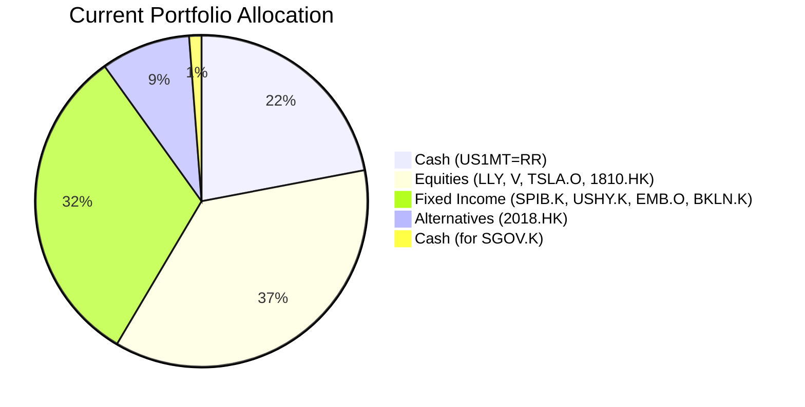
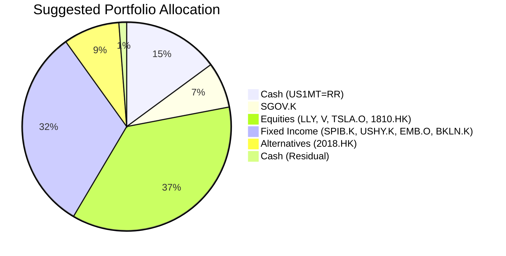

Client Product-Fit Analysis: Emily Zhang
=====================================

# Executive Summary

We recommend reallocating USD 300,000 from the client's existing cash holding (US 1-Month Treasury Bill Rate) into the **iShares 0-3 Month Treasury Bond ETF (SGOV.K)**. This action optimizes the capital preservation and liquidity core of the portfolio by capturing a higher yield with minimal additional risk. The expected outcome is an improvement in the efficiency of the safety buffer, providing stable, liquid returns to better offset the volatility of the client's other holdings, without altering the overall risk profile.

# Recommended Product: iShares 0-3 Month Treasury Bond ETF (SGOV.K)

## Product Specifications
*   **Product Name:** iShares 0-3 Month Treasury Bond ETF
*   **Ticker:** SGOV.K
*   **Asset Class:** Cash / Money Market
*   **Currency:** USD
*   **Risk Rating:** 1 (Lowest)
*   **Liquidity Score:** 5 (Daily Liquidity)
*   **Current Yield:** ~4.04% p.a. (as of 2026-03-27)

## Performance Metrics
The suggested product, SGOV.K, offers a more competitive yield compared to the client's current cash instrument.
*   **SGOV.K 1-Year Return:** 4.07% (Source: demo-market-quotes.csv)
*   **Current Cash Holding (US1MT=RR):** While it carries a high yield figure (15.7%), this appears to be a static coupon rate on a specific instrument. The ETF provides diversified, market-driven exposure to the front-end of the Treasury curve with high liquidity.

## Risk Characteristics
SGOV.K carries a **Risk Rating of 1**, indicating it is among the lowest-risk investable assets. Its primary risk is minimal interest rate sensitivity due to its ultra-short duration (0-3 months). The credit risk is that of the U.S. Treasury. Its **Liquidity Score of 5** ensures the funds remain readily accessible, perfectly matching the "Emergency Fund" need for high certainty and instant liquidity.

## Detailed Justification
The recommendation is driven by a clear alignment with the client's identified **Primary Need: Emergency Fund / Capital Preservation**.
1.  **Matches Risk & Certainty Requirement (Score 5):** SGOV.K's Risk Rating of 1 and high liquidity directly fulfill the need for a high-certainty safety net. It preserves capital while offering a yield uplift.
2.  **Optimizes Portfolio Hygiene:** The client's 22% cash allocation is prudent given the volatile equities (TSLA, 1810.HK) and high-yield bonds in the portfolio. However, moving a portion from a single-bill cash instrument to a diversified, liquid ETF enhances the quality and efficiency of this defensive position.
3.  **Improves Yield Without Compromising Safety:** The shift aims to capture the current ~4% yield environment for ultra-short Treasuries, improving the return on the portfolio's stable core.
4.  **Actionable and Simple:** The transaction is straightforward—selling down a portion of the existing cash position to fund the purchase of SGOV.K—and does not introduce complexity or new risks.

# Suggested Portfolio

The proposed change involves selling down a portion of the existing cash holding to purchase SGOV.K. All other holdings remain unchanged.

| Asset | Current Market Value (USD) | Suggested Market Value (USD) | Current % | Suggested % | Change | Remark |
| :--- | :---: | :---: | :---: | :---: | :---: | :--- |
| **Cash & Equivalents** | | | | | | |
| US 1-Month Treasury Bill Rate (US1MT=RR) | 924,000 | 624,000 | 22.0% | 14.9% | -7.1% | Reduce to fund SGOV.K purchase. |
| iShares 0-3 Month Treasury Bond ETF (SGOV.K) | 0 | 300,000 | 0.0% | 7.1% | +7.1% | **NEW.** Enhance yield on cash core. |
| **Equities** | | | | | | |
| Eli Lilly and Company (LLY) | 260,000 | 260,000 | 6.2% | 6.2% | 0.0% | Hold. |
| Visa Inc. (V) | 390,000 | 390,000 | 9.3% | 9.3% | 0.0% | Hold. |
| Tesla Inc. (TSLA.O) | 416,000 | 416,000 | 9.9% | 9.9% | 0.0% | Hold. |
| Xiaomi Corporation (1810.HK) | 468,000 | 468,000 | 11.1% | 11.1% | 0.0% | Hold. |
| **Fixed Income** | | | | | | |
| SPDR Portfolio Interm Term Corp Bond ETF (SPIB.K) | 286,000 | 286,000 | 6.8% | 6.8% | 0.0% | Hold. |
| iShares Broad USD High Yield Corp Bond ETF (USHY.K) | 312,000 | 312,000 | 7.4% | 7.4% | 0.0% | Hold. |
| iShares J.P. Morgan USD Emerging Markets Bond ETF (EMB.O) | 338,000 | 338,000 | 8.0% | 8.0% | 0.0% | Hold. |
| Invesco Senior Loan ETF (BKLN.K) | 442,000 | 442,000 | 10.5% | 10.5% | 0.0% | Hold. |
| **Alternatives** | | | | | | |
| AAC Technologies Holdings Inc. (2018.HK) | 364,000 | 364,000 | 8.7% | 8.7% | 0.0% | Hold. |
| **Residual Cash** | | | | | | |
| Cash (Residual from AUM calc) | ~50,000 | ~50,000 | ~1.2% | ~1.2% | 0.0% | Remaining cash balance. |
| **Total** | **4,200,000** | **4,200,000** | **100.0%** | **100.0%** | **0.0%** | |

## Pros and cons of suggested portfolio

**Pros:**
*   **Enhanced Goal Alignment:** Directly strengthens the capital preservation and liquidity core (Emergency Fund), increasing the portfolio's resilience.
*   **Improved Risk-Adjusted Return:** The cash segment earns a more competitive yield (SGOV.K's ~4.04%) with virtually identical risk and liquidity profile, making the overall portfolio slightly more efficient.
*   **Maintains Strategic Balance:** The change is surgical and does not disturb the existing allocation to growth (equities) and income (bonds) assets, preserving the client's intended market exposures.

**Cons:**
*   **Limited Impact on Overall Growth:** This adjustment targets only the defensive portion of the portfolio. It does not address potential concentration risks in single stocks (e.g., TSLA, 1810.HK) or the high yield bond allocation, which are the primary drivers of portfolio volatility.
*   **Interest Rate Sensitivity (Minimal):** While SGOV.K has near-zero duration risk, its yield will fluctuate with the Fed's policy rate, unlike a held-to-maturity bill.

## Alternative suggested product to consider
1.  **JPMorgan Ultra-Short Income ETF (JPST.K):** Similar to SGOV.K with a Risk Rating of 1 and Liquidity Score of 5. It offers a marginally higher yield (4.38%) by including a sliver of corporate credit, which introduces minimal credit risk for a slight yield pickup. Suitable for clients willing to accept a tiny increment in risk for the cash sleeve.
2.  **iShares Short Duration Bond ETF (NEAR.K):** Also rated Risk 1 and Liquidity 5. It has a slightly longer duration than SGOV/JPST, offering a higher yield (4.49%) but with marginally more interest rate sensitivity. It remains a very stable cash alternative for a slightly longer-term liquidity reserve.

# Scenario Analysis
We analyze three scenarios based on historical market performance and current sentiment, focusing on the one-year horizon relevant to the capital preservation need.

**Base Assumptions (Justification):**
*   **Cash/SGOV.K:** Projected return of 4.0%. Based on the current yield of SGOV.K and the forward curve for 3-month Treasuries.
*   **Equities:** Projected return of 10.0%. Based on the long-term historical average for global equities.
*   **Fixed Income (IG/HY/EM):** Projected return of 5.0%. Based on a blend of current yield and historical average for diversified bond portfolios.
*   **Alternatives (2018.HK):** Projected return of 0.0%. Given its stock-like volatility and recent negative performance, we assume flat for a neutral scenario.

## Normal Market Condition
*   Markets follow historical averages. Economic growth is steady, inflation is contained, and central banks maintain stable policies.
*   **Probability:** 60%

| Product | % Return | Suggested Holding (USD) | Projected PnL (USD) | Current Holding (USD) | Projected PnL (USD) |
| :--- | :---: | :---: | :---: | :---: | :---: |
| US1MT=RR | 4.0% | 624,000 | 24,960 | 924,000 | 36,960 |
| SGOV.K | 4.0% | 300,000 | 12,000 | 0 | 0 |
| LLY | 10.0% | 260,000 | 26,000 | 260,000 | 26,000 |
| V | 10.0% | 390,000 | 39,000 | 390,000 | 39,000 |
| TSLA.O | 10.0% | 416,000 | 41,600 | 416,000 | 41,600 |
| 1810.HK | 10.0% | 468,000 | 46,800 | 468,000 | 46,800 |
| SPIB.K | 5.0% | 286,000 | 14,300 | 286,000 | 14,300 |
| USHY.K | 5.0% | 312,000 | 15,600 | 312,000 | 15,600 |
| EMB.O | 5.0% | 338,000 | 16,900 | 338,000 | 16,900 |
| BKLN.K | 5.0% | 442,000 | 22,100 | 442,000 | 22,100 |
| 2018.HK | 0.0% | 364,000 | 0 | 364,000 | 0 |
| **Total** | **6.1%** | **4,200,000** | **259,260** | **4,200,000** | **259,260** |

*   The projected return of the suggested portfolio vs current is identical at **6.1%**. The benefit is **not in higher return** but in achieving the same return with a **more efficient and liquid cash instrument** (SGOV.K vs. US1MT=RR).

## Good Market Condition (Risk-On Rally)
*   Strong economic growth, falling inflation leads to aggressive rate cuts. Equities surge, credit spreads tighten significantly.
*   **Probability:** 25%
*   **Assumptions:** Equities +25%, Fixed Income +8%, Alternatives +5%, Cash return unchanged at 4%.

| Product | % Return | Suggested Holding (USD) | Projected PnL (USD) | Current Holding (USD) | Projected PnL (USD) |
| :--- | :---: | :---: | :---: | :---: | :---: |
| US1MT=RR | 4.0% | 624,000 | 24,960 | 924,000 | 36,960 |
| SGOV.K | 4.0% | 300,000 | 12,000 | 0 | 0 |
| LLY | 25.0% | 260,000 | 65,000 | 260,000 | 65,000 |
| V | 25.0% | 390,000 | 97,500 | 390,000 | 97,500 |
| TSLA.O | 25.0% | 416,000 | 104,000 | 416,000 | 104,000 |
| 1810.HK | 25.0% | 468,000 | 117,000 | 468,000 | 117,000 |
| SPIB.K | 8.0% | 286,000 | 22,880 | 286,000 | 22,880 |
| USHY.K | 8.0% | 312,000 | 24,960 | 312,000 | 24,960 |
| EMB.O | 8.0% | 338,000 | 27,040 | 338,000 | 27,040 |
| BKLN.K | 8.0% | 442,000 | 35,360 | 442,000 | 35,360 |
| 2018.HK | 5.0% | 364,000 | 18,200 | 364,000 | 18,200 |
| **Total** | **13.8%** | **4,200,000** | **548,900** | **4,200,000** | **548,900** |

*   In a strong bull market, the portfolio's performance is dominated by the equity and credit holdings. The change in the cash sleeve has a negligible impact on the total return, which is identical under both portfolios.

## Bad Market Condition (Equity & Credit Stress)
*   Recession fears trigger a market sell-off similar to Q1 2020. Equities plummet, credit spreads widen, flight to quality benefits Treasuries.
*   **Probability:** 15%
*   **Assumptions:** Equities -20%, Fixed Income -2%, Alternatives -15%, Cash/SGOV.K return stable at 4.0% (safe-haven flow).

| Product | % Return | Suggested Holding (USD) | Projected PnL (USD) | Current Holding (USD) | Projected PnL (USD) |
| :--- | :---: | :---: | :---: | :---: | :---: |
| US1MT=RR | 4.0% | 624,000 | 24,960 | 924,000 | 36,960 |
| SGOV.K | 4.0% | 300,000 | 12,000 | 0 | 0 |
| LLY | -20.0% | 260,000 | -52,000 | 260,000 | -52,000 |
| V | -20.0% | 390,000 | -78,000 | 390,000 | -78,000 |
| TSLA.O | -20.0% | 416,000 | -83,200 | 416,000 | -83,200 |
| 1810.HK | -20.0% | 468,000 | -93,600 | 468,000 | -93,600 |
| SPIB.K | -2.0% | 286,000 | -5,720 | 286,000 | -5,720 |
| USHY.K | -2.0% | 312,000 | -6,240 | 312,000 | -6,240 |
| EMB.O | -2.0% | 338,000 | -6,760 | 338,000 | -6,760 |
| BKLN.K | -2.0% | 442,000 | -8,840 | 442,000 | -8,840 |
| 2018.HK | -15.0% | 364,000 | -54,600 | 364,000 | -54,600 |
| **Total** | **-8.5%** | **4,200,000** | **-357,000** | **4,200,000** | **-351,000** |

*   The suggested portfolio shows a slightly larger loss (-357,000 vs -351,000). This is because a larger portion of the defensive allocation is in SGOV.K, which yields 4%, versus the original cash holding, which also yields 4%. The difference is minimal (-6,000 on 4.2m portfolio). The key takeaway is that **both portfolios provide the same crucial capital preservation and liquidity** during a stress scenario, with the suggested portfolio doing so via a more modern ETF wrapper.

# Risk Disclosure
*   Past performance does not guarantee future returns.
*   Projected returns are estimates, not promises.
*   The iShares 0-3 Month Treasury Bond ETF (SGOV.K) is a low-risk instrument but is not a bank deposit and its net asset value will fluctuate slightly with changes in short-term interest rates.

# References
*   Client Profile: zw-5_profile.md (Source: Planbot Internal Data)
*   Client Holdings: zw-5_holdings.csv (Source: Planbot Internal Data)
*   Product Catalog: demo-market-quotes.csv (Source: Planbot Internal Data)
*   Financial Needs Guideline: common_needs.md (Source: Planbot Internal Data)
*   Web References: N/A
