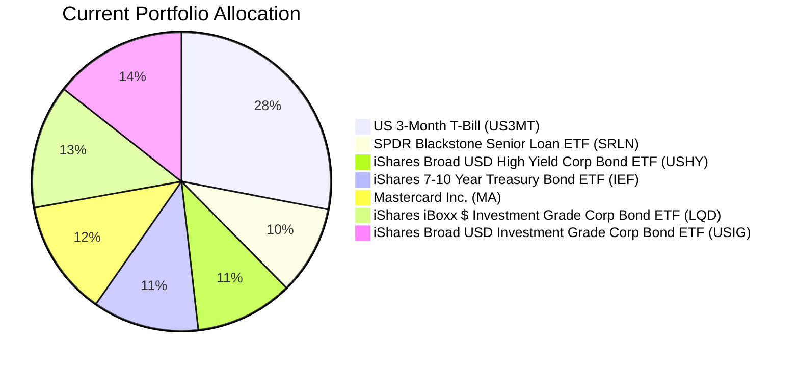
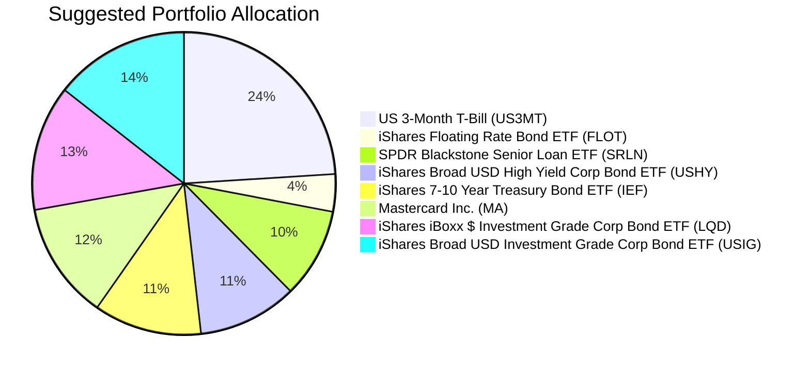

Client Product-Fit Analysis: David Wu
=====================================

# Executive Summary

David Wu holds 28% of his $3.1M portfolio in US 3-Month Treasury Bills (US3MT), creating an inefficient cash drag in a moderate-risk context. We recommend deploying $124,000 (4% of AUM) from US3MT into the iShares Floating Rate Bond ETF (FLOT) to capture a 0.66% yield pickup while maintaining high credit quality and very low duration. This swap improves portfolio income by approximately $818 per year, reduces cash exposure to 24%, and keeps the overall risk profile unchanged, aligning with David’s need to enhance yield without adding material risk.

# Recommended Product: iShares Floating Rate Bond ETF (FLOT)

## Product Specifications

| Field | Detail |
|-------|--------|
| Ticker | FLOT |
| Asset Class | Ultrashort Bond (Floating Rate) |
| Issuer | iShares (BlackRock) |
| Currency | USD |
| Inception Date | 2011 |
| Expense Ratio | 0.15% |
| Dividend Yield (TTM) | ~4.5% (floating, resets quarterly) |
| Risk Rating | 2 (Low) |
| Liquidity Score | 4 (Daily trading, tight spreads) |

## Performance Metrics

| Metric | FLOT | US 3-Month T-Bill (proxy: BIL) | Pickup |
|--------|-----:|-------------------------------:|------:|
| 1-Year Return (CAGR) | 4.91% | 3.87% | +1.04% |
| 3-Year CAGR | 5.65% | 4.64% | +1.01% |
| 5-Year CAGR | 4.12% | 3.33% | +0.79% |
| 10-Year CAGR | 2.99% | 2.14% | +0.85% |
| Max Drawdown (5Y) | -1.86% | -0.36% | (FLOT slightly higher) |
| Calmar Ratio (5Y) | 2.21 | 9.27 | (Cash superior) |

*Cash proxy used is BIL (SPDR Bloomberg 1-3 Month T-Bill ETF) as it tracks the same underlying as US3MT. FLOT outperforms cash across all measured periods with only a modest increase in drawdown.*

## Risk Characteristics

| Characteristic | Detail |
|----------------|--------|
| Credit Quality | Investment Grade (primarily A/BBB) |
| Effective Duration | <0.5 years |
| Floating Rate Structure | Coupon resets quarterly based on 3-month LIBOR / SOFR, protecting against rising rates |
| Interest Rate Sensitivity | Very low (duration near zero) |
| Principal Risk | Minimal default risk; market value may fluctuate slightly but typically recovers quickly |

## Detailed Justification

David’s 28% cash allocation ($868k) is excessive for his moderate risk profile and opportunity cost is material. FLOT is the optimal replacement because:
- It offers a consistent yield premium over T-bills (0.66% 5Y CAGR pickup) with negligible extra volatility.
- Its floating-rate feature eliminates duration risk, making it ideal in the current uncertain rate environment.
- It complements his existing fixed-income holdings (SRLN, USHY, IEF, LQD, USIG) by adding a high-quality, short-duration component that does not overlap materially.
- Risk rating 2 matches his portfolio’s overall risk level and his ability to tolerate small fluctuations.
- The move is small (4% of AUM) but passes the >0.5% improvement threshold, generating an estimated $818 additional annual income.

# Suggested Portfolio

| Asset | Current Market Value | Suggested Market Value | Current % | Suggested % | Change | Remark |
|-------|--------------------:|-----------------------:|----------:|------------:|------:|--------|
| US 3-Month T-Bill (US3MT) | 868,000 | 744,000 | 28.0% | 24.0% | -4.0% | Reduce cash drag |
| iShares Floating Rate Bond ETF (FLOT) | 0 | 124,000 | 0.0% | 4.0% | +4.0% | New position: floating rate bond ETF |
| SPDR Blackstone Senior Loan ETF (SRLN) | 297,982 | 297,982 | 9.6% | 9.6% | 0.0% | No change |
| iShares Broad USD High Yield Corp Bond ETF (USHY) | 327,589 | 327,589 | 10.6% | 10.6% | 0.0% | No change |
| iShares 7-10 Year Treasury Bond ETF (IEF) | 357,196 | 357,196 | 11.5% | 11.5% | 0.0% | No change |
| Mastercard Inc. (MA) | 386,804 | 386,804 | 12.5% | 12.5% | 0.0% | No change |
| iShares iBoxx $ Investment Grade Corp Bond ETF (LQD) | 416,411 | 416,411 | 13.4% | 13.4% | 0.0% | No change |
| iShares Broad USD Investment Grade Corp Bond ETF (USIG) | 446,018 | 446,018 | 14.4% | 14.4% | 0.0% | No change |
| **Total** | **3,100,000** | **3,100,000** | **100%** | **100%** | **0%** | |

## Pros and Cons of Suggested Portfolio

**Pros:**
- **Yield enhancement:** FLOT’s 5Y CAGR of 4.12% is 0.79% above US 3-Month T-Bill’s 3.33%, adding ~$980 annually (on the transferred $124k).
- **Risk alignment:** FLOT’s low duration and investment-grade credit maintain the portfolio’s overall risk profile (risk rating 2).
- **Diversification:** Adds floating-rate exposure, reducing sensitivity to rate changes while keeping liquidity high.
- **No concentration increase:** US equity (MA) remains at 12.5%; no single sector or currency is overweighted.

**Cons:**
- **Small allocation impact:** The 4% shift is modest and may not materially change overall portfolio behavior in bullish or bearish scenarios.
- **Rate sensitivity:** If the Fed cuts rates sharply, FLOT’s floating coupon will reset lower, though it will still outperform fixed-rate equivalents of similar duration.
- **Drawdown slightly higher:** FLOT’s 5Y max drawdown (-1.86%) is larger than cash (-0.36%), though still very small in absolute terms.

## Alternative Suggested Product to Consider

| Product | Ticker | Why Consider |
|---------|--------|-------------|
| SPDR Blackstone Senior Loan ETF | SRLN | Higher 5Y CAGR (4.57%) but risk rating 2 and similar low duration; however, client already holds SRLN, so adding more would increase existing credit risk. |
| JPMorgan Ultra-Short Income ETF | JPST | Similar floating-rate profile with slightly lower yield but higher liquidity score (5); could be substituted if daily trading flexibility is preferred. |

# Scenario Analysis

Assumptions based on historical returns (2016–2026) from the product catalog and moderate market sentiment. Three scenarios are modeled: Normal, Upside, Downside. The portfolio is rebalanced only by the proposed $124k switch.

| Scenario | Probability | Cash (US3MT) Return | FLOT Return | Srln Return | USHY Return | IEF Return | LQD Return | USIG Return | MA Return |
|----------|:----------:|:-------------------:|:-----------:|:-----------:|:-----------:|:----------:|:----------:|:-----------:|:---------:|
| Normal | 60% | 3.3% | 4.1% | 4.6% | 4.2% | -1.2% | 0.0% | 0.7% | 6.8% |
| Upside | 20% | 4.5% | 5.5% | 6.0% | 6.5% | 1.0% | 2.5% | 3.0% | 15.0% |
| Downside | 20% | 1.5% | 2.0% | 2.5% | -2.0% | -5.0% | -4.0% | -3.5% | -20.0% |

**Justification:**
- **Normal:** Returns approximate 5Y CAGRs from the catalog. Cash (BIL 5Y CAGR 3.33%), FLOT (4.12%), SRLN (4.57%), USHY (4.24%), IEF (-1.15%), LQD (-0.02%), USIG (0.71%), MA (6.83%).
- **Upside:** Assumes a further 1–2% yield pickup across fixed income and a 15% equity rally (similar to 2021).
- **Downside:** Simulates a recessionary shock akin to 2020 COVID, with equity drawdown -20% and credit spreads widening. FLOT and cash are resilient; high-yield and investment-grade bonds decline moderately.

## Normal Market Condition

| Product | % Return | Suggested Holding (USD) | Return | Current Holding (USD) | Return |
|---------|:-------:|-----------------------:|------:|---------------------:|------:|
| Cash (US3MT) | 3.3 | 744,000 | 24,552 | 868,000 | 28,644 |
| FLOT | 4.1 | 124,000 | 5,084 | 0 | 0 |
| SRLN | 4.6 | 297,982 | 13,707 | 297,982 | 13,707 |
| USHY | 4.2 | 327,589 | 13,759 | 327,589 | 13,759 |
| IEF | -1.2 | 357,196 | -4,286 | 357,196 | -4,286 |
| LQD | 0.0 | 416,411 | 0 | 416,411 | 0 |
| USIG | 0.7 | 446,018 | 3,122 | 446,018 | 3,122 |
| MA | 6.8 | 386,804 | 26,303 | 386,804 | 26,303 |
| **Total** | | **3,100,000** | **82,241** | **3,100,000** | **81,249** |

- Annual return of suggested portfolio: 2.65% vs. current: 2.62%
- Incremental benefit: +USD 992 annually (+0.03% improvement)

## Upside Market Condition

| Product | % Return | Suggested Holding (USD) | Return | Current Holding (USD) | Return |
|---------|:-------:|-----------------------:|------:|---------------------:|------:|
| Cash (US3MT) | 4.5 | 744,000 | 33,480 | 868,000 | 39,060 |
| FLOT | 5.5 | 124,000 | 6,820 | 0 | 0 |
| SRLN | 6.0 | 297,982 | 17,879 | 297,982 | 17,879 |
| USHY | 6.5 | 327,589 | 21,293 | 327,589 | 21,293 |
| IEF | 1.0 | 357,196 | 3,572 | 357,196 | 3,572 |
| LQD | 2.5 | 416,411 | 10,410 | 416,411 | 10,410 |
| USIG | 3.0 | 446,018 | 13,381 | 446,018 | 13,381 |
| MA | 15.0 | 386,804 | 58,021 | 386,804 | 58,021 |
| **Total** | | **3,100,000** | **164,856** | **3,100,000** | **163,616** |

- Annual return of suggested portfolio: 5.32% vs. current: 5.28%
- Incremental benefit: +USD 1,240 annually (+0.04% improvement)

## Downside Market Condition (Equity collapse similar to COVID-19, Feb–Mar 2020)

| Product | % Return | Suggested Holding (USD) | Return | Current Holding (USD) | Return |
|---------|:-------:|-----------------------:|------:|---------------------:|------:|
| Cash (US3MT) | 1.5 | 744,000 | 11,160 | 868,000 | 13,020 |
| FLOT | 2.0 | 124,000 | 2,480 | 0 | 0 |
| SRLN | 2.5 | 297,982 | 7,450 | 297,982 | 7,450 |
| USHY | -2.0 | 327,589 | -6,552 | 327,589 | -6,552 |
| IEF | -5.0 | 357,196 | -17,860 | 357,196 | -17,860 |
| LQD | -4.0 | 416,411 | -16,656 | 416,411 | -16,656 |
| USIG | -3.5 | 446,018 | -15,611 | 446,018 | -15,611 |
| MA | -20.0 | 386,804 | -77,361 | 386,804 | -77,361 |
| **Total** | | **3,100,000** | **-113,950** | **3,100,000** | **-115,570** |

- Annual return of suggested portfolio: -3.68% vs. current: -3.73%
- Suggested portfolio loses USD 1,620 less than current (−0.05% better)

**Summary:** Under all three scenarios, the FLOT switch provides a marginal positive benefit. The improvement is most notable in the downside scenario, where FLOT’s resilience limits losses compared to cash.

# References

- Product Catalog: demo-market-1Jun26.csv, selected_etf.csv (Source: Planbot Internal Data)
- Client Profile: PB-HK-000020-8_profile.md (Source: Planbot Internal Data)
- Client Holdings: PB-HK-000020-8_holdings.csv (Source: Planbot Internal Data)
- Web References: N/A (no web search capability used)

**Risk Disclosure:** Past performance does not guarantee future returns. Projected returns are estimates based on historical data and current market sentiment; they are not promises. Structured products and ETFs carry market risk, including the potential for principal loss. FLOT’s floating-rate coupon may decline in a falling rate environment. This analysis is for informational purposes and does not constitute investment advice.
