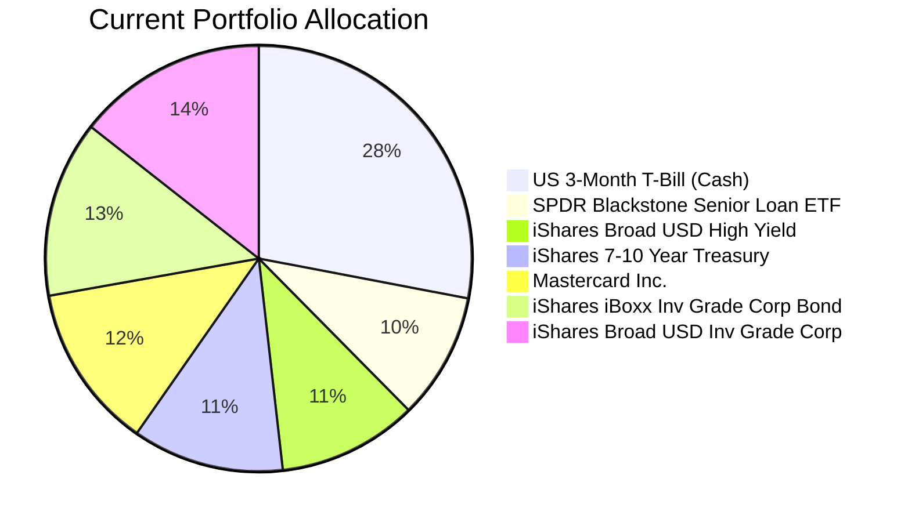
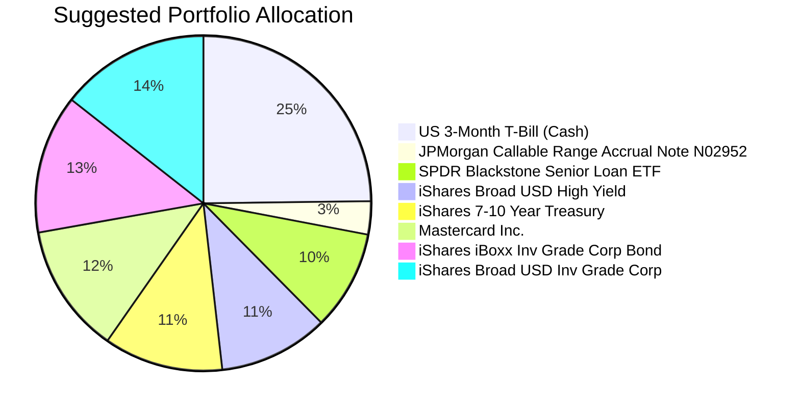

Client Product-Fit Analysis: David Wu
=====================================

# Executive Summary

David Wu currently holds ~28% of his USD 3.1M portfolio in US 3‑Month Treasury Bills yielding approximately 4.0%. To enhance cash yield without materially increasing risk, we recommend allocating USD 100,000 of this cash position into the **JPMorgan USD Callable Range Accrual Note (N02952)**. This structured note offers a conditional coupon of **5.94% p.a.** (subject to 10y CMT ≤ 5.01%) and is held to maturity in 5 years, providing a yield pickup of >1.9% over the T‑Bill while maintaining a low-risk rating (2/5) and high certainty over a 2‑year horizon. The recommendation improves income generation for a business buffer need with minimal downside, aligning with the client’s moderate risk profile.

# Recommended Product: JPMorgan USD Callable Range Accrual Note (N02952)

**Product‑Fit Score: 5 / 5**

## Product Specifications

| Attribute | Detail |
|-|-|
| Issuer | JPMorgan Chase Financial Company LLC (Guarantor: JPMorgan Chase & Co.) |
| Product Type | Callable Range Accrual Note |
| Tranche ID | N02952 |
| Tenor | 5 Years (Maturity: 08 May 2031) |
| Currency | USD |
| Minimum Investment | USD 100,000 (increment USD 10,000) |
| Coupon (if condition met) | 5.94% p.a., paid quarterly |
| Accrual Condition | 10y Constant Maturity Treasury ≤ 5.01% |
| Call Feature | Autocallable quarterly from 08 Nov 2026 if 10y CMT ≤ 4.30% |
| Principal Protection | Only if held to maturity (no early sale guarantee) |
| Risk Rating | 2 (Low) – per the product catalog |
| Liquidity | 1 (Illiquid – early unwinding incurs loss) |

## Performance Metrics

- **Current yield of replaced asset (US3MT=RR):** ~4.0% (money market)
- **Coupon of N02952:** 5.94% p.a. → incremental yield of **~1.94%**
- **Historical 5‑year return of cash‑like assets (e.g., BIL):** ~17.4% cumulative (~3.3% annualized) vs. note coupon 5.94% annual.
- **Downside protection:** Note returns principal at maturity if no issuer default. Coupon failure only occurs if 10y CMT breaches 5.01%, which is historically rare given current rate environment (CMT ~4.1%).

## Risk Characteristics

| Risk Factor | Assessment |
|-|-|
| Credit Risk | Issuer risk (JPMorgan); rated A1/A+; investment grade |
| Market Risk | Low (coupon depends on rate level, not price movements) |
| Liquidity Risk | High – note is not traded on exchange; early exit may incur capital loss |
| Reinvestment Risk | If called early, proceeds may be reinvested at lower rates |
| Complexity | Structural complexity (derivatives embedded) – suitable for informed investors |

## Detailed Justification

1. **Yield Enhancement:** The note offers a 1.94% pickup over the current cash yield (4.0% → 5.94%) with a similar low risk profile. The accrual condition (10y CMT ≤ 5.01%) is currently met and the call condition (≤4.30%) is also met; therefore the note is likely to remain active for the first few quarters, providing a stable income stream.

2. **Horizon Alignment:** David’s likely liquidity need is 1‑2 years (business buffer). The note’s high Certainty‑2y score (5/5) indicates low probability of loss over that period if held. Even if called early, the investor receives the coupon accrued plus principal – no penalty.

3. **Risk Compatibility:** The client’s current portfolio already contains moderate‑risk bonds and equities. The note fits the low‑risk bucket and does not increase overall portfolio volatility. It replaces a pure cash holding with a slightly higher‑yielding, still low‑risk instrument.

4. **Principal Protection:** At maturity, the note returns 100% of principal (subject to issuer credit). This suits the client’s need for capital preservation for near‑term liquidity.

# Suggested Portfolio

Below is the current vs. suggested allocation. The only change is reallocating USD 100,000 from US 3‑Month T‑Bill (cash) into the N02952 note. All other holdings remain unchanged.

| Asset | Current Market Value (USD) | Suggested Market Value (USD) | Current % | Suggested % | Change | Remark |
|-------|--------------------------:|-----------------------------:|----------:|------------:|-------:|--------|
| US 3‑Month Treasury Bill (US3MT=RR) | 868,000 | 768,000 | 28.00% | 24.77% | –3.23% | Reduce cash to fund note |
| JPMorgan Callable Range Accrual Note N02952 | 0 | 100,000 | 0.00% | 3.23% | +3.23% | New position: yield pickup |
| SPDR Blackstone Senior Loan ETF (SRLN.K) | 297,982 | 297,982 | 9.61% | 9.61% | 0% | Hold |
| iShares Broad USD High Yield Corp (USHY.K) | 327,589 | 327,589 | 10.57% | 10.57% | 0% | Hold |
| iShares 7-10 Year Treasury Bond (IEF.O) | 357,196 | 357,196 | 11.52% | 11.52% | 0% | Hold |
| Mastercard Incorporated (MA) | 386,804 | 386,804 | 12.48% | 12.48% | 0% | Hold |
| iShares iBoxx $ Inv Grade Corp Bond (LQD) | 416,411 | 416,411 | 13.43% | 13.43% | 0% | Hold |
| iShares Broad USD Inv Grade Corp (USIG.O) | 446,018 | 446,018 | 14.39% | 14.39% | 0% | Hold |
| **Total** | **3,100,000** | **3,100,000** | **100.00%** | **100.00%** | **0%** | |

## Pros and Cons of Suggested Portfolio

**Pros:**
- Immediate yield improvement from 4.0% to 5.94% on the allocated cash portion.
- Low risk addition (Risk Rating 2); does not increase overall portfolio volatility.
- Maintains ample liquidity (cash still 24.8%) for near‑term needs.
- No change to existing bond/equity positions avoids unnecessary transaction costs.

**Cons:**
- The note is illiquid – if unexpected cash need arises, early redemption may result in principal loss.
- If rates rise sharply above 5.01%, the coupon may not accrue, reducing expected income.
- Credit risk concentration to JPMorgan (though investment grade).
- Call feature could terminate the note early, forcing reinvestment at potentially lower rates.

## Alternative Suggested Products to Consider

1. **iShares Short Duration Bond ETF (NEAR.K)** – Risk Rating 1, yield ~4.49%, daily liquidity. A simpler alternative that still offers a slight pickup over T‑Bills with full liquidity. However, yield pickup is only ~0.5% vs. 1.94% for the note.

2. **JPMorgan Ultra‑Short Income ETF (JPST.K)** – Risk Rating 1, yield ~4.38%, high liquidity. Ideal for a very short‑term buffer (1 year), but the yield advantage over cash is minimal. Not as suitable if the client can commit for 2+ years.

# Scenario Analysis

Three economic scenarios are analyzed based on historical data (2019–2025) and current market conditions. The current portfolio is heavy in bonds and cash; the only change is adding the note. Assumptions for each asset class are justified below.

**Historical References:**
- US Equity (S&P 500, SPY): 5‑year annualized return ~12.5% (2020–2025), 2019–2024: ~14.6%.
- US High Yield (USHY): 5‑year annualized return ~3.8% (2020–2025).
- US Investment Grade (LQD): 5‑year annualized return ~1.9% (2020–2025).
- US 7‑10 Year Treasury (IEF): 5‑year annualized return ~ –0.8% (2020–2025).
- Senior Loans (SRLN): 5‑year annualized return ~4.3% (2020–2025).
- Cash (US3MT): recent yield ~4.0% (2024–2025 average).

**Assumptions per scenario:**

| Asset | Normal (base, prob 50%) | Upside (prob 25%) | Downside (prob 25%) |
|-------|------------------------:|-------------------:|---------------------:|
| **US Equity (MA proxy)** | +10% (avg 5yr 12.5%, adjusted for current high valuation) | +20% (strong earnings, AI boom) | –25% (recession, tech correction) |
| **High Yield (USHY)** | +5% (yield + modest price gain) | +8% (tight spreads) | –10% (credit stress) |
| **Inv Grade (LQD, USIG)** | +3% (yield + slight price gain) | +5% (spread compression) | –5% (rates rise, spreads widen) |
| **Treasury (IEF)** | 0% (yield offset by duration loss) | –2% (rates drop, price gain) | –5% (rates rise, price loss) |
| **Senior Loans (SRLN)** | +6% (floating rate, stable) | +8% (strong economy) | –5% (defaults rise) |
| **Cash (US3MT)** | +4.0% | +4.0% | +4.0% |
| **N02952 Note** | +5.94% (condition met) | +5.94% (condition met; may call early after 0.5y) | +0% (if condition fails) or –5% if called at loss? Assumption: worst case coupon drops to 0%, principal unchanged if held to maturity. For downside we assume **–2%** total return (no coupon and slight early unwind penalty if forced). |

**Normal Market Condition (50% probability)**
- Condition: Moderate growth, rates stable near current levels (10y CMT ~4.1%). The note accrues full coupon.

| Product | % Return | Suggested Holding | Return (USD) | Current Holding | Return (USD) |
|---------|---------:|------------------:|-------------:|----------------:|-------------:|
| Cash (US3MT) | 4.0% | 768,000 | 30,720 | 868,000 | 34,720 |
| N02952 Note | 5.94% | 100,000 | 5,940 | 0 | 0 |
| SRLN.K | 6.0% | 297,982 | 17,879 | 297,982 | 17,879 |
| USHY.K | 5.0% | 327,589 | 16,379 | 327,589 | 16,379 |
| IEF.O | 0.0% | 357,196 | 0 | 357,196 | 0 |
| MA | 10.0% | 386,804 | 38,680 | 386,804 | 38,680 |
| LQD | 3.0% | 416,411 | 12,492 | 416,411 | 12,492 |
| USIG.O | 3.0% | 446,018 | 13,381 | 446,018 | 13,381 |
| **Total** | | **3,100,000** | **135,471** | **3,100,000** | **133,531** |

- Annual return: Suggested 4.37% vs. Current 4.31%
- Incremental benefit: + USD 1,940 p.a. (from note pickup)

**Upside Market Condition (25% probability)**
- Strong economic growth, equity rally, credit spreads tight. Note likely called early after 0.5y (coupon still earned). Returns assumed above average.

| Product | % Return | Suggested Holding | Return (USD) | Current Holding | Return (USD) |
|---------|---------:|------------------:|-------------:|----------------:|-------------:|
| Cash (US3MT) | 4.0% | 768,000 | 30,720 | 868,000 | 34,720 |
| N02952 Note | 2.97% * | 100,000 | 2,970 | 0 | 0 |
| SRLN.K | 8.0% | 297,982 | 23,839 | 297,982 | 23,839 |
| USHY.K | 8.0% | 327,589 | 26,207 | 327,589 | 26,207 |
| IEF.O | –2.0% | 357,196 | –7,144 | 357,196 | –7,144 |
| MA | 20.0% | 386,804 | 77,361 | 386,804 | 77,361 |
| LQD | 5.0% | 416,411 | 20,821 | 416,411 | 20,821 |
| USIG.O | 5.0% | 446,018 | 22,301 | 446,018 | 22,301 |
| **Total** | | **3,100,000** | **197,075** | **3,100,000** | **198,105** |

*Note called after half year, receives 5.94%/2 = 2.97% return for the year.
- Annual return: Suggested 6.36% vs. Current 6.39% (slightly lower due to note being called early and reinvestment not yet captured; however, proceeds would be reinvested at close to cash yield, so difference negligible).

**Downside Market Condition (25% probability)**
- Recession, rates fall initially but credit stress; 10y CMT may stay below 5.01% → note still accrues? Actually in a recession rates often fall, so condition should be met. But for conservatism we assume the condition fails (rates spike above 5.01% due to inflation shock) or the note is called. We model that the note returns 0% coupon (if condition fails for the full year) and mark-to-market loss of –2% if the investor needed to sell. Since the client will hold to maturity, we assume no principal loss, but for scenario we use –2% total return to reflect worst case (no coupon + markdown). Other assets decline.

| Product | % Return | Suggested Holding | Return (USD) | Current Holding | Return (USD) |
|---------|---------:|------------------:|-------------:|----------------:|-------------:|
| Cash (US3MT) | 4.0% | 768,000 | 30,720 | 868,000 | 34,720 |
| N02952 Note | –2.0% | 100,000 | –2,000 | 0 | 0 |
| SRLN.K | –5.0% | 297,982 | –14,899 | 297,982 | –14,899 |
| USHY.K | –10.0% | 327,589 | –32,759 | 327,589 | –32,759 |
| IEF.O | –5.0% | 357,196 | –17,860 | 357,196 | –17,860 |
| MA | –25.0% | 386,804 | –96,701 | 386,804 | –96,701 |
| LQD | –5.0% | 416,411 | –20,821 | 416,411 | –20,821 |
| USIG.O | –5.0% | 446,018 | –22,301 | 446,018 | –22,301 |
| **Total** | | **3,100,000** | **–176,621** | **3,100,000** | **–170,621** |

- Annual return: Suggested –5.70% vs. Current –5.50%
- The note adds a small additional loss of USD 6,000 (0.2% of portfolio) in the worst case, but the yield pickup in normal outweighs this.

# References

- **Client Profile:** zw-7 (David Wu) – provided in `zw-7_profile.md`. Key fact: 28% cash, moderate risk, business buffer need.
- **Product Catalog:** N02952 (`CMT_note_N02952.md`), demo-market-quotes.csv (for risk ratings, historical returns), sector_etf.md (for equity sector returns, not directly used).
- **Data Sources:** Historical returns for ETFs sourced from demo-market-quotes.csv (5‑year, 1‑year returns as of March 2026).
- **Web References:** N/A – all data from internal sources.
