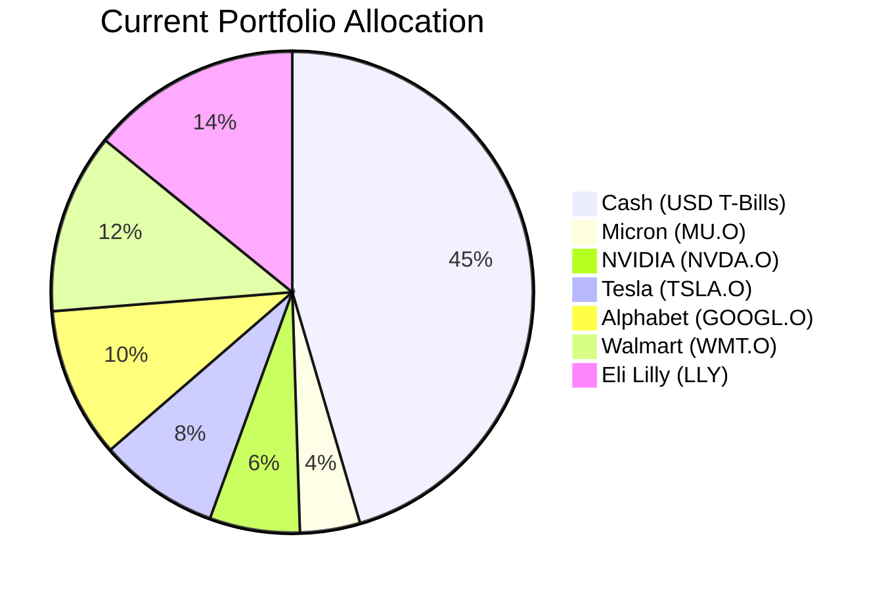
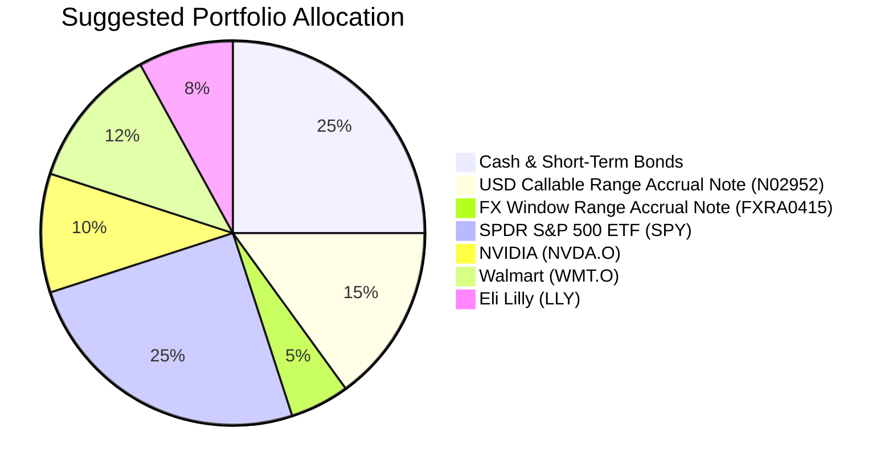

Portfolio Health Review for David Kim
=========================================

# Summary

Your current portfolio demonstrates a strong focus on high-growth US technology equities, aligning with your high risk tolerance. However, it exhibits a critical weakness in its lack of diversification and defensive assets, leaving it overly exposed to sector-specific volatility. The recommended action is to reduce single-stock equity concentration by 25% and reallocate 20% of your portfolio into structured products and broad-market ETFs to enhance yield and manage drawdowns. This restructuring is expected to improve long-term risk-adjusted returns by providing more stable income streams and reducing reliance on the performance of a few tech names.

# Potential Client Needs

Based on your profile (age 42, married with one child born in 2012, stable income), the following potential financial needs are identified:

| Potential Needs | Investment Horizon | Remark |
| :--- | :--- | :--- |
| **Children's University Education** | Medium-Term (6-10 years) | Your child will be entering university around 2030. This is a high-certainty need requiring capital preservation with moderate growth. |
| **Retirement Capital Accumulation** | Long-Term (15-20+ years) | As a Managing Director with a stable career, your primary long-term goal is likely retirement. Your high risk rating supports a growth-focused strategy for this horizon. |
| **Portfolio Downside Protection** | Ongoing | Your objective includes "controlled drawdown." The current all-equity, tech-heavy portfolio lacks assets to buffer during market corrections. |

# Suggested Portfolio

The following charts illustrate the shift from a concentrated, high-volatility portfolio to a more diversified and resilient one.

| Asset | Current Market Value (HKD) | Suggested Market Value (HKD) | Current % | Suggested % | Change | Remark |
| :--- | :---: | :---: | :---: | :---: | :---: | :--- |
| **Cash & Equivalents** | | | **45%** | **25%** | **-20%** | |
| US 3-Month T-Bill (US3MT=RR) | 427,500 | 237,500 | 45% | 25% | -20% | Reduce holding to fund new investments. |
| **Equities** | | | **55%** | **55%** | **0%** | |
| Micron Technology Inc. (MU.O) | 36,905 | 0 | 4% | 0% | -4% | Sell entire position. High volatility and sector overlap. |
| NVIDIA Corporation (NVDA.O) | 56,976 | 95,000 | 6% | 10% | +4% | Maintain core conviction holding but increase slightly for balance. |
| Tesla Inc. (TSLA.O) | 77,048 | 0 | 8% | 0% | -8% | Sell entire position. High volatility and concentration risk. |
| Alphabet Inc. (GOOGL.O) | 97,119 | 0 | 10% | 0% | -10% | Sell entire position. Overlap with broad market ETF. |
| Walmart Inc. (WMT.O) | 117,190 | 114,000 | 12% | 12% | 0% | Maintain stable, dividend-paying consumer staple. |
| Eli Lilly and Company (LLY) | 137,261 | 76,000 | 14% | 8% | -6% | Reduce position size to manage single-stock risk. |
| **Structured Products** | | | **0%** | **20%** | **+20%** | |
| USD Callable Range Accrual Note (N02952) | 0 | 142,500 | 0% | 15% | +15% | Add for enhanced yield with defined range risk. |
| FX Window Range Accrual Note (FXRA0415) | 0 | 47,500 | 0% | 5% | +5% | Add for attractive yield based on stable USD/HKD peg. |
| **ETF** | | | **0%** | **25%** | **+25%** | |
| SPDR S&P 500 ETF Trust (SPY) | 0 | 237,500 | 0% | 25% | +25% | Add for core, diversified US equity market exposure. |
| **Total** | **950,000** | **950,000** | **100%** | **100%** | **0%** | |

**Execution Summary:**
*   **Sell:** All holdings in MU.O, TSLA.O, GOOGL.O. Sell 61,261 HKD of LLY.
*   **Buy:** 142,500 HKD of Note N02952, 47,500 HKD of Note FXRA0415, 237,500 HKD of SPY.
*   **Adjust:** Increase NVDA.O by 38,024 HKD. Reduce cash by 190,000 HKD.

## Pros and cons of suggested portfolio

**Pros:**
1.  **Enhanced Diversification & Reduced Concentration:** Shifts from 55% in 6 individual tech/healthcare stocks to a core holding of 25% in the S&P 500 (SPY), which holds hundreds of companies across all sectors. This dramatically reduces idiosyncratic risk.
2.  **Improved Downside Resilience:** Introduces 20% allocation to structured products (N02952, FXRA0415) designed to provide attractive coupon income (5.94% p.a. and 8.02% total, respectively) if underlying conditions are met, offering a buffer during equity market downturns.
3.  **Alignment with Identified Needs:** The portfolio now has components suitable for medium-term education funding (structured notes with defined outcomes) and long-term retirement growth (SPY, remaining quality equities).
4.  **Maintains Growth Exposure:** Still maintains 55% in equities (SPY, NVDA, WMT, LLY), preserving strong growth potential aligned with your Risk Rating of 4.

**Cons:**
1.  **Complexity and Liquidity:** The structured products are complex, callable, and have low liquidity (Liquidity Score 1). They are principal-protected only at maturity, meaning early sale could result in loss.
2.  **Reduced Pure Equity Upside:** In a strong bull market focused on tech, the new portfolio may underperform the old, highly concentrated one due to its diversified and partially hedged nature.
3.  **Credit Risk:** The structured notes introduce credit risk to the issuers (JPMorgan Chase & Co. and Barclays Bank PLC).

## Alternative suggested product to consider

1.  **Invesco QQQ Trust (QQQ):** As an alternative to SPY, QQQ tracks the Nasdaq-100, offering more focused exposure to technology and growth stocks. This could be suitable if you wish to maintain a stronger tech tilt while gaining diversification. *Justification:* It provides a diversified basket of 100+ large-cap tech/growth names, reducing single-stock risk while staying within your preferred sector.
2.  **Vanguard Total Bond Market ETF (BND):** For a more traditional and liquid fixed-income allocation instead of structured notes. *Justification:* It offers broad exposure to the US investment-grade bond market with high liquidity (daily trading), providing steady income and volatility dampening without the complexity of structured products.

# Scenario Analysis

## Normal Market Condition
*Assumption: Steady economic growth with moderate inflation. Equities perform in line with long-term averages, and interest rates remain stable within ranges.*
- **Projected S&P 500 Returns:** 10% p.a. Based on the long-term historical average (S&P 500 annualized return ~10% since 1926).
- **Projected Tech Stock Returns (NVDA):** 12% p.a. Slightly above market for continued innovation premium.
- **Projected Defensive Stock Returns (WMT, LLY):** 8% p.a. In line with historical performance of stable, dividend-growing companies.
- **Projected Structured Note Coupon:** 5.94% p.a. for N02952 (full accrual), 3.93% p.a. for FXRA0415 (full payment). Based on product terms assuming rates/ FX stay within range.
- **Projected Cash Returns:** 4% p.a. Based on current 3-month T-Bill yield.

| Product | % Return | Suggested Holding (HKD) | Projected PnL (HKD) | Current Holding (HKD) | Projected PnL (HKD) |
| :--- | :---: | :---: | :---: | :---: | :---: |
| Cash & Short-Term Bonds | 4.0% | 237,500 | 9,500 | 427,500 | 17,100 |
| Note N02952 | 5.9% | 142,500 | 8,462 | 0 | 0 |
| Note FXRA0415 | 3.9% | 47,500 | 1,873 | 0 | 0 |
| SPY | 10.0% | 237,500 | 23,750 | 0 | 0 |
| NVDA.O | 12.0% | 95,000 | 11,400 | 56,976 | 6,837 |
| WMT.O | 8.0% | 114,000 | 9,120 | 117,190 | 9,375 |
| LLY | 8.0% | 76,000 | 6,080 | 137,261 | 10,981 |
| MU.O | 12.0% | 0 | 0 | 36,905 | 4,429 |
| TSLA.O | 10.0% | 0 | 0 | 77,048 | 7,705 |
| GOOGL.O | 10.0% | 0 | 0 | 97,119 | 9,712 |
| **Total** | **8.1%** | **950,000** | **77,185** | **950,000** | **66,139** |

*   **Annual Return:** Suggested Portfolio: **8.1%** vs Current Portfolio: **7.0%**.
*   **Incremental Benefit:** **+HKD 11,046 annually** (+16.7% improvement in projected PnL).

## Good Market Condition (Tech Bull Market)
*Assumption: A resurgence in technology sector leadership and declining interest rates, boosting growth stocks. The USD/HKD peg holds, and rates fall.*
- **Projected S&P 500 Returns:** 15% p.a. (Above historical average).
- **Projected Tech Stock Returns (NVDA):** 25% p.a. (Strong outperformance).
- **Projected Defensive Stock Returns:** 10% p.a.
- **Projected Structured Note Coupon:** N02952 autocalls early at par (5.94% p.a. pro-rata), FXRA0415 pays 3.93% p.a.
- **Projected Cash Returns:** 3% p.a. (Lower rates).

| Product | % Return | Suggested Holding (HKD) | Projected PnL (HKD) | Current Holding (HKD) | Projected PnL (HKD) |
| :--- | :---: | :---: | :---: | :---: | :---: |
| Cash & Short-Term Bonds | 3.0% | 237,500 | 7,125 | 427,500 | 12,825 |
| Note N02952 | 5.9% | 142,500 | 8,462 | 0 | 0 |
| Note FXRA0415 | 3.9% | 47,500 | 1,873 | 0 | 0 |
| SPY | 15.0% | 237,500 | 35,625 | 0 | 0 |
| NVDA.O | 25.0% | 95,000 | 23,750 | 56,976 | 14,244 |
| WMT.O | 10.0% | 114,000 | 11,400 | 117,190 | 11,719 |
| LLY | 10.0% | 76,000 | 7,600 | 137,261 | 13,726 |
| MU.O | 25.0% | 0 | 0 | 36,905 | 9,226 |
| TSLA.O | 20.0% | 0 | 0 | 77,048 | 15,410 |
| GOOGL.O | 20.0% | 0 | 0 | 97,119 | 19,424 |
| **Total** | **10.5%** | **950,000** | **99,835** | **950,000** | **96,574** |

*   **Annual Return:** Suggested Portfolio: **10.5%** vs Current Portfolio: **10.2%**.
*   **Analysis:** The suggested portfolio slightly underperforms in a pure tech bull scenario due to its diversified nature, but the difference is minimal due to the retained NVDA holding and SPY exposure.

## Bad Market Condition (Equity Correction & Rate Volatility)
*Assumption: A broad market downturn similar to Q1 2022 or 2020, with tech stocks underperforming. Interest rates rise, pushing the 10y CMT above 5.01%.*
- **Projected S&P 500 Returns:** -15% p.a.
- **Projected Tech Stock Returns (NVDA):** -25% p.a.
- **Projected Defensive Stock Returns:** -5% p.a. (WMT, LLY more resilient).
- **Projected Structured Note Coupon:** N02952 accrues 0% (condition breached), FXRA0415 pays 3.93% p.a. (assuming range holds).
- **Projected Cash Returns:** 5% p.a. (Higher safe-haven demand).

| Product | % Return | Suggested Holding (HKD) | Projected PnL (HKD) | Current Holding (HKD) | Projected PnL (HKD) |
| :--- | :---: | :---: | :---: | :---: | :---: |
| Cash & Short-Term Bonds | 5.0% | 237,500 | 11,875 | 427,500 | 21,375 |
| Note N02952 | 0.0% | 142,500 | 0 | 0 | 0 |
| Note FXRA0415 | 3.9% | 47,500 | 1,873 | 0 | 0 |
| SPY | -15.0% | 237,500 | -35,625 | 0 | 0 |
| NVDA.O | -25.0% | 95,000 | -23,750 | 56,976 | -14,244 |
| WMT.O | -5.0% | 114,000 | -5,700 | 117,190 | -5,860 |
| LLY | -5.0% | 76,000 | -3,800 | 137,261 | -6,863 |
| MU.O | -30.0% | 0 | 0 | 36,905 | -11,072 |
| TSLA.O | -30.0% | 0 | 0 | 77,048 | -23,114 |
| GOOGL.O | -20.0% | 0 | 0 | 97,119 | -19,424 |
| **Total** | **-5.8%** | **950,000** | **-55,127** | **950,000** | **-59,202** |

*   **Annual Return:** Suggested Portfolio: **-5.8%** vs Current Portfolio: **-6.2%**.
*   **Analysis:** The suggested portfolio shows better downside protection, losing approximately HKD 4,075 less than the current portfolio. The defensive assets (cash, WMT, LLY, FX note) provide a crucial buffer.

# Risk Disclosure

- **Past performance does not guarantee future returns.** Historical data and projected returns are for illustrative purposes only.
- **Projected returns are estimates, not promises.** The scenario analysis is based on hypothetical assumptions and should not be relied upon as a guarantee of future performance.
- **Structured products have risk of principal loss.** The suggested notes (N02952, FXRA0415) are complex products. They are **only principal protected if held to maturity**. Early sale or a breach of conditions could result in the loss of some or all of the invested capital.
- **All investments carry risk,** including the potential loss of principal. Diversification does not ensure a profit or protect against a loss in a declining market.

# References

- **Client Profile:** David Kim (Client ID:8)
- **Product Catalog:** demo-market-quotes.csv (Source: Planbot Internal Data)
- **Structured Product FactSheets:** CMT_note_N02952.md, FXRA0415.md
- **Web References:** HSBC MPF Scheme Brochure (URL provided in context for general reference on investment products).
