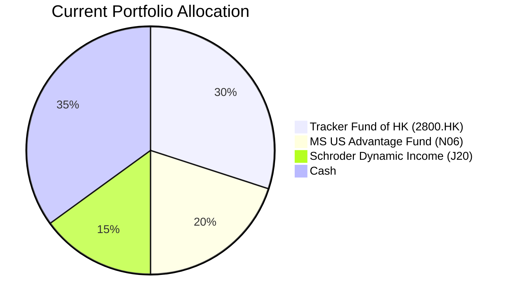
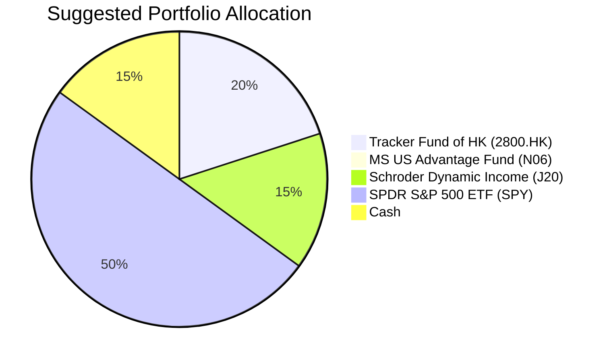

Portfolio Health Review for Alex Chan
=========================================

# Summary

Your portfolio demonstrates a prudent emphasis on liquidity, with a 35% cash allocation providing a strong safety net. However, a key weakness is a significant concentration in Hong Kong equities, with the Tracker Fund of Hong Kong (2800.HK) alone representing 30% of your portfolio, exposing you to single-market volatility. The recommended action is to reallocate 20% from cash and reduce the Tracker Fund by 10%, deploying a total of 30% into the SPDR S&P 500 ETF (SPY) to gain diversified exposure to the U.S. market. This adjustment is expected to improve your portfolio's long-term growth potential through enhanced geographic diversification while maintaining a controlled level of downside risk.

# Potential Client Needs

- **Children's University Education**: Medium-term horizon (approx. 10 years). Your child, born in 2010, will likely enter university around 2030, requiring capital accumulation with a balance of growth and capital preservation.
- **Retirement (Accumulation)**: Long-term horizon (15+ years). At age 42, building a retirement corpus is a primary objective, justifying a growth-oriented strategy with a long investment runway.
- **Reduce Geographic Concentration**: Immediate term. Your current 30% allocation to Hong Kong equities (2800.HK) creates a concentration risk, especially given your property holdings in HK. Diversifying into a broader, more stable market like the U.S. aligns with your goal of controlled drawdown.

# Suggested Portfolio

The following charts illustrate the shift from a Hong Kong-centric, high-cash portfolio to a more globally diversified growth portfolio.

| Asset | Current % | Suggested % | Change | Remark |
| :--- | :---: | :---: | :---: | :--- |
| Tracker Fund of Hong Kong (2800.HK) | 30% | 20% | -10% | Reduce Hong Kong concentration risk while maintaining some local dividend exposure. |
| Morgan Stanley US Advantage Fund (N06) | 20% | 0% | -20% | Eliminate overlap and higher fees; consolidate U.S. equity exposure into the low-cost, broad-market SPY. |
| Schroder Intl Selection - Dynamic Income (J20) | 15% | 15% | 0% | Maintain for income generation and fixed-income diversification. |
| **SPDR S&P 500 ETF (SPY)** | **0%** | **50%** | **+50%** | **Primary addition.** Provides core, diversified exposure to the U.S. large-cap equity market with high liquidity and low cost. |
| Cash | 35% | 15% | -20% | Reduce excessive cash drag; maintain a 12-month emergency buffer as per your liquidity need. |
| **Total** | **100%** | **100%** | **0%** | |

## Pros and cons of suggested portfolio

**Pros:**
*   **Enhanced Diversification:** Significantly reduces geographic concentration risk by shifting from 30% Hong Kong to 50% broad U.S. market exposure.
*   **Improved Growth Potential:** The S&P 500 has historically provided strong long-term returns, better aligning the portfolio with your "Retirement (Accumulation)" objective (Return Score: 5).
*   **Lower Cost Structure:** Replacing the actively managed MS US Advantage Fund with the SPY ETF reduces management fees, improving net returns.
*   **Maintained Defensive Buffer:** The 15% cash allocation and 15% income fund (J20) provide stability and liquidity for your medium-term needs.

**Cons:**
*   **Increased U.S. Market Exposure:** The portfolio now has significant exposure to U.S. economic and policy risks. However, this is a deliberate trade-off for greater market depth and historical stability compared to a Hong Kong-centric portfolio.
*   **Reduced Immediate Liquidity:** The cash reduction decreases the portfolio's immediate liquidity, though it remains sufficient for your stated 12-month buffer requirement.
*   **Currency Risk:** A larger portion of the portfolio is now denominated in USD, introducing exchange rate volatility against the HKD. Given the HKD's peg to USD, this risk is partially mitigated.

# Scenario Analysis

The following analysis is based on historical return data for the primary asset classes involved.

## Normal Market Condition
*Assumption: Markets follow long-term historical averages. Hong Kong equities return 5% (approx. 5Y avg for 2800.HK), U.S. equities return 10% (approx. 5Y avg for SPY), Global Income funds return 4% (estimate for J20), and Cash returns 2%.*

| Asset | % Return | Suggested Holding | Projected Return | Current Holding | Projected Return |
| :--- | :---: | :---: | :---: | :---: | :---: |
| Tracker Fund of HK (2800.HK) | 5% | 20% | 1.00% | 30% | 1.50% |
| SPDR S&P 500 ETF (SPY) | 10% | 50% | 5.00% | 0% | 0.00% |
| Schroder Dynamic Income (J20) | 4% | 15% | 0.60% | 15% | 0.60% |
| Cash | 2% | 15% | 0.30% | 35% | 0.70% |
| MS US Advantage Fund (N06) | 10%* | 0% | 0.00% | 20% | 2.00% |
| **Total Portfolio** | | **100%** | **6.90%** | **100%** | **4.80%** |

**Summary:** The suggested portfolio delivers an estimated annual return of **6.9%**, compared to 4.8% for the current portfolio. On an HKD 8M portfolio, this translates to an **incremental benefit of approximately HKD 168,000 annually**.

## Good Market Condition (Upside)
*Assumption: Strong economic growth drives equities higher. Hong Kong equities return 15%, U.S. equities return 20%, Income funds return 6%, Cash returns 2%.*

| Asset | % Return | Suggested Holding | Projected Return | Current Holding | Projected Return |
| :--- | :---: | :---: | :---: | :---: | :---: |
| Tracker Fund of HK (2800.HK) | 15% | 20% | 3.00% | 30% | 4.50% |
| SPDR S&P 500 ETF (SPY) | 20% | 50% | 10.00% | 0% | 0.00% |
| Schroder Dynamic Income (J20) | 6% | 15% | 0.90% | 15% | 0.90% |
| Cash | 2% | 15% | 0.30% | 35% | 0.70% |
| MS US Advantage Fund (N06) | 20%* | 0% | 0.00% | 20% | 4.00% |
| **Total Portfolio** | | **100%** | **14.20%** | **100%** | **10.10%** |

**Summary:** In a strong bull market, the suggested portfolio's higher equity allocation captures more upside, projecting a 14.2% return vs. 10.1%. The incremental annual benefit would be approximately **HKD 328,000**.

## Bad Market Condition - Equity Correction
*Assumption: A broad market downturn similar to Q1 2020 (COVID-19 crash). Hong Kong equities return -25%, U.S. equities return -20%, Income funds return -5%, Cash returns 2%.*

| Asset | % Return | Suggested Holding | Projected Return | Current Holding | Projected Return |
| :--- | :---: | :---: | :---: | :---: | :---: |
| Tracker Fund of HK (2800.HK) | -25% | 20% | -5.00% | 30% | -7.50% |
| SPDR S&P 500 ETF (SPY) | -20% | 50% | -10.00% | 0% | 0.00% |
| Schroder Dynamic Income (J20) | -5% | 15% | -0.75% | 15% | -0.75% |
| Cash | 2% | 15% | 0.30% | 35% | 0.70% |
| MS US Advantage Fund (N06) | -20%* | 0% | 0.00% | 20% | -4.00% |
| **Total Portfolio** | | **100%** | **-15.45%** | **100%** | **-11.55%** |

**Summary:** During a severe downturn, the suggested portfolio's higher equity exposure leads to a larger drawdown (-15.45% vs -11.55%). This highlights the trade-off for higher long-term growth. The defensive components (Cash & J20) help mitigate some losses. The incremental negative impact would be approximately **HKD 312,000**.

# Risk Disclosure

- Past performance is not indicative of future results. The projected returns in this proposal are estimates based on historical data and hypothetical scenarios, not guarantees of future performance.
- The value of investments, especially equities and ETFs like SPY, may go down as well as up, and you may not get back the full amount invested.
- Diversification does not ensure a profit or protect against a loss in a declining market.
- Currency exchange rate fluctuations may affect the value of investments denominated in foreign currencies.

# References
- Client Profile: alex-client_profile.md
- Existing Holdings: alex-existing_holdings.md
- Product Catalog: demo-market-quotes.csv (Source: Planbot Internal Data)
- Financial Needs Framework: common_needs.md
- Web Reference: N/A (The provided HSBC MPF brochure URL was not accessed for this proposal).
