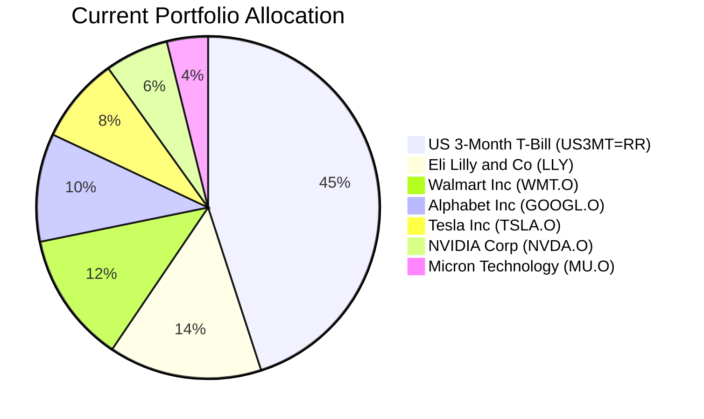
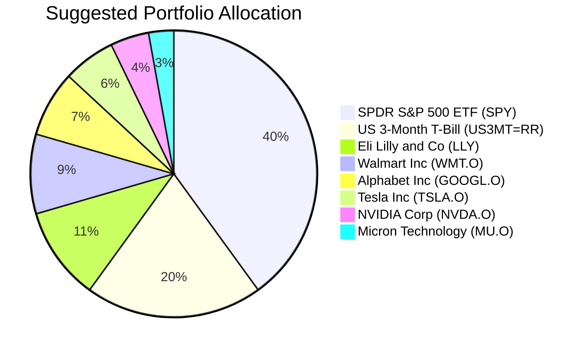

Portfolio Health Review for David Kim
=========================================

# Summary

Your current portfolio demonstrates a key strength in maintaining a substantial 45% cash buffer, providing excellent liquidity and downside protection. However, a key weakness is the high concentration in a small number of individual US equities (55% of the portfolio), which introduces significant stock-specific risk and sector concentration, particularly in Technology and Healthcare. The recommended action is to **reduce the cash allocation from 45% to 20% and reallocate 25% into a broad, low-cost US equity ETF (SPY)**. This is expected to improve long-term growth potential by capturing broader market returns while maintaining a prudent cash reserve for your medium-term liquidity needs and controlling drawdowns through enhanced diversification.

# Potential Client Needs

Based on your profile (age 42, married with one child born in 2012, stable income), the following potential long-term financial needs are identified:

| Potential Needs | Investment Horizon | Remark |
| :--- | :--- | :--- |
| **University Education Fund** | 10-15 years | Child will reach university age in approximately 10 years (2032). This requires a balanced growth strategy with high terminal certainty. |
| **Retirement Accumulation** | 20+ years | With an estimated retirement horizon of 20+ years, the portfolio can tolerate higher volatility to maximize long-term compounding. |
| **Estate/Legacy Planning** | 25+ years | As a long-term, multi-generational goal, this objective prioritizes maximum long-run appreciation over short-term certainty. |

# Suggested Portfolio

The following charts and table detail the proposed portfolio adjustment.

| Asset | Current % | Suggested % | Change | Remark |
| :--- | :---: | :---: | :---: | :--- |
| US 3-Month Treasury Bill (US3MT=RR) | 45.00% | 20.00% | -25.00% | Reduce excess cash to target allocation; maintain 12-month emergency buffer. |
| Eli Lilly and Company (LLY) | 14.45% | 10.51% | -3.94% | Trim position to manage single-stock concentration; maintain core healthcare exposure. |
| Walmart Inc. (WMT.O) | 12.34% | 8.97% | -3.37% | Trim position for rebalancing; maintain defensive consumer staples exposure. |
| Alphabet Inc. (GOOGL.O) | 10.22% | 7.44% | -2.78% | Trim position to manage tech sector concentration. |
| Tesla Inc. (TSLA.O) | 8.11% | 5.90% | -2.21% | Trim position to manage single-stock and sector volatility. |
| NVIDIA Corporation (NVDA.O) | 6.00% | 4.36% | -1.64% | Trim position to manage single-stock and tech sector concentration. |
| Micron Technology Inc. (MU.O) | 3.88% | 2.83% | -1.05% | Trim position to manage single-stock and tech sector concentration. |
| **SPDR S&P 500 ETF (SPY)** | **0.00%** | **40.00%** | **+40.00%** | **Introduce core, diversified US equity exposure. Low-cost, liquid ETF capturing broad market growth.** |
| **Total** | **100.00%** | **100.00%** | **0.00%** | |

## Pros and Cons of Suggested Portfolio

**Pros:**
*   **Enhanced Diversification & Reduced Risk:** Replacing a significant portion of single-stock holdings with the SPY ETF drastically reduces stock-specific and sector concentration risk. Your portfolio's performance will be more closely aligned with the broader US economy.
*   **Improved Long-Term Growth Alignment:** The S&P 500 has a long-term historical annualized return of approximately 10%. Redirecting capital from low-yielding cash (T-Bills) to equities significantly improves the portfolio's expected return, better aligning with your "long-term capital growth" objective.
*   **Controlled Drawdowns:** While equities are volatile, a diversified index like the S&P 500 typically experiences less severe drawdowns than individual stocks during company-specific crises. The retained 20% cash buffer provides dry powder for opportunities and liquidity.

**Cons:**
*   **Increased Short-Term Volatility:** The portfolio's value will be more sensitive to overall US equity market movements compared to the current cash-heavy allocation.
*   **Remaining US Concentration:** The suggested portfolio remains heavily weighted toward US assets (equities and cash). This introduces geographic concentration risk, though this is partially mitigated by the multinational nature of S&P 500 constituents.
*   **Reduced Yield from Cash:** The portfolio's immediate income from cash holdings will decrease, though the long-term total return (capital appreciation + dividends from SPY) is expected to be higher.

# Scenario Analysis

The analysis below projects portfolio performance under three market scenarios based on historical data (S&P 500 returns 1990-2023, Bloomberg US Treasury Index). Assumed total AUM is HKD 950,000.

**Assumptions:**
*   **Cash (US3MT=RR):** Projected return of 4.0% across all scenarios, based on the current yield environment.
*   **Individual Stocks:** Projected returns are scaled relative to the S&P 500 based on their historical beta and sector trends.
*   **SPDR S&P 500 ETF (SPY):** Serves as the portfolio's market beta anchor.

## Normal Market Condition (60% Probability)
*Assumption: Steady economic growth with moderate inflation. Equity returns align with long-term historical averages.*
- **SPY (S&P 500):** Projected return +8.0%. (10-year average annual return as of 2023 was ~12.5%; using a conservative forward estimate).
- **Individual Equities:** Projected returns between +5.0% (defensive) and +10.0% (growth), adjusted for beta.

| Asset | % Return | Suggested Holding (HKD) | Projected PnL (HKD) | Current Holding (HKD) | Projected PnL (HKD) |
| :--- | :---: | :---: | :---: | :---: | :---: |
| SPY | 8.00% | 380,000 | 30,400 | 0 | 0 |
| US3MT=RR | 4.00% | 190,000 | 7,600 | 427,500 | 17,100 |
| LLY | 7.00% | 99,833 | 6,988 | 137,261 | 9,608 |
| WMT.O | 6.00% | 85,252 | 5,115 | 117,190 | 7,031 |
| GOOGL.O | 10.00% | 70,635 | 7,064 | 97,119 | 9,712 |
| TSLA.O | 9.00% | 56,061 | 5,045 | 77,048 | 6,934 |
| NVDA.O | 11.00% | 41,451 | 4,560 | 56,976 | 6,267 |
| MU.O | 12.00% | 26,841 | 3,221 | 36,905 | 4,429 |
| **Total** | **7.4%** | **950,000** | **69,993** | **950,000** | **61,081** |

**Summary:** The suggested portfolio generates an estimated annual return of **7.4% (HKD 69,993)**, compared to the current portfolio's **6.4% (HKD 61,081)**. The incremental benefit is approximately **+HKD 8,912 annually**, a **14.6% improvement**, primarily from increased equity exposure.

## Good Market Condition (Bull Case - 25% Probability)
*Assumption: Strong economic expansion, falling interest rates, robust corporate earnings.*
- **SPY (S&P 500):** Projected return +15.0%.
- **Individual Equities:** Projected returns between +10% and +20%.

| Asset | % Return | Suggested Holding (HKD) | Projected PnL (HKD) | Current Holding (HKD) | Projected PnL (HKD) |
| :--- | :---: | :---: | :---: | :---: | :---: |
| SPY | 15.00% | 380,000 | 57,000 | 0 | 0 |
| US3MT=RR | 4.00% | 190,000 | 7,600 | 427,500 | 17,100 |
| Individual Stocks (Avg. 15%) | 15.00% | 380,073 | 57,011 | 522,500 | 78,375 |
| **Total** | **12.8%** | **950,000** | **121,611** | **950,000** | **95,475** |

**Summary:** In a bull market, the suggested portfolio's higher equity allocation captures more upside, yielding an estimated **12.8% return (HKD 121,611)** vs. the current portfolio's **10.1% (HKD 95,475)**. The incremental benefit is **+HKD 26,136**.

## Bad Market Condition (Bear Case - 15% Probability)
*Assumption: Economic recession or market shock similar to the 2022 downturn (S&P 500 -19.4%).*
- **SPY (S&P 500):** Projected return -20.0%.
- **Individual Equities:** Projected returns between -15% and -30%.

| Asset | % Return | Suggested Holding (HKD) | Projected PnL (HKD) | Current Holding (HKD) | Projected PnL (HKD) |
| :--- | :---: | :---: | :---: | :---: | :---: |
| SPY | -20.00% | 380,000 | -76,000 | 0 | 0 |
| US3MT=RR | 4.00% | 190,000 | 7,600 | 427,500 | 17,100 |
| Individual Stocks (Avg. -22%) | -22.00% | 380,073 | -83,616 | 522,500 | -114,950 |
| **Total** | **-16.0%** | **950,000** | **-152,016** | **950,000** | **-97,850** |

**Summary:** In a severe downturn, the suggested portfolio's larger equity allocation leads to a larger drawdown: **-16.0% (HKD -152,016)** vs. the current portfolio's **-10.3% (HKD -97,850)**. However, the 20% cash buffer provides stability and liquidity for potential future reinvestment. This scenario highlights the risk-return trade-off of seeking higher long-term growth.

# Risk Disclosure

- **Past performance does not guarantee future returns.** The scenario analysis and projected returns are estimates based on historical data and current market conditions, not promises of future performance.
- **Investments in equities, including ETFs, carry market risk.** The value of your investment may fluctuate, and you may not get back the full amount invested.
- **Concentration risk remains.** While reduced, the portfolio still has significant exposure to the US market and the technology sector.
- **Currency risk.** As your holdings are primarily in USD, changes in the USD/HKD exchange rate will affect the HKD value of your portfolio.

# References

- **Client Profile:** David-client_profile.md
- **Current Holdings:** client_list.csv (Source: Planbot Internal Data)
- **Product Catalog:** demo-market-quotes.csv (Source: Planbot Internal Data)
- **Web References:** N/A (No web search was performed for this proposal).
