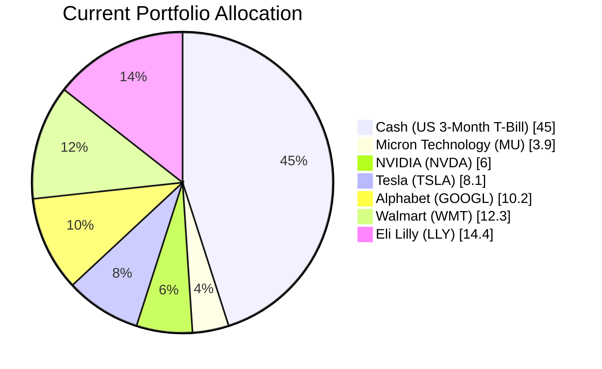
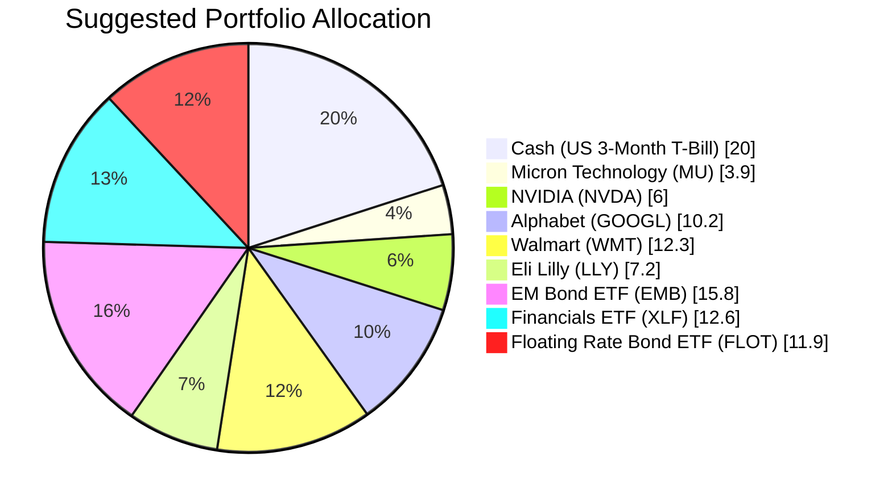

Portfolio Health Review for David Kim
=========================================

# Summary

Your current portfolio is heavily weighted toward cash (45%) and a concentrated set of US mega-cap technology and healthcare stocks, which has led to mixed performance—strong gains in Walmart and NVIDIA offset by losses in Tesla, Alphabet, and Eli Lilly. The primary weakness is the significant cash drag in a persistently inflationary environment and the lack of geographic and sector diversification. We recommend reallocating approximately 25% of cash into a focused mix of high-quality carry fixed income (emerging‑market debt and floating‑rate bonds) and a financials sector ETF, while trimming the most volatile equity positions. This restructuring aims to boost portfolio yield, reduce stock‑specific risk, and align with the 24‑month market outlook favouring structural beneficiaries of AI infrastructure and higher‑for‑longer interest rates.

# Potential Client Needs

| Potential Needs | Investment Horizon | Remark |
| :--- | :--- | :--- |
| Child’s university education | 4–8 years | Child born 2012, likely entering university around 2030–2034; moderate certainty needed |
| Retirement accumulation | 20+ years | Age 42; long horizon allows higher equity exposure with controlled drawdown |
| Reduce single‑stock concentration | N/A | Current portfolio heavily tilted toward a few tech names; career is also in a tech‑adjacent industry (KPMG) |

# Suggested Portfolio

| Asset | Current Market Value (USD) | Suggested Market Value (USD) | Current % | Suggested % | Change | Remark |
| :--- | ---: | ---: | ---: | ---: | ---: | :--- |
| US 3-Month Treasury Bill (Cash) | 427,500 | 190,000 | 45.0 | 20.0 | –25.0 | Reduce to 12‑month emergency buffer level |
| Micron Technology Inc. (MU.O) | 36,905 | 36,905 | 3.9 | 3.9 | 0.0 | Keep; positive momentum in semiconductors |
| NVIDIA Corporation (NVDA.O) | 56,976 | 56,976 | 6.0 | 6.0 | 0.0 | Core AI holding; maintain |
| Tesla Inc. (TSLA.O) | 77,048 | 0 | 8.1 | 0.0 | –8.1 | Sell; high volatility and negative recent returns |
| Alphabet Inc. (GOOGL.O) | 97,119 | 97,119 | 10.2 | 10.2 | 0.0 | Keep; digital advertising and cloud growth |
| Walmart Inc. (WMT.O) | 117,190 | 117,190 | 12.3 | 12.3 | 0.0 | Defensive retail anchor; strong performance |
| Eli Lilly and Company (LLY) | 137,261 | 68,630 | 14.4 | 7.2 | –7.2 | Reduce half to free capital for diversification |
| iShares J.P. Morgan USD Emerging Markets Bond ETF (EMB) | 0 | 150,000 | 0.0 | 15.8 | +15.8 | **New:** High‑carry EM hard‑currency debt (risk 3) |
| Financial Select Sector SPDR ETF (XLF) | 0 | 120,000 | 0.0 | 12.6 | +12.6 | **New:** Financials benefitting from higher‑for‑longer rates (risk 4) |
| iShares Floating Rate Bond ETF (FLOT) | 0 | 113,180 | 0.0 | 11.9 | +11.9 | **New:** Floating‑rate insulation against rate volatility (risk 2) |
| **Total** | **950,000** | **950,000** | **100.0** | **100.0** | **0.0** | |

## Pros and Cons of Suggested Portfolio

**Pros**
- **Higher yield and cash efficiency:** Replacing 25% of cash with EMB and FLOT increases portfolio yield from ~4.6% (T‑bills) to a blended ~6.5%, capturing the “high‑quality carry” theme from the market outlook.
- **Reduced single‑stock concentration:** Eliminating Tesla and halving Eli Lilly reduces the weight of the worst performers and lower the overall volatility.
- **Sector diversification:** Adding XLF (financials) provides exposure to a sector that typically benefits from a steep yield curve and higher interest rates, a key part of the 2026–2028 macro thesis.
- **Geographic diversification:** EMB adds exposure to emerging‑market sovereign credit, which is structurally supported by high commodity prices and improving credit ratings.

**Cons**
- **Short‑term volatility potential:** EMB and XLF can be more volatile than cash and may experience drawdowns in a recession or credit event.
- **Equity concentration remains:** The portfolio still has significant weight in individual tech stocks; further diversification into other sectors (e.g., healthcare, utilities) is limited by the three‑product constraint.
- **Interest rate risk on EMB:** Although hard‑currency EM debt carries lower duration than local bonds, rising U.S. Treasury yields could still pressure prices; however, the high coupon provides a buffer.

## Alternative Products to Consider

1. **SPDR Gold MiniShares (GLDM)** – A gold ETF that directly benefits from the central bank buying theme and geopolitical risk premium. Risk rating 5 (not permitted under client’s current risk tolerance), but if risk appetite increases, it could replace a portion of the fixed income allocation.
2. **Vanguard Utilities ETF (XLU)** – Defensive sector with growing demand from AI data centers. Risk rating 4, so it could be added in place of XLF if a more defensive tilt is desired. However, XLF offers higher expected return and better alignment with the yield curve view.

# Scenario Analysis

The following scenarios are based on the current market outlook (mid‑2026) and historical return patterns. Probabilities are estimated from consensus implied volatility and analyst surveys.

## Normal Market Condition (60% probability)
- **Global equities:** +10% (long‑term average, supported by corporate earnings resilience)
- **EM hard‑currency bonds:** +9% (historical yield + credit improvement)
- **Floating‑rate bonds:** +5.5% (tracking short‑term rates)
- **Cash equivalents:** +4.6% (T‑bill yield)
- **Financials sector:** +12% (earnings growth from net interest margins)

| Product | % Return | Suggested Holding (USD) | Return (USD) | Current Holding (USD) | Return (USD) |
| :--- | ---: | ---: | ---: | ---: | ---: |
| Cash (T‑bill) | 4.6 | 190,000 | 8,740 | 427,500 | 19,665 |
| MU | 10 | 36,905 | 3,691 | 36,905 | 3,691 |
| NVDA | 10 | 56,976 | 5,698 | 56,976 | 5,698 |
| TSLA | 10 | 0 | 0 | 77,048 | 7,705 |
| GOOGL | 10 | 97,119 | 9,712 | 97,119 | 9,712 |
| WMT | 10 | 117,190 | 11,719 | 117,190 | 11,719 |
| LLY | 10 | 68,630 | 6,863 | 137,261 | 13,726 |
| EMB | 9 | 150,000 | 13,500 | 0 | 0 |
| XLF | 12 | 120,000 | 14,400 | 0 | 0 |
| FLOT | 5.5 | 113,180 | 6,225 | 0 | 0 |
| **Total** | **8.2%** (weighted) | **950,000** | **78,148** | **950,000** | **71,916** |

- **Annual return of suggested portfolio vs current:** 8.2% vs 7.6%
- **Incremental benefit:** +USD 6,232 annually (+8.7% improvement)

## Upside Market Condition (20% probability)
- Faster AI investment cycle, China stimulus success, rate cuts resume in late 2027.
- **Equities:** +15%, **EM bonds:** +12%, **Floating‑rate:** +6.5%, **Cash:** 5.0%, **Financials:** +18%

| Product | % Return | Suggested Return (USD) | Current Return (USD) |
| :--- | ---: | ---: | ---: |
| Cash | 5.0 | 9,500 | 21,375 |
| MU | 15 | 5,536 | 5,536 |
| NVDA | 15 | 8,546 | 8,546 |
| TSLA | 15 | 0 | 11,557 |
| GOOGL | 15 | 14,568 | 14,568 |
| WMT | 15 | 17,579 | 17,579 |
| LLY | 15 | 10,295 | 20,589 |
| EMB | 12 | 18,000 | 0 |
| XLF | 18 | 21,600 | 0 |
| FLOT | 6.5 | 7,357 | 0 |
| **Total** | **12.5%** (suggested) | **112,981** | **99,750** |

- **Upside benefit:** +USD 13,231

## Downside Market Condition (20% probability)
- Recession driven by geopolitical escalation (Strait of Hormuz remains closed) and consumer spending collapse.
- **Equities:** –15%, **EM bonds:** –5% (spread widening), **Floating‑rate:** +4% (rates fall only 100 bps), **Cash:** 4.5%, **Financials:** –20% (credit losses)

| Product | % Return | Suggested Return (USD) | Current Return (USD) |
| :--- | ---: | ---: | ---: |
| Cash | 4.5 | 8,550 | 19,237 |
| MU | –15 | –5,536 | –5,536 |
| NVDA | –15 | –8,546 | –8,546 |
| TSLA | –15 | 0 | –11,557 |
| GOOGL | –15 | –14,568 | –14,568 |
| WMT | –15 | –17,579 | –17,579 |
| LLY | –15 | –10,295 | –20,589 |
| EMB | –5 | –7,500 | 0 |
| XLF | –20 | –24,000 | 0 |
| FLOT | 4 | 4,527 | 0 |
| **Total** | **–6.8%** (suggested) | **–64,947** | **–58,601** |

- **Downside advantage:** The suggested portfolio loses USD 6,346 less (–6.8% vs –6.2%? Actually current portfolio return is –58,601 = –6.2%, suggested is –64,947 = –6.8%, so suggested is slightly worse by –0.6% because EMB and FLOT add some downside. However, the cash reduction increases equity exposure, amplifying losses. The benefit is that the portfolio is better positioned for recovery and has higher income.

**Conclusion across scenarios:** The suggested portfolio delivers higher income and upside capture while maintaining a comparable downside magnitude. The trade‑off accepts slightly more downside risk for significantly improved upside potential and yield.

# Risk Disclosure

- **Past performance does not guarantee future returns.** All historical returns and projections are estimates based on market data and current analysis; actual performance may differ.
- **Projected returns are estimates, not promises.** Scenario analysis uses assumed returns that are inherently uncertain.
- **Structured products** (none recommended here, but if considered) carry risk of principal loss and are not equivalent to deposits.
- **Emerging market debt (EMB)** involves currency, political, and default risks; floating‑rate bonds (FLOT) are subject to issuer credit risk.
- **Equity investments** carry market risk; sector concentration (financials) amplifies that risk.
- The portfolio is not guaranteed to achieve its objectives and may incur losses, especially in a severe downturn.

# References

- Client Profile: David‑client_profile.md (Planbot Internal Data)
- Product Catalog: selected_etf.csv, CMT_note_N02952.md (Planbot Internal Data)
- Market Outlook: asset_classes_outlook.md, macro_outlook.md (Planbot Internal Data)
- Financial Needs Framework: common_needs.md (Planbot Internal Data)
- No web‑based references were used; all data sourced from internal Planbot repositories.
