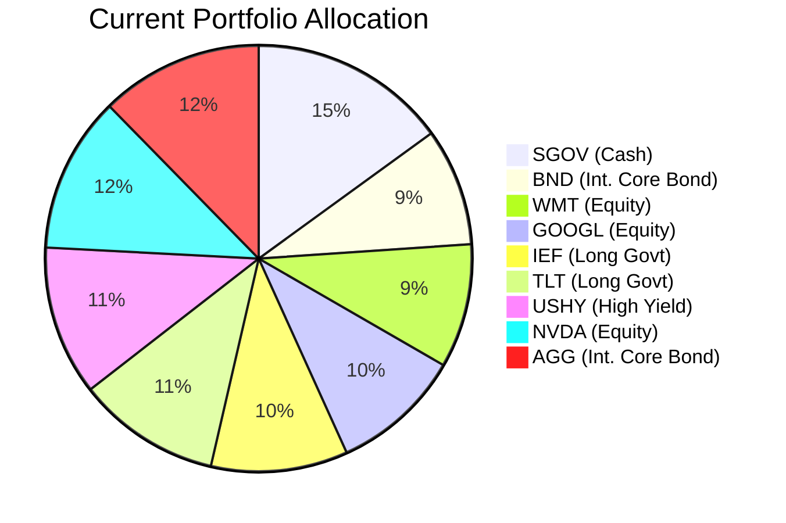
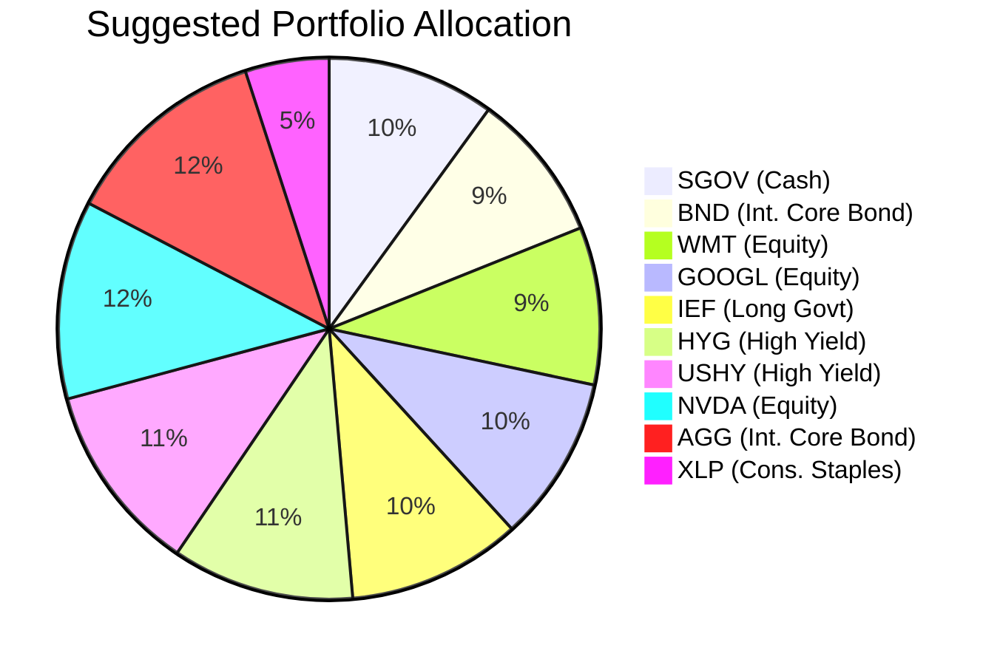

Portfolio Health Review for Emily Harrison
=========================================

# Summary

Emily Harrison's current portfolio exhibits a **strong liquidity position** ($750,000 in cash equivalents) but a **structural weakness in fixed-income carry**, where 10.9% is allocated to the iShares 20+ Year Treasury Bond ETF (TLT), which has delivered a negative 5-year CAGR of -6.97% and contradicts the current macro outlook favoring short-duration, high-quality carry. The recommended action is to **eliminate TLT entirely**, replacing it with the iShares iBoxx $ High Yield Corporate Bond ETF (HYG) for superior carry, and **reduce cash by 5%** to add defensive equity exposure via the Consumer Staples Select Sector SPDR ETF (XLP). The expected outcome is a **lift in annual portfolio return of approximately +0.66%** while maintaining the overall moderate risk profile and improving portfolio resilience through sector diversification.

# Potential Client Needs

| Potential Needs | Investment Horizon | Remark |
| :---|---:| :--- |
| **Children's University Education** | 10–15 years | Two children; education costs require a balanced-growth approach with moderate certainty (Certainty 4). |
| **Retirement Accumulation** | 25+ years | Age 36 with Managing Director income; long compounding horizon supports growth-oriented allocation (Certainty 2). |
| **Reduce Fixed-Income Duration Risk** | N/A | TLT's 20+ year duration is a drag in a "higher-for-longer" rate environment; pivot to short-duration, high-carry products. |

# Suggested Portfolio

| Asset | Current Market Value ($) | Suggested Market Value ($) | Current % | Suggested % | Change | Remark |
| :--- | ---: | ---: | ---: | ---: | ---: | :--- |
| iShares 0-3 Month Treasury Bond ETF (SGOV) | 750,000 | 500,000 | 15.00% | 10.00% | –5.00% | Reduce excess cash; maintain adequate 10% liquidity buffer. |
| Vanguard Total Bond Market ETF (BND) | 446,172 | 446,172 | 8.92% | 8.92% | 0.00% | Hold — core intermediate bond exposure. |
| Walmart Inc. (WMT) | 470,480 | 470,480 | 9.41% | 9.41% | 0.00% | Hold — defensive equity with strong consumer franchise. |
| Alphabet Inc. Class A (GOOGL) | 494,788 | 494,788 | 9.90% | 9.90% | 0.00% | Hold — core tech holding; maintain as structural AI/cloud beneficiary. |
| iShares 7-10 Year Treasury Bond ETF (IEF) | 519,096 | 519,096 | 10.38% | 10.38% | 0.00% | Hold — intermediate duration; limited rate sensitivity. |
| iShares 20+ Year Treasury Bond ETF (TLT) | 543,404 | 0 | 10.87% | 0.00% | –10.87% | **Sell entirely** — negative 5-yr CAGR (–6.97%), headwind from sticky inflation and heavy sovereign issuance. |
| iShares iBoxx $ High Yield Corporate Bond ETF (HYG) | 0 | 543,404 | 0.00% | 10.87% | +10.87% | **New holding** — high-quality carry with 3.80% 5-yr CAGR; floating-rate insulation. |
| iShares Broad USD High Yield Corporate Bond ETF (USHY) | 567,712 | 567,712 | 11.35% | 11.35% | 0.00% | Hold — complementary high-yield exposure. |
| NVIDIA Corporation (NVDA) | 592,020 | 592,020 | 11.84% | 11.84% | 0.00% | Hold — core AI infrastructure beneficiary; monitor for overweight in tech. |
| iShares Core U.S. Aggregate Bond ETF (AGG) | 616,328 | 616,328 | 12.33% | 12.33% | 0.00% | Hold — core bond anchor. |
| Consumer Staples Select Sector SPDR ETF (XLP) | 0 | 250,000 | 0.00% | 5.00% | +5.00% | **New holding** — defensive equity sector with 7.64% expected return; reduces tech concentration. |
| **Total** | **5,000,000** | **5,000,000** | **100.00%** | **100.00%** | **0.00%** | |

## Pros and Cons of Suggested Portfolio

**Pros**
- **Improved carry & return profile:** Replacing TLT (–6.97% CAGR) with HYG (+3.80% CAGR) and adding XLP (+7.64% CAGR) lifts the portfolio's weighted expected return under normal conditions from ~6.4% to ~7.1%, generating an estimated incremental return of ~$33,000 per year on the $5M AUM.
- **Duration risk reduction:** Eliminating 20+ year Treasuries removes the portfolio's largest duration drag in the current "higher-for-longer" rate environment, while HYG's shorter effective duration provides floating-rate-like insulation.
- **Sector diversification:** Adding XLP reduces concentration in technology (NVDA, GOOGL currently 21.7% of portfolio) by introducing a defensive consumer staples allocation that historically shows low correlation to tech and positive performance during economic downturns.
- **Alignment with market outlook:** The pivot from long-duration government bonds to high-yield carry and defensive equities follows the macro view recommending underweight core government duration and overweight high-quality carry and selective equities.

**Cons**
- **Credit risk increase:** HYG and USHY (combined 22.2% of portfolio) introduce corporate credit risk; during a sharp recession, high-yield spreads could widen significantly, leading to principal losses.
- **Reduced liquidity buffer:** Cash reduced from 15% to 10% ($750K → $500K); while still ample for a "low liquidity need" client, a prolonged market dislocation could require liquidating equities at unfavorable prices.
- **Tech upside cap:** Reducing cash and reallocating to XLP instead of adding to NVDA/GOOGL may cap upside in a continued tech bull market.

## Alternative Suggested Products to Consider

| Product | Justification |
| :--- | :--- |
| **Fidelity Money Market Fund (FZDXX)** | If the client prefers to retain the 15% cash buffer but improve yield, FZDXX offers 3.56% expected return (5-yr CAGR) with daily liquidity and ultra-low risk (Rating 1). Suitable for the emergency fund / tuition reserve portion. |
| **Vanguard S&P 500 ETF (VOO)** | For clients seeking broader U.S. equity exposure with lower single-stock risk, VOO provides 13.85% 5-yr CAGR across 500 large-cap companies. **Note:** VOO has a risk rating of 5, which exceeds the client's risk tolerance of 3, so this would only be appropriate if the risk assessment is revisited. |

# Scenario Analysis

## Scenario Assumptions

The following return assumptions are based on historical 5-year CAGR data (2021–2026) from the product catalog, adjusted for the current macro outlook described in the market references. A 24-month forward-looking view is applied.

| Product | Normal (Base) | Upside | Downside |
| :--- | ---: | ---: | ---: |
| SGOV | 3.5% | 3.5% | 3.5% |
| BND | 3.5% | 5.0% | 2.0% |
| WMT | 10.0% | 18.0% | –8.0% |
| GOOGL | 12.0% | 25.0% | –15.0% |
| IEF | 3.5% | 5.0% | 1.0% |
| TLT (current only) | 2.0% | 5.0% | –10.0% |
| HYG (suggested only) | 6.0% | 10.0% | –5.0% |
| USHY | 6.0% | 10.0% | –5.0% |
| NVDA | 15.0% | 30.0% | –20.0% |
| AGG | 3.5% | 5.0% | 2.0% |
| XLP (suggested only) | 8.0% | 12.0% | –5.0% |

**Rationale:** Normal scenario uses 5-yr historical CAGR as baseline. Upside assumes strong AI capex execution and benign inflation (per Morgan Stanley S&P 500 target of 8,000). Downside assumes rate shock or recession compressing equity multiples and widening credit spreads. TLT downside (–10%) reflects its higher duration sensitivity in a rising-rate environment.

## Normal Market Condition (Probability: 50%)

Global equities deliver moderate single-digit returns; fixed income yields stabilize with no aggressive central bank action.

| Product | % Return | Current Portfolio ($) | Current Return ($) | Suggested Portfolio ($) | Suggested Return ($) |
| :--- | ---: | ---: | ---: | ---: | ---: |
| SGOV | 3.5% | 750,000 | 26,250 | 500,000 | 17,500 |
| BND | 3.5% | 446,172 | 15,616 | 446,172 | 15,616 |
| WMT | 10.0% | 470,480 | 47,048 | 470,480 | 47,048 |
| GOOGL | 12.0% | 494,788 | 59,375 | 494,788 | 59,375 |
| IEF | 3.5% | 519,096 | 18,168 | 519,096 | 18,168 |
| TLT | 2.0% | 543,404 | 10,868 | 0 | 0 |
| HYG | 6.0% | 0 | 0 | 543,404 | 32,604 |
| USHY | 6.0% | 567,712 | 34,063 | 567,712 | 34,063 |
| NVDA | 15.0% | 592,020 | 88,803 | 592,020 | 88,803 |
| AGG | 3.5% | 616,328 | 21,571 | 616,328 | 21,571 |
| XLP | 8.0% | 0 | 0 | 250,000 | 20,000 |
| **Total** | | **5,000,000** | **321,762** | **5,000,000** | **354,748** |

- **Annual return:** Current 6.44% vs. Suggested 7.09%
- **Incremental benefit:** +$32,986 annually (+10.3% improvement)

## Upside Market Condition (Probability: 25%)

AI infrastructure spending accelerates, earnings beat estimates, and central banks begin cautious easing in late 2027.

| Product | % Return | Current Portfolio ($) | Current Return ($) | Suggested Portfolio ($) | Suggested Return ($) |
| :--- | ---: | ---: | ---: | ---: | ---: |
| SGOV | 3.5% | 750,000 | 26,250 | 500,000 | 17,500 |
| BND | 5.0% | 446,172 | 22,309 | 446,172 | 22,309 |
| WMT | 18.0% | 470,480 | 84,686 | 470,480 | 84,686 |
| GOOGL | 25.0% | 494,788 | 123,697 | 494,788 | 123,697 |
| IEF | 5.0% | 519,096 | 25,955 | 519,096 | 25,955 |
| TLT | 5.0% | 543,404 | 27,170 | 0 | 0 |
| HYG | 10.0% | 0 | 0 | 543,404 | 54,340 |
| USHY | 10.0% | 567,712 | 56,771 | 567,712 | 56,771 |
| NVDA | 30.0% | 592,020 | 177,606 | 592,020 | 177,606 |
| AGG | 5.0% | 616,328 | 30,816 | 616,328 | 30,816 |
| XLP | 12.0% | 0 | 0 | 250,000 | 30,000 |
| **Total** | | **5,000,000** | **575,260** | **5,000,000** | **623,680** |

- **Annual return:** Current 11.51% vs. Suggested 12.47%
- **Incremental benefit:** +$48,420 annually (+8.4% improvement)

## Downside Market Condition (Probability: 25%) — Recession / Credit Event

Persistent inflation forces aggressive central bank action, compressing equity multiples and widening credit spreads (similar to 2022 rate shock).

| Product | % Return | Current Portfolio ($) | Current Return ($) | Suggested Portfolio ($) | Suggested Return ($) |
| :--- | ---: | ---: | ---: | ---: | ---: |
| SGOV | 3.5% | 750,000 | 26,250 | 500,000 | 17,500 |
| BND | 2.0% | 446,172 | 8,923 | 446,172 | 8,923 |
| WMT | –8.0% | 470,480 | –37,638 | 470,480 | –37,638 |
| GOOGL | –15.0% | 494,788 | –74,218 | 494,788 | –74,218 |
| IEF | 1.0% | 519,096 | 5,191 | 519,096 | 5,191 |
| TLT | –10.0% | 543,404 | –54,340 | 0 | 0 |
| HYG | –5.0% | 0 | 0 | 543,404 | –27,170 |
| USHY | –5.0% | 567,712 | –28,386 | 567,712 | –28,386 |
| NVDA | –20.0% | 592,020 | –118,404 | 592,020 | –118,404 |
| AGG | 2.0% | 616,328 | 12,327 | 616,328 | 12,327 |
| XLP | –5.0% | 0 | 0 | 250,000 | –12,500 |
| **Total** | | **5,000,000** | **–260,295** | **5,000,000** | **–254,375** |

- **Annual return:** Current –5.21% vs. Suggested –5.09%
- **Downside protection benefit:** +$5,920 improvement (limits loss by 2.3%)

# Risk Disclosure

- **Past performance does not guarantee future returns.** Historical CAGR figures are based on 5-year data ending June 2026 and may not repeat.
- **Projected returns are estimates, not promises.** Scenario analysis assumes specific market conditions; actual returns may differ materially, especially given the volatile macro backdrop.
- **Structured products (if applicable) have risk of principal loss.** The recommended portfolio consists solely of exchange-traded products with daily liquidity and no structured notes.
- **High-yield bond ETFs (HYG, USHY)** carry credit risk and may experience significant price declines during economic downturns or periods of rising defaults.
- **Equity concentration risk:** The portfolio retains meaningful exposure to technology (NVDA, GOOGL at 21.7%), which may underperform during a sector rotation.
- **Currency risk:** All holdings are denominated in USD, which aligns with the client's North America region but introduces currency exposure relative to any non-USD liabilities.

# References

- **Client Profiles:** `11_demographics.md`, `11_holdings.csv`, `11_profile.md` (Source: Planbot Internal Data)
- **Product Catalog:** `selected_etf.csv`, `Overview of product catalog.md` (Source: Planbot Internal Data)
- **Market Outlook:** `macro_outlook.md`, `asset_classes_outlook.md` (Source: Planbot Shared References)
- **Proposal Instructions:** `proposal_format.md`, `suggested_portfolio_instruction.md`, `scenario_analysis_instruction.md`, `risk_disclosure_instruction.md`, `references_instruction.md` (Source: Planbot Internal Data)
- **Financial Needs Framework:** `common_needs.md` (Source: Planbot Shared Guidelines)
- **Web References:** N/A — no web search was used; all data sourced from internal reference materials.
