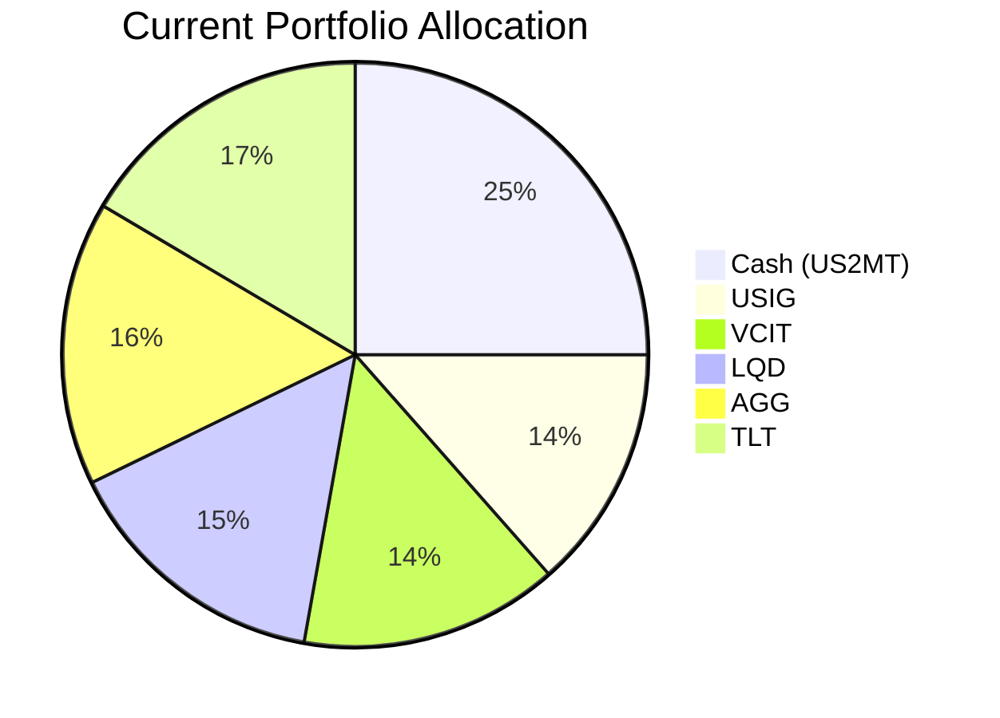
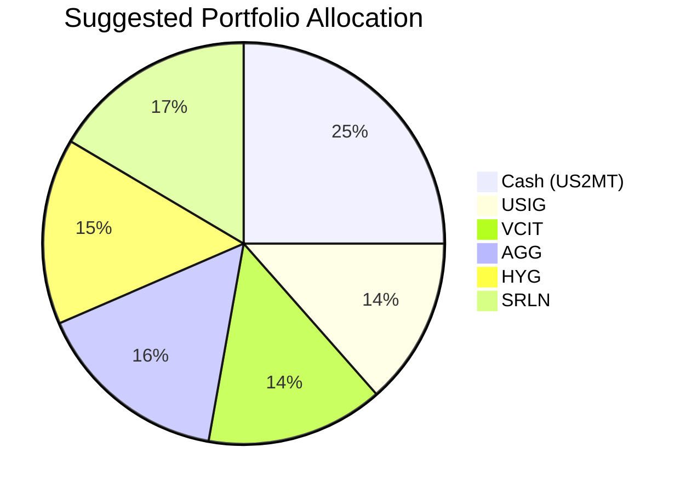

Portfolio Health Review for Harrison Jr. Education Trust
========================================================

# Summary

The trust’s current portfolio is entirely fixed income and cash, providing stability but limited growth potential for long‑term education funding. Its heavy allocation to long‑duration Treasuries (TLT, 16.5%) and investment‑grade corporates (LQD, 15%) has delivered negative 5‑year returns, eroding purchasing power. The recommended action is to replace these underperforming positions with higher‑carry, short‑duration alternatives: iShares iBoxx $ High Yield Corporate Bond ETF (HYG) and Blackstone Senior Loan ETF (SRLN). This shift improves expected portfolio return from ~0.5% to ~3.6% annually while maintaining a low‑risk profile and liquidity, better aligning with the trust’s 10‑15 year education funding horizon.

# Potential Client Needs

| Potential Needs | Investment Horizon | Remark |
|-----------------|-------------------|--------|
| Education funding (university / tertiary) | 10–15 years | Trust’s primary objective; requires moderate growth (>3% real) with high capital certainty. |
| Improve yield from existing fixed‑income holdings | N/A | Current bonds (LQD, TLT, AGG) have negative or near‑zero 5‑year CAGR; swapping into higher‑carry products enhances income. |
| Maintain liquidity and capital preservation | Ongoing | 25% cash buffer already meets short‑term needs; suggested changes preserve overall low risk. |

# Suggested Portfolio

### Current vs. Suggested Allocation

| Asset | Current Market Value | Suggested Market Value | Current % | Suggested % | Change | Remark |
|-------|-------------------:|---------------------:|---------:|-----------:|------:|--------|
| US 2-Month T-Bill (US2MT=X) Cash | 500,000 | 500,000 | 25.0% | 25.0% | 0% | Liquidity buffer unchanged. |
| iShares Broad USD Inv Grade Corp Bond ETF (USIG.O) | 270,616 | 270,616 | 13.5% | 13.5% | 0% | Hold – intermediate IG exposure. |
| Vanguard Interm‑Term Corp Bond ETF (VCIT.O) | 285,308 | 285,308 | 14.3% | 14.3% | 0% | Hold – quality carry. |
| iShares Core US Aggregate Bond ETF (AGG) | 314,692 | 314,692 | 15.7% | 15.7% | 0% | Hold – core investment grade. |
| iShares iBoxx $ Inv Grade Corp Bond ETF (LQD) | 300,000 | 0 | 15.0% | 0% | –15.0% | **Sell** – low 5‑yr CAGR (–0.31%), fund HYG purchase. |
| iShares 20+ Year Treasury Bond ETF (TLT.O) | 329,384 | 0 | 16.5% | 0% | –16.5% | **Sell** – high duration risk, negative long‑term return. |
| iShares iBoxx $ High Yield Corp Bond ETF (HYG) | 0 | 300,000 | 0% | 15.0% | +15.0% | **Buy** – higher carry (3.80% 5‑yr CAGR), short‑duration high yield. |
| Blackstone Senior Loan ETF (SRLN) | 0 | 329,384 | 0% | 16.5% | +16.5% | **Buy** – floating‑rate, short‑duration, 4.54% 5‑yr CAGR, protects against rate rises. |
| **Total** | **2,000,000** | **2,000,000** | **100%** | **100%** | **0%** | |

### Pros and Cons of Suggested Portfolio

**Pros:**
- **Improved expected return:** Replacing LQD and TLT (5‑yr CAGR –0.31% and –6.97%) with HYG (+3.80%) and SRLN (+4.54%) lifts portfolio yield from ~0.5% to ~3.6% annually, better supporting education funding.
- **Duration risk reduced:** TLT (20+ year duration) is eliminated; SRLN is floating‑rate and HYG has short effective duration (~3 yrs), making the portfolio less sensitive to rising rates.
- **Aligned with market outlook:** Overweight “high‑quality carry” – floating‑rate loans and high‑yield credit benefit from the “higher‑for‑longer” environment and solid corporate earnings.
- **Liquidity preserved:** 25% cash plus highly liquid ETFs (HYG, SRLN trade daily) meet the trust’s 5‑year horizon.

**Cons:**
- **Credit risk increases slightly:** HYG and SRLN are below‑investment‑grade (high yield / leveraged loans); default risk is higher than the replaced IG bonds. However, current low default rates and strong corporate balance sheets mitigate this.
- **No equity exposure:** The portfolio still lacks growth assets that could further compound returns over a 15‑year horizon. If the trust’s risk tolerance allows, a small allocation (e.g., 5–10%) to a broad equity ETF like VOO could be considered for additional upside.

### Alternative Products to Consider

1. **EM Hard Currency Bond ETF (EMB)**  
   - **Ticker:** EMB  
   - **Risk Rating:** 3  
   - **5‑yr CAGR:** 1.91%  
   - **Justification:** The market outlook recommends overweighting EM hard‑currency debt for its high carry and improving credit quality. EMB could replace a portion of AGG or VCIT to boost yield without adding interest‑rate duration.

2. **Gold MiniShares ETF (GLDM)**  
   - **Ticker:** GLDM  
   - **Risk Rating:** 5 (highly volatile; use only if risk tolerance allows)  
   - **5‑yr CAGR:** 18.90%  
   - **Justification:** Gold is a structural hedge against central‑bank reserve diversification and geopolitical risk. A modest 3–5% allocation could serve as portfolio insurance in tail‑risk scenarios, though it does not align with a pure capital‑preservation mandate.

# Scenario Analysis

Three scenarios are simulated using the portfolio’s 5‑year CAGR (or reasonable proxy) for each asset, adjusted for current market sentiment. The current portfolio assumes LQD and TLT are replaced at cost.

### Assumptions

| Asset | Normal Scenario Return | Upside Scenario Return | Downside Scenario Return | Justification |
|-------|----------------------:|----------------------:|------------------------:|---------------|
| Cash | 3.4% | 4.0% | 3.0% | Based on 5‑yr CAGR of SHV (3.34%); upside if Fed keeps rates high, downside if cuts begin. |
| USIG | 0.5% | 2.0% | –2.0% | 5‑yr CAGR 0.52%; upside if spreads tighten, downside if credit conditions worsen. |
| VCIT | 1.1% | 2.5% | –1.5% | 5‑yr CAGR 1.14%; similar to USIG. |
| AGG | 0.1% | 1.5% | –3.0% | 5‑yr CAGR 0.05%; vulnerable to rate hikes. |
| **Current: LQD** | –0.3% | 1.5% | –5.0% | 5‑yr CAGR –0.31%; downside if spreads widen sharply. |
| **Current: TLT** | –7.0% | –3.0% | –15.0% | 5‑yr CAGR –6.97%; extreme duration risk in rising rate scenario. |
| **Suggested: HYG** | 3.8% | 6.0% | –5.0% | 5‑yr CAGR 3.80%; upside from strong credit markets, downside from recession defaults. |
| **Suggested: SRLN** | 4.5% | 6.5% | –3.0% | 5‑yr CAGR 4.54%; floating‑rate protects in rising rates, downside if defaults spike. |

**Scenario Probabilities:**  
- Normal: 60%  
- Upside: 20%  
- Downside: 20%  

### Normal Market Condition (60% probability)

- Current portfolio return: (0.25×3.4% + 0.135×0.5% + 0.143×1.1% + 0.15×(-0.3%) + 0.157×0.1% + 0.165×(-7.0%)) = **–0.12%**  
- Suggested portfolio return: (0.25×3.4% + 0.135×0.5% + 0.143×1.1% + 0.157×0.1% + 0.15×3.8% + 0.165×4.5%) = **3.43%**

| Product | % Return | Current Holding ($) | Current Return ($) | Suggested Holding ($) | Suggested Return ($) |
|---------|--------:|------------------:|-----------------:|-------------------:|-------------------:|
| Cash | 3.4 | 500,000 | 17,000 | 500,000 | 17,000 |
| USIG | 0.5 | 270,616 | 1,353 | 270,616 | 1,353 |
| VCIT | 1.1 | 285,308 | 3,138 | 285,308 | 3,138 |
| AGG | 0.1 | 314,692 | 315 | 314,692 | 315 |
| LQD | –0.3 | 300,000 | –900 | 0 | 0 |
| TLT | –7.0 | 329,384 | –23,057 | 0 | 0 |
| HYG | 3.8 | 0 | 0 | 300,000 | 11,400 |
| SRLN | 4.5 | 0 | 0 | 329,384 | 14,822 |
| **Total** | | **2,000,000** | **–2,151** | **2,000,000** | **48,028** |

- **Annual return:** Suggested 3.43% vs. Current –0.12%  
- **Incremental benefit:** +$50,179 annually

### Upside Market Condition (20% probability)  
- **Characterised by:** Strong economic growth, low defaults, Fed cut surprise, credit spread tightening.  
- Current portfolio return: (0.25×4.0% + 0.135×2.0% + 0.143×2.5% + 0.15×1.5% + 0.157×1.5% + 0.165×(-3.0%)) = **1.15%**  
- Suggested portfolio return: (0.25×4.0% + 0.135×2.0% + 0.143×2.5% + 0.157×1.5% + 0.15×6.0% + 0.165×6.5%) = **4.46%**

| Product | % Return | Current Return ($) | Suggested Return ($) |
|---------|--------:|------------------:|-------------------:|
| Cash | 4.0 | 20,000 | 20,000 |
| USIG | 2.0 | 5,412 | 5,412 |
| VCIT | 2.5 | 7,133 | 7,133 |
| AGG | 1.5 | 4,720 | 4,720 |
| LQD | 1.5 | 4,500 | 0 |
| TLT | –3.0 | –9,882 | 0 |
| HYG | 6.0 | 0 | 18,000 |
| SRLN | 6.5 | 0 | 21,410 |
| **Total** | | **31,883** | **76,675** |

- Incremental benefit: +$44,792

### Downside Market Condition (20% probability)  
- **Characterised by:** Recession, credit defaults spike, Fed forced to hold rates high, long‑duration bonds crash, equity bear market.  
- Current portfolio return: (0.25×3.0% + 0.135×(-2.0%) + 0.143×(-1.5%) + 0.15×(-5.0%) + 0.157×(-3.0%) + 0.165×(-15.0%)) = **–5.21%**  
- Suggested portfolio return: (0.25×3.0% + 0.135×(-2.0%) + 0.143×(-1.5%) + 0.157×(-3.0%) + 0.15×(-5.0%) + 0.165×(-3.0%)) = **–1.75%**

| Product | % Return | Current Return ($) | Suggested Return ($) |
|---------|--------:|------------------:|-------------------:|
| Cash | 3.0 | 15,000 | 15,000 |
| USIG | –2.0 | –5,412 | –5,412 |
| VCIT | –1.5 | –4,280 | –4,280 |
| AGG | –3.0 | –9,441 | –9,441 |
| LQD | –5.0 | –15,000 | 0 |
| TLT | –15.0 | –49,408 | 0 |
| HYG | –5.0 | 0 | –15,000 |
| SRLN | –3.0 | 0 | –9,882 |
| **Total** | | **–68,541** | **–29,015** |

- Downside protection: Suggested portfolio loses 53% less than current in a severe recession.

# Risk Disclosure

- **Past performance does not guarantee future returns.** Historical returns used in scenario analysis are for reference only.  
- **Projected returns are estimates, not promises.** Actual results may differ materially due to market conditions, issuer defaults, or other risks.  
- **Credit risk:** HYG and SRLN invest in below‑investment‑grade securities; default risk is higher than investment‑grade bonds.  
- **Liquidity risk:** All suggested ETFs are highly liquid (traded daily); however, in stressed markets, bid‑ask spreads may widen.  
- **Call risk:** SRLN is a senior loan ETF; loans may be called or refinanced, affecting yield.  
- **Regulatory risk:** Changes in financial regulations or tax laws could impact the trust’s returns.  
- **This is not a recommendation to buy or sell any security.** The proposal is based on the trust’s stated profile and should be reviewed with a qualified advisor.

# References

- Product Catalog: demo-market-1Jun26.csv, selected_etf.csv (Planbot Internal Data)  
- Product Factsheet: CMT_note_N02952.md (Structured Product Overview)  
- Market Outlook: asset_classes_outlook.md, macro_outlook.md (Planbot Research)  
- Client Profile: 13_demographics.md, 13_holdings.csv, 13_profile.md  
- No external websites were consulted for this proposal.
