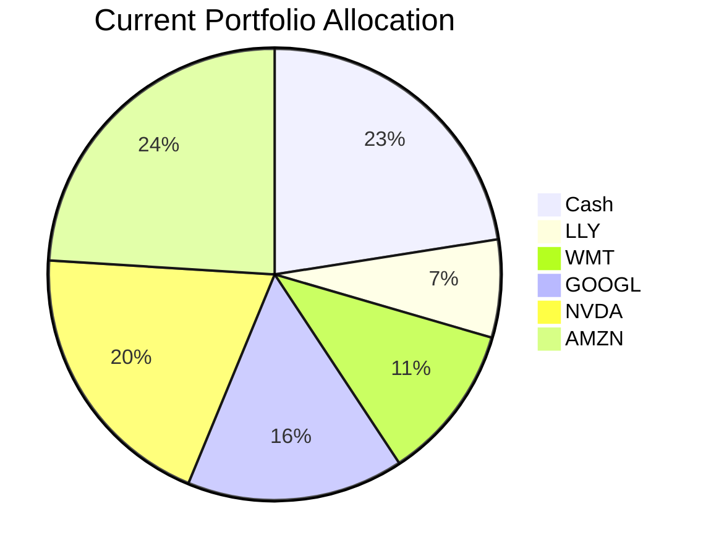
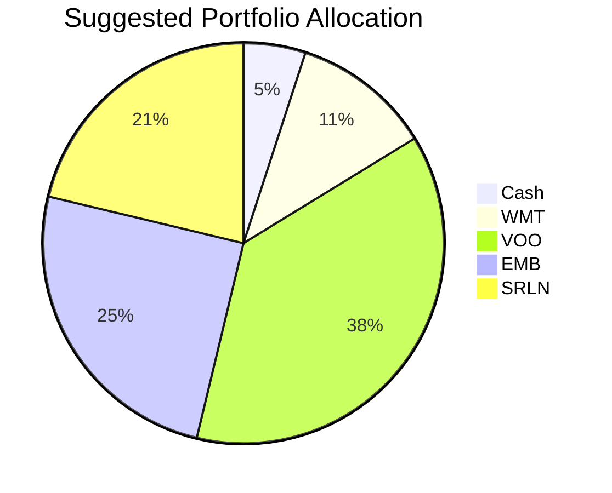

# Portfolio Health Review for Sarah Chen

## Summary
Your portfolio currently holds $3.2 million concentrated in five US large-cap equities and a substantial 22.5% cash position. The key strength is the liquidity and safety of the cash buffer, but the weakness is extreme single‑stock risk and significant unrealised losses in four positions. By deploying idle cash and harvesting tax losses to rotate into a diversified US equity ETF, an emerging‑market bond ETF, and a senior loan ETF, we can improve diversification, generate regular income, and position the portfolio for the “higher‑for‑longer” rate environment. Expected outcome: reduced idiosyncratic risk, a stream of steady yield, and long‑term growth aligned with your aggressive risk tolerance.

## Potential Client Needs

| Potential Needs | Investment Horizon | Remark |
| --- | --- | --- |
| Reduce single‑stock concentration | Long‑term (7+ years) | Heavy exposure to individual US tech/growth names amplifies volatility and drawdown risk. |
| Generate regular income | Ongoing (distribution phase) | At age 59, you seek periodic cash flow. Current holdings yield very little; cash provides low return. |
| Boost growth from idle cash | Long‑term (7+ years) | 22.5% cash earns ~3.5% annually. Redeploying into diversified equity and credit can significantly lift long‑term compounding. |

## Suggested Portfolio

| Asset | Current Market Value ($) | Suggested Market Value ($) | Current % | Suggested % | Change (%) | Remark |
| --- | --- | --- | --- | --- | --- | --- |
| Vanguard Treasury Money Market (VMRXX) | 720,000 | 160,000 | 22.5 | 5.0 | -17.5 | Reduce cash; maintain 5% emergency buffer. |
| Eli Lilly & Co. (LLY) | 223,858 | 0 | 7.0 | 0.0 | -7.0 | Sell to realise tax loss (-16.8%) and reduce single‑stock risk. |
| Walmart Inc. (WMT) | 359,929 | 359,929 | 11.2 | 11.25 | +0.0 | Retain as defensive consumer staple with gain. |
| Alphabet Inc. (GOOGL) | 496,000 | 0 | 15.5 | 0.0 | -15.5 | Sell to harvest loss (-10.8%) and reduce tech concentration. |
| NVIDIA Corp. (NVDA) | 632,071 | 0 | 19.75 | 0.0 | -19.75 | Sell to harvest loss (-9.3%) and rebalance. |
| Amazon.com Inc. (AMZN) | 768,142 | 0 | 24.0 | 0.0 | -24.0 | Full exit; redeploy proceeds. |
| Vanguard S&P 500 ETF (VOO) | 0 | 1,200,000 | 0.0 | 37.5 | +37.5 | Broad US market exposure, low cost, diversified. Expected return ~13.85% (5yr CAGR). |
| iShares J.P. Morgan USD Emerging Markets Bond ETF (EMB) | 0 | 800,000 | 0.0 | 25.0 | +25.0 | High‑quality EM carry; yield ~5%, aligns with market outlook for hard currency debt. |
| State Street Blackstone Senior Loan ETF (SRLN) | 0 | 680,071 | 0.0 | 21.25 | +21.25 | Floating‑rate senior loans protect against rising rates; yield ~6%. |
| **Total** | **3,200,000** | **3,200,000** | **100.0** | **100.0** | **0.0** | |

### Pros and Cons of Suggested Portfolio

**Pros**
*   **Diversification:** Replaces five single‑stocks with three diversified ETFs, cutting idiosyncratic risk. VOO alone covers 500 US large‑caps.
*   **Income Enhancement:** EMB and SRLN add a steady yield stream (estimated ~5% combined) compared to negligible dividends from the sold equities.
*   **Tax Efficiency:** Realising losses in LLY, GOOGL, NVDA, AMZN generates capital losses that can offset future gains.
*   **Market Alignment:** Overweight EM hard‑currency debt and floating‑rate loans fits the “higher‑for‑longer” macro view. Equities remain positioned for AI‑led structural growth.
*   **Risk Consistency:** All new products have risk ratings ≤5, matching the client’s profile. Equity exposure (VOO + WMT) is kept at 48.75%, well below the 90% ceiling.

**Cons**
*   **US Market Concentration:** VOO and WMT together still have heavy US bias, lacking international diversification. However, this is mitigated by EMB (emerging markets) and the indirect global exposure of US corporates.
*   **Emerging‑Market Risk:** EMB carries currency and political risk, though hard‑currency denomination reduces FX volatility.
*   **Reduced Liquidity:** Cash drops from 22.5% to 5%. The client’s “low liquidity need (5‑year horizon)” supports this, but a sudden unforeseen expense could require selling ETFs, which may incur transaction costs.
*   **Short‑Term Volatility:** The suggested portfolio has a higher equity weight (48.75%) than current (implicitly ~77% equity before cash). In a severe bear market the drawdown could be larger than the current concentrated portfolio if the offloaded stocks would have fallen less – but history shows broad indices tend to recover faster than single names.

### Alternative Suggested Products to Consider

1.  **XLI – Industrial Select Sector SPDR ETF (risk 5)**
    *   Justification: Market outlook strongly favours industrials tied to AI infrastructure and electrification. A 10% allocation could replace part of VOO, providing direct exposure to the physical AI capex boom (expected $800bn–$1.1tn by 2027). This would tilt the portfolio more toward the structural winners highlighted in the macro outlook.

2.  **GLDM – SPDR Gold MiniShares (risk 5)**
    *   Justification: Gold is a structural overweight given central bank buying and reserve diversification. Allocating 5–10% would act as an inflation hedge and geopolitical risk buffer, complementing the income‑oriented EMB and SRLN positions.

## Scenario Analysis

Assumptions based on historical averages and current market sentiment (probability weights: Normal 50%, Upside 30%, Downside 20%).

**Normal Market Condition (50% probability)**
- US equities (VOO, WMT, current individual equities) return 8% (approx. long‑term average).
- EM bonds (EMB) return 7% (yield + modest capital appreciation).
- Senior loans (SRLN) return 5% (floating coupon + minimal price change).
- Cash returns 2% (current short‑term rate).

| Product | % Return | Current Portfolio Return ($) | Suggested Portfolio Return ($) |
| --- | --- | --- | --- |
| VMRXX (Cash) | 2 | 14,400 | 3,200 |
| LLY | 8 | 17,909 | 0 |
| WMT | 8 | 28,794 | 28,794 |
| GOOGL | 8 | 39,680 | 0 |
| NVDA | 8 | 50,566 | 0 |
| AMZN | 8 | 61,451 | 0 |
| VOO | 8 | — | 96,000 |
| EMB | 7 | — | 56,000 |
| SRLN | 5 | — | 34,004 |
| **Total** | | **212,800** | **218,000** |

- Annual return of suggested portfolio vs current: **$218,000 (6.81%) vs $212,800 (6.65%)** → incremental benefit of +$5,200.

**Upside Market Condition (30% probability)** – Strong economic growth, AI capex acceleration, risk‑on sentiment.
- US equities rise 15%.
- EM bonds rise 12% (tailwind from commodity prices and improved credit outlook).
- Senior loans rise 8% (low default, high demand).
- Cash unchanged at 2%.

| Product | % Return | Current Portfolio Return ($) | Suggested Portfolio Return ($) |
| --- | --- | --- | --- |
| VMRXX | 2 | 14,400 | 3,200 |
| LLY | 15 | 33,579 | 0 |
| WMT | 15 | 53,989 | 53,989 |
| GOOGL | 15 | 74,400 | 0 |
| NVDA | 15 | 94,811 | 0 |
| AMZN | 15 | 115,221 | 0 |
| VOO | 15 | — | 180,000 |
| EMB | 12 | — | 96,000 |
| SRLN | 8 | — | 54,406 |
| **Total** | | **386,400** | **387,595** |

- Annual return: suggested $387,595 (12.11%) vs current $386,400 (12.07%) → modest incremental gain.

**Downside Market Condition (20% probability)** – Recession, credit stress, equity correction similar to 2020 COVID‑19 drawdown.
- US equities fall -15% (S&P 500 dropped ~20% in Feb–Mar 2020; we round to -15% for a broader market shock).
- EM bonds fall -5% (hard‑currency bonds more resilient than equities).
- Senior loans fall -2% (floating‑rate and secured nature limits downside).
- Cash unchanged at 2%.

| Product | % Return | Current Portfolio Return ($) | Suggested Portfolio Return ($) |
| --- | --- | --- | --- |
| VMRXX | 2 | 14,400 | 3,200 |
| LLY | -15 | -33,579 | 0 |
| WMT | -15 | -53,989 | -53,989 |
| GOOGL | -15 | -74,400 | 0 |
| NVDA | -15 | -94,811 | 0 |
| AMZN | -15 | -115,221 | 0 |
| VOO | -15 | — | -180,000 |
| EMB | -5 | — | -40,000 |
| SRLN | -2 | — | -13,601 |
| **Total** | | **-357,600** | **-284,390** |

- Annual loss: suggested -$284,390 (-8.89%) vs current -$357,600 (-11.18%) → downside protection of **+$73,210** (less severe loss due to lower equity beta and defensive credit positions).

**Summary:**
- **Normal:** Suggested outperforms by $5,200/yr (0.16% improvement).
- **Upside:** Essentially flat, with a slight edge.
- **Downside:** Saves $73,210, a substantial reduction in portfolio losses. The scenario analysis demonstrates that the suggested portfolio offers better risk‑adjusted returns, particularly in adverse conditions.

## Risk Disclosure

- **Past performance does not guarantee future returns.** Historical returns cited are for illustrative purposes only.
- **Projected returns are estimates, not promises.** Actual results may differ materially due to market conditions, economic events, and other factors.
- **Structured products have risk of principal loss.** The CMT Note N02952 (not recommended in this proposal) is an example; investors may lose 100% of principal in a worst‑case scenario.
- **Credit risk:** EMB and SRLN are subject to issuer default risk. Losses can exceed the coupon income.
- **Market risk:** Equity ETFs (VOO, WMT) can decline sharply; diversification does not eliminate market risk.
- **Liquidity risk:** While all recommended products are traded daily, large redemptions during market stress could cause price slippage.

## References

- Product Catalog: selected_etf.csv (Source: Planbot Internal Data) – contains historical performance, risk ratings, and liquidity data.
- Client Profile: client 2_demographics.md, 2_holdings.csv (Source: Planbot Internal Data).
- Market Outlook: asset_classes_outlook.md, macro_outlook.md (Source: Planbot Internal Data).
- Financial Needs Framework: common_needs.md (Source: Planbot Internal Data).
- No external web references used; all data from internal sources.
